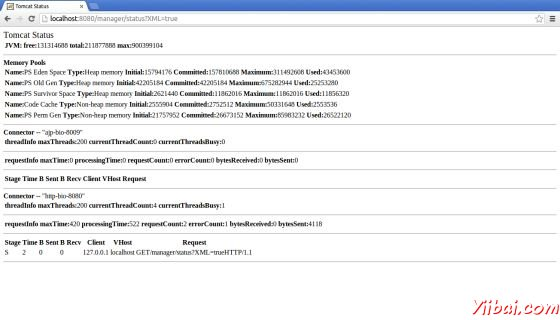
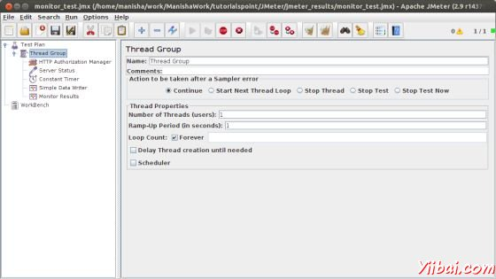
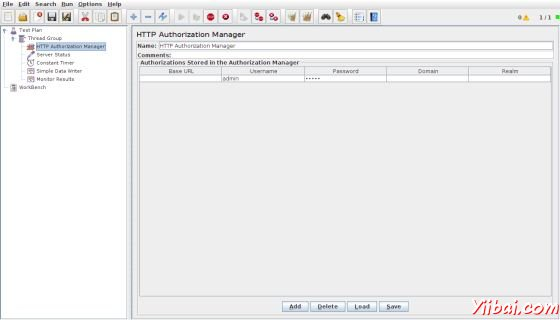
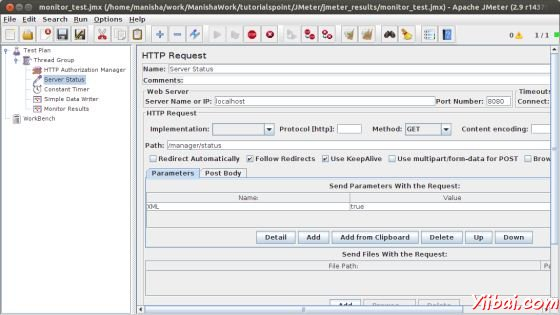
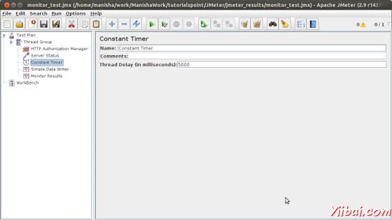
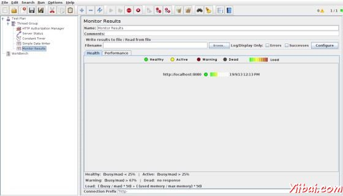
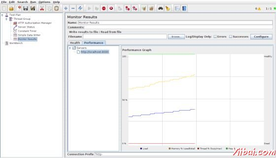

# JMeter监视测试计划 - JMeter教程

在本章中，我们将讨论有关如何创建使用 [JMeter](http://www.yiibai.com/jmeter) 测试计划，监控Web服务器。利用监视器测试是：

*   监视器是有用的压力测试和系统管理。

*   用于压力测试，监视器服务器性能提供了额外的信息。

*   监视器可以更容易地看到在客户端服务器的性能和响应时间之间的关系.

*   系统管理工具，显示器提供了一个简单的方法来从一个控制台监视器多台服务器.

我们将需要一个[Tomcat](http://www.yiibai.com/tomcat) 5或以上版本进行监测。对于我们的测试目的，将监视Tomcat 7.0.42 服务器。可以测试任何servlet容器支持JMX（Java管理扩展）。让我们写一个测试案例监视器Tomcat 服务器。但在此之前，让我们先来设立 tomcat 服务器。

## 设置Tomcat服务器

我们先从“打开”Tomcat服务状态。要做到这一点，编辑的配置文件用户&lt;TOMCAT_HOME&gt;/conf/tomcat-users.xml. 此文件包含一个tomcat的用户部分（评论）如下：

```
<tomcat-users>

<!--
  <role rolename="tomcat"/>
  <role rolename="role1"/>
  <user username="tomcat" password="tomcat" roles="tomcat"/>
  <user username="both" password="tomcat" roles="tomcat,role1"/>
  <user username="role1" password="tomcat" roles="role1"/>
-->
</tomcat-users>
```

我们需要改变这部分，添加管理员的角色，manager，manager-gui和分配用户“admin”。修订后的文件如下：

```
<tomcat-users>

  <role rolename="manager-gui"/>
  <role rolename="manager-script"/>
  <role rolename="manager-jmx"/>
  <role rolename="manager-status"/>
  <user username="admin" password="admin" roles="manager-gui,manager-script,manager-jmx,manager-status"/>

</tomcat-users>
```

现在启动 tomcat 服务器 &lt;TOMCAT_HOME&gt;/bin/startup.sh 在Linux平台 下， &lt;TOMCAT_HOME&gt;/bin/startup.bat 在Window. 一旦启动，检查Tomcat 监管工作进入下面的链接(在浏览器中打开)：

```
http://localhost:8080/manager/status?XML=true
```

验证窗口出现在浏览器中，进入tomcat 登录名和密码相关（在我们的案例中，它是admin）。然后，浏览器显示Tomcat作为下面的执行状态：



从上面的图片中，我们可以注意几件事情：

*   在URL中，XML = true（注意区分大小写）注意，可以清晰地显示JMeter 运作需要监视 Tomcat。

*   另外请注意，默认有两个连接器。加上Apache httpd 的mod_jk 前端模块，这是常用的 HTTP 连接器通过端口 8080 连接器直接访问到 Tomcat 的AJP连接器。

## 编写JMeter测试计划

让我们监视器Tomcat服务器通过编写测试计划如下：

### 重命名测试计划

通过点击启动JMeter的窗口 /home/manisha/apache-jmeter-2.9/bin/jmeter.sh. 点击测试计划节点上。如解释在下一步添加一个线程组。

### 添加线程组

添加一个线程组。右键单击Test Plan &gt; Add &gt; Threads(Users) &gt; Thread Group. 根据测试计划节点将添加线程组。改变永远循环计数（或大量），以便产生足够的样本。



### HTTP授权管理器

添加了HTTP授权管理到线程组元素 Add &gt; Config element &gt; HTTP Authorization Manager. 此元素管理认证要求浏览器中看到Tomcat服务器的状态。选择HTTP Authorization Manager 并编辑以下细节：

*   Username : admin 管理员（取决于tomcat-users.xml文件中的配置）

*   Password : admin（取决于配置tomcat-users.xml文件）

*   其他字段都留空。



### 添加采样器的HTTP请求

现在，我们已经定义了我们的用户，它是时间来定义，他们将要执行的任务。我们将增加HTTP请求元素。点击鼠标右键得到添加菜单，然后选择Add &gt; Sampler &gt; HTTP Request. 然后，选择HTTP请求树中的元素，并在下面的图片编辑以下属性：

这个元素中输入下列详细信息：

*   Name : 服务器状态

*   Server Name or IP : localhost

*   Port : 8080

*   Path : /manager/status

*   Parameters : 添加请求参数名为“XML”大写。给它一个小写 “true” 值。

*   Optional Tasks : 检查采样底部的“监视器”。



### 添加常量计时器

要定期要求服务器状态，添加的常量元素，这将使每个请求之间的时间间隔定时器。这个线程组中添加一个计时器 Add &gt; Timer &gt; Constant Timer.

输入5000毫秒在线程的延迟框中。在一般情况下，使用短的间隔超过5秒将添加到服务器的压力。搞清楚什么是可接受的间隔，在生产环境中部署监视器。



### 添加监听器

需要添加到测试计划中的最后一个元素是一个监听器。我们将两种类型的监听器。结果存储在一个文件中的第二个显示的图形视图中的结果。

选择线程组元素，并添加一个简单的数据写入器监听 Add &gt; Listener &gt; Simple Data Writer.下一步，指定输出文件的目录和文件名（在我们的案例中为 /home/manisha/work/sample.csv）


让我们添加另一个监听器，通过选择测试计划元件 Add &gt; Listener &gt; Monitor Results.


### 运行此测试计划

现在保存的以上测试计划 monitor_test.jmx 。执行本测试计划使用 Run &gt; Start 选项.

### 查看输出

结果将被保存在 /home/manisha/work/sample.csv 的文件。在下面的图片，你还可以看到一个图形化的结果的监测结果监听



请注意图中有字幕图形的两侧上。在左边是％，右边是dead/healthy。如果记忆线尖峰迅速下降，这可能表明内存颠簸。在这些情况下，与Borland Optimizeit 的 JProbe的分析应用程序。希望看到的是一个普通的负载，内存和线程模式。任何不稳定的行为通常表明表现欠佳或某种形式的错误。

