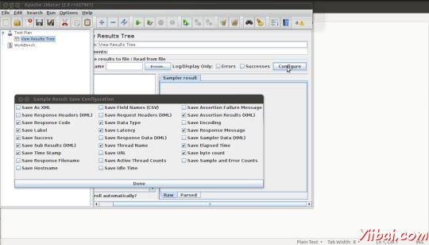

# jMeter监听器 - JMeter教程

监听器提供 [JMeter](http://www.yiibai.com/jmeter) 有关JMeter的运行测试用例，同时收集信息的访问。结果还是监听器所收集的信息可以显示的形式：

*   树（tree）

*   表（tables）

*   图形（graphs）

*   日志文件

当它被指定，所有侦听器相同的原始数据写入到输出文件中。

## 默认配置

要保存的默认项可以定义：



*   在jmeter.properties（或user.properties）文件中。JMeter 的 /bin文件夹中，这个文件是存在。要更改默认格式，发现以下行 jmeter.properties 文件：

    ```
    jmeter.save.saveservice.output_format=
    ```

*   或通过使用配置弹出下面的图片所示：

JMeter 创建JTL（JMeter的文本日志）试运行的结果。这些通常被称为 JTL 文件，因为这是默认的扩展名 - 但可以使用任何扩展名。

如果使用相同的输出文件名，那么 JMeter 自动追加新的数据到文件末尾的运行多个测试。

监听器器可以记录到一个文件中，而不是到 UI 结果。它的目的是记录数据 GUI 的开销，从而提供一种有效的手段。

当运行在：

*   GUI模式：使用监听器器简单的数据写入

*   非GUI模式：-l标志，可用于创建数据文件。

监听器可以使用大量的内存，如果有很多的样品。为了尽量减少所需的内存量，使用简单的数据写入，并使用CSV格式。

## CSV日志格式

CSV格式的日志格式取决于数据项中选择配置。只有指定的数据项被记录在文件中。外观上的列的顺序是固定的，如下所示：

| 字段 | 描述 | 示例值 |
| --- | --- | --- |
| timeStamp | in milliseconds since 1/1/1970 | 1354223881017 |
| elapsed | in milliseconds | 1858 |
| label | sampler label | HTTP Request |
| responseCode | e.g. 200, 404 | 200 |
| responseMessage | e.g. OK | OK |
| threadName | Thread Group 1-1 |
| dataType | e.g. text | text |
| success | true or false | true |
| failureMessage | if any |
| bytes | number of bytes in the sample | 34908 |
| grpThreads | number of active threads in this thread group | 1 |
| allThreads | total number of active threads in all groups | 1 |
| URL | http://yiibai.com |
| Filename | if Save Response to File was used |
| latency | time to first response | 132 |
| encoding | utf-8 |
| SampleCount | number of samples (1, unless multiple samples are aggregated) | 1 |
| ErrorCount | number of errors (0 or 1, unless multiple samples are aggregated) | 0 |
| Hostname | where the sample was generated | LaptopManisha |
| IdleTime | number of milliseconds of 'Idle' time (normally 0) |
| Variables | if specified |

## 保存响应数据

响应数据可以被保存在[XML](http://www.yiibai.com/xml)中的日志文件（如果需要）。但它也有限制，当文件很大，也不能包含图像。在这种情况下，使用后处理器Save_Responses_to_a_file。这会产生一个新的文件，对每个样品，样品保存的文件名。样品中的日志输出的文件名可以被包含。这些数据将被从文件示例日志文件时，如果有必要被重新检索。

## 数据加载（读取）响应数据

要查看现有结果文件，可以使用“文件”浏览...“按钮选择一个文件。如果有必要，只需创建一个虚拟测试计划，在合适的监听器。

## GUI数据保存监听器

JMeter是能够保存任何监听器器作为一个PNG文件。要做到这一点，在左侧面板中选择监听器，
Edit &gt; Save As Image.

会出现一个文件对话框。输入所需的名称和保存的监听器。

