# JOGL安装 - JOGL教程

本章介绍了设置环境以使用JOGL使用不同的集成开发环境(IDE)，在您的系统上。

## 安装JOGL

对于JOGL安装，需要有以下系统要求：

### 系统要求

第一个要求是要在机器上安装Java Development Kit（JDK）。

| 要求 | 描述 |
| --- | --- |
| JDK 版本 | 1.4 或以上 |
| 内存 | 没有最小限制 |
| 硬盘大小 | 没有最小限制 |
| 操作系统 | 没有最小限制 |

需要按照设置给定的步骤，从配置环境入手JOGL应用程序开发：

### 第1步 - 在机器上验证Java安装

系统的开放式控制台，并执行下面的Java命令：

| 平台 | 任务 | 命令 |
| --- | --- | --- |
| Windows | 打开命令控制台 | C:\&gt;java-version |
| Linux | 打开命令终端 | $java- version |
| MAC | 打开终端 | Machine:~ joseph$ java -version |

验证在各操作系统的输出。

| 平台 | 输出 |
| --- | --- |
| Windows | Java “1.6.0.21”java(TM) SE Runtime Environment(build 1..6.0_21-b07)Java HotSpot(TM) Client VM(buld 17.0-b7,mixed mode, sharing) |
| Linux | Java “1.6.0.21”java(TM) SE Runtime Environment(build 1..6.0_21-b07)Java HotSpot(TM) Client VM(buld 17.0-b7,mixed mode ,sharing) |
| MAC | Java “1.6.0.21”java(TM) SE Runtime Environment(build 1..6.0_21-b07)Java HotSpot(TM) Client VM(buld 17.0-b7,mixed mode ,sharing) |

### 第2步 - 安装Java开发工具包（JDK）

如果Java未在你的机器上安装，则需要从Oracle网站上下载安装Java SDK： [www.oracle.com/technetwork/java/javase/downloads/.](http://www.oracle.com/technetwork/java/javase/downloads/index.htmll) 您可以从下载的文件安装JDK说明。需要按照安装和配置设置的指示。最后，设置PATH和JAVA_HOME环境变量指向包含的java.exe和javac.exe文件的目录，它们分别为：java_install_dir/bin和java_install_dir。

设置Java-home环境变量指向的基本目录的位置相同的路径，安装在机器上的Java程序。

| 平台 | 命令 |
| --- | --- |
| Windows | 设置环境变量 JAVA_HOME to C:\ProgramFiles\Java\Jdk1.6.0_21 |
| Linux | Export JAVA_HOME=/usr/local/java-current |
| MAC | Export JAVA_HOME=/Library/Java/Home |

附加的Java编译器位置，系统路径如下：

| 平台 | 命令 |
| --- | --- |
| Windows | 添加字符串 ;%JAVA_HOME% bin at the end of the system variable and path |
| Linux | Export PATH=$PATH:$JAVA_HOME/bin/ |
| MAC | Not required |

### 第3步 - 下载JOGL

*   可以从网站上下载JOGL的最新版本 [www.jogamp.org](http://www.jogamp.org/)

*   前往主页 [www.jogamp.org](http://www.jogamp.org/)

*   点击 Builds/Downloads &gt; Current (zip).

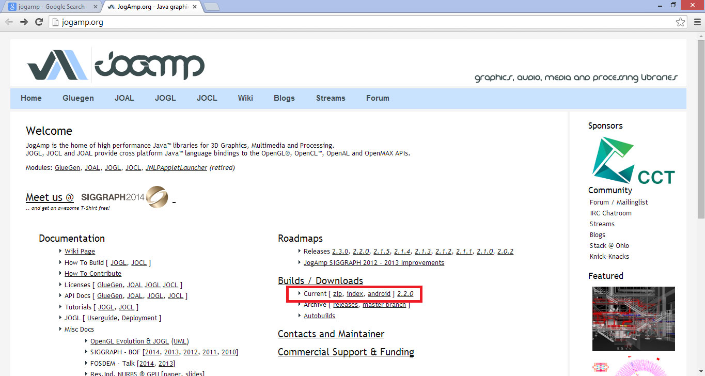

可以看到网站所维护的所有.jar文件的API列表。

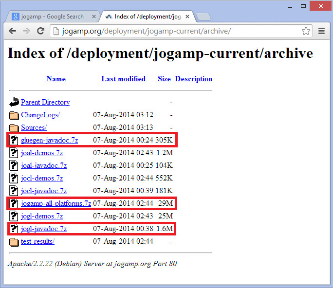

*   下载库.jar文件jogamp-all-platforms.7z，JAVA文档OpenGL库glugen-javadoc.7z和JOGL JOGL-javadocs.7z。

*   提取使用任何压缩解压软件下载的.jar文件。

*   当打开解压文件夹，会发现jar 文件夹，源代码和其他文件。

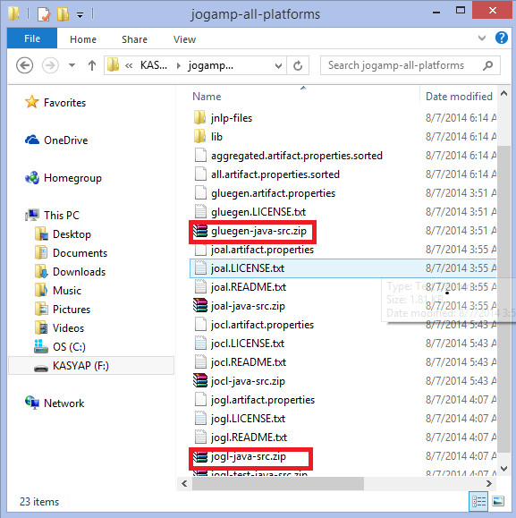

*   获取源代码gluegen-java-src.zip和jogl-java-src.zip支持IDE。这是可选的。

*   文件夹中的jar，有多个.jar文件。文件的集合属于Glugen和JOGL。

*   JOAMP提供支持多种操作系统，如Windows，Solraris，Linux和Android原生库。因此，需要采取适当的jar文件，这些文件可以在需要的平台上执行。例如，如果使用的是Windows64位操作系统，那么可以通过jarfolder以下.jar文件：

1.  gluegenrt.jar
2.  jogl-all.jar
3.  gluegen-rt-natives-windows-amd64.jar
4.  jogl-all-natives-windowsamd64.jar

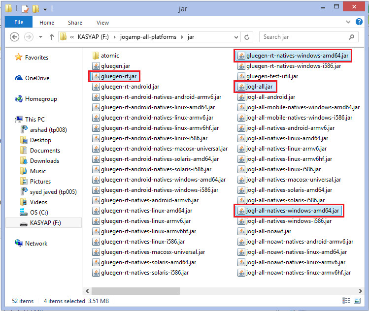

## Eclipse4.4设置JOGL

按照给定的程序设置JOGL：

### 添加以下类库

1.  打开eclipse.

2.  创建一个新工程

3.  创建一个名为lib目录在项目文件夹中的新文件夹。

4.  复制文件 gluegen-rt-natives-windows-amd64.jar, gluegen-rt.jar, jogl-all-natives-windowsamd64.jar 和 jogl-all.jar 到 lib 目录。 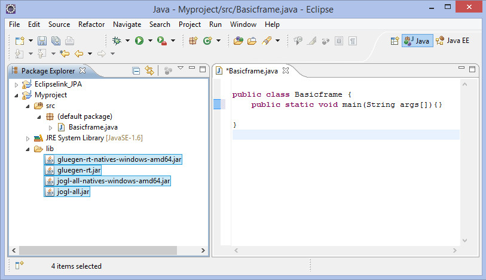

5.  现在选择这些文件，然后右键单击鼠标按钮。将显示一个快捷菜单，其中包含 Build Path &gt; Add to Build Path. 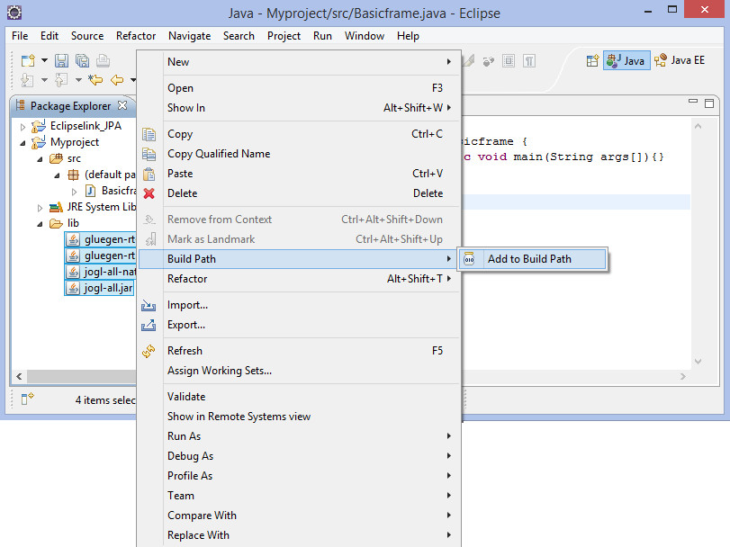

6.  为了可以在其他项目中可以使用所有的.jar文件，进入主菜单。选择 Window &gt; Preferences. 出现在首选项窗口。 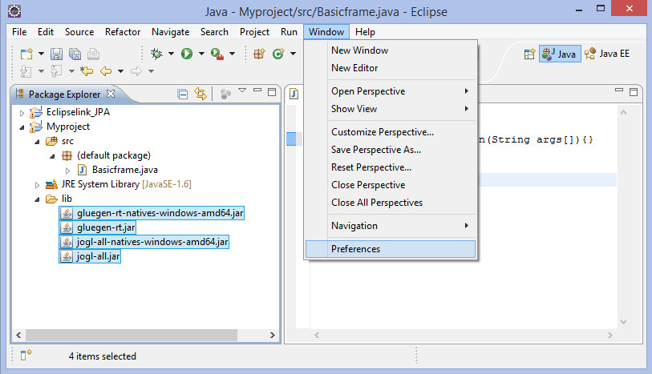

1.  在首选项窗口，在下拉菜单上的左侧菜单中，按照 hierarchy- Java-&gt; Build Path -&gt; User 库.

2.  点击 “New…” 按钮.

3.  这将打开一个对话框。输入库名称 jogl2.1.

4.  添加 jar 文件 glugen-rt.jar 和 jogl-all.jar 使用按钮 “Add External JARs...”.

5.  这将创建一个名为新的用户库 jogl2.1.

以同样的方式，我们可以为添加.jar文件添加的java文件和源代码。

### 添加本地库

1.  展开jogl-all.jar 的节点上，选择Javadoc位置（无）。

2.  点击 “New…” 钮，输入JOGL Java文件的名称。

3.  请点击 “Add External JARs…” 按钮。

4.  这将打开你需要选择JOGL Java文档，我们已经先前下载的位置的对话框。

### 添加源代码

1.  选择节点本地库的位置：(None).

2.  点击 “New…” 按钮.

3.  本地库和点击输入姓名 “OK” 按钮.

4.  点击 “Add External JARs…” 按钮.

5.  现在选择的路径，其中原生库文件 ('gluegen-rt-natives-windows-amd64.jar and joglall-natives-windows-amd64.jar') 位置.

6.  重复同样的程序源代码。

7.  上文两个本地库文件，我们可以设置为Javadoc，源代码和jar文件的位置以相同的方式在 glegen-rt.jar 和 glugen-natives-windows-amd64.jar.

## Netbeans4.4设置JOGL

让我们通过以下步骤来设置JOGL针对NetBeans4.4：

### 添加库

1.  在主菜单中，选择**Tools &gt; Libraries. 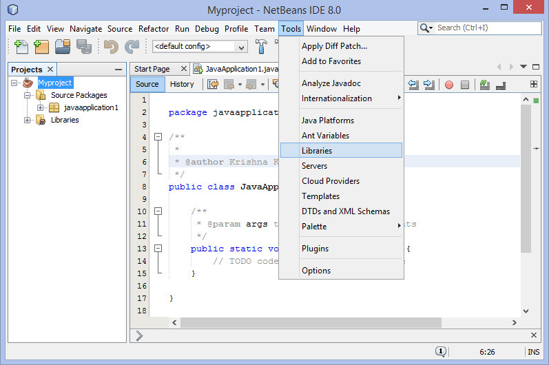**

2.  这使得 **Ant Library Manager. 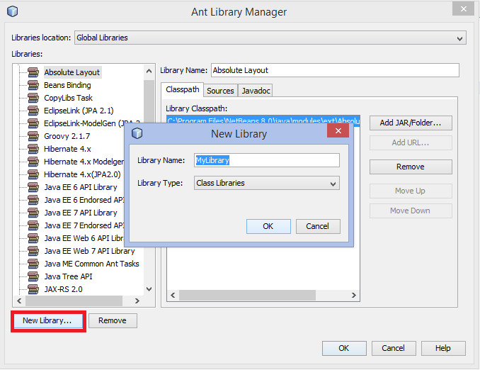**

3.  在Classpath选项卡，单击位于左下角新建库按钮。它会打开一个小对话框。

4.  输入库名称 JoGl2.0.

5.  点击 “OK” 按钮.

6.  点击 “Add JAR/Folder…” 按钮.

7.  选择在.jar文件jogl.all.jar和gluegen-rt.jar所在的路径。

包括JOGL库到每一个项目，请执行以下步骤：

1.  在项目名称上单击右键。它显示一个快捷菜单。 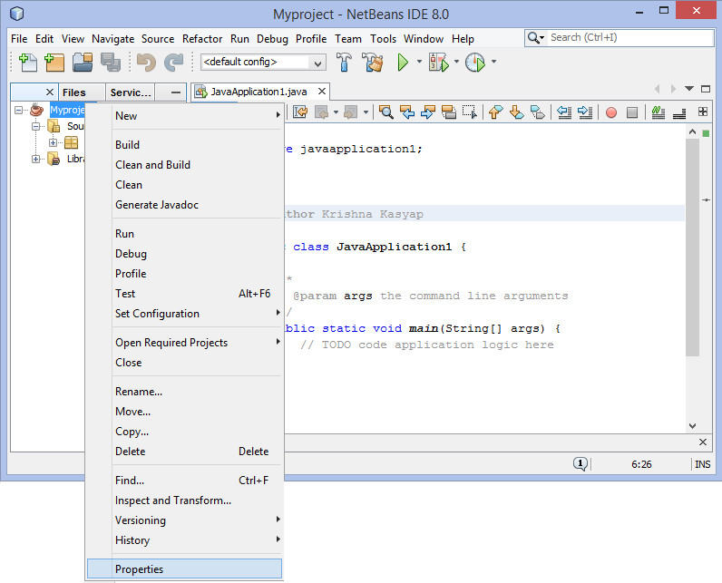

2.  选择属性。它打开了一个名为Project Properties窗口。

3.  从左侧的类别中选择库

4.  选择编译选项卡，并单击“添加库...”按钮。添加库对话框出现。

5.  现在添加JOGL2.0库，先前创建的。

### 包括每个项目的本地库

按照给定的步骤，包括在每个项目中机库：

这使得项目属性窗口。

1.  用鼠标右键单击该项目。

2.  选择 Set Configuration &gt; Customize… **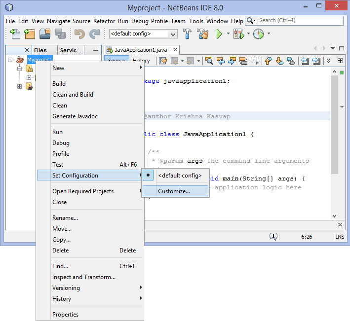**

3.  在右手边，在VM选项，点击“Customize”按钮。

4.  浏览包含JOGL本地库的路径 gluegen-rt-natives-windows-amd64.jar'' 和 'jogl-all-natives-windows-amd64.jar.

### 添加本地库Java文档

需要再次打开Ant库管理，使源代码和Javadoc可用于每个项目。按照给定的步骤：

### 添加本地库的源代码

1.  打开main menu.

2.  选择 Tools &gt; Libraries. 这使 Library manager.

3.  在JavaDoc 下面选项卡中，单击 “New Library…” 按钮.

4.  输入 JOGLJavadoc 名称. (可以输入任何所需的名称)

5.  点击 “Add jars/libraries…” 按钮.

6.  其中，选择解压后的文件JOGL代码所在的路径。

7.  在Sources 下面的选项卡中，单击 “New Library…” 按钮。进入JOGLsources 名称.

8.  点击 “Add jars/libraries…” 按钮，选择解压缩源代码所在的路径。

### 自定义JDK编辑

1.  设置类路径的文件jogl.all.jar和gluegen-rt.jar。

2.  设置路径，本地库gluegen-rt-natives-windows-amd64.jar 和 jogl-all-natives-windowsamd64.jar复制并将其粘贴到JSE lib下载文件夹中的所有jar文件。

