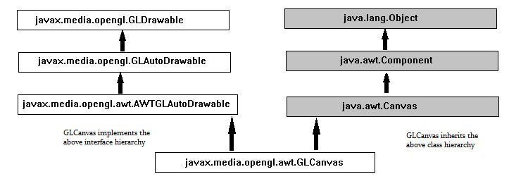
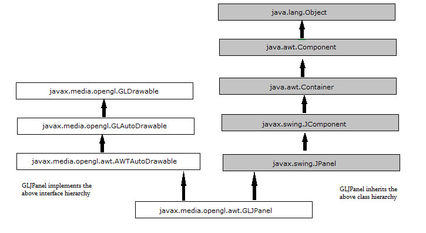
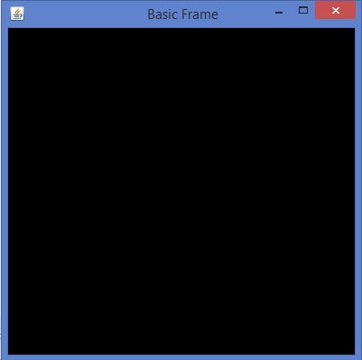

# JOGL基本模板 - JOGL教程

本章介绍了编写JOGL基本模板的概念。

## 重要的接口和类

为了使程序能够使用JOGL图形API，需要实现GLEventListener接口。

### GLEventListener接口

可以在javax.media.opengl包找到GLEventListener接口。

Interface: GLEventListener

Package: javax.media.opengl

下表给出了各种方法和GLEventListener接口的详细描述：

| Sr. No. | 方法和说明 |
| --- | --- |
| 1 | **Void display(GLAutoDrawable drawable)**这就是所谓GLAutoDrawable接口的对象，由客户机发起OpenGL渲染。也就是说，该方法包含用于绘制使用OpenGL API的图形元素的逻辑。 |
| 2 | **Void dispose(GLAutoDrawable drawable)**这种方法的信号监听执行每各GLContext，所有的OpenGL释放资源，如内存缓冲区和GLSL程序。 |
| 3 | **Void init(GLAutoDrawble drawble)**这就是所谓GLAutoDrawable接口OpenGL上下文被初始化之后的对象。 |
| 4 | **Void reshape(GLAutoDrawble drawble,in tx,int y,int width ,int height)**第一重画过程中它被称为GLAutoDrawable接口的对象的组件大小后。它也被称为每当窗口上的部件的位置变化。 |

GLEventListener所有的方法都需要GLAutoDrawable接口作为参数的对象。

### GLAutoDrawable 接口

这个接口提供一个基于事件机制（GLEventListener），用于执行OpenGL渲染。 GLAutoDrawable自动创建一个与GLAutoDrawable为对象的生命周期相关联的一个主要呈现上下文。

Interface: GLAutoDrawble

Package: javax.media.opengl

| Sr. No. | 方法和说明 |
| --- | --- |
| 1 | **GL getGL()**此方法返回所使用的GLAutoDrawable接口的当前对象的GL管道对象。 |
| 2 | **Void addGLEventListener(GLEventListener Listener)**这种方法增加了给定侦听器到当前绘制队列的末尾。 |
| 3 | **Void addGLEventListener(int index,GLEventListener listener)**这种方法增加了给定侦听器这个队列中绘制的给定索引处。 |
| 4 | **Void destroy()**这种方法会破坏GLAutoDrawable接口名为此对象，包括GLContext相关联的所有资源。 |

注：有在这个包的其他方法。只有很少的关于模板的重要方法是在此界面中进行讨论。

### GLCanvas 类

GLCanvas 和 GLJpanel 是JOGL GUI两大类实现 GLAutoDrawable 接口，这让他们可以用作拉丝表面的OpenGL命令。

GLCanvas是一个重量级AWT组件，它提供了OpenGL的渲染支持。这是一AWTAutoGLDrawable接口的主执行。它还是java.awt.Canvas继承类。因为它是一个重量级的组成部分，在某些情况下，GLJCanvas可能无法与Swing组件正确地结合起来。因此，必须谨慎使用，同时它与Swing共用。每当面临GLJCanvas问题，那么必须使用GLJPanel类。

GLCanvas类的分层图可以如下所示：



*   GLEventistener接口工作以及GLCanvas类，它响应变化GLCanvas类并由它们制成要求的图纸。

*   每当GLCanvas的类被实例化，调用GLEventListener的init()方法。可以覆盖此方法来初始化OpenGL的状态。

*   每当GLCanvas的初始绘制（实例化），或调整大小，则执行GLEventListener的reshape()方法。它用来初始化OpenGL的视口和投影矩阵。它也被调用被改变来组件的位置。

*   GLEventListener()方法显示包含渲染3D场景的代码。它被调用时调用GLCanvas的display()方法。

class: GLCanvas

package: javax.media.opengl.awt

Contructor

```
**GLCanvas()**

```

它与OpenGL功能的默认设置创建一个新的GLCanvas组成部分，使用默认的OpenGL功能选择机制，在默认的屏幕设备上。

```
**GLCanvas(GLCapabilitiesImmutable)**

```

它创建了一个新的GLCanvas成分与所请求的一套OpenGL的功能，使用默认的OpenGL功能选择机制，在默认的屏幕设备上。

| Sr. No. | 方法及描述 |
| --- | --- |
| 1 | **Void addGLEventListener(GLEventListener listener)**它增加了给定侦听器来绘制这个队列的末尾 |
| 2 | **Void addGLEventListener(int indexGLEventListener listener)**它增加了给定侦听器这个队列中绘制的给定索引处。 |

要实例化GLCanvas类，需要GLCapabilitiesImmutable接口，它指定一个不可变的集合的OpenGL性能的目的。

来获得 CapabilitiesImmutable 接口的对象的一个方式是实例 GLCapabilities 类，它实现接口。 GLCapabilities 类的实例可以用来服务。

### GLCapabilities 类

此类指定一组的OpenGL性能。它需要GLCapabilities对象作为参数。该GLCapabilities类描述渲染上下文必须支持所期望的功能，例如OpenGL的轮廓。

class: GLCapabilities

package: javax.media.opengl

Constructor

```
**GLCapabilities(GLProfile glprofile)**
```

创建一个GLCapabilities对象。

要实例化GLCanvas类，需要GLCapabilitiesImmutable接口，它指定一个不可变的集合的OpenGL性能的目的。

获得CapabilitiesImmutable接口的对象的一种方式是实例化GLCapabilities类并实现接口。 GLCapabilities类的实例，可以用来以服务为目的。

### GLCapabilities 类

此类指定一组OpenGL性能。它需要GLCapabilities对象作为参数。GLCapabilities类描述渲染上下文必须支持所期望的功能，例如OpenGL的轮廓。

class: GLCapabilities

package: javax.media.opengl

Constructor

```
**GLCapabilities(GLProfile glprofile)**
```

GLCapabilities类又需要GLProfile对象。

### GLProfile 类

由于几个版本的OpenGL API发布，需要指定OpenGL的API确切版本被用在你的程序到Java虚拟机（JVM）。这是通过使用GLProfile类。这个类的get()方法接受不同的预定义的String对象作为参数。每一个String对象是一个接口的名称，每个接口支持OpenGL的某些版本。如果初始化这个类的静态和单例，这个类提供了每个可用JOGL单例GLProfile对象。

class: GLProfile

package: javax.media.opengl

| Method and 描述 |
| --- |
| **Static GLProfile get(String profile)**使用默认设备。 |

因为这是一个静态方法，需要使用类名来调用它，它需要一个预定义的静态字符串变量作为参数。有在这12级这样的变量，分别代表GL接口的独立实现。

```
GLProfile.get(GLProfile.GL2);
```

下表显示GLProfile类的get()方法的字符串参数：

| Sr. No. | 预定义的字符串值（接口名称）和描述 |
| --- | --- |
| 1 | **GL2**这种接口包含所有的OpenGL[1.0 ...3.0]的方法，以及它的大多数扩展中定义在本说明书中的时间。 |
| 2 | **GLES1**这种接口包含所有的OpenGL ES[1.0 ...1.1]的方法，以及它的大多数扩展中定义在本说明书中的时间 |
| 3 | **GLES2**这种接口包含所有的OpenGL ES 2.0的方法，以及它的大部分在本说明书中的时间定义的扩展。 |
| 4 | **GLES3**这种接口包含所有的OpenGL ES3.0的方法，以及它的大部分在本说明书中的时间定义的扩展。 |
| 5 | **GL2ES1**此接口包含GL2和GLES1的公共子集。 |
| 6 | **GL2ES2**此接口包含GL3，GL2和GLES2的公共子集。 |
| 7 | **GL2GL3**此接口包含核心GL3（OpenGL的3.1+）和GL2的公共子集。 |
| 8 | **GL3**这种接口包含所有的OpenGL[3.1...3.3]核心方法，以及它的大部分在本说明书中的时间定义的扩展。 |
| 9 | **GL3bc**这种接口包含所有的OpenGL[3.1...3.3]的相容性的方法，以及它的大部分在本说明书中的时间定义的扩展。 |
| 10 | **GL3ES3**接口含有核心GL3（OpenGL的3.1+）和GLES3（OpenGL ES3.0）的公共子集。 |
| 11 | **GL4**这种接口包含所有的OpenGL[4.0...4.3]核心方法，以及它的大部分在本说明书中的时间定义的扩展。 |
| 12 | **GL4bc**这种接口包含所有的OpenGL[4.0...4.3]相容性分布，以及它的大部分在本说明书中的时间定义的扩展。 |
| 13 | **GL4ES3**接口含有核心GL4（OpenGL的4.0+）和GLES3（OpenGL ES3.0）的公共子集。 |

现在一切都被设置在使用JOGL的第一个程序中。

## 使用画布与AWT的基本模板

使用JOGL的编程，可以绘制各种图形形状，例如直线，三角形，三维形状，包括特殊效果，如旋转，照明，色彩等。

JOGL编程的基本模板如下：

步骤1：创建一个类

最初创建一个实现 GlEventListener 接口的类，并导入包 javax.media.opengl。实现所有四种方法 display(), dispose(), reshape(), init()。由于这是基本框架，基本任务，如创建Canvas类，将其添加到框架进行了讨论。所有GLEVentListener接口的方法留下未实现。

第二步：准备画布

(a)构建GLCanvas类和对象

```
final GLCanvas glcanvas = new GLCanvas( xxxxxxx );

  //here capabilities obj should be passed as parameter
```

(b) 实例化GLCapabilities类

```
GLCapabilities capabilities = new GLCapabilities( xxxxx );

   //here profile obj should be passed as parameter
```

生成GLProfile对象

因为这是静态方法，它是使用类名调用。由于本教程是关于JOGL2，产生GL2接口对象。

```
final GLProfile profile = GLProfile.get( GLProfile.GL2 );
// both, variable and method are static hence both are called using class name.
```

让我们看到了代码片段画布

```
//getting the capabilities object of GL2 profile					
final GLProfile profile = GLProfile.get(GLProfile.GL2);
GLCapabilities capabilities = new GLCapabilities(profile);
// The canvas 
final GLCanvas glcanvas = new GLCanvas(capabilities);
```

现在，使用方法addGLEventListener()添加GLEventListener到画布。此方法需要GLEventListener接口参数的对象。因此，通过实现GLEventListener类的对象。

```
BasicFrame basicframe=newBasic Frame( );// class which implements
GLEventListener interface
glcanvas.addGLEventListener( basicframe );
```

使用setSize()方法继承自javax.media.opengl.awt.AWTGLAutoDrawable GLCanvas框架设置大小。

```
  glcanvas.setSize( 400, 400 );
```

现在，还可以用GLCanvas。

第三步：创建框架

通过实例JSE AWT框架组件的Frame类对象创建的框架。

添加画布，使框架可见。

```
//creating frame
 final Frame frame = new frame( " Basic Frame" );
  //adding canvas to frame  
 frame.add( glcanvas );
  frame.setVisible( true );   
```

**第4步：在全屏观看帧**

对于帧的全屏视图，使用java.awt.Toolkit中的类得到默认的屏幕大小。现在，使用这些默认的屏幕大小尺寸，使用setSize()方法设置帧的大小。

```
 Dimension screenSize = 
 Toolkit.getDefaultToolkit().getScreenSize();
 frame.setSize(screenSize.width, screenSize.height);
```

让我们通过在程序使用AWT来生成基本的框架：

```
import javax.media.opengl.GLAutoDrawable;
import javax.media.opengl.GLCapabilities;
import javax.media.opengl.GLEventListener;
import javax.media.opengl.GLProfile;
import javax.media.opengl.awt.GLCanvas;
import javax.swing.JFrame;
public class BasicFrame implements GLEventListener{
   @Override
   public void display(GLAutoDrawable arg0) {
      // method body
   }
   @Override
   public void dispose(GLAutoDrawable arg0) {
      //method body
   }
   @Override
   public void init(GLAutoDrawable arg0) {
      // method body
   }
   @Override
   public void reshape(GLAutoDrawable arg0, int arg1, int arg2, int arg3,int arg4) {
      // method body
   }
   public static void main(String[] args) {
      //getting the capabilities object of GL2 profile
      final GLProfile profile = GLProfile.get(GLProfile.GL2);
      GLCapabilities capabilities = new GLCapabilities(profile);
      // The canvas 
      final GLCanvas glcanvas = new GLCanvas(capabilities);
      BasicFrame b = new BasicFrame();
      glcanvas.addGLEventListener(b);
      glcanvas.setSize(400, 400);
      //creating frame
      final JFrame frame = new JFrame (" Basic Frame");
      //adding canvas to frame
      frame.getContentPane().add(glcanvas);
      frame.setSize(frame.getContentPane().getPreferredSize());
      frame.setVisible(true);
   }
}
```

如果编译并执行上述程序，将生成以下输出。它显示了当我们用GLCanvas类与AWT形成一个基本的框架：


### 使用画布与Swing

使用Canvas与AWT提供了一个图形化的框架与重量级的功能。对于具有轻量级的图形框架，同时采用GLCanvas与Swing，可以将GLCanvas会在窗口JFrame直接使用，也可以将其添加到JPanel中。

下面的程序将生成使用GLCanvas与Swing窗口的基本框架：

```
import javax.media.opengl.GLAutoDrawable;
import javax.media.opengl.GLCapabilities;
import javax.media.opengl.GLEventListener;
import javax.media.opengl.GLProfile;
import javax.media.opengl.awt.GLCanvas;
import javax.swing.JFrame;

public class BasicFrame implements GLEventListener{
   @Override
   public void display(GLAutoDrawable arg0) {
      // method body
   }
   @Override
   public void dispose(GLAutoDrawable arg0) {
      //method body
   }
   @Override
   public void init(GLAutoDrawable arg0) {
      // method body
   }
   @Override
   public void reshape(GLAutoDrawable arg0, int arg1, int arg2, int arg3, int arg4) {
      // method body
   }
   public static void main(String[] args) {
      //getting the capabilities object of GL2 profile
      final GLProfile profile = GLProfile.get(GLProfile.GL2);
      GLCapabilities capabilities = new GLCapabilities(profile);
      // The canvas 
      final GLCanvas glcanvas = new GLCanvas(capabilities);
      BasicFrame b = new BasicFrame();
      glcanvas.addGLEventListener(b);
      glcanvas.setSize(400, 400);
      //creating frame
      final JFrame frame = new JFrame (" Basic Frame");
      //adding canvas to it
      frame.getContentPane().add(glcanvas);
      frame.setSize(frame.getContentPane().getPreferredSize());
      frame.setVisible(true);
   }//end of main
}//end of classimport
```

如果编译并执行上述程序，将生成以下输出。它显示了当我们用GLCanvas与Swing窗口形成一个基本的框架。


### GLJPanel 类

它是一个轻量级的Swing组件，它提供了OpenGL的渲染支持。它提供了与Swing的兼容性。

GLJPanel类层次结构



class: GLJPanel

package: javax.media.opengl.awt

Contructors

```
 GJPanel()
```

创建一个用 OpenGL 功能的默认设置一个新的GLJPanel组成部分。

```
 (GLCapabilitiesImmutable)
```

创建一个具有指定一组OpenGL性能的新 GLJPanel 组件。

```
 GLJPanel(GLCapabilitiesImmutable userCapsRequest, 
 GLCapabilitiesChooser chooser) 
```

创建一个新的GLJPanel组件。

| 方法及描述 |
| --- |
| **Void addGLEventListener(GLEventListener listener)**此方法将给定的侦听器，以这种绘制队列的末尾。 |
| **Void addGLEventListener(int indexGLEventListener listener)**这种方法绘制该队列的特定索引处添加指定的侦听器。 |

## 使用GLJPanel与Swing窗口

让我们来看看生成使用GLJPanel与Swing窗口基本框架方案：

```

import javax.media.opengl.GLAutoDrawable;
import javax.media.opengl.GLCapabilities;
import javax.media.opengl.GLEventListener;
import javax.media.opengl.GLProfile;
import javax.media.opengl.awt.GLCanvas;
import javax.swing.JFrame;
public class BasicFrame implements GLEventListener{
   @Override
   public void display(GLAutoDrawable arg0) {
      // method body
   }
   @Override
   public void dispose(GLAutoDrawable arg0) {
      //method body
   }
   @Override
   public void init(GLAutoDrawable arg0) {
      // method body
   }
   @Override
   public void reshape(GLAutoDrawable arg0, int arg1, int arg2, int arg3,
      int arg4) {
      // method body
   }
   public static void main(String[] args) {
      //getting the capabilities object of GL2 profile
      final GLProfile profile = GLProfile.get(GLProfile.GL2);
      GLCapabilities capabilities = new GLCapabilities(profile);
      // The canvas 
      final GLCanvas glcanvas = new GLCanvas(capabilities);
      BasicFrame b = new BasicFrame();
      glcanvas.addGLEventListener(b);
      glcanvas.setSize(400, 400);
      //creating frame
      final JFrame frame = new JFrame (" Basic Frame");
      //adding canvas to it
      frame.getContentPane().add(glcanvas);
      frame.setSize(frame.getContentPane().getPreferredSize());
      frame.setVisible(true);
   }//end of main
}//end of classimport
```

如果编译并执行上述程序，将生成以下输出。这表明，当我们使用GLJPanel swing窗口形成一个基本框架：

   