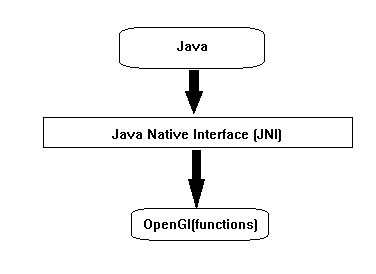
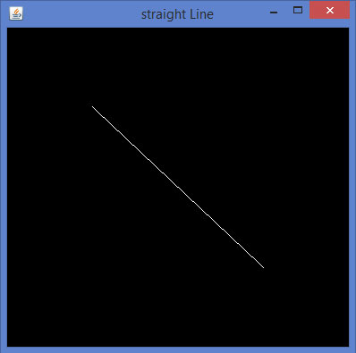
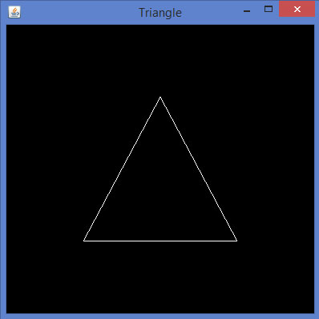
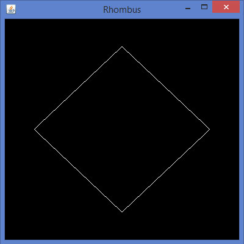
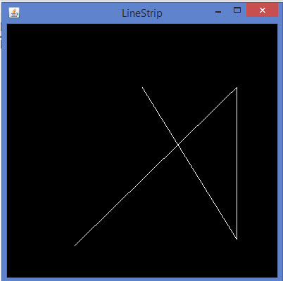
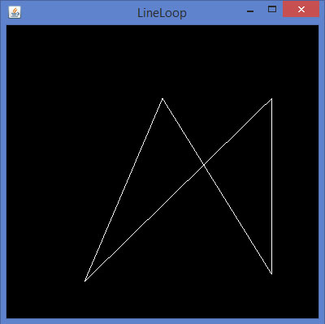
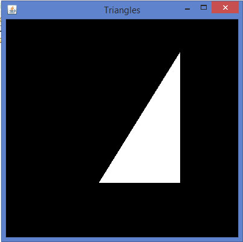
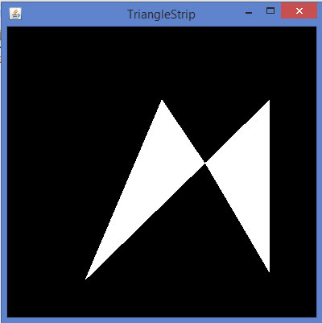
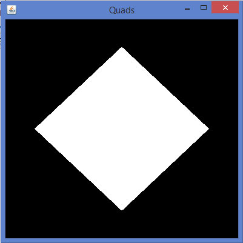
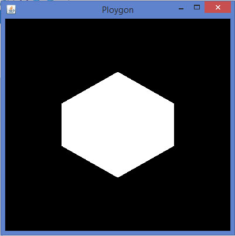

# JOGL图形形状 - JOGL教程

本教程介绍了绘制直线，用直线的各种形状。 OpenGL的API提供了原始的方法，用这些方法，可以开发形状，如三角形，多边形和圆形绘制基本图形元素如点，顶点，线等。或者二维和三维。

## 图形对象

要访问程序特定于硬件和操作系统平台，以及其他语言编写，比如C和C++(原生应用)库，Java使用一种称为Java本地接口(JNI)编程框架的工作。 JOGL内部使用此接口，如图中下面的图表来访问OpenGL函数。



GLEventListener接口的所有四种方法让代码(Java JOGL方法)，它内部调用OpenGL函数，这些JOGL方法的命名也类似于 OpenGL 命名约定。如果在OpenGL中的函数名是在glBegin()，它被用作gl.glBegin()。

只要gl.glBegin()的Java JOGL的方法被调用时，它在内部调用OpenGL的glBegin()方法。这是在安装JOGL的时间对用户的系统上安装本地库文件的原因。

Display() 方法

这是其中包含用于开发图形的代码的一个重要方法。这就要求GLAutoDrawable接口对象作为参数。

Display()方法中，首先得到使用GL接口的对象的OpenGL上下文（GL继承GLBase接口，该接口包含的方法来生成所有的OpenGL上下文对象）。由于本教程是关于JOGL2让我们产生GL2对象。

让我们通过代码片段获取GL2对象：

```
//Generating GL object
GL gl=drawable.getGL();
GL gl=drawable.getGL(); 
//Using this Getting the Gl2 Object            
//this can be written in a single line like        
final GL2 gl = drawable.getGL().getGL2();
```

使用GL2接口的对象，就可以访问GL2接口的成员，而这又提供了访问 OpenGL[1.0 ...3.0]功能。

## 绘制一条线

GL2接口包含的方法和列表，但这里的三个主要方法的重要论述，即函数是glBegin()glVertex()和glEnd()。

| Sr. No. | 方法及描述 |
| --- | --- |
| 1 | **glBegin()**此方法开始画线过程。它采用预定义的字符串整数“GL_LINES”作为一个参数，它是由GL接口继承。 |
| 2 | **glVertex3f()/glVertex2f()**此方法创建的顶点，我们必须通过坐标参数3f 和 2f,，这表示3维的浮点坐标和2维浮点分别坐标。 |
| 3 | **glEnd()**行结尾 |

让我们通过程序来绘制一条直线：

```
import javax.media.opengl.GL2;
import javax.media.opengl.GLAutoDrawable;
import javax.media.opengl.GLCapabilities;
import javax.media.opengl.GLEventListener;
import javax.media.opengl.GLProfile;
import javax.media.opengl.awt.GLCanvas;
import javax.swing.JFrame;

public class Line implements GLEventListener{
   @Override
   public void display(GLAutoDrawable drawable) {
      final GL2 gl = drawable.getGL().getGL2();
      gl.glBegin (GL2.GL_LINES);//static field
      gl.glVertex3f(0.50f,-0.50f,0);
      gl.glVertex3f(-0.50f,0.50f,0);
      gl.glEnd();
   }
   @Override
   public void dispose(GLAutoDrawable arg0) {
      //method body
   }

   @Override
   public void init(GLAutoDrawable arg0) {
      // method body
   }
   @Override
   public void reshape(GLAutoDrawable arg0, int arg1, int arg2, int arg3, int arg4) {
      // method body
   }
   public static void main(String[] args) {
      //getting the capabilities object of GL2 profile
      final GLProfile profile = GLProfile.get(GLProfile.GL2);
      GLCapabilities capabilities = new GLCapabilities(profile);
      // The canvas 
      final GLCanvas glcanvas = new GLCanvas(capabilities);
      Line l = new Line();
      glcanvas.addGLEventListener(l);
      glcanvas.setSize(400, 400);
      //creating frame
      final JFrame frame = new JFrame ("straight Line");
      //adding canvas to frame
      frame.getContentPane().add(glcanvas);
      frame.setSize(frame.getContentPane().getPreferredSize());
      frame.setVisible(true);
   }//end of main
}//end of classimport javax.media.opengl.GL2;
```



## 使用GL_LINES绘制形状

让我们通过一个程序使用GL_LINES绘制一个三角形：

```
import javax.media.opengl.GL2;
import javax.media.opengl.GLAutoDrawable;
import javax.media.opengl.GLCapabilities;
import javax.media.opengl.GLEventListener;
import javax.media.opengl.GLProfile;
import javax.media.opengl.awt.GLCanvas;
import javax.swing.JFrame;

public class Triangle implements GLEventListener{
   @Override
   public void display(GLAutoDrawable drawable) {
      final GL2 gl = drawable.getGL().getGL2();
      gl.glBegin (GL2.GL_LINES);
      //drawing the base
      gl.glBegin (GL2.GL_LINES);
      gl.glVertex3f(-0.50f, -0.50f, 0);
      gl.glVertex3f(0.50f, -0.50f, 0);
      gl.glEnd();
      //drawing the right edge
      gl.glBegin (GL2.GL_LINES);
      gl.glVertex3f(0f, 0.50f, 0);
      gl.glVertex3f(-0.50f, -0.50f, 0);
      gl.glEnd();
      //drawing the lft edge
      gl.glBegin (GL2.GL_LINES);
      gl.glVertex3f(0f, 0.50f, 0);
      gl.glVertex3f(0.50f, -0.50f, 0);
      gl.glEnd();
      gl.glFlush();
   }
   @Override
   public void dispose(GLAutoDrawable arg0) {
      //method body
   }
   @Override
   public void init(GLAutoDrawable arg0) {
   // method body
   }
   @Override
   public void reshape(GLAutoDrawable arg0, int arg1, int arg2, int arg3,
   int arg4) {
   // method body
   }
   public static void main(String[] args) {
      //getting the capabilities object of GL2 profile
      final GLProfile profile = GLProfile.get(GLProfile.GL2);
      GLCapabilities capabilities = new GLCapabilities(profile);
      // The canvas 
      final GLCanvas glcanvas = new GLCanvas(capabilities);
      Triangle l = new Triangle();
      glcanvas.addGLEventListener(l);
      glcanvas.setSize(400, 400);
      //creating frame
      final JFrame frame = new JFrame ("Triangle");
      //adding canvas to frame
      frame.getContentPane().add(glcanvas);
      frame.setSize(frame.getContentPane().getPreferredSize());
      frame.setVisible(true);
   }//end of main
}//end of classimport javax.media.opengl.GL2;
```

如果编译并执行上述程序，将生成以下输出。它示出了使用glBegin()方法的GL_LINES画出一个三角形。



让我们通过一个程序中使用GL_LINES画一个菱形：

```
import javax.media.opengl.GL2;
import javax.media.opengl.GLAutoDrawable;
import javax.media.opengl.GLCapabilities;
import javax.media.opengl.GLEventListener;
import javax.media.opengl.GLProfile;
import javax.media.opengl.awt.GLCanvas;
import javax.swing.JFrame;

public class Rhombus implements GLEventListener{
   @Override
   public void display( GLAutoDrawable drawable ) {
      final GL2 gl = drawable.getGL().getGL2();
      //edge1
      gl.glBegin( GL2.GL_LINES );
      gl.glVertex3f( 0.0f,0.75f,0 );
      gl.glVertex3f( -0.75f,0f,0 );
      gl.glEnd();
      //edge2
      gl.glBegin( GL2.GL_LINES );
      gl.glVertex3f( -0.75f,0f,0 );
      gl.glVertex3f( 0f,-0.75f, 0 );
      gl.glEnd();
      //edge3
      gl.glBegin( GL2.GL_LINES );
      gl.glVertex3f( 0f,-0.75f, 0 );
      gl.glVertex3f( 0.75f,0f, 0 );
      gl.glEnd();
      //edge4 
      gl.glBegin( GL2.GL_LINES );
      gl.glVertex3f( 0.75f,0f, 0 );
      gl.glVertex3f( 0.0f,0.75f,0 );
      gl.glEnd();
      gl.glFlush();
   }
   @Override
   public void dispose( GLAutoDrawable arg0 ) {
      //method body
   }
   @Override
   public void init(GLAutoDrawable arg0 ) {
      // method body
   }
   @Override
   public void reshape( GLAutoDrawable arg0, int arg1, int arg2, int arg3, int arg4 ) {
      // method body
   }
   public static void main( String[] args ) {
      //getting the capabilities object of GL2 profile
      final GLProfile profile = GLProfile.get( GLProfile.GL2 );
      GLCapabilities capabilities = new GLCapabilities( profile );
      // The canvas 
      final GLCanvas glcanvas = new GLCanvas( capabilities );
      Rhombus rhombus = new Rhombus();
      glcanvas.addGLEventListener( rhombus );
      glcanvas.setSize( 400, 400 );
      //creating frame
      final JFrame frame = new JFrame ( "Rhombus" );
      //adding canvas to frame
      frame.getContentPane().add( glcanvas );
      frame.setSize( frame.getContentPane().getPreferredSize() );
      frame.setVisible( true );
   }//end of main
}//end of class
```

如果编译并执行以上程序，会得到下面的输出。它示出了使用在glBegin()方法的GL_LINES产生一个菱形。



让我们通过一个程序使用GL_LINES画一所房子：

```
import javax.media.opengl.GL2;
import javax.media.opengl.GLAutoDrawable;
import javax.media.opengl.GLCapabilities;
import javax.media.opengl.GLEventListener;
import javax.media.opengl.GLProfile;
import javax.media.opengl.awt.GLCanvas;
import javax.swing.JFrame;

public class House implements GLEventListener{
   @Override
   public void display( GLAutoDrawable drawable ) {
      final GL2 gl = drawable.getGL().getGL2();
      //drawing top
      gl.glBegin ( GL2.GL_LINES );
      gl.glVertex3f( -0.3f, 0.3f, 0 );
      gl.glVertex3f( 0.3f,0.3f, 0 );
      gl.glEnd();
      //drawing bottom
      gl.glBegin( GL2.GL_LINES );
      gl.glVertex3f( -0.3f,-0.3f, 0 );
      gl.glVertex3f( 0.3f,-0.3f, 0 );
      gl.glEnd();
      //drawing the right edge
      gl.glBegin( GL2.GL_LINES );
      gl.glVertex3f( -0.3f,0.3f, 0 );
      gl.glVertex3f( -0.3f,-0.3f, 0 );
      gl.glEnd();
      //drawing the left edge
      gl.glBegin( GL2.GL_LINES );
      gl.glVertex3f( 0.3f,0.3f,0 );
      gl.glVertex3f( 0.3f,-0.3f,0 );
      gl.glEnd();
      //building roof
      //building lft dia 
      gl.glBegin( GL2.GL_LINES );
      gl.glVertex3f( 0f,0.6f, 0 );
      gl.glVertex3f( -0.3f,0.3f, 0 );
      gl.glEnd();
      //building rt  dia 
      gl.glBegin( GL2.GL_LINES );
      gl.glVertex3f( 0f,0.6f, 0 );
      gl.glVertex3f( 0.3f,0.3f, 0 );
      gl.glEnd();
      //building door
      //drawing top
      gl.glBegin ( GL2.GL_LINES );
      gl.glVertex3f( -0.05f, 0.05f, 0 );
      gl.glVertex3f( 0.05f, 0.05f, 0 );
      gl.glEnd();
      //drawing the left edge
      gl.glBegin ( GL2.GL_LINES );
      gl.glVertex3f( -0.05f, 0.05f, 0 );
      gl.glVertex3f( -0.05f, -0.3f, 0 );
      gl.glEnd();
      //drawing the right edge
      gl.glBegin ( GL2.GL_LINES );
      gl.glVertex3f( 0.05f, 0.05f, 0 );
      gl.glVertex3f( 0.05f, -0.3f, 0 );
      gl.glEnd();
   }
   @Override
   public void dispose( GLAutoDrawable arg0 ) {
      //method body
   }
   @Override
   public void init( GLAutoDrawable arg0 ) {
      // method body
   }
   @Override
   public void reshape( GLAutoDrawable arg0, int arg1, int arg2, int arg3, int arg4 ) {
      // method body
   }
   public static void main( String[] args ) {
      //getting the capabilities object of GL2 profile
      final GLProfile profile = GLProfile.get( GLProfile.GL2 );
      GLCapabilities capabilities = new GLCapabilities( profile );
      // The canvas 
      final GLCanvas glcanvas = new GLCanvas( capabilities );
      House house = new House();
      glcanvas.addGLEventListener( house );
      glcanvas.setSize(400, 400);
      //creating frame
      final JFrame frame = new JFrame( "House" );
      //adding canvas to frame
      frame.getContentPane().add( glcanvas );
      frame.setSize( frame.getContentPane().getPreferredSize() );
      frame.setVisible( true );
   }//end of main
}//end of class
```

如果编译并执行以上程序，会得到下面的输出。它示出了使用GL_LINES()方法生成一所房子的图。


## 使用glBegin()更多的参数绘画出更多的形状

除了GL_LINES预定义的字符串参数，glBegin()方法接受八个参数。可以用它来绘制不同的形状。这些用于相同GL_LINES。

下表显示了glBegin()方法的参数和描述：

| Sr. No. | 参数和描述 |
| --- | --- |
| 1 | GL_LINES创建每对顶点作为一个独立的线段。 |
| 2 | GL_LINE_STRIP绘制线段的连接组从第一顶点到最后。 |
| 3 | GL_LINE_LOOP绘制线段的从第一顶点到最后一个连接组再次回到第一个点。 |
| 4 | GL_TRIANGLES把顶点的每一三元组作为一个独立的三角形。 |
| 5 | GL_TRIANGLE_STRIP绘制三角形的连接组。一个三角形被定义为所述第一两个顶点后呈现的每个顶点。 |
| 6 | GL_TRIANGLE_FAN绘制三角形的连接组。一个三角形被定义为所述第一两个顶点后呈现的每个顶点。 |
| 7 | GL_QUADS将每个组的四个顶点作为一个独立的四边形。 |
| 8 | GL_QUAD_STRIP绘制四边形的连接组。一个四边形被定义为每对所述第一对后呈现的顶点。 |
| 9 | GL_POLYGON绘制一个单一的，凸多边形。顶点1，...，N定义这个多边形。 |

让我们来看看使用glBegin()参数的一些例子。

程序画线带钢：

```
import javax.media.opengl.GL2;
import javax.media.opengl.GLAutoDrawable;
import javax.media.opengl.GLCapabilities;
import javax.media.opengl.GLEventListener;
import javax.media.opengl.GLProfile;
import javax.media.opengl.awt.GLCanvas;
import javax.swing.JFrame;

public class LineStrip implements GLEventListener{
   @Override
   public void display(GLAutoDrawable drawable) {
      final GL2 gl = drawable.getGL().getGL2();
      gl.glBegin (GL2.GL_LINE_STRIP);
      gl.glVertex3f(-0.50f,-0.75f, 0);
      gl.glVertex3f(0.7f,0.5f, 0);
      gl.glVertex3f(0.70f,-0.70f, 0);
      gl.glVertex3f(0f,0.5f, 0);
      gl.glEnd();
   }
   @Override
   public void dispose(GLAutoDrawable arg0) {
      //method body
   }
   @Override
   public void init(GLAutoDrawable arg0) {
      // method body
   }
   @Override
   public void reshape(GLAutoDrawable arg0, int arg1, int arg2, int arg3, int arg4) {
      // method body
   }
   public static void main(String[] args) {
      //getting the capabilities object of GL2 profile 
      final GLProfile profile = GLProfile.get(GLProfile.GL2);
      GLCapabilities capabilities = new GLCapabilities(profile);
      // The canvas 
      final GLCanvas glcanvas = new GLCanvas(capabilities);
      LineStrip r = new LineStrip();
      glcanvas.addGLEventListener(r);
      glcanvas.setSize(400, 400);
      //creating frame
      final JFrame frame = new JFrame ("LineStrip");
      //adding canvas to frame
      frame.getContentPane().add(glcanvas);
      frame.setSize(frame.getContentPane().getPreferredSize());
      frame.setVisible(true);
   }//end of main
}//end of classimport javax.media.opengl.GL2;
```

如果编译并执行上面的代码，生成以下输出：



代码片段display()方法来绘制线路回路：

```
public void display(GLAutoDrawable drawable) {
   final GL2 gl = drawable.getGL().getGL2();
   gl.glBegin (GL2.GL_LINE_LOOP);
   gl.glVertex3f( -0.50f, -0.75f, 0);
   gl.glVertex3f(0.7f, .5f, 0);
   gl.glVertex3f(0.70f,  -0.70f, 0);
   gl.glVertex3f(0f, 0.5f, 0);
   gl.glEnd();
}
```

如果用上面的代码替换任何基本的模板方案的display()方法，编译并执行它，下面的输出生成：



代码片段display()方法使用GL_TRIANGLES画三角形

```
public void display(GLAutoDrawable drawable) {
   final GL2 gl = drawable.getGL().getGL2();
   gl.glBegin(GL2.GL_TRIANGLES);        // Drawing Using Triangles
   gl.glVertex3f(0.5f,0.7f,0.0f);      // Top
   gl.glVertex3f(-0.2f,-0.50f,0.0f);  // Bottom Left
   gl.glVertex3f(0.5f,-0.5f,0.0f);   //Bottom Right
   gl.glEnd();   
}
```

如果用上面的代码替换显示任何基本的模板程序的方法，编译并执行它，下面的输出生成：



代码片段display()方法来绘制三角形：

```
public void display(GLAutoDrawable drawable) {
   final GL2 gl = drawable.getGL().getGL2();
   gl.glBegin (GL2.GL_TRIANGLE_STRIP);
   gl.glVertex3f(0f,0.5f,0);
   gl.glVertex3f(-0.50f,-0.75f,0);
   gl.glVertex3f(0.28f,0.06f,0);
   gl.glVertex3f(0.7f,0.5f,0);
   gl.glVertex3f(0.7f,-0.7f,0);
   gl.glEnd();   
}
```

如果要更换显示器的任何与上面的代码的基本模板方案的方法，编译并执行它，下面的输出生成：



代码片段display()方法来绘制四边形：

```
public void display(GLAutoDrawable drawable) {
   final GL2 gl = drawable.getGL().getGL2();
   gl.glBegin(GL2.GL_QUADS);
   gl.glVertex3f( 0.0f,0.75f,0);
   gl.glVertex3f(-0.75f,0f,0);
   gl.glVertex3f(0f,-0.75f,0);
   gl.glVertex3f(0.75f,0f,0);
   gl.glEnd();   
}
```

如果用上面的代码替换显示任何基本的模板程序的方法，编译并执行它，下面的输出生成：



代码片段display()方法来绘制多边形：

```
public void display(GLAutoDrawable drawable) {
   final GL2 gl = drawable.getGL().getGL2();
   gl.glBegin(GL2.GL_POLYGON);
   gl.glVertex3f(0f,0.5f,0f);
   gl.glVertex3f(-0.5f,0.2f,0f);
   gl.glVertex3f(-0.5f,-0.2f,0f);
   gl.glVertex3f(0f,-0.5f,0f);
   gl.glVertex3f(0f,0.5f,0f);
   gl.glVertex3f(0.5f,0.2f,0f);
   gl.glVertex3f(0.5f,-0.2f,0f);
   gl.glVertex3f(0f,-0.5f,0f);
   gl.glEnd();
}
```

如果用上面的代码替换任何基本的模板方案的display()方法，编译并执行它，会生成以下输出

   