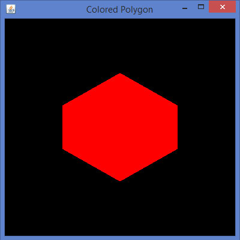
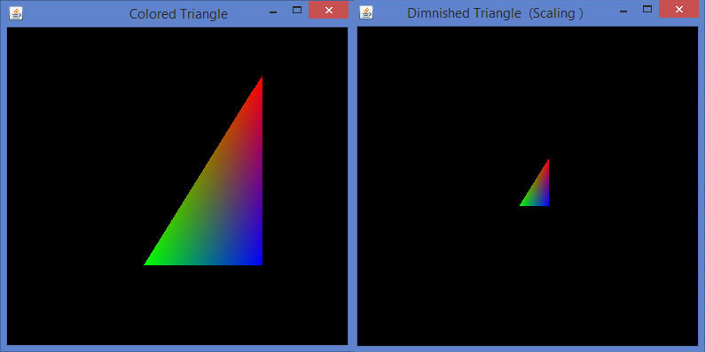
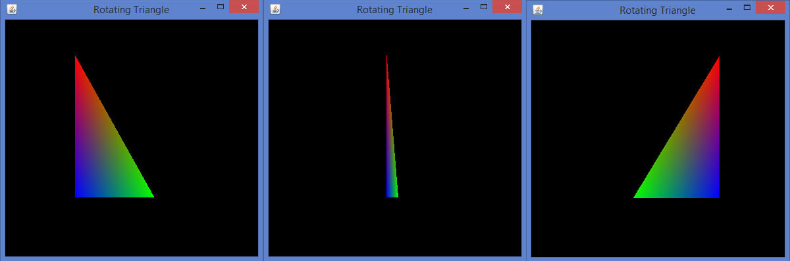

# JOGL转化对象 - JOGL教程

OpenGL提供了更多的功能，比如色彩应用到一个对象，比例，灯光，旋转的物体等。本章介绍了一些变换使用JOGL的对象。

## 移动对象的窗口

在前面的章节中，我们讨论的方案画线，用简单的线条绘制各种形状。以这种方式创建的形状可被显示在该窗口内的任何位置。它是通过使用glTranslatef (float x, float y, float z) 方法完成。

这种方法属于GLMatrixFunc接口，它在javax.media.opengl.fixedfunc包。

### GLMatrixFunc 接口

interface: GLMatrixFunc

package: javax.media.opengl.fixedfunc

让我们来看看这个接口的一些重要方法：

| Sr. No. | 方法和说明 |
| --- | --- |
| 1 | **void glRotatef(float angle, float x, float y, float z)**这个方法旋转当前矩阵。 |
| 2 | **void glScalef(float x, float y, float z)**此方法用于缩放当前矩阵。 |
| 3 | **void glTranslatef(float x, float y,float z)**此方法用于转换的当前矩阵。 |
| 4 | **void glLoadIdentity()**此方法加载当前矩阵与单位矩阵。 |

glTranslate()方法的移动坐标系的原点，以通过所述参数（x，y，z），传递给glTranslate()方法作为参数指定的点。保存和恢复的未翻译的坐标系，glPushMatrix()和glPopMatrix()方法被使用。

```
 gl.glTranslatef(0f, 0f, -2.5f);
```

只要 glTranslate()方法被使用时，它改变了组件的屏幕上的位置。因此，GLEventListener 界面的 reshape()方法应该重写和OpenGL视口和投影矩阵应该初始化。

下面的代码显示初始化视口和投影矩阵模板：

```
public void reshape(GLAutoDrawable drawable, int x,  int y, int width, int height){
   final GL2 gl = drawable.getGL().getGL2(); 
   // get the OpenGL 2 graphics object  
   if(height <=0)
      height =1;
   //preventing devided by 0 exception height =1;
   final float h = (float) width / (float) height;
   // display area to cover the entire window
   gl.glViewport(0, 0, width, height);
   //transforming projection matrix
   gl.glMatrixMode(GL2.GL_PROJECTION);
   gl.glLoadIdentity();
   glu.gluPerspective(45.0f, h, 1.0, 20.0);
   //transforming model view gl.glLoadIdentity();
   gl.glMatrixMode(GL2.GL_MODELVIEW);
   gl.glLoadIdentity();
}
```

## 运用颜色的对象

要应用颜色的物体，使用GL2类的glColor()方法。

语法

```
 gl.glColorXY(1f,0f,0f);
```

例子

如果通过颜色值（1，0，0），那么得到的红色和（1，1，0）的值给定为黄色。

*   x表示使用的颜色数， 3 (red, blue, green) or 4(red, blue, green, alpha)。为了得到不同的颜色组合，这些颜色值作为参数传递。颜色参数的序列必须是维护的顺序。

*   y表示它接受的参数，如字节byte(b), double(d), float(f), int(i), short(s), ubyte(ub), uint(ui), ushort(us)。

```
 gl.glColor3f(1f,0f,0f);   //gives us red         
 gl.glColor3f(0f,1f,0f);   //gives us blue         
 gl.glColor3f(0f,0f,1f);   //gives us green
```

如果三角形，可以为每个顶点应用不同的颜色。

让我们通过程序的颜色应用到一个三角形：

```
import javax.media.opengl.GL2;
import javax.media.opengl.GLAutoDrawable;
import javax.media.opengl.GLCapabilities;
import javax.media.opengl.GLEventListener;
import javax.media.opengl.GLProfile;
import javax.media.opengl.awt.GLCanvas;
import javax.swing.JFrame;

public class TriangleColor implements GLEventListener{
   @Override
   public void display( GLAutoDrawable drawable ) {
      final GL2 gl = drawable.getGL().getGL2();
      gl.glBegin( GL2.GL_TRIANGLES );         // Drawing Using Triangles
      gl.glColor3f( 1.0f, 0.0f, 0.0f ); //Red
      gl.glVertex3f( 0.5f,0.7f,0.0f ); // Top
      gl.glColor3f( 0.0f,1.0f,0.0f ); //blue
      gl.glVertex3f( -0.2f,-0.50f,0.0f );              // Bottom Left
      gl.glColor3f( 0.0f,0.0f,1.0f ); //green
      gl.glVertex3f( 0.5f,-0.5f,0.0f );              //Bottom Right
      gl.glEnd();   
   }
   @Override
   public void dispose( GLAutoDrawable arg0 ) {
      //method body
   }
   @Override
   public void init( GLAutoDrawable arg0 ) {
      // method body
   }
   @Override
   public void reshape( GLAutoDrawable arg0, int arg1, int arg2, int arg3, int arg4 ) {
      // method body
   }
   public static void main( String[] args ) {
      //getting the capabilities object of GL2 profile
      final GLProfile profile = GLProfile.get( GLProfile.GL2 );
      GLCapabilities capabilities = new GLCapabilities( profile );
      // The canvas 
      final GLCanvas glcanvas = new GLCanvas( capabilities );
      TriangleColor triangle = new TriangleColor();
      glcanvas.addGLEventListener( triangle );
      glcanvas.setSize( 400, 400 );
      //creating frame
      final JFrame frame = new JFrame (" Colored Triangle");      
      //adding canvas to it
      frame.getContentPane().add( glcanvas );
      frame.setSize( frame.getContentPane().getPreferredSize() );
      frame.setVisible( true );
   }//end of main
}//end of class
```

当编译并执行以上程序，会得到如下彩色三角形：


## 应用颜色为多边形

让我们通过程序的颜色应用到多边形：

```
import javax.media.opengl.GL2;
import javax.media.opengl.GLAutoDrawable;
import javax.media.opengl.GLCapabilities;
import javax.media.opengl.GLEventListener;
import javax.media.opengl.GLProfile;
import javax.media.opengl.awt.GLCanvas;
import javax.swing.JFrame;

public class PolygonColor implements GLEventListener{
   @Override
   public void display( GLAutoDrawable drawable ) {
      final GL2 gl = drawable.getGL().getGL2();
      gl.glColor3f( 1f,0f,0f ); //applying red   
      gl.glBegin( GL2.GL_POLYGON );
      gl.glVertex3f( 0f,0.5f,0f  );
      gl.glVertex3f( -0.5f,0.2f,0f );
      gl.glVertex3f( -0.5f,-0.2f,0f );
      gl.glVertex3f( 0f,-0.5f,0f );
      gl.glVertex3f( 0f,0.5f,0f );
      gl.glVertex3f( 0.5f,0.2f,0f );
      gl.glVertex3f( 0.5f,-0.2f,0f );
      gl.glVertex3f( 0f,-0.5f,0f );
      gl.glEnd();
   }
   @Override
   public void dispose( GLAutoDrawable arg0 ) {
      //method body
   }
   @Override
   public void init( GLAutoDrawable arg0 ) {
      // method body
   }
   @Override
   public void reshape( GLAutoDrawable arg0, int arg1, int arg2, int arg3, int arg4 ) {
      // method body
   }
   public static void main( String[] args ) {
      //getting the capabilities object of GL2 profile
      final GLProfile profile = GLProfile.get( GLProfile.GL2 );
      GLCapabilities capabilities = new GLCapabilities( profile );
      // The canvas 
      final GLCanvas glcanvas = new GLCanvas( capabilities );
      PolygonColor polygon = new PolygonColor();
      glcanvas.addGLEventListener( polygon );
      glcanvas.setSize( 400, 400 );
      //creating frame
      final JFrame frame = new JFrame ( "Colored Polygon" );
      //adding canvas to frame
      frame.getContentPane().add( glcanvas );
      frame.setSize( frame.getContentPane().getPreferredSize() );
      frame.setVisible( true );
   }//end of main
}//end of class
```

当编译并执行上述程序，将生成以下输出：



## 缩放

缩放对象是通过使用GLMatrixFunc接口的void glScalef(float x, float y, float z) 方法进行。该方法接受三个浮点参数，使用我们指定轴沿x，y和z比例因子。

例如，在下面的程序中，一个三角形是减弱至50％。在这里，50传递的是沿所有轴的参数。

让我们通过程序来扩展一个三角形：

```
import javax.media.opengl.GL2;
import javax.media.opengl.GLAutoDrawable;
import javax.media.opengl.GLCapabilities;
import javax.media.opengl.GLEventListener;
import javax.media.opengl.GLProfile;
import javax.media.opengl.awt.GLCanvas;
import javax.swing.JFrame;

public class Scaling implements GLEventListener{
   @Override
   public void display( GLAutoDrawable drawable ) {
      final GL2 gl = drawable.getGL().getGL2();
      gl.glScalef( 0.50f,0.25f,0.50f );
      gl.glBegin( GL2.GL_TRIANGLES );       // Drawing Using Triangles
      gl.glColor3f( 1.0f, 0.0f, 0.0f ); //Red
      gl.glVertex3f( 0.5f,0.7f,0.0f ); // Top
      gl.glColor3f( 0.0f,1.0f,0.0f ); //blue
      gl.glVertex3f( -0.2f,-0.50f,0.0f );          // Bottom Left
      gl.glColor3f( 0.0f,0.0f,1.0f ); //green
      gl.glVertex3f( 0.5f,-0.5f,0.0f );           //Bottom Right
      gl.glEnd();
   }
   @Override
   public void dispose( GLAutoDrawable arg0 ) {
      //method body
   }
   @Override
   public void init( GLAutoDrawable arg0 ) {
      // method body
   }
   @Override
   public void reshape( GLAutoDrawable arg0, int arg1, int arg2, int arg3, int arg4 ) {
      // method body
   }
   public static void main( String[] args ) {
      //getting the capabilities object of GL2 profile
      final GLProfile profile = GLProfile.get( GLProfile.GL2 );
      GLCapabilities capabilities = new GLCapabilities( profile );
      // The canvas 
      final GLCanvas glcanvas = new GLCanvas( capabilities );
      Scaling scaling = new Scaling();
      glcanvas.addGLEventListener( scaling );
      glcanvas.setSize( 400, 400 );
      //creating frame
      final JFrame frame = new JFrame (" Dimnished Triangle (Scaling )");
      //adding canvas to it
      frame.getContentPane().add(glcanvas);
      frame.setSize(frame.getContentPane().getPreferredSize());
      frame.setVisible(true);
   }//end of main
}//end of classimport javax.media.opengl.GL2;
```

编译和执行上面的程序，我们得到以下输出。在这里，可以看到一个三角形的减弱相比，由TriangleColor.java生产的原三角形：



## 旋转

对象旋转可以沿任意3轴来完成，使用GLMatrixFunc接口的void glRotatef(float angle, float x, float y, float z) 方法。需要传递的旋转以及x，y，z轴的角度作为参数传递给该方法。

下面的步骤指导成功地旋转对象：

*   清除颜色缓存和深度缓存最初使用gl.glClear（GL2.GL_COLOR_BUFFER_BIT| GL2.GL_DEPTH_BUFFER_BIT）方法。此方法擦除对象的先前状态，使视图清晰。

*   复位用glLoadIdentity()方法的投影矩阵。

实例化的动画类和使用start()方法启动动画。

### FPSAnimator 类

Class:

FPSAnimator

Package: javax.media.opengl.util

构造方法

```
FPSAnimator(GLAutoDrawable drawable, int fps)
```

创建给定的目标帧每秒的值和初始绘制的动画一个FPSAnimator。

```
FPSAnimator(GLAutoDrawable drawable, int fps, boolean cheduleAtFixedRate)
```

创建一个具有给定的目标帧每秒的值，初始绘制动画，和一个标志，指示是否使用固定利率调度FPSAnimator。

```
FPSAnimator(int fps)
```

创建由给定的目标帧每秒值的FPSAnimator。

```
FPSAnimator(int fps, boolean scheduleAtFixedRate)
```

创建由给定的目标帧每秒的值和一个标志，指示是否使用固定速率的调度FPSAnimator。

start() 和stop()在这个类中的两个重要的方法。

让我们通过程序来旋转一个三角形：

```
import javax.media.opengl.GL2;
import javax.media.opengl.GLAutoDrawable;
import javax.media.opengl.GLCapabilities;
import javax.media.opengl.GLEventListener;
import javax.media.opengl.GLProfile;
import javax.media.opengl.awt.GLCanvas;
import javax.swing.JFrame;
import com.jogamp.opengl.util.FPSAnimator;
public class TriangleRotation implements GLEventListener{
   private float rtri;  //for angle of rotation
   @Override
   public void display( GLAutoDrawable drawable ) {
      final GL2 gl = drawable.getGL().getGL2();
      gl.glClear (GL2.GL_COLOR_BUFFER_BIT | GL2.GL_DEPTH_BUFFER_BIT );     
      // Clear The Screen And The Depth Buffer
      gl.glLoadIdentity();                  // Reset The View
      gl.glRotatef( rtri, 0.0f, 1.0f, 0.0f );//triangle rotation
      gl.glBegin( GL2.GL_TRIANGLES );         // Drawing Using Triangles
      gl.glColor3f( 1.0f, 0.0f, 0.0f ); //Red
      gl.glVertex3f( 0.5f,0.7f,0.0f ); // Top
      gl.glColor3f( 0.0f,1.0f,0.0f ); //blue
      gl.glVertex3f( -0.2f,-0.50f,0.0f );              // Bottom Left
      gl.glColor3f( 0.0f,0.0f,1.0f ); //green
      gl.glVertex3f( 0.5f,-0.5f,0.0f );              // Bottom Right
      gl.glEnd();   
      gl.glFlush();
      rtri +=0.2f;  //assigning the angle
   }
   @Override
   public void dispose( GLAutoDrawable arg0 ) {
      //method body
   }
   @Override
   public void init( GLAutoDrawable arg0 ) {
      // method body
   }
   @Override
   public void reshape( GLAutoDrawable drawable, int x, int y, int width, int height ) {
      // method body
   }
   public static void main( String[] args ) {
      //getting the capabilities object of GL2 profile 
      final GLProfile profile = GLProfile.get( GLProfile.GL2 );
      GLCapabilities capabilities = new GLCapabilities( profile );
      // The canvas 
      final GLCanvas glcanvas = new GLCanvas( capabilities );
      TriangleRotation triangle = new TriangleRotation();
      glcanvas.addGLEventListener( triangle );
      glcanvas.setSize( 400, 400 );
      //creating frame
      final JFrame frame = new JFrame ( "Rotating Triangle" );
      //adding canvas to it
      frame.getContentPane().add( glcanvas );
      frame.setSize( frame.getContentPane().getPreferredSize() );
      frame.setVisible( true );
      //Instantiating and Initiating Animator
      final FPSAnimator animator = new FPSAnimator( glcanvas, 300,true );
      animator.start();
   }//end of main
}//end of class
```

如果编译并执行上述程序，它会生成以下输出。在这里，可以看到周围x轴旋转彩色三角形的各个快照。



## 灯光

要设置灯光，使用过glEnable()方法初步启用的照明。然后应用照明的对象，使用GLLightingFunc接口的 glLightfv(int light, int pname, float[] params, int params_offset) 方法。这个方法有四个参数。

下表描述了gllightfv()方法的参数。

| Sr. No. | 参数名称和描述 |
| --- | --- |
| 1 | **Light**指定的光。灯的数量依赖于实现，但至少八个灯支持。它接受10个值，这些参数是在一个名为下面给出的光源参数表中单独讨论。 |
| 2 | **Pname**指定一个单值的光源参数。光源有10个参数，如下所述。 |
| 3 | **Params**指定的指针被设置到的光源的参数pname的一个或多个值。 |
| 4 | **Light source parameter**可以使用以下任何给定的光源参数。 |

光源参数：

| Sr. No. | 参数及描述 |
| --- | --- |
| 1 | **GL_AMBIENT**它包含指定的光的环境亮度的参数。 |
| 2 | **GL_DIFFUSE**它包含指定的光的漫反射的强度的参数。 |
| 3 | **GL_SPECULAR**它包含指定的光的镜面反射强度的参数。 |
| 4 | **GL_POSITION**它包含指定的均质物体坐标的光的位置的4个整数或浮点值。 |
| 5 | **GL_SPOT_DIRECTION**它包含在均质物体坐标指定的光的方向的参数。 |
| 6 | **GL_SPOT_EXPONENT**此参数指定的光的强度分布。 |
| 7 | **GL_SPOT_CUTOFF**这种单参数指定的光的最大发散角。 |
| 8 | **GL_CONSTANT_ATTENUATION or GL_LINEAR_ATTENUATION or GL_QUADRATIC_ATTENUATION**可以使用任意的衰减系数，它是由一个单一的值来表示。 |

照明被启用并使用过glEnable()方法和glDisable()函数以及参数GL_LIGHTING禁用。

下面的模板，给出了灯光：

```
gl.glEnable(GL2.GL_LIGHTING);
gl.glEnable(GL2.GL_LIGHT0); gl.glEnable(GL2.GL_NORMALIZE);
float[] ambientLight = { 0.1f, 0.f, 0.f,0f }; // weak RED ambient
gl.glLightfv(GL2.GL_LIGHT0, GL2.GL_AMBIENT, ambientLight, 0);
float[] diffuseLight = { 1f,2f,1f,0f }; //multi-color diffuse
gl.glLightfv(GL2.GL_LIGHT0, GL2.GL_DIFFUSE, diffuseLight, 0);
```

## 施加光到一个旋转多角

遵循用于将光以一个旋转多角给定的步骤。

使用旋转glRotate()方法的多边形：

```
gl.glClear(GL2.GL_COLOR_BUFFER_BIT | GL2.GL_DEPTH_BUFFER_BIT);  
// Clear The Screen And The Depth Buffer 
gl.glLoadIdentity();                  
// Reset The View 
gl.glRotatef(rpoly, 0.0f, 1.0f, 0.0f);
```

让我们通过程序将光应用到旋转面：

```
import javax.media.opengl.GL2;
import javax.media.opengl.GLAutoDrawable;
import javax.media.opengl.GLCapabilities;
import javax.media.opengl.GLEventListener;
import javax.media.opengl.GLProfile;
import javax.media.opengl.awt.GLCanvas;
import javax.swing.JFrame;
import com.jogamp.opengl.util.FPSAnimator;

public class PolygonLighting implements GLEventListener{
   private float rpoly;
   @Override
   public void display( GLAutoDrawable drawable ) {
      final GL2 gl = drawable.getGL().getGL2();
      gl.glColor3f(1f,0f,0f); //applying red   
      // Clear The Screen And The Depth Buffer
      gl.glClear( GL2.GL_COLOR_BUFFER_BIT | GL2.GL_DEPTH_BUFFER_BIT );  
      gl.glLoadIdentity();                  // Reset The View
      gl.glRotatef( rpoly, 0.0f, 1.0f, 0.0f );
      gl.glBegin( GL2.GL_POLYGON );
      gl.glVertex3f( 0f,0.5f,0f );
      gl.glVertex3f( -0.5f,0.2f,0f );
      gl.glVertex3f( -0.5f,-0.2f,0f );
      gl.glVertex3f( 0f,-0.5f,0f );
      gl.glVertex3f( 0f,0.5f,0f );
      gl.glVertex3f( 0.5f,0.2f,0f );
      gl.glVertex3f( 0.5f,-0.2f,0f );
      gl.glVertex3f( 0f,-0.5f,0f );
      gl.glEnd();
      gl.glFlush();
      rpoly +=0.2f;  //assigning the angle
      gl.glEnable( GL2.GL_LIGHTING ); 
      gl.glEnable( GL2.GL_LIGHT0 ); 
      gl.glEnable( GL2.GL_NORMALIZE );
      float[] ambientLight =  0.1f, 0.f, 0.f,0f }; // weak RED ambient 
      gl.glLightfv( GL2.GL_LIGHT0, GL2.GL_AMBIENT, ambient-Light, 0 ); 
      float[] diffuseLight = { 1f,2f,1f,0f }; //multi color diffuse 
      gl.glLightfv( GL2.GL_LIGHT0, GL2.GL_DIFFUSE, diffuse-Light, 0 );
   }
   @Override
   public void dispose( GLAutoDrawable arg0 ) {
      //method body
   }
   @Override
   public void init( GLAutoDrawable arg0 ) {
      // method body
   }
   @Override
   public void reshape( GLAutoDrawable arg0, int arg1, int arg2, int arg3, int arg4 ) {
      // method body
   }
   public static void main( String[] args ) {
      //getting the capabilities object of GL2 profile 
      final GLProfile profile = GLProfile.get( GLProfile.GL2 );
      GLCapabilities capabilities = new GLCapabilities( profile );
      // The canvas 
      final GLCanvas glcanvas = new GLCanvas( capabilities );
      PolygonLighting polygonlighting = new PolygonLighting();
      glcanvas.addGLEventListener( polygonlighting );
      glcanvas.setSize( 400, 400 );
      //creating frame
      final JFrame frame = new JFrame ( " Polygon lighting " );
      //adding canvas to it
      frame.getContentPane().add( glcanvas );
      frame.setSize( frame.getContentPane().getPreferredSize() );
      frame.setVisible( true );
      //Instantiating and Initiating Animator
      final FPSAnimator animator = new FPSAnimator(glcanvas, 300,true );
      animator.start();
   }//end of main
}//end of class
```

如果编译并执行上述程序，它会生成以下输出。在这里，可以观察到一个旋转的多边形灯光的各种快照。

   