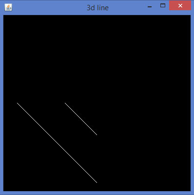
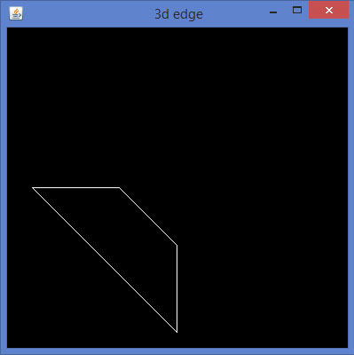
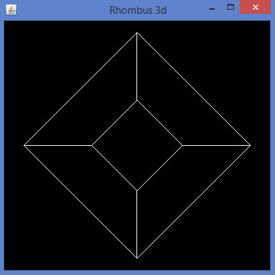
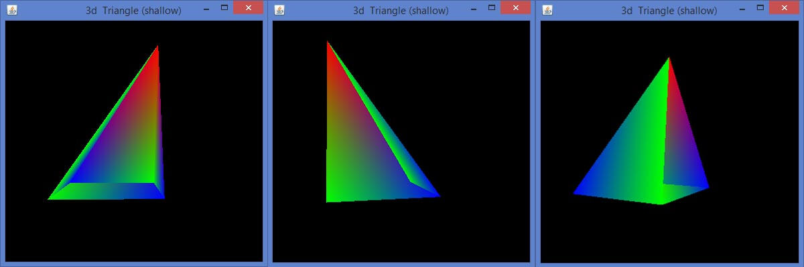
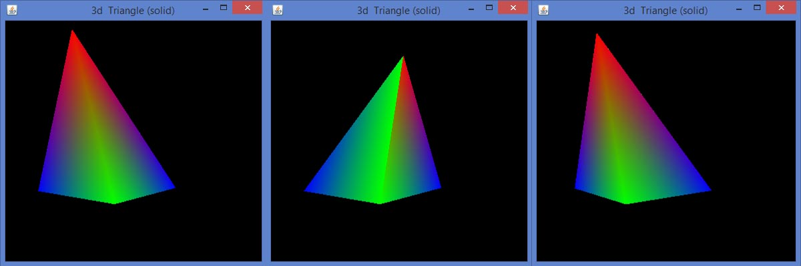
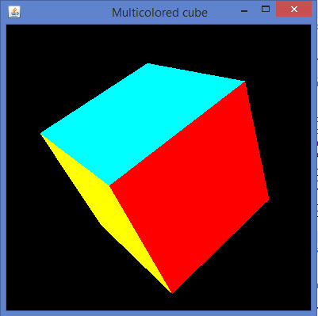
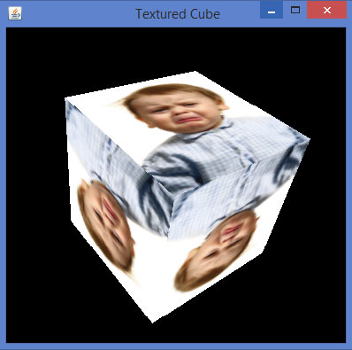

# JOGL 3D图形 - JOGL教程

在本章中，让我们来学习如何处理3D图形。

## 绘制3D线

让我们绘制与z轴成简单的线，看到2D和3D线之间的差值。先画一条简单的直线，再画第二条线3个单元到窗口中。

让我们通过程序来绘制3D线：

```
import javax.media.opengl.GL2;
import javax.media.opengl.GLAutoDrawable;
import javax.media.opengl.GLCapabilities;
import javax.media.opengl.GLEventListener;
import javax.media.opengl.GLProfile;
import javax.media.opengl.awt.GLCanvas;
import javax.media.opengl.glu.GLU;
import javax.swing.JFrame;

public class Line3d implements GLEventListener{
   private GLU glu = new GLU();
   @Override
   public void display( GLAutoDrawable drawable ) {   
      final GL2 gl = drawable.getGL().getGL2();
      gl.glTranslatef( 0f, 0f, -2.5f );
      gl.glBegin( GL2.GL_LINES );
      gl.glVertex3f( -0.75f,0f,0 );
      gl.glVertex3f( 0f,-0.75f, 0 );
      gl.glEnd();
      //3d line
      gl.glBegin( GL2.GL_LINES );
      gl.glVertex3f( -0.75f,0f,3f );// 3 units into the window
      gl.glVertex3f( 0f,-0.75f,3f );
      gl.glEnd();
   }
   @Override
   public void dispose( GLAutoDrawable arg0 ) {
      //method body
   }
   @Override
   public void init( GLAutoDrawable arg0 ) {
      // method body
   }
   @Override
   public void reshape( GLAutoDrawable drawable, int x, int y, int width, int height ) {
      GL2 gl = drawable.getGL().getGL2();
      if( height <=0 )
         height =1;
      final float h = ( float ) width / ( float ) height;
      gl.glViewport( 0, 0, width, height );
      gl.glMatrixMode( GL2.GL_PROJECTION );
      gl.glLoadIdentity();
      glu.gluPerspective( 45.0f, h, 1.0, 20.0 );
      gl.glMatrixMode( GL2.GL_MODELVIEW );
      gl.glLoadIdentity();
   }
   public static void main( String[] args ) {
      //getting the capabilities object of GL2 profile
      final GLProfile profile = GLProfile.get( GLProfile.GL2 );
      GLCapabilities capabilities = new GLCapabilities( profile );
      // The canvas 
      final GLCanvas glcanvas = new GLCanvas( capabilities );
      Line3d line3d = new Line3d();
      glcanvas.addGLEventListener( line3d );
      glcanvas.setSize( 400, 400 );
      //creating frame
      final JFrame frame = new JFrame (" 3d line");
      //adding canvas to it
      frame.getContentPane().add( glcanvas );
      frame.setSize( frame.getContentPane().getPreferredSize() );
      frame.setVisible( true );
   }//end of main
}//end of class
```

当编译并执行上述程序，将生成以下输出：



3D形状可以通过glVertex3f()方法，该方法产生上述观点的Z-象限赋予非零值绘制。现在加入剩余行会导致一个三维边缘。

程序开发3D优势：

```
import javax.media.opengl.GL2;
import javax.media.opengl.GLAutoDrawable;
import javax.media.opengl.GLCapabilities;
import javax.media.opengl.GLEventListener;
import javax.media.opengl.GLProfile;
import javax.media.opengl.awt.GLCanvas;
import javax.media.opengl.glu.GLU;
import javax.swing.JFrame;

public class Edge1 implements GLEventListener{
   private GLU glu = new GLU();
   @Override
   public void display(GLAutoDrawable drawable) {   
      // TODO Auto-generated method stub
      final GL2 gl = drawable.getGL().getGL2();
      gl.glTranslatef(0f, 0f, -2.5f);
      gl.glBegin(GL2.GL_LINES);
      gl.glVertex3f(-0.75f,0f,0);
      gl.glVertex3f(0f,-0.75f, 0);
      gl.glEnd();
      //3d line
      gl.glBegin(GL2.GL_LINES);
      //3 units in to the window
      gl.glVertex3f(-0.75f,0f,3f);
      gl.glVertex3f(0f,-0.75f,3f);
      gl.glEnd();
      //top
      gl.glBegin(GL2.GL_LINES);
      gl.glVertex3f(-0.75f,0f,0);
      gl.glVertex3f(-0.75f,0f,3f);
      gl.glEnd();
      //bottom
      gl.glBegin(GL2.GL_LINES); 
      gl.glVertex3f(0f,-0.75f, 0);
      gl.glVertex3f(0f,-0.75f,3f);
      gl.glEnd();
   }
   @Override
   public void dispose(GLAutoDrawable arg0) {
      //method body
   }
   @Override
   public void init(GLAutoDrawable arg0) {
      // method body
   }
   @Override
   public void reshape(GLAutoDrawable drawable, int x, int y, int width, int height) {
      GL2 gl = drawable.getGL().getGL2();
      if(height <=0)
         height =1;
      final float h = (float) width / (float) height;
      gl.glViewport(0, 0, width, height);
      gl.glMatrixMode(GL2.GL_PROJECTION);
      gl.glLoadIdentity();
      glu.gluPerspective(45.0f, h, 1.0, 20.0);
      gl.glMatrixMode(GL2.GL_MODELVIEW);
      gl.glLoadIdentity();
   }
   public static void main(String[] args) {
      //getting the capabilities object of GL2 profile
      final GLProfile profile = GLProfile.get(GLProfile.GL2);
      GLCapabilities capabilities = new GLCapabilities(profile);
      // The canvas 
      final GLCanvas glcanvas = new GLCanvas(capabilities);
      Edge1 b = new Edge1();
      glcanvas.addGLEventListener(b);
      glcanvas.setSize(400, 400);
      //creating frame
      final JFrame frame = new JFrame (" 3d edge");
      //adding canvas to it
      frame.getContentPane().add(glcanvas);
      frame.setSize(frame.getContentPane().getPreferredSize());
      frame.setVisible(true);
   }//end of main
}//end of class
```

当编译并执行上述程序，将生成以下输出：



以同样的方式，由显影3D边缘到对应的任何二维四边形的侧面和连接相邻顶点，就可以得到一个3D四边形。

让我们通过程序来绘制一个菱形：

```
import javax.media.opengl.GL2;
import javax.media.opengl.GLAutoDrawable;
import javax.media.opengl.GLCapabilities;
import javax.media.opengl.GLEventListener;
import javax.media.opengl.GLProfile;
import javax.media.opengl.awt.GLCanvas;
import javax.media.opengl.glu.GLU;
import javax.swing.JFrame;

public class Rhombus implements GLEventListener{
   private GLU glu = new GLU();
   @Override
   public void display(GLAutoDrawable drawable) { 
      final GL2 gl = drawable.getGL().getGL2();
      gl.glTranslatef(0f, 0f, -2.5f);
      //drawing edge1.....
      gl.glBegin(GL2.GL_LINES);
      gl.glVertex3f(-0.75f,0f,0);
      gl.glVertex3f(0f,-0.75f, 0);
      gl.glEnd();
      gl.glBegin(GL2.GL_LINES);
      gl.glVertex3f(-0.75f,0f,3f);// 3 units into the window
      gl.glVertex3f(0f,-0.75f,3f);
      gl.glEnd();
      //top
      gl.glBegin(GL2.GL_LINES);
      gl.glVertex3f(-0.75f,0f,0);
      gl.glVertex3f(-0.75f,0f,3f);
      gl.glEnd();
      //bottom
      gl.glBegin(GL2.GL_LINES);
      gl.glVertex3f(0f,-0.75f, 0);
      gl.glVertex3f(0f,-0.75f,3f);
      gl.glEnd();
      //edge 2....
      gl.glBegin(GL2.GL_LINES);
      gl.glVertex3f(0f,-0.75f, 0);
      gl.glVertex3f(0.75f,0f, 0);
      gl.glEnd();
      gl.glBegin(GL2.GL_LINES);
      gl.glVertex3f(0f,-0.75f, 3f);
      gl.glVertex3f(0.75f,0f, 3f);
      gl.glEnd();
      gl.glBegin(GL2.GL_LINES);
      gl.glVertex3f(0f,-0.75f, 0);
      gl.glVertex3f(0f,-0.75f, 3f);
      gl.glEnd();
      gl.glBegin(GL2.GL_LINES);
      gl.glVertex3f(0.75f,0f, 0);
      gl.glVertex3f(0.75f,0f, 3f);
      gl.glEnd();
      //Edge 3.............
      gl.glBegin(GL2.GL_LINES);
      gl.glVertex3f( 0.0f,0.75f,0);
      gl.glVertex3f(-0.75f,0f,0);
      gl.glEnd();
      gl.glBegin(GL2.GL_LINES);
      gl.glVertex3f( 0.0f,0.75f,3f);
      gl.glVertex3f(-0.75f,0f,3f);
      gl.glEnd();
      gl.glBegin(GL2.GL_LINES);
      gl.glVertex3f( 0.0f,0.75f,0);
      gl.glVertex3f( 0.0f,0.75f,3f);
      gl.glEnd();
      gl.glBegin(GL2.GL_LINES);
      gl.glVertex3f(-0.75f,0f,0);
      gl.glVertex3f(-0.75f,0f,3f);
      gl.glEnd();
      //final edge
      gl.glBegin(GL2.GL_LINES);
      gl.glVertex3f(0.75f,0f, 0);
      gl.glVertex3f( 0.0f,0.75f,0);
      gl.glEnd();
      gl.glBegin(GL2.GL_LINES);
      gl.glVertex3f(0.75f,0f,3f);
      gl.glVertex3f( 0.0f,0.75f,3f);
      gl.glEnd();
      gl.glBegin(GL2.GL_LINES);
      gl.glVertex3f(0.75f,0f, 0);
      gl.glVertex3f(0.75f,0f,3f);
      gl.glEnd();
      gl.glBegin(GL2.GL_LINES);
      gl.glVertex3f( 0.0f,0.75f,0);
      gl.glVertex3f( 0.0f,0.75f,3f);
      gl.glEnd();
    }      
   @Override
   public void dispose(GLAutoDrawable arg0) {
      //method body
   }
   @Override
   public void init(GLAutoDrawable arg0) {
      // method body
   }
   @Override
   public void reshape(GLAutoDrawable drawable, int x, int y, int width, int height) {
      // TODO Auto-generated method stub final 
      GL2 gl = drawable.getGL().getGL2();
      if(height <=0)
      height =1;
      final float h = (float) width / (float) height;
      gl.glViewport(3, 6, width, height);
      gl.glMatrixMode(GL2.GL_PROJECTION);
      gl.glLoadIdentity();
      glu.gluPerspective(45.0f, h, 1.0, 20.0);
      gl.glMatrixMode(GL2.GL_MODELVIEW);
      gl.glLoadIdentity();
   }
   public static void main(String[] args) {
      //getting the capabilities object of GL2 profile
      final GLProfile profile = GLProfile.get(GLProfile.GL2);
      GLCapabilities capabilities = new GLCapabilities(profile);
      // The canvas 
      final GLCanvas glcanvas = new GLCanvas(capabilities);
      Rhombus b = new Rhombus();
      glcanvas.addGLEventListener(b);
      glcanvas.setSize(400, 400);
      //creating frame
      final JFrame frame = new JFrame (" Rhombus 3d");
      //adding canvas to it
      frame.getContentPane().add(glcanvas);
      frame.setSize(frame.getContentPane().getPreferredSize());
      frame.setVisible(true);
   }//end of main
}//end of classimport javax.media.opengl.GL2;
```

当编译并执行上述程序，将生成以下输出。它显示了一个使用3D线条绘制的菱形



glBegin()方法的预定义参数可用于绘制3D形状。

让我们通过程序绘制一个3D三角（无深度测试）：

```
import javax.media.opengl.GL2;
import javax.media.opengl.GLAutoDrawable;
import javax.media.opengl.GLCapabilities;
import javax.media.opengl.GLEventListener;
import javax.media.opengl.GLProfile;
import javax.media.opengl.awt.GLCanvas;
import javax.media.opengl.glu.GLU;
import javax.swing.JFrame;
import com.jogamp.opengl.util.FPSAnimator;

public class Triangle3d implements GLEventListener{
   private GLU glu = new GLU();
   private float rtri =0.0f;
   @Override
   public void display(GLAutoDrawable drawable) {
      final GL2 gl = drawable.getGL().getGL2();
      // Clear The Screen And The Depth Buffer
      gl.glClear( GL2.GL_COLOR_BUFFER_BIT | GL2.GL_DEPTH_BUFFER_BIT );     
      gl.glLoadIdentity();                       // Reset The View
      gl.glTranslatef( -0.5f, 0.0f, -6.0f );         // Move the triangle 
      gl.glRotatef( rtri, 0.0f, 1.0f, 0.0f );
      gl.glBegin(  GL2.GL_TRIANGLES );         
      //drawing triangle in all dimensions
      // Front
      gl.glColor3f( 1.0f, 0.0f, 0.0f ); // Red
      gl.glVertex3f( 1.0f, 2.0f, 0.0f ); // Top Of Triangle (Front)
      gl.glColor3f( 0.0f, 1.0f, 0.0f ); // Green
      gl.glVertex3f( -1.0f, -1.0f, 1.0f ); // Left Of Triangle (Front)
      gl.glColor3f( 0.0f, 0.0f, 1.0f ); // Blue
      gl.glVertex3f( 1.0f, -1.0f, 1.0f ); // Right Of Triangle (Front)
      // Right
      gl.glColor3f( 1.0f, 0.0f, 0.0f ); // Red
      gl.glVertex3f( 1.0f, 2.0f, 0.0f ); // Top Of Triangle (Right)
      gl.glColor3f( 0.0f, 0.0f, 1.0f ); // Blue
      gl.glVertex3f( 1.0f, -1.0f, 1.0f ); // Left Of Triangle (Right)
      gl.glColor3f( 0.0f, 1.0f, 0.0f ); // Green
      gl.glVertex3f( 1.0f, -1.0f, -1.0f ); // Right Of Triangle (Right)
      // Left
      gl.glColor3f( 1.0f, 0.0f, 0.0f ); // Red
      gl.glVertex3f( 1.0f, 2.0f, 0.0f ); // Top Of Triangle (Back)
      gl.glColor3f( 0.0f, 1.0f, 0.0f ); // Green
      gl.glVertex3f( 1.0f, -1.0f, -1.0f ); // Left Of Triangle (Back)
      gl.glColor3f( 0.0f, 0.0f, 1.0f ); // Blue
      gl.glVertex3f( -1.0f, -1.0f, -1.0f ); // Right Of Triangle (Back)
      //left
      gl.glColor3f( 0.0f, 1.0f, 0.0f ); // Red
      gl.glVertex3f( 1.0f, 2.0f, 0.0f ); // Top Of Triangle (Left)
      gl.glColor3f( 0.0f, 0.0f, 1.0f ); // Blue
      gl.glVertex3f( -1.0f, -1.0f, -1.0f ); // Left Of Triangle (Left)
      gl.glColor3f( 0.0f, 1.0f, 0.0f ); // Green
      gl.glVertex3f( -1.0f, -1.0f, 1.0f ); // Right Of Triangle (Left)
      gl.glEnd(); // Done Drawing 3d  triangle (Pyramid)
      gl.glFlush();
      rtri +=0.2f;   
   }
   @Override
   public void dispose( GLAutoDrawable drawable ) {
      //method body
   }
   @Override
   public void init( GLAutoDrawable drawable ) {
      //method body
   }
   @Override
   public void reshape( GLAutoDrawable drawable, int x, int y, int width, int height ) {
      final GL2 gl = drawable.getGL().getGL2();
      if(height <=;)
         height =1;
      final float h = ( float ) width / ( float ) height;
      gl.glViewport( 0, 0, width, height );
      gl.glMatrixMode( GL2.GL_PROJECTION );
      gl.glLoadIdentity();
      glu.gluPerspective( 45.0f, h, 1.0, 20.0 );
      gl.glMatrixMode( GL2.GL_MODELVIEW );
      gl.glLoadIdentity();
   }
   public static void main( String[] args ) {
      final GLProfile profile = GLProfile.get( GLProfile.GL2 );
      GLCapabilities capabilities = new GLCapabilities( profile );
      // The canvas 
      final GLCanvas glcanvas = new GLCanvas( capabilities );
      Triangle3d triangle = new Triangle3d();
      glcanvas.addGLEventListener( triangle );
      glcanvas.setSize( 400, 400 );
      final JFrame frame = new JFrame ( "3d  Triangle (shallow)" );
      frame.getContentPane().add( glcanvas );
      frame.setSize( frame.getContentPane().getPreferredSize() );
      frame.setVisible( true );
      final FPSAnimator animator = new FPSAnimator( glcanvas, 300,true );
      animator.start();
   }
}
```

当编译并执行上述程序，将生成以下输出。在这里，有旋转的3D三角形的快照。由于该程序不包含深度测试，三角形生成空洞。



为了使实心的三角形，需要使用过glEnable（GL_DEPTH_TEST），以实现深度测试。启用深度缓冲给出黑屏。方法|这可以同时清除使用glClear（GL_DEPTH_BUFFER_BIT GL_COLOR_BUFFERBIT）的颜色被清除。要启用深度测试中的init()方法或glDisplay()方法，编写如下代码：

```
public void init(GLAutoDrawable drawable) {
   final GL2 gl = drawable.getGL().getGL2(); 
   gl.glShadeModel(GL2.GL_SMOOTH); 
   gl.glClearColor(0f, 0f, 0f, 0f); 
   gl.glClearDepth(1.0f); 
   gl.glEnable(GL2.GL_DEPTH_TEST);
   gl.glDepthFunc(GL2.GL_LEQUAL);
   gl.glHint(GL2.GL_PERSPECTIVE_CORRECTION_HINT, GL2.GL_NICEST);
}
```

让我们通过程序绘制一个3D三角（深度测试）：

```
import javax.media.opengl.GL2;
import javax.media.opengl.GLAutoDrawable;
import javax.media.opengl.GLCapabilities;
import javax.media.opengl.GLEventListener;
import javax.media.opengl.GLProfile;
import javax.media.opengl.awt.GLCanvas;
import javax.media.opengl.glu.GLU;
import javax.swing.JFrame;
import com.jogamp.opengl.util.FPSAnimator;

public class Triangledepthtest implements GLEventListener{
   private GLU glu = new GLU();
   private float rtri =0.0f;
   @Override
   public void display( GLAutoDrawable drawable ) {
      final GL2 gl = drawable.getGL().getGL2();
      gl.glShadeModel( GL2.GL_SMOOTH );
      gl.glClearColor( 0f, 0f, 0f, 0f );
      gl.glClearDepth( 1.0f );
      gl.glEnable( GL2.GL_DEPTH_TEST );
      gl.glDepthFunc( GL2.GL_LEQUAL );
      gl.glHint( GL2.GL_PERSPECTIVE_CORRECTION_HINT, GL2.GL_NICEST );
      // Clear The Screen And The Depth Buffer
      gl.glClear( GL2.GL_COLOR_BUFFER_BIT | GL2.GL_DEPTH_BUFFER_BIT );     
      gl.glLoadIdentity();  // Reset The View
      gl.glTranslatef( -0.5f,0.0f,-6.0f );  // Move the triangle 
      gl.glRotatef( rtri, 0.0f, 1.0f, 0.0f );
      gl.glBegin( GL2.GL_TRIANGLES );                
      //drawing triangle in all dimentions
      //front
      gl.glColor3f( 1.0f, 0.0f, 0.0f ); // Red
      gl.glVertex3f( 1.0f, 2.0f, 0.0f ); // Top
      gl.glColor3f( 0.0f, 1.0f, 0.0f ); // Green
      gl.glVertex3f( -1.0f, -1.0f, 1.0f ); // Left
      gl.glColor3f( 0.0f, 0.0f, 1.0f ); // Blue
      gl.glVertex3f( 1.0f, -1.0f, 1.0f ); // Right)
      //right
      gl.glColor3f( 1.0f, 0.0f, 0.0f ); 
      gl.glVertex3f( 1.0f, 2.0f, 0.0f ); // Top 
      gl.glColor3f( 0.0f, 0.0f, 1.0f ); 
      gl.glVertex3f( 1.0f, -1.0f, 1.0f ); // Left 
      gl.glColor3f( 0.0f, 1.0f, 0.0f ); 
      gl.glVertex3f( 1.0f, -1.0f, -1.0f ); // Right
      //left
      gl.glColor3f( 1.0f, 0.0f, 0.0f ); 
      gl.glVertex3f( 1.0f, 2.0f, 0.0f ); // Top 
      gl.glColor3f( 0.0f, 1.0f, 0.0f ); 
      gl.glVertex3f( 1.0f, -1.0f, -1.0f ); // Left 
      gl.glColor3f( 0.0f, 0.0f, 1.0f ); 
      gl.glVertex3f( -1.0f, -1.0f, -1.0f ); // Right 
      //top
      gl.glColor3f( 0.0f, 1.0f, 0.0f ); 
      gl.glVertex3f( 1.0f, 2.0f, 0.0f ); // Top 
      gl.glColor3f( 0.0f, 0.0f, 1.0f ); 
      gl.glVertex3f( -1.0f, -1.0f, -1.0f ); // Left 
      gl.glColor3f( 0.0f, 1.0f, 0.0f ); 
      gl.glVertex3f( -1.0f, -1.0f, 1.0f ); // Right 
      gl.glEnd(); // Done Drawing 3d  triangle (Pyramid)            
      gl.glFlush();
      rtri +=0.2f;
   }
   @Override
   public void dispose( GLAutoDrawable drawable ) {
      //method body
   }
   @Override
   public void init( GLAutoDrawable drawable  ) {
      final GL2 gl = drawable.getGL().getGL2();
      gl.glShadeModel( GL2.GL_SMOOTH );
      gl.glClearColor( 0f, 0f, 0f, 0f );
      gl.glClearDepth( 1.0f );
      gl.glEnable( GL2.GL_DEPTH_TEST );
      gl.glDepthFunc( GL2.GL_LEQUAL );
      gl.glHint( GL2.GL_PERSPECTIVE_CORRECTION_HINT, GL2.GL_NICEST );
   }
   @Override
   public void reshape( GLAutoDrawable drawable, int x, int y, int width, int height ) {
      final GL2 gl = drawable.getGL().getGL2();
      if( height <=0 )
         height =1;
      final float h = ( float ) width / ( float ) height;
      gl.glViewport( 0, 0, width, height );
      gl.glMatrixMode( GL2.GL_PROJECTION );
      gl.glLoadIdentity();
      glu.gluPerspective( 45.0f, h, 1.0, 20.0 );
      gl.glMatrixMode( GL2.GL_MODELVIEW );
      gl.glLoadIdentity();
   }
   public static void main( String[] args ) {
      // TODO Auto-generated method stub
      final GLProfile profile = GLProfile.get( GLProfile.GL2 );
      GLCapabilities capabilities = new GLCapabilities( profile );
      // The canvas 
      final GLCanvas glcanvas = new GLCanvas( capabilities );
      Triangledepthtest triangledepthtest = new Triangledepthtest();
      glcanvas.addGLEventListener( triangledepthtest );
      glcanvas.setSize( 400, 400 );
      final JFrame frame = new JFrame ( "3d  Triangle (solid)" );
      frame.getContentPane().add(glcanvas);
      frame.setSize( frame.getContentPane().getPreferredSize() );
      frame.setVisible( true );
      final FPSAnimator animator = new FPSAnimator( glcanvas, 300,true );
      animator.start();
   }
}
```

当编译并执行上述程序，将生成以下输出。

在这里，可以看到旋转的3D三角形的快照。由于该计划包括用于深度测试代码，三角形生成固体。



## 绘制一个3D立方体

以同样的方式，让我们得出一个3D立方体和应用颜色。通过程序来创建一个3D立方体：

```
import java.awt.DisplayMode;
import javax.media.opengl.GL2;
import javax.media.opengl.GLAutoDrawable;
import javax.media.opengl.GLCapabilities;
import javax.media.opengl.GLEventListener;
import javax.media.opengl.GLProfile;
import javax.media.opengl.awt.GLCanvas;
import javax.media.opengl.glu.GLU;
import javax.swing.JFrame;
import com.jogamp.opengl.util.FPSAnimator;

public class Cube implements GLEventListener{

   public static DisplayMode dm, dm_old;
   private GLU glu = new GLU();
   private float rquad=0.0f;
   @Override
   public void display( GLAutoDrawable drawable ) {
      final GL2 gl = drawable.getGL().getGL2();
      gl.glClear( GL2.GL_COLOR_BUFFER_BIT | GL2.GL_DEPTH_BUFFER_BIT );     
      gl.glLoadIdentity();
      gl.glTranslatef( 0f, 0f, -5.0f ); 
      gl.glRotatef( rquad, 1.0f, 1.0f, 1.0f ); // Rotate The Cube On X, Y & Z
      //giving different colors to different sides
      gl.glBegin( GL2.GL_QUADS ); // Start Drawing The Cube
      gl.glColor3f( 1f,0f,0f );   //red color
      gl.glVertex3f( 1.0f, 1.0f, -1.0f ); // Top Right Of The Quad (Top)
      gl.glVertex3f( -1.0f, 1.0f, -1.0f); // Top Left Of The Quad (Top)
      gl.glVertex3f( -1.0f, 1.0f, 1.0f ); // Bottom Left Of The Quad (Top)
      gl.glVertex3f( 1.0f, 1.0f, 1.0f ); // Bottom Right Of The Quad (Top)
      gl.glColor3f( 0f,1f,0f ); //green color
      gl.glVertex3f( 1.0f, -1.0f, 1.0f ); // Top Right Of The Quad 
      gl.glVertex3f( -1.0f, -1.0f, 1.0f ); // Top Left Of The Quad 
      gl.glVertex3f( -1.0f, -1.0f, -1.0f ); // Bottom Left Of The Quad 
      gl.glVertex3f( 1.0f, -1.0f, -1.0f ); // Bottom Right Of The Quad 
      gl.glColor3f( 0f,0f,1f ); //blue color
      gl.glVertex3f( 1.0f, 1.0f, 1.0f ); // Top Right Of The Quad (Front)
      gl.glVertex3f( -1.0f, 1.0f, 1.0f ); // Top Left Of The Quad (Front)
      gl.glVertex3f( -1.0f, -1.0f, 1.0f ); // Bottom Left Of The Quad 
      gl.glVertex3f( 1.0f, -1.0f, 1.0f ); // Bottom Right Of The Quad 
      gl.glColor3f( 1f,1f,0f ); //yellow (red + green)
      gl.glVertex3f( 1.0f, -1.0f, -1.0f ); // Bottom Left Of The Quad 
      gl.glVertex3f( -1.0f, -1.0f, -1.0f ); // Bottom Right Of The Quad
      gl.glVertex3f( -1.0f, 1.0f, -1.0f ); // Top Right Of The Quad (Back)
      gl.glVertex3f( 1.0f, 1.0f, -1.0f ); // Top Left Of The Quad (Back)
      gl.glColor3f( 1f,0f,1f ); //purple (red + green)
      gl.glVertex3f( -1.0f, 1.0f, 1.0f ); // Top Right Of The Quad (Left)
      gl.glVertex3f( -1.0f, 1.0f, -1.0f ); // Top Left Of The Quad (Left)
      gl.glVertex3f( -1.0f, -1.0f, -1.0f ); // Bottom Left Of The Quad 
      gl.glVertex3f( -1.0f, -1.0f, 1.0f ); // Bottom Right Of The Quad 
      gl.glColor3f( 0f,1f, 1f ); //sky blue (blue +green)
      gl.glVertex3f( 1.0f, 1.0f, -1.0f ); // Top Right Of The Quad (Right)
      gl.glVertex3f( 1.0f, 1.0f, 1.0f ); // Top Left Of The Quad 
      gl.glVertex3f( 1.0f, -1.0f, 1.0f ); // Bottom Left Of The Quad 
      gl.glVertex3f( 1.0f, -1.0f, -1.0f ); // Bottom Right Of The Quad 
      gl.glEnd(); // Done Drawing The Quad
      gl.glFlush();
      rquad -=0.15f;
   }
   @Override
   public void dispose( GLAutoDrawable drawable ) {
   // TODO Auto-generated method stub
   }
   @Override
   public void init( GLAutoDrawable drawable ) {
      final GL2 gl = drawable.getGL().getGL2();
      gl.glShadeModel( GL2.GL_SMOOTH );
      gl.glClearColor( 0f, 0f, 0f, 0f );
      gl.glClearDepth( 1.0f );
      gl.glEnable( GL2.GL_DEPTH_TEST );
      gl.glDepthFunc( GL2.GL_LEQUAL );
      gl.glHint( GL2.GL_PERSPECTIVE_CORRECTION_HINT, GL2.GL_NICEST );
   }
   @Override
   public void reshape( GLAutoDrawable drawable, int x, int y, int width, int height ) {
      final GL2 gl = drawable.getGL().getGL2();
      if( height <=0 )
         height =1;
      final float h = ( float ) width / ( float ) height;
      gl.glViewport( 0, 0, width, height );
      gl.glMatrixMode( GL2.GL_PROJECTION );
      gl.glLoadIdentity();
      glu.gluPerspective( 45.0f, h, 1.0, 20.0 );
      gl.glMatrixMode( GL2.GL_MODELVIEW );
      gl.glLoadIdentity();
   }
   public static void main( String[] args ) {
      final GLProfile profile = GLProfile.get( GLProfile.GL2 );
      GLCapabilities capabilities = new GLCapabilities( profile );
      // The canvas 
      final GLCanvas glcanvas = new GLCanvas( capabilities );
      Cube cube = new Cube();
      glcanvas.addGLEventListener( cube );
      glcanvas.setSize( 400, 400 );
      final JFrame frame = new JFrame ( " Multicolored cube" );
      frame.getContentPane().add( glcanvas );
      frame.setSize( frame.getContentPane().getPreferredSize() );
      frame.setVisible( true );
      final FPSAnimator animator = new FPSAnimator( glcanvas, 300,true );
      animator.start();
   }
}
```

当编译并执行上述程序，将生成以下输出。这说明一个彩色3D立方体。



## 应用质感的立方体

给出下面的步骤来应用质感的立方体：

```
File file=new File(“c:\\pictures\\boy.jpg”);
Texture t=textureIO.newTexture(file, true);
texture=t.getTextureObject(gl);
```

*   可以要求纹理结合使用gl.glBindTexture（GL2.GL_TEXTURE_2D。纹理）绘制对象的接口方法的立方体。

*   这种方法需要的纹理（INT）参数以及GL2.GL_TEXTURE_2D（INT）

*   执行display()创建需要纹理变量。

*   在init()方法或在glDisplay()方法中的起始行，使用gl.glEnable（GL2.GL_TEXTURE_2D）方法的纹理。

*   创建纹理对象，它需要一个文件对象作为参数，而这又需要用作纹理的对象的图像的路径。

*   处理未发现异常文件。

    让我们通过程序应用纹理到多维数据集：

```
import java.awt.DisplayMode;
import java.io.File;
import java.io.IOException;
import javax.media.opengl.GL2;
import javax.media.opengl.GLAutoDrawable;
import javax.media.opengl.GLCapabilities;
import javax.media.opengl.GLEventListener;
import javax.media.opengl.GLProfile;
import javax.media.opengl.awt.GLCanvas;
import javax.media.opengl.glu.GLU;
import javax.swing.JFrame;
import com.jogamp.opengl.util.FPSAnimator;
import com.jogamp.opengl.util.texture.Texture;
import com.jogamp.opengl.util.texture.TextureIO;

public class CubeTexture implements GLEventListener {
   public static DisplayMode dm, dm_old;
   private GLU glu = new GLU();
   private float xrot,yrot,zrot;
   private int texture;
   @Override
   public void display(GLAutoDrawable drawable) {
      final GL2 gl = drawable.getGL().getGL2();
      gl.glClear(GL2.GL_COLOR_BUFFER_BIT | GL2.GL_DEPTH_BUFFER_BIT);   
      gl.glLoadIdentity();                       // Reset The View
      gl.glTranslatef(0f, 0f, -5.0f);
      gl.glRotatef(xrot, 1.0f, 1.0f, 1.0f); 
      gl.glRotatef(yrot, 0.0f, 1.0f, 0.0f);
      gl.glRotatef(zrot, 0.0f, 0.0f, 1.0f);
      gl.glBindTexture(GL2.GL_TEXTURE_2D, texture);
      gl.glBegin(GL2.GL_QUADS);
      // Front Face
      gl.glTexCoord2f(0.0f, 0.0f); gl.glVertex3f(-1.0f, -1.0f,  1.0f);
      gl.glTexCoord2f(1.0f, 0.0f); gl.glVertex3f( 1.0f, -1.0f,  1.0f);
      gl.glTexCoord2f(1.0f, 1.0f); gl.glVertex3f( 1.0f,  1.0f,  1.0f);
      gl.glTexCoord2f(0.0f, 1.0f); gl.glVertex3f(-1.0f,  1.0f,  1.0f);
      // Back Face
      gl.glTexCoord2f(1.0f, 0.0f); gl.glVertex3f(-1.0f, -1.0f, -1.0f);
      gl.glTexCoord2f(1.0f, 1.0f); gl.glVertex3f(-1.0f,  1.0f, -1.0f);
      gl.glTexCoord2f(0.0f, 1.0f); gl.glVertex3f( 1.0f,  1.0f, -1.0f);
      gl.glTexCoord2f(0.0f, 0.0f); gl.glVertex3f( 1.0f, -1.0f, -1.0f);
      // Top Face
      gl.glTexCoord2f(0.0f, 1.0f); gl.glVertex3f(-1.0f,  1.0f, -1.0f);
      gl.glTexCoord2f(0.0f, 0.0f); gl.glVertex3f(-1.0f,  1.0f,  1.0f);
      gl.glTexCoord2f(1.0f, 0.0f); gl.glVertex3f( 1.0f,  1.0f,  1.0f);
      gl.glTexCoord2f(1.0f, 1.0f); gl.glVertex3f( 1.0f,  1.0f, -1.0f);
      // Bottom Face
      gl.glTexCoord2f(1.0f, 1.0f); gl.glVertex3f(-1.0f, -1.0f, -1.0f);
      gl.glTexCoord2f(0.0f, 1.0f); gl.glVertex3f( 1.0f, -1.0f, -1.0f);
      gl.glTexCoord2f(0.0f, 0.0f); gl.glVertex3f( 1.0f, -1.0f,  1.0f);
      gl.glTexCoord2f(1.0f, 0.0f); gl.glVertex3f(-1.0f, -1.0f,  1.0f);
      // Right face
      gl.glTexCoord2f(1.0f, 0.0f); gl.glVertex3f( 1.0f, -1.0f, -1.0f);
      gl.glTexCoord2f(1.0f, 1.0f); gl.glVertex3f( 1.0f,  1.0f, -1.0f);
      gl.glTexCoord2f(0.0f, 1.0f); gl.glVertex3f( 1.0f,  1.0f,  1.0f);
      gl.glTexCoord2f(0.0f, 0.0f); gl.glVertex3f( 1.0f, -1.0f,  1.0f);
      // Left Face
      gl.glTexCoord2f(0.0f, 0.0f); gl.glVertex3f(-1.0f, -1.0f, -1.0f);
      gl.glTexCoord2f(1.0f, 0.0f); gl.glVertex3f(-1.0f, -1.0f,  1.0f);
      gl.glTexCoord2f(1.0f, 1.0f); gl.glVertex3f(-1.0f,  1.0f,  1.0f);
      gl.glTexCoord2f(0.0f, 1.0f); gl.glVertex3f(-1.0f,  1.0f, -1.0f);
      gl.glEnd();
      gl.glFlush();
      //change the speeds here  
      xrot+=.1f;
      yrot+=.1f;
      zrot+=.1f;
   }
   @Override
   public void dispose(GLAutoDrawable drawable) {
      // method body
   }
   @Override
   public void init(GLAutoDrawable drawable) {
      final GL2 gl = drawable.getGL().getGL2();
      gl.glShadeModel(GL2.GL_SMOOTH);
      gl.glClearColor(0f, 0f, 0f, 0f);
      gl.glClearDepth(1.0f);
      gl.glEnable(GL2.GL_DEPTH_TEST);
      gl.glDepthFunc(GL2.GL_LEQUAL);
      gl.glHint(GL2.GL_PERSPECTIVE_CORRECTION_HINT, GL2.GL_NICEST);
      gl.glEnable(GL2.GL_TEXTURE_2D);
      try
      {
         File im = new File("E:\\office\\boy.jpg ");
         Texture t = TextureIO.newTexture(im, true);
         texture= t.getTextureObject(gl);
      }
      catch(IOException e)
      {
         e.printStackTrace();
      }
   }
   @Override
   public void reshape(GLAutoDrawable drawable, int x, int y, int width, int height) {
      final GL2 gl = drawable.getGL().getGL2();
      if(height <=0)
         height =1;
      final float h = (float) width / (float) height;
      gl.glViewport(0, 0, width, height);
      gl.glMatrixMode(GL2.GL_PROJECTION);
      gl.glLoadIdentity();
      glu.gluPerspective(45.0f, h, 1.0, 20.0);
      gl.glMatrixMode(GL2.GL_MODELVIEW);
      gl.glLoadIdentity();
   }
   public static void main(String[] args) {
      final GLProfile profile = GLProfile.get(GLProfile.GL2);
      GLCapabilities capabilities = new GLCapabilities(profile);
      // The canvas 
      final GLCanvas glcanvas = new GLCanvas(capabilities);
      CubeTexture r = new CubeTexture();
      glcanvas.addGLEventListener(r);
      glcanvas.setSize(400, 400);
      final JFrame frame = new JFrame (" Textured Cube");
      frame.getContentPane().add(glcanvas);
      frame.setSize(frame.getContentPane().getPreferredSize());
      frame.setVisible(true);
      final FPSAnimator animator = new FPSAnimator(glcanvas, 300,true );
      animator.start();
   }
}
```

当编译并执行上述程序，将生成以下输出。可以看到一个3D立方体与应用上所需的纹理。



## 附录

GPU - 图形处理单元，它是促进图像的呈现一个特殊的电子设备。

JNI - Java本地接口。使用它，Java可以访问本地方法。

模型 - 它们是从基本的图形元素，如点，线和多边形构造的对象。

像素 - 显示在屏幕上看到的最小单位。

投影 - 映射对象的坐标的二维平面的方法，被称为凸起。

投影矩阵 - 它是二维表面上的物体的线性变换。

渲染 - 由计算机从模型生成的图像的过程。

视口 - 视区是计算机图形学的屏幕上观看区域。

 