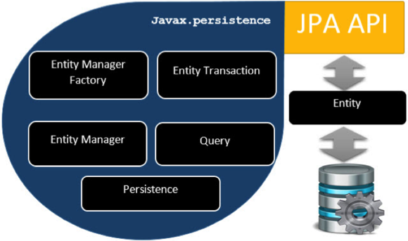
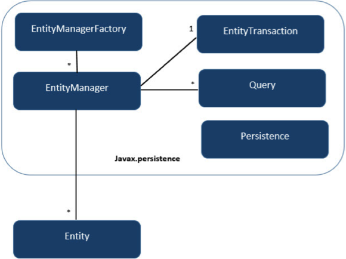

# JPA架构 - JPA教程

JPA(Java持久性API)是存储业务实体关联的实体的来源。它显示了如何定义一个面向普通Java对象(POJO)作为一个实体，以及如何与管理关系实体。

## 类级别架构

下图显示了JPA的类的层次结构。它显示核心类和JPA接口。

下表描述了每个在上述架构的显示单元。

| 单元 | 描述 |
| --- | --- |
| **EntityManagerFactory** | 这是一个EntityManager的工厂类。它创建并管理多个EntityManager实例。 |
| **EntityManager** | 这是一个接口，它管理的持久化操作的对象。它的工作原理类似工厂的查询实例。 |
| **Entity** | 实体是持久性对象是存储在数据库中的记录。 |
| **EntityTransaction** | 它与EntityManager是一对一的关系。对于每一个EntityManager，操作是由EntityTransaction类维护。 |
| **Persistence** | 这个类包含静态方法来获取EntityManagerFactory实例。 |
| **Query** | 该接口由每个JPA供应商，能够获得符合标准的关系对象。 |

上述的类和接口用于存储实体到数据库的一个记录。帮助程序员通过减少自己编写代码将数据存储到数据库中，使他们能够专注于更重要的业务活动代码，如 数据库表映射的类编写代码。

## JPA类关系

在上述体系结构中，类和接口之间的关系属于javax.persistence包。下图显示了它们之间的关系。

*   EntityManagerFactory和EntityManager的关系是1对多。这是一个工厂类EntityManager实例。

*   EntityManager和EntityTransaction之间的关系是1对1。对于每个EntityManager操作，只有一个EntityTransaction实例。

*   EntityManager和Query之间的关系是1对多。查询数众多可以使用一个EntityManager实例执行。

*   EntityManager实体之间的关系是1对多。一个EntityManager实例可以管理多个实体。

