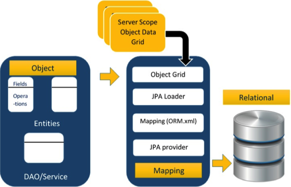

# JPA ORM组件 - JPA教程

最现代的应用程序使用关系型数据库来存储数据。最近，许多厂商改用对象数据库，以减少其对数据的维护负担。这意味着对象数据库或对象关系技术正在存储，检索，更新和维护数据的照顾。这个对象关系型技术的核心部分是映射orm.xml中的文件。随着XML不需要编译，可以很容易地进行修改多个数据源较少的管理。

## 对象关系映射

对象关系映射(ORM)简要地告诉什么是ORM以及它是如何工作。 ORM是从对象类型的数据隐蔽到关系型，反之亦然编程能力。

ORM主要特征是映射或绑定一个目的是它的数据库中的数据。而映射，我们要考虑的任何其他表中的数据，数据的类型，并具有自一个或多个实体的关系。

## 高级功能

*   惯用的持久性：它使您能够编写使用面向对象的类持久性类。

*   高性能：它有许多抓取技术和充满希望的锁定技术。

*   可靠的：它是高度稳定的，被很多专业程序员。

## ORM架构

在ORM架构如下所示。



在上述体系结构解释了如何对象数据存储到关系数据库中的三个阶段。

### 第1阶段

第一阶段，命名为对象数据阶段，包括POJO类，服务接口和类。它是主要的业务组件层，其具有业务逻辑操作和属性。

例如，让我们举个员工数据库的架构。

*   Employee POJO类包含属性，如ID，姓名，工资和标识。它也包含类似属性setter和getter方法。

*   Employee DAO/服务类包含服务方法，如建立员工，发现员工和删除员工。

### 第2阶段

第二阶段，称为映射或持久性的阶段，包括JPA提供者，映射文件（orm.xml），JPA装载器和对象网格。

*   JPA提供者：这是一个包含了JPA（javax.persistence）供应的产品。例如EclipseLink，Toplink，Hibernate等。

*   映射文件：映射文件（orm.xml中）包含在关系数据库中的一个POJO类的数据和数据之间的映射配置。

*   JPA装载器：在JPA加载器的工作原理就像一个高速缓冲存储器。它可以加载关系网格数据。它的工作原理类似数据库的副本与服务类POJO数据（POJO类的属性）进行交互。

*   对象网格：它是可存储的关系数据的副本，如高速缓冲存储器的临时位置。对数据库的所有查询首先被实现在对象网格的数据。只有提交它才会影响到主数据库。

### 第3阶段

第三阶段是关系数据相关。它包含在逻辑上连接到所述业务组件的关系数据。如上所讨论的，仅当业务组件提交该数据，它被存储到数据库中的物理。在此之前，已修改的数据被存储在高速缓冲存储器作为一个网格格式。在获取数据的过程和存储数据是相同的。

上述三个阶段的编程交互的机制被称为对象关系映射。

## Mapping.xml

mapping.xml文件指示JPA的供应者来映射实体类与数据库表。

让我们以Employee实体包含四个属性的一个例子。POJO类Employee实体的命名为：Employee.java，如下：

```
public class Employee 
{
   private int eid;
   private String ename;
   private double salary;
   private String deg;
   public Employee(int eid, String ename, double salary, String deg) 
   {
       super( );
       this.eid = eid;
       this.ename = ename;
       this.salary = salary;
       this.deg = deg;
   }

   public Employee( ) 
   {
       super();
   }

   public int getEid( ) 
   {
       return eid;
   }
   public void setEid(int eid)  
   {
       this.eid = eid;
   }
    public String getEname( ) 
   {
       return ename;
   }
   public void setEname(String ename) 
   {
       this.ename = ename;
   }

   public double getSalary( ) 
   {
       return salary;
   }
   public void setSalary(double salary) 
   {
       this.salary = salary;
   }

   public String getDeg( ) 
   {
       return deg;
   }
   public void setDeg(String deg) 
   {
       this.deg = deg;
   }
}

```

上面的代码是Employee实体POJO类。它包含四个属性eid, ename,salary, 和 deg。考虑这些属性为表的字段，并且eid作为该表的主键。现在，我们要设计Hibernate映射文件了。映射文件名为 mapping.xml 如下：

```
<? xml version="1.0" encoding="UTF-8" ?>
<entity-mappings xmlns="http://java.sun.com/xml/ns/persistence/orm"
    xmlns:xsi="http://www.w3.org/2001/XMLSchema-instance"
    xsi:schemaLocation="http://java.sun.com/xml/ns/persistence/orm    
                        http://java.sun.com/xml/ns/persistence/orm_1_0.xsd"
                        version="1.0">
    <description> XML Mapping file</description>
    <entity class="Employee">        
        <table name="EMPLOYEETABLE"/>
        <attributes>
            <id name="eid">
                <generated-value strategy="TABLE"/>
            </id>
            <basic name="ename">
                <column name="EMP_NAME" length="100"/>
            </basic>
            <basic name="salary">
            </basic>
            <basic name="deg">
            </basic>
        </attributes>
    </entity>
</entity-mappings>

```

上述脚本用于与数据库表的映射实体类。在该文件中

*   &lt;entity-mappings&gt; : 标签定义的模式定义，允许实体标记为XML文件。

*   &lt;description&gt; : 标签提供了有关应用程序的描述。

*   &lt;entity&gt; : 标签定义要转换成数据库表中的实体类。属性类定义了POJO实体类的名称。

*   &lt;table&gt; : 标签定义的表名。如果想有两个类相同的名称以及该表中，则该标签是没有必要的。

*   &lt;attributes&gt; : 标签定义的属性（在表中的字段）。

*   &lt;id&gt; : 标记定义表中的主键。在&lt;generated-value&gt;标记定义了如何将主键值赋值，如Automatic, Manual或者使用 Sequence。

*   &lt;basic&gt; : 标签用于定义其余属性在表中。

*   &lt;column-name&gt; : 标签被用来在表中定义用户定义表的字段名。

## 注解

一般的XML文件用于配置特定的组件，或者映射两种不同规格的组件。在我们的例子中，我们要分别保持在一个框架的XML文件。这意味着在写一个映射的XML文件，我们需要比较用mapping.xml文件实体标签的POJO类的属性。

这里是解决方案。在类定义中，我们可以使用注释写配置的一部分。注解用于类，属性和方法。注释以'@'符号在类，属性或方法的注释中声明之前。 JPA的所有批注在javax.persistence包定义。

在这里，在我们的实例中使用的注释列表如下。

| 注解 | 描述 |
| --- | --- |
| @Entity | 声明类为实体或表。 |
| @Table | 声明表名。 |
| @Basic | 指定非约束明确的各个字段。 |
| @Embedded | 指定类或它的值是一个可嵌入的类的实例的实体的属性。 |
| @Id | 指定的类的属性，用于识别（一个表中的主键）。 |
| @GeneratedValue | 指定如何标识属性可以被初始化，例如自动，手动，或从序列表中获得的值。 |
| @Transient | 指定的属性，它是不持久的，即，该值永远不会存储在数据库中。 |
| @Column | 指定持久属性栏属性。 |
| @SequenceGenerator | 指定在@GeneratedValue注解中指定的属性的值。它创建了一个序列。 |
| @TableGenerator | 指定在@GeneratedValue批注指定属性的值发生器。它创造了的值生成的表。 |
| @AccessType | 这种类型的注释用于设置访问类型。如果设置@AccessType（FIELD），然后进入FIELD明智的。如果设置@AccessType（PROPERTY），然后进入属性发生明智的。 |
| @JoinColumn | 指定一个实体组织或实体的集合。这是用在多对一和一对多关联。 |
| @UniqueConstraint | 指定的字段和用于主要或辅助表的唯一约束。 |
| @ColumnResult | 参考使用select子句的SQL查询中的列名。 |
| @ManyToMany | 定义了连接表之间的多对多一对多的关系。 |
| @ManyToOne | 定义了连接表之间的多对一的关系。 |
| @OneToMany | 定义了连接表之间存在一个一对多的关系。 |
| @OneToOne | 定义了连接表之间有一个一对一的关系。 |
| @NamedQueries | 指定命名查询的列表。 |
| @NamedQuery | 指定使用静态名称的查询。 |

## Java Bean标准

Java类封装了实例的值及其行为为对象称为一个单元。 Java Bean是一个临时的存储和可重用的组件或对象。它是有一个默认的构造函数和getter和setter方法来初始化实例序列化的类单独的属性。

## Bean约定

*   bean包含其默认构造函数或包含序列化实例的文件。因此，一个bean可以实例化另一个bean。

*   bean属性可以被隔离成布尔属性或者非布尔属性。

*   非布尔属性包含getter和setter方法。

*   布尔属性包含setter和方法。

*   任何字段的getter方法应从小字母get（Java方法的公约）开始，之后使用大写字母开头的字段名。例如，字段名为salary，因此这一字段的getter方法为getSalary()。

*   任何属性的setter方法应该先从小字母的集合（Java方法公约）开始，继续以大写字母，参数值设置为字段开头的字段名。例如，字段名为salary，因此这一字段的setter方法是setSalary（double sal ）。

*   对于布尔型属性，方法是检查它是否是 true 或 false。例如，Boolean属性为空，则该字段的就是方法isEmpty()。

