# JPA安装配置 - JPA教程

本章将指导完成JPA在Windows和Linux系统的设置过程。 JPA可以很容易地安装并集成而无需任何复杂的设置程序，简单几个步骤在当前的Java环境。在安装时用户管理是必需的。

## 系统要求

| JDK | Java SE 2 JDK 1.5 或以上 |
|:--- |:--- |
| 内存 | 1 GB RAM (推荐，小了慢了不要怪我) |
| 硬盘 | 没有最小要求 |
| 系统版本 | Windows XP 或以上, Linux |

现在让我们继续安装JPA，如下几个步骤。

## 第一步：确认已经Java安装

首先，需要在系统上安装Java软件开发工具包（SDK）。为了验证这一点，根据所使用的平台执行以下两个命令。

如果Java安装已正确完成，那么它会显示Java安装的当前版本。示例输出如下表中。

**Windows**

打开命令控制台，然后输入：

```
>java –version
```

```
Java version "1.7.0_60"
Java (TM) SE Run Time Environment (build 1.7.0_60-b19)
Java Hotspot (TM) 64-bit Server VM (build 24.60-b09,mixed mode)
```

**Linux**

打开命令终端，输入：

```
$java –version
```

```
java version "1.7.0_25"
Open JDK Runtime Environment (rhel-2.3.10.4.el6_4-x86_64)
Open JDK 64-Bit Server VM (build 23.7-b01, mixed mode)
```

*   假设本教程的读者已把Java SDK版本1.7.0_60 安装在他们的系统中。

*   如果还没有安装Java SDK，从http://www.oracle.com/technetwork/java/javase/downloads/index.html 下载当前版本并安装它。

## 第2步：设置Java环境

设置环境变量JAVA_HOME 指向到安装在机器上的 Java 目录的位置。例如，

| 平台 | 描述 |
| --- | --- |
| Windows | 设置 JAVA_HOME 指向 C:\ProgramFiles\java\jdk1.7.0_60 |
| Linux | Export JAVA_HOME=/usr/local/java-current |

添加Java编译器位置的完整路径到系统路径。

| 平台 | 描述 |
| --- | --- |
| Windows | 添加字符串  "C:\Program Files\Java\jdk1.7.0_60\bin" 到系统变量 PATH 的尾部. |
| Linux | Export PATH=$PATH:$JAVA_HOME/bin/ |

在命令提示符下执行命令java-version如上所述。

## 第3步：安装JPA

可以使用任何JPA提供者，从本教程中，如EclipseLink，Hibernate都经过JPA安装。让我们使用EclipseLink遵循JPA安装。对于JPA编程需要遵循特定的文件夹架构，因此最好是使用IDE。

下载Eclipse IDE 如下面的链接 https://www.eclipse.org/downloads/ 选择 EclipseIDE 对JavaEE 开发者是 Eclipse indigo。

解压缩 Eclipse 的zip文件。打开Eclipse IDE。

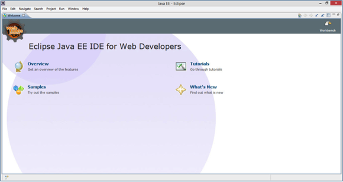

### 安装使用EclipseLink JPA

EclipseLink是一个库，因此我们不能直接将其添加到Eclipse IDE。安装JPA使用EclipseLink需要按照下面给出的步骤。

*   创建一个新的JPA项目在Eclipse IDE中，首先选择File-&gt;New-&gt;JPA项目如下：

    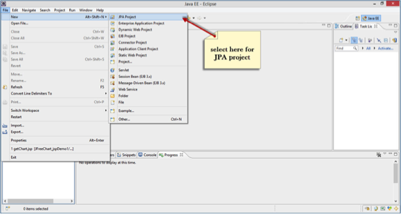
*   得到一个名为新建JPA项目的对话框。输入项目名称 yiibai_JPA_Eclipselink，检查JRE版本，然后单击下一步：

    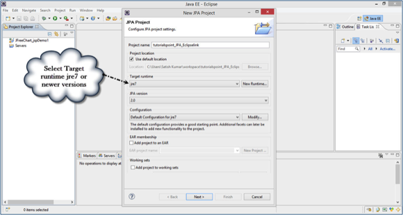
*   点击下载库（如果没有库）中的用户库部分。

    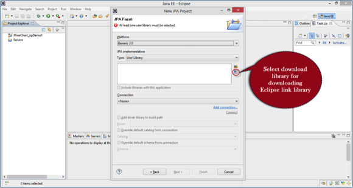
*   在下载库对话框中选择 EclipseLink 库的最新版本，点击下一步，如下所示：

    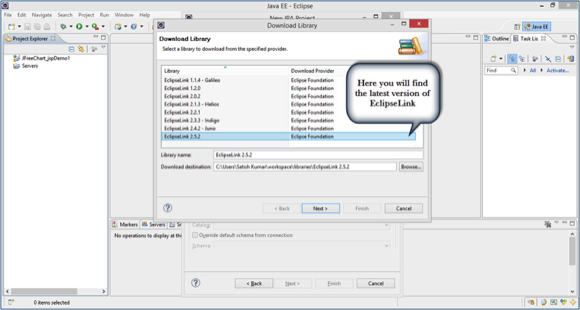
*   接受许可条款，然后单击下载库完成。

    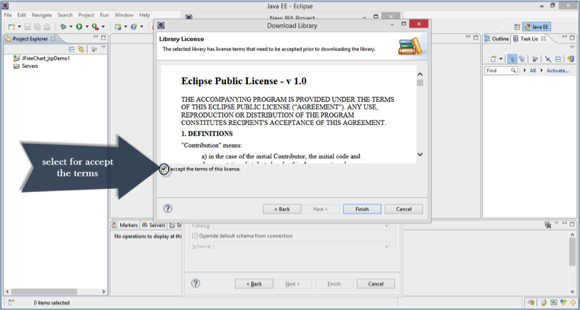
*   下载开始作为显示在下面的屏幕截图。

    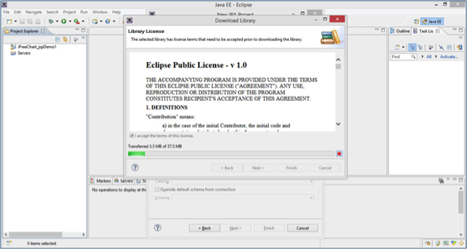
*   下载后，请在用户库部分中的下载库，然后单击Finish（完成）。

    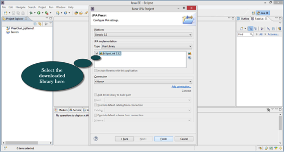
*   最后得到Package Explorer中的Eclipse IDE项目文件。提取所有文件，得到的文件夹和文件的层次结构如下所示：

    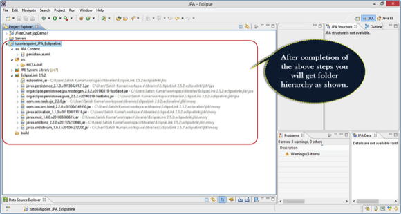

## 加入MySQL连接到项目

我们在这里讨论的例子需要连接数据库。让我们看看[MySQL](http://www.yiibai.com/mysql/)数据库进行数据库操作。它需要使用mysql-connector jar与Java程序进行交互。

按照以下步骤配置数据库的jar在项目中。

*   转到项目属性 - 通过右击它&gt; Java构建路径。会得到一个对话框，显示在下面的屏幕截图。单击添加外部JAR。

    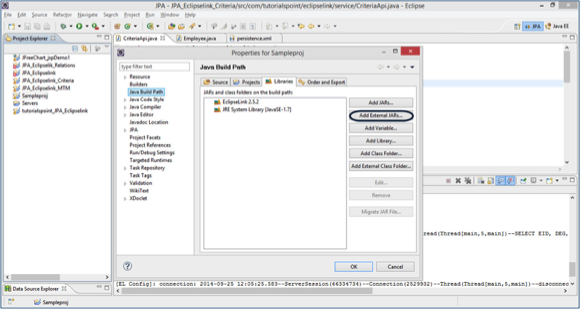
*   去到 jar 在系统的位置，选择该文件，然后单击打开。

    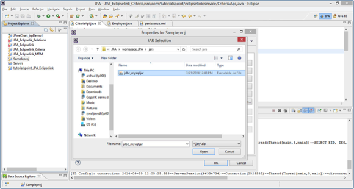
*   单击确定在属性对话框。将获得MySQL的连接器jar 在项目。现在，可以使用MySQL数据库操作。
