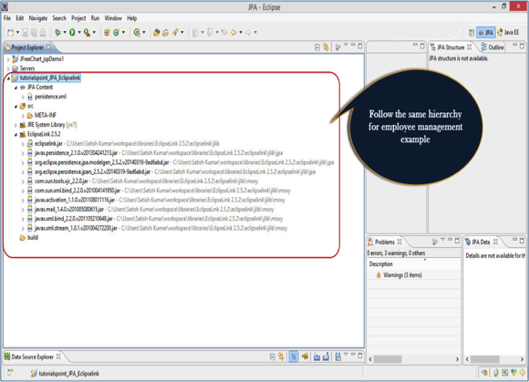
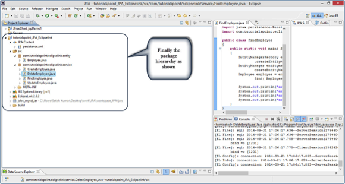

# JPA实体管理器 - JPA教程

本章将使用一个简单的例子来说明JPA是如何工作的。让我们来考虑以员工管理为例。假设员工管理分别创建，更新，查找和删除员工的记录操作。正如前面提到的，使用MySQL数据库进行数据库操作。

对于此示例中的主要模块如下：

*   模型或POJO

    Employee.java

*   持久化

    Persistence.xml

*   服务

    CreatingEmployee.java

    UpdatingEmployee.java

    FindingEmployee.java

    DeletingEmployee.java

让我们看看，我们已经使用了JPA安装EclipseLink包的层次。按照分层结构的此示例中，如下所示：



## 创建实体

实体是什么？无非是bean或model。在这个例子中，我们将使用员工作为一个实体。 eid, ename, salary, 和deg是实体的属性。它包含一个默认的构造函数，以及这些属性的setter和getter方法。

在上图所示的层次结构，创建一个名为“com.yiibai.eclipselink.entity'包，在'src'中(源)封装。给包下创建一个名为Employee.java类，如下所示：

```
package com.yiibai.eclipselink.entity;

import javax.persistence.Entity;
import javax.persistence.GeneratedValue;
import javax.persistence.GenerationType;
import javax.persistence.Id;
import javax.persistence.Table;

@Entity
@Table
public class Employee 
{
   @Id
   @GeneratedValue(strategy= GenerationType.AUTO)     
   private int eid;
   private String ename;
   private double salary;
   private String deg;
   public Employee(int eid, String ename, double salary, String deg) 
   {
       super( );
       this.eid = eid;
       this.ename = ename;
       this.salary = salary;
       this.deg = deg;
   }

   public Employee( ) 
   {
       super();
   }

   public int getEid( ) 
   {
       return eid;
   }
   public void setEid(int eid)  
   {
       this.eid = eid;
   }
    public String getEname( ) 
   {
       return ename;
   }
   public void setEname(String ename) 
   {
       this.ename = ename;
   }

   public double getSalary( ) 
   {
       return salary;
   }
   public void setSalary(double salary) 
   {
       this.salary = salary;
   }

   public String getDeg( ) 
   {
       return deg;
   }
   public void setDeg(String deg) 
   {
       this.deg = deg;
   }
   @Override
   public String toString() {
       return "Employee [eid=" + eid + ", ename=" + ename + ", salary="
               + salary + ", deg=" + deg + "]";
   }
}

```

在上面的代码中，我们使用@Entity注解，使这个POJO类为实体。

在断续下一个模块前，我们需要对关系实体关联，它记录在 persistence.xml 文件数据库中并创建数据库。打开 [MySQL](http://www.yiibai.com/mysql/ "MySQL ") 工作台，然后键入下面的查询。

```
create database jpadb
use jpadb

```

### Persistence.xml

这个模块起着JPA概念至关重要的作用。在这个XML文件中，我们将注册数据库，并指定实体类。

另外，在上述所示的包的层次结构，根据JPA的内容包含在 persistence.xml 如下：

```
<?xml version="1.0" encoding="UTF-8"?>
<persistence version="2.0" xmlns="http://java.sun.com/xml/ns/persistence" xmlns:xsi="http://www.w3.org/2001/XMLSchema-instance" xsi:schemaLocation="http://java.sun.com/xml/ns/persistence http://java.sun.com/xml/ns/persistence/persistence_2_0.xsd">
   <persistence-unit name="Eclipselink_JPA" 
                        transaction-type="RESOURCE_LOCAL">
    <class>com.yiibai.eclipselink.entity.Employee</class>
       <properties>
           <property name="javax.persistence.jdbc.url"
                   value="jdbc:mysql://localhost:3306/jpadb"/>
           <property name="javax.persistence.jdbc.user" value="root"/>
          <property name="javax.persistence.jdbc.password" value="root"/>
          <property name="javax.persistence.jdbc.driver"
                   value="com.mysql.jdbc.Driver"/>
           <property name="eclipselink.logging.level" value="FINE"/>
          <property name="eclipselink.ddl-generation" 
                  value="create-tables"/>
       </properties>
   </persistence-unit>
</persistence>

```

在上面的XML，**&lt;persistence-unit&gt;**标签定义JPA持久性的特定名称。&lt;class&gt;标记定义了包名的实体类。**&lt;properties&gt;**标签定义的所有属性，而**&lt;property&gt;**标记的每个属性定义，例如数据库注册，URL规范，用户名和密码。这些是EclipseLink属性。此文件将配置数据库。

## 持久化操作

用于与一个数据库进行交互持久性操作，它们加载和存储操作。在一个业务组件，所有的持久化操作属于服务类。

在上面的图示包层次结构，创建一个名为“com.yiibai.eclipselink.service'包，在'src'中（源）封装。所有命名为CreateEmloyee.java，UpdateEmployee.java，FindEmployee.java和DeleteEmployee.java 服务类。来自给定的包下，如下所示：

## 创建Employee

下面的代码段说明了如何创建一个名为CreateEmployee.java的一个Employee类。

```
package com.yiibai.eclipselink.service;

import javax.persistence.EntityManager;
import javax.persistence.EntityManagerFactory;
import javax.persistence.Persistence;
import com.yiibai.eclipselink.entity.Employee;

public class CreateEmployee 
{
   public static void main( String[ ] args ) 
   {
       EntityManagerFactory emfactory = Persistence.
               createEntityManagerFactory( "Eclipselink_JPA" );
       EntityManager entitymanager = emfactory.
               createEntityManager( );
       entitymanager.getTransaction( ).begin( );

       Employee employee = new Employee( ); 
       employee.setEid( 1201 );
       employee.setEname( "Gopal" );
       employee.setSalary( 40000 );
       employee.setDeg( "Technical Manager" );
       entitymanager.persist( employee );
       entitymanager.getTransaction( ).commit( );

       entitymanager.close( );
       emfactory.close( );
   }
}

```

在上面的代码中createEntityManagerFactory()通过提供我们在 persistent.xml 文件提供持久化单元相同唯一的名称创建一个持久性单元。 EntityManagerFactory对象将由usingcreateEntityManager()方法创建entitymanger实例。 EntityManager对象创建 entitytransactioninstance 事务管理。通过使用 EntityManager 对象，我们可以持久化实体到数据库中。

编译和执行上述程序后，会从库中的EclipseLink得到通知在Eclipse IDE的控制台面板上。

对于结果，打开 MySQL 工作台，然后输入以下的查询。

```
use jpadb
select * from employee

```

命名为 employee 受影响的数据库表将显示在表格格式如下：

| Eid | Ename | Salary | Deg |
| --- | --- | --- | --- |
| 1201 | Gopal | 40000 | Technical Manager |

## 更新Employee

要更新员工的记录，我们需要检索现有记录形成数据库，进行修改，最后提交到数据库中。名为UpdateEmployee.java类如下所示：

```
package com.yiibai.eclipselink.service;

import javax.persistence.EntityManager;
import javax.persistence.EntityManagerFactory;
import javax.persistence.Persistence;
import com.yiibai.eclipselink.entity.Employee;

public class UpdateEmployee 
{
   public static void main( String[ ] args ) 
   {
       EntityManagerFactory emfactory = Persistence.
               createEntityManagerFactory( "Eclipselink_JPA" );
       EntityManager entitymanager = emfactory.
               createEntityManager( );
               entitymanager.getTransaction( ).begin( );
       Employee employee=entitymanager.
               find( Employee.class, 1201 );
       //before update
       System.out.println( employee );
       employee.setSalary( 46000 );
       entitymanager.getTransaction( ).commit( );
        //after update
       System.out.println( employee );
       entitymanager.close();
       emfactory.close();
   }
}

```

编译和执行上述程序后，会从库中的EclipseLink得到通知在Eclipse IDE的控制台面板上。

对于结果，打开MySQL工作台，然后输入以下的查询。

```
use jpadb
select * from employee

```

命名为employee受影响的数据库表将显示在表格格式如下：

| Eid | Ename | Salary | Deg |
| --- | --- | --- | --- |
| 1201 | Gopal | 46000 | Technical Manager |

员工的工资为1201将更新为46000。

## 查找Employee

找一个雇员的记录，从数据库中检索现有数据并显示它。在该操作中，EntityTransaction 未在检索的记录中应用。

命名类 FindEmployee.java如下。

```
package com.yiibai.eclipselink.service;

import javax.persistence.EntityManager;
import javax.persistence.EntityManagerFactory;
import javax.persistence.Persistence;
import com.yiibai.eclipselink.entity.Employee;

public class FindEmployee 
{
   public static void main( String[ ] args ) 
   {
       EntityManagerFactory emfactory = Persistence
               .createEntityManagerFactory( "Eclipselink_JPA" );
       EntityManager entitymanager = emfactory.
               createEntityManager();
       Employee employee = entitymanager.
               find( Employee.class, 1201 );

       System.out.println("employee ID = "+employee.getEid( ));
       System.out.println("employee NAME = "+employee.getEname( ));
       System.out.println("employee SALARY = "+employee.getSalary( ));
       System.out.println("employee DESIGNATION = "+employee.getDeg( ));
   }
}

```

编译并执行上述程序后，从库中的EclipseLink 会得到以下输出在 Eclipse IDE 控制台面板上。

```
employee ID = 1201
employee NAME = Gopal
employee SALARY = 46000.0
employee DESIGNATION = Technical Manager

```

## 删除员工

要删除一个员工的记录，首先我们会发现现有的记录，然后删除它。这里 EntityTransaction 起着重要的作用。

命名 DeleteEmployee.java 类如下：

```
package com.yiibai.eclipselink.service;

import javax.persistence.EntityManager;
import javax.persistence.EntityManagerFactory;
import javax.persistence.Persistence;
import com.yiibai.eclipselink.entity.Employee;

public class DeleteEmployee 
{
   public static void main( String[ ] args ) 
   {
       EntityManagerFactory emfactory = Persistence.
               createEntityManagerFactory( "Eclipselink_JPA" );
       EntityManager entitymanager = emfactory.
               createEntityManager( );
       entitymanager.getTransaction( ).begin( );
       Employee employee=entitymanager.
               find( Employee.class, 1201 );
       entitymanager.remove( employee );
       entitymanager.getTransaction( ).commit( );
       entitymanager.close( );
       emfactory.close( );
   }
}

```

编译和执行上述程序后，会得到Eclipse IDE控制台面板上，从EclipseLink 库中的通知。

对于结果，打开MySQL的工作台，然后键入以下的查询。

```
use jpadb
select * from employee

```

受影响的数据库命名为 employee 的记录为空。

在此示例中所有的模块完成后，将包和文件的层次结构如下所示：



