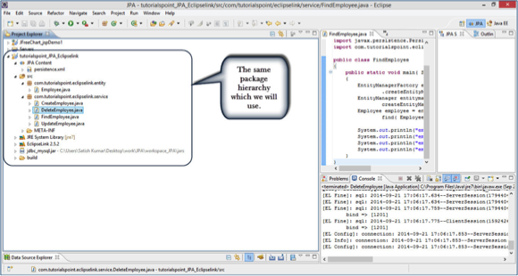
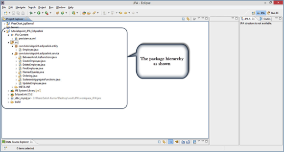

# JPA JPQL/持久化查询语言 - JPA教程

本章介绍有关JPQL和它的工作原理与持久性单元。在这一章中，给出的例子遵循相同的包层次结构，和我们在前面的章节中使用一样。



## Java持久化查询语言

JPQL代表Java持久化查询语言。它被用来创建针对实体的查询存储在关系数据库中。 JPQL是基于SQL语法的发展。但它不会直接影响到数据库。

JPQL可以检索使用SELECT子句中的数据，可以使用 UPDATE子句做批量UPDATE和DELETE子句。

## 查询结构

JPQL语法非常类似于SQL语法。SQL的语法是一个优势，因为SQL很简单，被广泛使用。 SQL工作直接针对关系数据库表，记录和字段，而JPQL适用于Java类和实例。

例如，JPQL查询可以检索实体对象，而不是从一个数据库中设置字段结果，作为与SQL。该JPQL查询结构如下。

```
SELECT ... FROM ...
[WHERE ...]
[GROUP BY ... [HAVING ...]]
[ORDER BY ...]
```

JPQL的结构，DELETE和UPDATE查询，如下所示。

```
DELETE FROM ... [WHERE ...]

UPDATE ... SET ... [WHERE ...]
```

## 标量和聚合函数

标量函数返回基于输入值所得的数值。集合函数，通过计算输入值返回的结果值。

我们将使用相同的例子员工管理，在前面的章节。在这里将通过使用JPQL的标量和聚合函数的服务类。

让我们假定 jpadb.employee 表包含下述记录。

| Eid | Ename | Salary | Deg |
| --- | --- | --- | --- |
| 1201 | Gopal | 40000 | 技术经理 |
| 1202 | Manisha | 40000 | 接待员 |
| 1203 | Masthanvali | 40000 | 技术作家 |
| 1204 | Satish | 30000 | 技术作家 |
| 1205 | Krishna | 30000 | 技术作家 |
| 1206 | Kiran | 35000 | 接待员 |

创建一个在 com.yiibai.eclipselink.service 包命名为 ScalarandAggregateFunctions.java类如下。

```
package com.yiibai.eclipselink.service;

import java.util.List;
import javax.persistence.EntityManager;
import javax.persistence.EntityManagerFactory;
import javax.persistence.Persistence;
import javax.persistence.Query;

public class ScalarandAggregateFunctions 
{
   public static void main( String[ ] args ) 
   {
       EntityManagerFactory emfactory = Persistence.
               createEntityManagerFactory( "Eclipselink_JPA" );
       EntityManager entitymanager = emfactory.
               createEntityManager();
       //Scalar function
       Query query = entitymanager.
       createQuery("Select UPPER(e.ename) from Employee e");
       List<String> list=query.getResultList();

       for(String e:list)
       {
           System.out.println("Employee NAME :"+e);
       }
       //Aggregate function
       Query query1 = entitymanager.
               createQuery("Select MAX(e.salary) from Employee e");
       Double result=(Double) query1.getSingleResult();
       System.out.println("Max Employee Salary :"+result);
   }
}
```

编译和执行上面的程序，在Eclipse IDE的控制台面板上会得到以下输出。

```
Employee NAME :GOPAL
Employee NAME :MANISHA
Employee NAME :MASTHANVALI
Employee NAME :SATISH
Employee NAME :KRISHNA
Employee NAME :KIRAN
Max Employee Salary :40000.0
```

## Between, And, Like 关键词

Between, And, 和Like是JPQL的主要关键字。这些关键字在查询子句后使用。

创建一个名为 BetweenAndLikeFunctions.java 类在 com.yiibai.eclipselink.service包下，如下所示：

```
package com.yiibai.eclipselink.service;

import java.util.List;
import javax.persistence.EntityManager;
import javax.persistence.EntityManagerFactory;
import javax.persistence.Persistence;
import javax.persistence.Query;
import com.yiibai.eclipselink.entity.Employee;

public class BetweenAndLikeFunctions 
{
   public static void main( String[ ] args ) 
   {
       EntityManagerFactory emfactory = Persistence.
           createEntityManagerFactory( "Eclipselink_JPA" );
       EntityManager entitymanager = emfactory.
           createEntityManager();
       //Between
       Query query = entitymanager.
           createQuery( "Select e " +
               "from Employee e " +
               "where e.salary " +
               "Between 30000 and 40000" )
       List<Employee> list=(List<Employee>)query.getResultList( );

       for( Employee e:list )
       {
           System.out.print("Employee ID :"+e.getEid( ));
           System.out.println("\t Employee salary :"+e.getSalary( ));
       }

       //Like
       Query query1 = entitymanager.
           createQuery("Select e " +
               "from Employee e " +
               "where e.ename LIKE 'M%'");
       List<Employee> list1=(List<Employee>)query1.getResultList( );
       for( Employee e:list1 )
       {
           System.out.print("Employee ID :"+e.getEid( ));
           System.out.println("\t Employee name :"+e.getEname( ));
       }
   }
}
```

编译并执行上述程序后，将在Eclipse IDE的控制台面板下面输出以下内容。

```
Employee ID :1201    Employee salary :40000.0
Employee ID :1202    Employee salary :40000.0
Employee ID :1203    Employee salary :40000.0
Employee ID :1204    Employee salary :30000.0
Employee ID :1205    Employee salary :30000.0
Employee ID :1206    Employee salary :35000.0

Employee ID :1202    Employee name :Manisha
Employee ID :1203    Employee name :Masthanvali
```

## 排序

要排序JPQL中的记录，我们使用ORDER BY子句。这一个子句的使用类似于SQL中的用法，但它涉及的实体。下面的示例演示了如何使用ORDER BY子句。

在com.yiibai.eclipselink.service包中创建类 Ordering.java 如下：

```
package com.yiibai.eclipselink.service;

import java.util.List;
import javax.persistence.EntityManager;
import javax.persistence.EntityManagerFactory;
import javax.persistence.Persistence;
import javax.persistence.Query;
import com.yiibai.eclipselink.entity.Employee;

public class Ordering 
{
   public static void main( String[ ] args ) 
   {
       EntityManagerFactory emfactory = Persistence.
           createEntityManagerFactory( "Eclipselink_JPA" );
       EntityManager entitymanager = emfactory.
           createEntityManager();
       //Between
       Query query = entitymanager.
           createQuery( "Select e " +
               "from Employee e " +
               "ORDER BY e.ename ASC" );
       List<Employee> list=(List<Employee>)query.getResultList( );

       for( Employee e:list )
       {
           System.out.print("Employee ID :"+e.getEid( ));
           System.out.println("\t Employee Name :"+e.getEname( ));
       }
   }
}
```

编译和执行上面的程序，在Eclipse IDE的控制台面板会产生下面的输出。

```
Employee ID :1201    Employee Name :Gopal
Employee ID :1206    Employee Name :Kiran
Employee ID :1205    Employee Name :Krishna
Employee ID :1202    Employee Name :Manisha
Employee ID :1203    Employee Name :Masthanvali
Employee ID :1204    Employee Name :Satish
```

## 命名查询

@NamedQuery注解被定义为一个预定义的查询字符串，它是不可改变的查询。相反，动态查询，命名查询可以通过POJO分离JPQL查询字符串提高代码的组织。它也传送的查询参数，而不是动态地嵌入文本到查询字符串，并因此产生更高效的查询。

首先，@NamedQuery注解添加到com.yiibai.eclipselink.entity包中的 Employee实体，类名为Employee.java下，如下所示：

```
package com.yiibai.eclipselink.entity;

import javax.persistence.Entity;
import javax.persistence.GeneratedValue;
import javax.persistence.GenerationType;
import javax.persistence.Id;
import javax.persistence.NamedQuery;
import javax.persistence.Table;

@Entity
@Table
@NamedQuery(query = "Select e from Employee e where e.eid = :id", 
   name = "find employee by id")
public class Employee 
{
   @Id
   @GeneratedValue(strategy= GenerationType.AUTO)     
   private int eid;
   private String ename;
   private double salary;
   private String deg;
   public Employee(int eid, String ename, double salary, String deg) 
   {
       super( );
       this.eid = eid;
       this.ename = ename;
       this.salary = salary;
       this.deg = deg;
   }
   public Employee( ) 
   {
       super();
   }

   public int getEid( ) 
   {
       return eid;
   }
   public void setEid(int eid)  
   {
       this.eid = eid;
   }

   public String getEname( ) 
   {
       return ename;
   }
   public void setEname(String ename) 
   {
       this.ename = ename;
   }

   public double getSalary( ) 
   {
       return salary;
   }
   public void setSalary(double salary) 
   {
       this.salary = salary;
   }

   public String getDeg( ) 
   {
       return deg;
   }
   public void setDeg(String deg) 
   {
       this.deg = deg;
   }
   @Override
   public String toString() {
       return "Employee [eid=" + eid + ", ename=" + ename + ", salary="
               + salary + ", deg=" + deg + "]";
   }
}
```

创建一个名为com.yiibai.eclipselink.service包下的NamedQueries.java类，如下所示：

```
package com.yiibai.eclipselink.service;

import java.util.List;
import javax.persistence.EntityManager;
import javax.persistence.EntityManagerFactory;
import javax.persistence.Persistence;
import javax.persistence.Query;
import com.yiibai.eclipselink.entity.Employee;

public class NamedQueries 
{
   public static void main( String[ ] args ) 
   {
       EntityManagerFactory emfactory = Persistence.
           createEntityManagerFactory( "Eclipselink_JPA" );
       EntityManager entitymanager = emfactory.
           createEntityManager();
       Query query = entitymanager.createNamedQuery(
           "find employee by id");
       query.setParameter("id", 1204);
       List<Employee> list = query.getResultList( );
       for( Employee e:list )
       {
           System.out.print("Employee ID :"+e.getEid( ));
           System.out.println("\t Employee Name :"+e.getEname( ));
       }
   }
}
```

经过编译和执行上面的程序，在Eclipse IDE的控制台面板上会得到下面的输出。

```
Employee ID :1204    Employee Name :Satish
```

加入上述所有类后，包层次结构如下所示：



## 急切和延迟加载

JPA中最重要的概念是为了使数据库的副本在高速缓冲存储器中。虽然有一个数据库事务，但JPA首先创建一个重复的数据集，只有当它使用实体管理提交，所做的更改影响到数据库中。

从数据库中获取记录有两种方式。

### 预先抓取

在预先抓取，相关的子对象获取一个特定的记录自动上传。

### 延迟加载

在延迟装载，涉及的对象不会自动上传，除非你特别要求他们。首先，它检查相关对象和通知可用性。以后，如果调用任何实体的getter方法，那么它获取的所有记录。

延迟装载可能在第一次尝试获取记录。这样一来，在整个记录的副本已经被存储在高速缓冲存储器中。性能方面，延迟装载最好。

