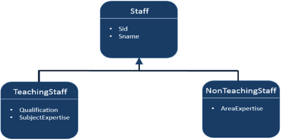

# JPA高级映射 - JPA教程

JPA是一种发布使用Java规范的库。因此，它支持所有的面向对象的概念实体，持久性。到现在为止，我们已经完成了对象关系映射的基本知识。本章将完成对象和关系单位之间的高级映射。

## 继承策略

继承是任何面向对象语言的核心理念，因此我们可以用实体之间的继承关系和策略。JPA支持三种类型的继承策略：SINGLE_TABLE，JOINED_TABLE和TABLE_PER_CONCRETE_CLASS。

让我们考虑一个例子。下图显示了三个等级，即Staff, TeachingStaff, and NonTeachingStaff和他们之间的关系。



在上面的图中，员工是一个实体，而TeachingStaff和NonTeachingStaff是工作人员的子实体。在这里，我们将使用上面的例子来演示继承的全部三个策略。

## 单一表策略

单表策略采取所有类的字段(包括超级亚类)，并将它们映射成称为SINGLE_TABLE策略一个表。这里的鉴别值起着区分在一个表中三个实体的值的关键作用。

让我们考虑上面的例子。TeachingStaff和NonTeachingStaff是Staff的子类。按照继承的概念，一个子类继承其超类中的属性。因此sid和sname属于TeachingStaff和NonTeachingStaff 字段。创建JPA项目。在这个项目中的所有模块，如下所示：

### 创建实体

创建一个名为“src”（源）在“com.yiibai.eclipselink.entity'包下。创建一个名为Staff.java新的Java类。工作人员实体类如下所示：

```
package com.yiibai.eclipselink.entity;

import java.io.Serializable;
import javax.persistence.DiscriminatorColumn;
import javax.persistence.Entity;
import javax.persistence.GeneratedValue;
import javax.persistence.GenerationType;
import javax.persistence.Id;
import javax.persistence.Inheritance;
import javax.persistence.InheritanceType;
import javax.persistence.Table;
@Entity
@Table
@Inheritance( strategy = InheritanceType.SINGLE_TABLE )
@DiscriminatorColumn( name="type" )
public class Staff implements Serializable 
{
   @Id
   @GeneratedValue( strategy = GenerationType.AUTO )
   private int sid;
   private String sname;
   public Staff( int sid, String sname ) 
   {
       super( );
       this.sid = sid;
       this.sname = sname;
   }
   public Staff( ) 
   {
       super( );
   }
   public int getSid( ) 
   {
       return sid;
   }
   public void setSid( int sid ) 
   {
       this.sid = sid;
   }
   public String getSname( ) 
   {
       return sname;
   }
   public void setSname( String sname ) 
   {
       this.sname = sname;
   }
}
```

在上面的代码@DescriminatorColumn指定字段名称（类型）和它的值显示剩余（Teaching和NonTeachingStaff）字段。

创建Staff类的一个子类叫TeachingStaff.java在com.yiibai.eclipselink.entity包下。TeachingStaff 实体类如下所示：

```
package com.yiibai.eclipselink.entity;

import javax.persistence.DiscriminatorValue;
import javax.persistence.Entity;

@Entity
@DiscriminatorValue( value="TS" )
public class TeachingStaff extends Staff 
{
   private String qualification;
   private String subjectexpertise;

   public TeachingStaff( int sid, String sname, 
           String qualification,String subjectexpertise ) 
   {
       super( sid, sname );
       this.qualification = qualification;
       this.subjectexpertise = subjectexpertise;
   }

   public TeachingStaff( ) 
   {
       super( );
   }

   public String getQualification( )
   {
       return qualification;
   }

   public void setQualification( String qualification )
   {
       this.qualification = qualification;
   }

   public String getSubjectexpertise( ) 
   {
       return subjectexpertise;
   }

   public void setSubjectexpertise( String subjectexpertise )
   {
       this.subjectexpertise = subjectexpertise;
   }
}
```

创建Staff 的一个子类（类）类叫NonTeachingStaff.java 在 com.yiibai.eclipselink.entity 包下。NonTeachingStaff实体类如下所示：

```
package com.yiibai.eclipselink.entity;

import javax.persistence.DiscriminatorValue;
import javax.persistence.Entity;

@Entity
@DiscriminatorValue( value = "NS" )
public class NonTeachingStaff extends Staff 
{
   private String areaexpertise;

   public NonTeachingStaff( int sid, String sname, 
           String areaexpertise ) 
   {
       super( sid, sname );
       this.areaexpertise = areaexpertise;
   }

   public NonTeachingStaff( ) 
   {
       super( );
   }

   public String getAreaexpertise( ) 
   {
       return areaexpertise;
   }

   public void setAreaexpertise( String areaexpertise )
   {
       this.areaexpertise = areaexpertise;
   }
}
```

### Persistence.xml

persistence.xml中包含数据库的配置信息和实体类的注册信息。 XML文件如下所示：

```
<?xml version="1.0" encoding="UTF-8"?>
<persistence version="2.0" xmlns="http://java.sun.com/xml/ns/persistence" xmlns:xsi="http://www.w3.org/2001/XMLSchema-instance" xsi:schemaLocation="http://java.sun.com/xml/ns/persistence http://java.sun.com/xml/ns/persistence/persistence_2_0.xsd">
   <persistence-unit name="Eclipselink_JPA" 
                        transaction-type="RESOURCE_LOCAL">
       <class>com.yiibai.eclipselink.entity.Staff</class>
       <class>com.yiibai.eclipselink.entity.NonTeachingStaff</class>
       <class>com.yiibai.eclipselink.entity.TeachingStaff</class>
       <properties>
           <property name="javax.persistence.jdbc.url" 
                            value="jdbc:mysql://localhost:3306/jpadb"/>
           <property name="javax.persistence.jdbc.user" value="root"/>
           <property name="javax.persistence.jdbc.password" 
                            value="root"/>
           <property name="javax.persistence.jdbc.driver" 
                            value="com.mysql.jdbc.Driver"/>
           <property name="eclipselink.logging.level" value="FINE"/>
           <property name="eclipselink.ddl-generation" 
                            value="create-tables"/>
       </properties>
   </persistence-unit>
</persistence>
```

### 服务类

服务类业务组件的实现部分。创建com.yiibai.eclipselink.service“包在'src”下。

创建一个给定的包下名为SaveClient.java用来存储Staff，TeachingStaff和NonTeachingStaff类字段类。SaveClient类如下所示：

```
package com.yiibai.eclipselink.service;

import javax.persistence.EntityManager;
import javax.persistence.EntityManagerFactory;
import javax.persistence.Persistence;
import com.yiibai.eclipselink.entity.NonTeachingStaff;
import com.yiibai.eclipselink.entity.TeachingStaff;

public class SaveClient 
{
   public static void main( String[ ] args ) 
   {
       EntityManagerFactory emfactory = Persistence.
               createEntityManagerFactory( "Eclipselink_JPA" );
       EntityManager entitymanager = emfactory.
               createEntityManager( );
       entitymanager.getTransaction( ).begin( );

       //Teaching staff entity 
       TeachingStaff ts1=new TeachingStaff(
               1,"Gopal","MSc MEd","Maths");
       TeachingStaff ts2=new TeachingStaff(
               2, "Manisha", "BSc BEd", "English");
       //Non-Teaching Staff entity
       NonTeachingStaff nts1=new NonTeachingStaff(
               3, "Satish", "Accounts");
       NonTeachingStaff nts2=new NonTeachingStaff(
               4, "Krishna", "Office Admin");

       //storing all entities
       entitymanager.persist(ts1);
       entitymanager.persist(ts2);
       entitymanager.persist(nts1);
       entitymanager.persist(nts2);
       entitymanager.getTransaction().commit();
       entitymanager.close();
       emfactory.close();
   }
}
```

编译并执行上述程序后，Eclipse IDE的控制台面板上会得到通知。检查MySQL工作台的输出。以表格格式的输出如下所示：

| Sid | Type | Sname | Areaexpertise | Qualification | Subjectexpertise |
| --- | --- | --- | --- | --- | --- |
| 1 | TS | Gopal | MSC MED | Maths |
| 2 | TS | Manisha | BSC BED | English |
| 3 | NS | Satish | Accounts |
| 4 | NS | Krishna | Office Admin |

最后，会得到一个包含所有三个类字段鉴别列命名类型（字段）一个表。

## 注册策略表

连接表的策略是共享引用的列包含唯一值的加入表并进行便捷事务。让我们考虑与上述相同的例子。

创建JPA项目。所有工程的模块如下所示。

### 创建实体

在“src”下创建一个名为 com.yiibai.eclipselink.entity' 的包。创建一个名为Staff.java新的Java类。Staff 实体类如下所示：

```
package com.yiibai.eclipselink.entity;

import java.io.Serializable;
import javax.persistence.Entity;
import javax.persistence.GeneratedValue;
import javax.persistence.GenerationType;
import javax.persistence.Id;
import javax.persistence.Inheritance;
import javax.persistence.InheritanceType;
import javax.persistence.Table;

@Entity
@Table
@Inheritance( strategy = InheritanceType.JOINED )
public class Staff implements Serializable 
{
   @Id
   @GeneratedValue( strategy = GenerationType.AUTO )
   private int sid;
   private String sname;
   public Staff( int sid, String sname ) 
   {
       super( );
       this.sid = sid;
       this.sname = sname;
   }
   public Staff( ) 
   {
       super( );
   }
   public int getSid( ) 
   {
       return sid;
   }
   public void setSid( int sid ) 
   {
       this.sid = sid;
   }
   public String getSname( ) 
   {
       return sname;
   }
   public void setSname( String sname ) 
   {
       this.sname = sname;
   }
}
```

创建Staff类的一个子类叫TeachingStaff.java在com.yiibai.eclipselink.entity包下。TeachingStaff 实体类如下所示：

```
package com.yiibai.eclipselink.entity;

import javax.persistence.DiscriminatorValue;
import javax.persistence.Entity;

@Entity
@PrimaryKeyJoinColumn(referencedColumnName="sid")
public class TeachingStaff extends Staff 
{
   private String qualification;
   private String subjectexpertise;

   public TeachingStaff( int sid, String sname, 
           String qualification,String subjectexpertise ) 
   {
       super( sid, sname );
       this.qualification = qualification;
       this.subjectexpertise = subjectexpertise;
   }

   public TeachingStaff( ) 
   {
       super( );

   }

   public String getQualification( )
   {
       return qualification;
   }

   public void setQualification( String qualification )
   {
       this.qualification = qualification;
   }

   public String getSubjectexpertise( ) 
   {
       return subjectexpertise;
   }

   public void setSubjectexpertise( String subjectexpertise )
   {
       this.subjectexpertise = subjectexpertise;
   }
}
```

创建Staff的一个子类（类）类叫NonTeachingStaff.java在com.yiibai.eclipselink.entity包下。NonTeachingStaff实体类如下所示：

```
package com.yiibai.eclipselink.entity;

import javax.persistence.DiscriminatorValue;
import javax.persistence.Entity;

@Entity
@PrimaryKeyJoinColumn(referencedColumnName="sid")
public class NonTeachingStaff extends Staff 
{
   private String areaexpertise;

   public NonTeachingStaff( int sid, String sname, 
           String areaexpertise ) 
   {
       super( sid, sname );
       this.areaexpertise = areaexpertise;
   }

   public NonTeachingStaff( ) 
   {
       super( );
   }

   public String getAreaexpertise( ) 
   {
       return areaexpertise;
   }

   public void setAreaexpertise( String areaexpertise )
   {
       this.areaexpertise = areaexpertise;
   }
}
```

### Persistence.xml

persistence.xml文件包含数据库的配置信息和实体类的注册信息。 XML文件如下所示：

```
<?xml version="1.0" encoding="UTF-8"?>
<persistence version="2.0" xmlns="http://java.sun.com/xml/ns/persistence" xmlns:xsi="http://www.w3.org/2001/XMLSchema-instance" xsi:schemaLocation="http://java.sun.com/xml/ns/persistence http://java.sun.com/xml/ns/persistence/persistence_2_0.xsd">
   <persistence-unit name="Eclipselink_JPA" 
                        transaction-type="RESOURCE_LOCAL">
   <class>com.yiibai.eclipselink.entity.Staff</class>
   <class>com.yiibai.eclipselink.entity.NonTeachingStaff</class>
   <class>com.yiibai.eclipselink.entity.TeachingStaff</class>
       <properties>
           <property name="javax.persistence.jdbc.url" 
                            value="jdbc:mysql://localhost:3306/jpadb"/>
           <property name="javax.persistence.jdbc.user" value="root"/>
           <property name="javax.persistence.jdbc.password" 
                            value="root"/>
           <property name="javax.persistence.jdbc.driver" 
                            value="com.mysql.jdbc.Driver"/>
           <property name="eclipselink.logging.level" value="FINE"/>
           <property name="eclipselink.ddl-generation" 
                            value="create-tables"/>
       </properties>
   </persistence-unit>
</persistence>
```

### 服务类

服务类业务组件的实现部分。在src下创建一个包com.yiibai.eclipselink.service“。

创建一个名为SaveClient.java给定的包来存储Staff ，TeachingStaff，NonTeachingStaff类来存储字段。然后SaveClient类如下所示：

```
package com.yiibai.eclipselink.service;

import javax.persistence.EntityManager;
import javax.persistence.EntityManagerFactory;
import javax.persistence.Persistence;
import com.yiibai.eclipselink.entity.NonTeachingStaff;
import com.yiibai.eclipselink.entity.TeachingStaff;

public class SaveClient 
{
   public static void main( String[ ] args ) 
   {
       EntityManagerFactory emfactory = Persistence.
               createEntityManagerFactory( "Eclipselink_JPA" );
       EntityManager entitymanager = emfactory.
               createEntityManager( );
       entitymanager.getTransaction( ).begin( );

       //Teaching staff entity 
       TeachingStaff ts1=new TeachingStaff(
               1,"Gopal","MSc MEd","Maths");
       TeachingStaff ts2=new TeachingStaff(
               2, "Manisha", "BSc BEd", "English");
       //Non-Teaching Staff entity
       NonTeachingStaff nts1=new NonTeachingStaff(
               3, "Satish", "Accounts");
       NonTeachingStaff nts2=new NonTeachingStaff(
       4, "Krishna", "Office Admin");

       //storing all entities
       entitymanager.persist(ts1);
       entitymanager.persist(ts2);
       entitymanager.persist(nts1);
       entitymanager.persist(nts2);

       entitymanager.getTransaction().commit();
       entitymanager.close();
       emfactory.close();
   }
}
```

编译和执行上述程序后，在Eclipse IDE的控制台面板得到通知。对于输出，检查MySQL工作台。

在这里，将创建三个表和工作人员表的结果显示在表格格式。

| Sid | Dtype | Sname |
| --- | --- | --- |
| 1 | TeachingStaff | Gopal |
| 2 | TeachingStaff | Manisha |
| 3 | NonTeachingStaff | Satish |
| 4 | NonTeachingStaff | Krishna |

TeachingStaff表的结果显示如下：

| Sid | Qualification | Subjectexpertise |
| --- | --- | --- |
| 1 | MSC MED | Maths |
| 2 | BSC BED | English |

在上表中的sid是外键（参考字段工作人员表单表）NonTeachingStaff 表的结果显示如下：

| Sid | Areaexpertise |
| --- | --- |
| 3 | Accounts |
| 4 | Office Admin |

最后，使用各自字段中创建三个表和SID字段由所有三个表共享。在员工表中，SID是主键。在剩下的两个表（TeachingStaff和NonTeachingStaff），SID是外键。

## 每个类表策略

表每个类策略是创建一个表中为每个子实体。 Staff表将被创建，但它会包含空值。Staff 表的字段值必须同时由TeachingStaff和NonTeachingStaff表共享。

让我们考虑与上述相同的例子。

### 创建实体

在src下创建一个名为“com.yiibai.eclipselink.entity'的包。创建一个名为Staff.java为一个新的Java类。Staff实体类如下所示：

```
package com.yiibai.eclipselink.entity;

import java.io.Serializable;
import javax.persistence.Entity;
import javax.persistence.GeneratedValue;
import javax.persistence.GenerationType;
import javax.persistence.Id;
import javax.persistence.Inheritance;
import javax.persistence.InheritanceType;
import javax.persistence.Table;

@Entity
@Table
@Inheritance( strategy = InheritanceType.TABLE_PER_CLASS )
public class Staff implements Serializable 
{
   @Id
   @GeneratedValue( strategy = GenerationType.AUTO )
   private int sid;
   private String sname;
   public Staff( int sid, String sname ) 
   {
       super( );
       this.sid = sid;
       this.sname = sname;
   }
   public Staff( ) 
   {
       super( );
   }
   public int getSid( ) 
   {
       return sid;
   }
   public void setSid( int sid ) 
   {
       this.sid = sid;
   }
   public String getSname( ) 
   {
       return sname;
   }
   public void setSname( String sname ) 
   {
       this.sname = sname;
   }
}
```

创建Staff类的一个子类叫TeachingStaff.java 在com.yiibai.eclipselink.entity包下。该TeachingStaff实体类如下所示：

```
package com.yiibai.eclipselink.entity;

import javax.persistence.DiscriminatorValue;
import javax.persistence.Entity;

@Entity
public class TeachingStaff extends Staff 
{
   private String qualification;
   private String subjectexpertise;

   public TeachingStaff( int sid, String sname, 
           String qualification,String subjectexpertise ) 
   {
       super( sid, sname );
       this.qualification = qualification;
       this.subjectexpertise = subjectexpertise;
   }

   public TeachingStaff( ) 
   {
       super( );

   }

   public String getQualification( )
   {
       return qualification;
   }
   public void setQualification( String qualification )
   {
       this.qualification = qualification;
   }

   public String getSubjectexpertise( ) 
   {
       return subjectexpertise;
   }

   public void setSubjectexpertise( String subjectexpertise )
   {
       this.subjectexpertise = subjectexpertise;
   }
}
```

创建Staff 的一个子类（类）类叫NonTeachingStaff.java在com.yiibai.eclipselink.entity包下。NonTeachingStaff实体类如下所示：

```
package com.yiibai.eclipselink.entity;

import javax.persistence.DiscriminatorValue;
import javax.persistence.Entity;

@Entity
public class NonTeachingStaff extends Staff 
{
   private String areaexpertise;

   public NonTeachingStaff( int sid, String sname, 
           String areaexpertise )
           {
       super( sid, sname );
       this.areaexpertise = areaexpertise;
   }

   public NonTeachingStaff( ) 
   {
       super( );
   }

   public String getAreaexpertise( ) 
   {
       return areaexpertise;
   }

   public void setAreaexpertise( String areaexpertise )
   {
       this.areaexpertise = areaexpertise;
   }
}
```

### Persistence.xml

persistence.xml文件中包含的实体类的数据库和注册信息的配置信息。 XML文件如下所示：

```
<?xml version="1.0" encoding="UTF-8"?>
<persistence version="2.0" xmlns="http://java.sun.com/xml/ns/persistence" xmlns:xsi="http://www.w3.org/2001/XMLSchema-instance" xsi:schemaLocation="http://java.sun.com/xml/ns/persistence http://java.sun.com/xml/ns/persistence/persistence_2_0.xsd">
   <persistence-unit name="Eclipselink_JPA" 
                        transaction-type="RESOURCE_LOCAL">
   <class>com.yiibai.eclipselink.entity.Staff</class>
   <class>com.yiibai.eclipselink.entity.NonTeachingStaff</class>
   <class>com.yiibai.eclipselink.entity.TeachingStaff</class>
       <properties>
           <property name="javax.persistence.jdbc.url" 
                            value="jdbc:mysql://localhost:3306/jpadb"/>
           <property name="javax.persistence.jdbc.user" value="root"/>
           <property name="javax.persistence.jdbc.password" 
                            value="root"/>
           <property name="javax.persistence.jdbc.driver" 
                            value="com.mysql.jdbc.Driver"/>
           <property name="eclipselink.logging.level" value="FINE"/>
           <property name="eclipselink.ddl-generation" 
                            value="create-tables"/>
           </properties>
   </persistence-unit>
</persistence>
```

### 服务类

服务类业务组件的实现部分。在src下创建一个包com.yiibai.eclipselink.service“。

创建一个给定的包下名为SaveClient.java用来存储Staff，TeachingStaff和NonTeachingStaff 类字段类。该SaveClient类如下所示：

```
package com.yiibai.eclipselink.service;

import javax.persistence.EntityManager;
import javax.persistence.EntityManagerFactory;
import javax.persistence.Persistence;
import com.yiibai.eclipselink.entity.NonTeachingStaff;
import com.yiibai.eclipselink.entity.TeachingStaff;
public class SaveClient 
{
   public static void main( String[ ] args ) 
   {
       EntityManagerFactory emfactory = Persistence.
               createEntityManagerFactory( "Eclipselink_JPA" );
       EntityManager entitymanager = emfactory.
               createEntityManager( );
       entitymanager.getTransaction( ).begin( );

       //Teaching staff entity 
       TeachingStaff ts1=new TeachingStaff(
               1,"Gopal","MSc MEd","Maths");
       TeachingStaff ts2=new TeachingStaff(
               2, "Manisha", "BSc BEd", "English");
       //Non-Teaching Staff entity
       NonTeachingStaff nts1=new NonTeachingStaff(
               3, "Satish", "Accounts");
       NonTeachingStaff nts2=new NonTeachingStaff(
               4, "Krishna", "Office Admin");

       //storing all entities
       entitymanager.persist(ts1);
       entitymanager.persist(ts2);
       entitymanager.persist(nts1);
       entitymanager.persist(nts2);

       entitymanager.getTransaction().commit();
       entitymanager.close();
       emfactory.close();
   }
}
```

编译并执行上述程序后，Eclipse IDE的控制台面板上会得到通知。对于输出，检查MySQL的工作台。

这里创建了三个表并且Staff表的记录为空。

TeachingStaff的结果显示如下：

| Sid | Qualification | Sname | Subjectexpertise |
| --- | --- | --- | --- |
| 1 | MSC MED | Gopal | Maths |
| 2 | BSC BED | Manisha | English |

上表TeachingStaff包含Staff和TeachingStaff实体字段。

NonTeachingStaff的结果显示如下：

| Sid | Areaexpertise | Sname |
| --- | --- | --- |
| 3 | Accounts | Satish |
| 4 | Office Admin | Krishna |

上表NonTeachingStaff包含Staff和NonTeachingStaff实体字段。

