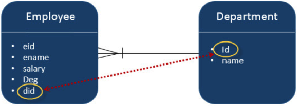
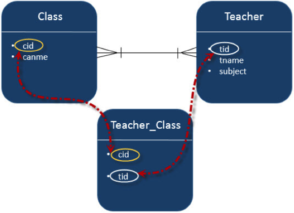

# JPA实体关系 - JPA教程

本章将指导完成学习实体间的关系。一般的关系数据库中的表之间的更有效。这里的实体类都被视为关系表(JPA的概念)，因此是实体类之间的关系如下：

*   @ManyToOne 关系
*   @OneToMany 关系
*   @OneToOne 关系
*   @ManyToMany 关系

## @ManyToOne 关系

多对一实体之间存在的关系，其中一个实体（列或组列）的引用与另一个实体（列或组列）包含唯一值。在关系数据库中，这些关系是通过使用表之间的外键/主键应用。

让我们考虑Employee和Department 实体之间的关系的一个例子。在单向方式，即从员工到部门，多到一的关系是可行的。这意味着员工每个记录包含一个部门ID，它应该是在部门表的主键。在这里，在Employee表，Department 的ID是外键。

下图显示了两个表之间的多对一关系。



在Eclipse中创建一个IDE JPA项目命名为JPA_Eclipselink_MTO。这个项目的所有模块下面讨论。

### 创建实体

遵循用于创建实体上面给出的图，在src下创建“com.tutorialspoin.eclipselink.entity'包。创建一个名为Department.java的类。类系实体如下：

```
package com.yiibai.eclipselink.entity;

import javax.persistence.Entity;
import javax.persistence.GeneratedValue;
import javax.persistence.GenerationType;
import javax.persistence.Id;

@Entity
public class Department 
{
    @Id 
    @GeneratedValue( strategy=GenerationType.AUTO )
    private int id;
    private String name;

    public int getId() 
    {
       return id;
    }

    public void setId(int id) 
    {
       this.id = id;
    }

    public String getName( )
    {
       return name;
    }

    public void setName( String deptName )
    {
       this.name = deptName;
    }
}
```

建立在这种关系中的第二个实体 - 名为Employee.java在“com.yiibai.eclipselink.entity'包下的Employee实体类。 Employee实体类如下所示：

```
package com.yiibai.eclipselink.entity;

import javax.persistence.Entity;
import javax.persistence.GeneratedValue;
import javax.persistence.GenerationType;
import javax.persistence.Id;
import javax.persistence.ManyToOne;

@Entity
public class Employee 
{
   @Id
   @GeneratedValue( strategy= GenerationType.AUTO )     
   private int eid;
   private String ename;
   private double salary;
   private String deg;
   @ManyToOne
   private Department department;

   public Employee(int eid, 
           String ename, double salary, String deg) 
   {
       super( );
       this.eid = eid;
       this.ename = ename;
       this.salary = salary;
       this.deg = deg;
   }

   public Employee( ) 
   {
       super();
   }

   public int getEid( ) 
   {
       return eid;
   }
   public void setEid(int eid)  
   {
       this.eid = eid;
   }

   public String getEname( ) 
   {
       return ename;
   }
   public void setEname(String ename) 
   {
       this.ename = ename;
   }

   public double getSalary( ) 
   {
       return salary;
   }
   public void setSalary(double salary) 
   {
       this.salary = salary;
   }

   public String getDeg( ) 
   {
       return deg;
   }
   public void setDeg(String deg) 
   {
       this.deg = deg;
   }

   public Department getDepartment() {
       return department;
   }

   public void setDepartment(Department department) {
       this.department = department;
   }
}
```

### Persistence.xml

persistence.xml文件需要配置数据库和实体类的注册。

Persitence.xml由Eclipse IDE在创建时由JPA项目创建。详细配置信息是用户的规范。 persistence.xml 文件如下所示：

```

<?xml version="1.0" encoding="UTF-8"?>
<persistence version="2.0" 
             xmlns="http://java.sun.com/xml/ns/persistence" 
             xmlns:xsi="http://www.w3.org/2001/XMLSchema-instance" 
             xsi:schemaLocation="http://java.sun.com/xml/ns/persistence 
             http://java.sun.com/xml/ns/persistence/persistence_2_0.xsd">
   <persistence-unit name="Eclipselink_JPA" 
                        transaction-type="RESOURCE_LOCAL">
   <class>com.yiibai.eclipselink.entity.Employee</class>
   <class>com.yiibai.eclipselink.entity.Department</class>
       <properties>
           <property name="javax.persistence.jdbc.url" 
                     value="jdbc:mysql://localhost:3306/jpadb"/>
           <property name="javax.persistence.jdbc.user" value="root"/>
           <property name="javax.persistence.jdbc.password"
                            value="root"/>
           <property name="javax.persistence.jdbc.driver" 
                     value="com.mysql.jdbc.Driver"/>
           <property name="eclipselink.logging.level" value="FINE"/>
           <property name="eclipselink.ddl-generation" 
                     value="create-tables"/>
       </properties>
   </persistence-unit>
</persistence>
```

### 服务类

该模块包含服务类，它实现了使用属性初始化关系的一部分。在src下创建一个名为“com.yiibai.eclipselink.service'包。创建一个名为ManyToOne.java的DAO类。在DAO类如下所示：

```
package com.yiibaieclipselink.service;

import javax.persistence.EntityManager;
import javax.persistence.EntityManagerFactory;
import javax.persistence.Persistence;
import com.yiibai.eclipselink.entity.Department;
import com.yiibai.eclipselink.entity.Employee;

public class ManyToOne 
{
   public static void main( String[ ] args ) 
   {
       EntityManagerFactory emfactory = Persistence.
               createEntityManagerFactory( "Eclipselink_JPA" );
       EntityManager entitymanager = emfactory.
               createEntityManager( );
       entitymanager.getTransaction( ).begin( );

       //Create Department Entity
       Department department = new Department();
       department.setName("Development");
       //Store Department
       entitymanager.persist(department);

       //Create Employee1 Entity
       Employee employee1 = new Employee();
       employee1.setEname("Satish");
       employee1.setSalary(45000.0);
       employee1.setDeg("Technical Writer");
       employee1.setDepartment(department);

       //Create Employee2 Entity
       Employee employee2 = new Employee();
       employee2.setEname("Krishna");
       employee2.setSalary(45000.0);
       employee2.setDeg("Technical Writer");
       employee2.setDepartment(department);

       //Create Employee3 Entity
       Employee employee3 = new Employee();
       employee3.setEname("Masthanvali");
       employee3.setSalary(50000.0);
       employee3.setDeg("Technical Writer");
       employee3.setDepartment(department);

       //Store Employees
       entitymanager.persist(employee1);
       entitymanager.persist(employee2);
       entitymanager.persist(employee3);

       entitymanager.getTransaction().commit();
       entitymanager.close();
       emfactory.close();
   }
}
```

编译并执行上述程序后，Eclipse IDE控制台面板上会显示的通知。对于输出，检查MySQL工作台。在此示例中，将创建两个表。

通过在MySQL管理界面中执行下面的查询，Department表的结果显示如下：

```
Select * from department
```

| ID | Name |
| --- | --- |
| 101 | Development |

通过在MySQL界面执行下面的查询，Employee表显示如下的结果。

```
Select * from employee
```

| Eid | Deg | Ename | Salary | Department_Id |
| --- | --- | --- | --- | --- |
| 102 | Technical Writer | Satish | 45000 | 101 |
| 103 | Technical Writer | Krishna | 45000 | 101 |
| 104 | Technical Writer | Masthanwali | 50000 | 101 |

在上表中Deparment_Id是Department表的外键（参考字段）。

## @OneToMany 关系

在这种关系中，一个实体中的每一行被引用到其它实体的许多子记录。最重要的是，子记录不能有多个父。在表A和表B之间的1对多的关系，在表A中的每一行都可以在表B中被链接到一个或多个行

让我们考虑上面的例子。假设Employee 和Department在上述例子中的表连接在一个相反的单向方式，那么关系成为一个一对多的关系。在Eclipse中创建一个IDE JPA项目命名JPA_Eclipselink_OTM。这个项目的所有模块下面讨论。

### 创建实体

遵循用于创建实体上面给出的图，在src下创建“com.tutorialspoin.eclipselink.entity'包。创建一个名为Department.java的类。类系实体如下：

```
package com.yiibai.eclipselink.entity;

import java.util.List;
import javax.persistence.Entity;
import javax.persistence.GeneratedValue;
import javax.persistence.GenerationType;
import javax.persistence.Id;
import javax.persistence.OneToMany;

@Entity
public class Department 
{
    @Id 
    @GeneratedValue( strategy=GenerationType.AUTO )
    private int id;
    private String name;

    @OneToMany( targetEntity=Employee.class )
    private List employeelist;

    public int getId() 
    {
       return id;
    }

    public void setId(int id) 
    {
       this.id = id;
    }

    public String getName( )
    {
       return name;
    }

    public void setName( String deptName )
    {
       this.name = deptName;
    }

    public List getEmployeelist() 
    {
   return employeelist;
    }

    public void setEmployeelist(List employeelist) 
    {
   this.employeelist = employeelist;
    }
}
```

创建第二个实体类关系-Employee实体类，命名为Employee.java在“com.yiibai.eclipselink.entity'包下。 Employee实体类如下所示：

```
package com.yiibai.eclipselink.entity;

import javax.persistence.Entity;
import javax.persistence.GeneratedValue;
import javax.persistence.GenerationType;
import javax.persistence.Id;

@Entity
public class Employee 
{
   @Id
   @GeneratedValue( strategy= GenerationType.AUTO )     
   private int eid;
   private String ename;
   private double salary;
   private String deg;

   public Employee(int eid, 
           String ename, double salary, String deg) 
   {
       super( );
       this.eid = eid;
       this.ename = ename;
       this.salary = salary;
       this.deg = deg;
   }

   public Employee( ) 
   {
       super();
   }

   public int getEid( ) 
   {
       return eid;
   }
   public void setEid(int eid)  
   {
       this.eid = eid;
   }

   public String getEname( ) 
   {
       return ename;
   }
   public void setEname(String ename) 
   {
       this.ename = ename;
   }

   public double getSalary( ) 
   {
       return salary;
   }
   public void setSalary(double salary) 
   {
       this.salary = salary;
   }

   public String getDeg( ) 
   {
       return deg;
   }
   public void setDeg(String deg) 
   {
       this.deg = deg;
   }    
}
```

### Persistence.xml

persistence.xml文件如下：

```
<?xml version="1.0" encoding="UTF-8"?>
<persistence version="2.0" 
             xmlns="http://java.sun.com/xml/ns/persistence" 
             xmlns:xsi="http://www.w3.org/2001/XMLSchema-instance" 
             xsi:schemaLocation="http://java.sun.com/xml/ns/persistence 
             http://java.sun.com/xml/ns/persistence/persistence_2_0.xsd">
   <persistence-unit name="Eclipselink_JPA" 
                        transaction-type="RESOURCE_LOCAL">
   <class>com.yiibai.eclipselink.entity.Employee</class>
   <class>com.yiibai.eclipselink.entity.Department</class>
       <properties>
           <property name="javax.persistence.jdbc.url" 
                     value="jdbc:mysql://localhost:3306/jpadb"/>
           <property name="javax.persistence.jdbc.user" value="root"/>
           <property name="javax.persistence.jdbc.password" 
                            value="root"/>
           <property name="javax.persistence.jdbc.driver" 
                     value="com.mysql.jdbc.Driver"/>
           <property name="eclipselink.logging.level" value="FINE"/>
           <property name="eclipselink.ddl-generation" 
                     value="create-tables"/>
       </properties>
   </persistence-unit>
</persistence>
```

### 服务类

该模块包含服务类，它实现了使用属性初始化关系的一部分。在src下创建一个名为“com.yiibai.eclipselink.service'包。并在包下创建一个名为OneToMany.java的DAO类。在DAO类如下所示：

```
package com.yiibaieclipselink.service;

import java.util.List;
import java.util.ArrayList;
import javax.persistence.EntityManager;
import javax.persistence.EntityManagerFactory;
import javax.persistence.Persistence;
import com.yiibai.eclipselink.entity.Department;
import com.yiibai.eclipselink.entity.Employee;

public class OneToMany 
{
   public static void main(String[] args) 
   {
       EntityManagerFactory emfactory = Persistence.
               createEntityManagerFactory( "Eclipselink_JPA" );
       EntityManager entitymanager = emfactory.
               createEntityManager( );
       entitymanager.getTransaction( ).begin( );

       //Create Employee1 Entity
       Employee employee1 = new Employee();
       employee1.setEname("Satish");
       employee1.setSalary(45000.0);
       employee1.setDeg("Technical Writer");

       //Create Employee2 Entity
       Employee employee2 = new Employee();
       employee2.setEname("Krishna");
       employee2.setSalary(45000.0);
       employee2.setDeg("Technical Writer");

       //Create Employee3 Entity
       Employee employee3 = new Employee();
       employee3.setEname("Masthanvali");
       employee3.setSalary(50000.0);
       employee3.setDeg("Technical Writer");

       //Store Employee
       entitymanager.persist(employee1);
       entitymanager.persist(employee2);
       entitymanager.persist(employee3);

       //Create Employeelist
       List<Employee> emplist = new ArrayList();
       emplist.add(employee1);
       emplist.add(employee2);
       emplist.add(employee3);

       //Create Department Entity
       Department department= new Department();
       department.setName("Development");
       department.setEmployeelist(emplist);

       //Store Department
       entitymanager.persist(department);

       entitymanager.getTransaction().commit();
       entitymanager.close();
       emfactory.close();
   }
}
```

编译和执行上述程序后，在Eclipse IDE的控制台面板中得到通知。对于输出检查MySQL工作台如下。

在这个项目中创建三个表。通过在MySQL界面查询，department_employee表的结果显示如下：

```
Select * from department_Id;
```

| Department_ID | Employee_Eid |
| --- | --- |
| 254 | 251 |
| 254 | 252 |
| 254 | 253 |

在上表中，deparment_id和employee_id 是部门和员工表的外键（参考字段）。

通过在MySQL界面下面查询，department表的结果将显示如下表格格式。

```
Select * from department;
```

| ID | Name |
| --- | --- |
| 254 | Development |

通过在MySQL界面下面查询，employee表的结果显示如下：

```
Select * from employee;
```

| Eid | Deg | Ename | Salary |
| --- | --- | --- | --- |
| 251 | Technical Writer | Satish | 45000 |
| 252 | Technical Writer | Krishna | 45000 |
| 253 | Technical Writer | Masthanwali | 50000 |

## @OneToOne 关系

在一对一关系，一个项可以链接到只能另一个项。这意味着一个实体中的每一行被称为一个且仅一个行对另一个实体。

让我们考虑上面的例子。Employee和Department在反向单向的方式，关系是一对一的关系。这意味着每个员工只能属于一个部门。
在Eclipse中创建一个IDE JPA项目命名JPA_Eclipselink_OTO。这个项目的所有模块下面讨论。

### 创建实体

遵循用于创建实体上面给出的图。在src下创建一个名为“com.tutorialspoin.eclipselink.entity'的包。在这个包下创建类名为：Department.java。类系实体被示为如下：

```
package com.yiibai.eclipselink.entity;

import javax.persistence.Entity;
import javax.persistence.GeneratedValue;
import javax.persistence.GenerationType;
import javax.persistence.Id;

@Entity
public class Department 
{
    @Id 
    @GeneratedValue( strategy=GenerationType.AUTO )
    private int id;
    private String name;

    public int getId() 
    {
       return id;
    }

    public void setId(int id) 
    {
       this.id = id;
    }

    public String getName( )
    {
       return name;
    }

    public void setName( String deptName )
    {
       this.name = deptName;
    }
}
```

创建第二个实体类关系-Employee实体类，命名为Employee.java在“com.yiibai.eclipselink.entity'包下。 Employee实体类如下所示：

```
package com.yiibai.eclipselink.entity;

import javax.persistence.Entity;
import javax.persistence.GeneratedValue;
import javax.persistence.GenerationType;
import javax.persistence.Id;
import javax.persistence.OneToOne;

@Entity
public class Employee 
{
   @Id
   @GeneratedValue( strategy= GenerationType.AUTO )     
   private int eid;
   private String ename;
   private double salary;
   private String deg;

   @OneToOne
   private Department department;

   public Employee(int eid, 
           String ename, double salary, String deg) 
   {
       super( );
       this.eid = eid;
       this.ename = ename;
       this.salary = salary;
       this.deg = deg;
   }

   public Employee( ) 
   {
       super();
   }

   public int getEid( ) 
   {
       return eid;
   }
   public void setEid(int eid)  
   {
       this.eid = eid;
   }

   public String getEname( ) 
   {
       return ename;
   }
   public void setEname(String ename) 
   {
       this.ename = ename;
   }

   public double getSalary( ) 
   {
       return salary;
   }
   public void setSalary(double salary) 
   {
       this.salary = salary;
   }

   public String getDeg( ) 
   {
       return deg;
   }
   public void setDeg(String deg) 
   {
       this.deg = deg;
   }

   public Department getDepartment() 
   {
       return department;
   }

   public void setDepartment(Department department) 
   {
       this.department = department;
   }    
}
```

### Persistence.xml

persistence.xml文件，如下所示：

```
<?xml version="1.0" encoding="UTF-8"?>
<persistence version="2.0" 
             xmlns="http://java.sun.com/xml/ns/persistence" 
             xmlns:xsi="http://www.w3.org/2001/XMLSchema-instance" 
             xsi:schemaLocation="http://java.sun.com/xml/ns/persistence 
             http://java.sun.com/xml/ns/persistence/persistence_2_0.xsd">
   <persistence-unit name="Eclipselink_JPA" 
                        transaction-type="RESOURCE_LOCAL">
   <class>com.yiibai.eclipselink.entity.Employee</class>
   <class>com.yiibai.eclipselink.entity.Department</class>
       <properties>
           <property name="javax.persistence.jdbc.url" 
                     value="jdbc:mysql://localhost:3306/jpadb"/>
           <property name="javax.persistence.jdbc.user" value="root"/>
           <property name="javax.persistence.jdbc.password" 
                            value="root"/>
           <property name="javax.persistence.jdbc.driver" 
                     value="com.mysql.jdbc.Driver"/>
           <property name="eclipselink.logging.level" value="FINE"/>
           <property name="eclipselink.ddl-generation" 
                     value="create-tables"/>
       </properties>
   </persistence-unit>
</persistence>
```

### 服务类

在src下创建一个名为“com.yiibai.eclipselink.service'的包。在这个包下创建一个名为OneToOne.java的DAO类。在DAO类如下所示：

```
package com.yiibaieclipselink.service;

import javax.persistence.EntityManager;
import javax.persistence.EntityManagerFactory;
import javax.persistence.Persistence;
import com.yiibai.eclipselink.entity.Department;
import com.yiibai.eclipselink.entity.Employee;

public class OneToOne 
{
   public static void main(String[] args) 
   {
       EntityManagerFactory emfactory = Persistence.
               createEntityManagerFactory( "Eclipselink_JPA" );
       EntityManager entitymanager = emfactory.
               createEntityManager( );
       entitymanager.getTransaction( ).begin( );

       //Create Department Entity
       Department department = new Department();
       department.setName("Development");

       //Store Department
       entitymanager.persist(department);

       //Create Employee Entity
       Employee employee = new Employee();
       employee.setEname("Satish");
       employee.setSalary(45000.0);
       employee.setDeg("Technical Writer");
       employee.setDepartment(department);

       //Store Employee
       entitymanager.persist(employee);

       entitymanager.getTransaction().commit();
       entitymanager.close();
       emfactory.close();
   }
}
```

编译和执行上述程序后，在Eclipse IDE控制台面板的显示通知。对于输出，检查MySQL工作台如下。

在上面的例子中，将创建两个表。通过在MySQL的界面下面的查询，department表的结果显示如下：

```
Select * from department
```

| ID | Name |
| --- | --- |
| 301 | Development |

通过在MySQL界面下面查询，employee表的结果显示如下：

```
Select * from employee
```

| Eid | Deg | Ename | Salary | Department_id |
| --- | --- | --- | --- | --- |
| 302 | Technical Writer | Satish | 45000 | 301 |

## @ManyToMany 关系

多对多的关系，就是从一个实体中的一个或多个行与其他实体的多个行相关联。

让我们考虑两个实体之间的关系的一个例子：班级和教师。以双向的方式，既班级和教师有多对一的关系。这意味着类中的每个记录由教师组（教师ID），这应该是在教师表中的主键和存储在Teacher_Class表，反之亦然简称。在这里，Teachers_Class表包含外键字段。在Eclipse中创建一个IDE JPA项目命名JPA_Eclipselink_MTM。这个项目的所有模块下面讨论。



### 创建实体

按照上面的图中所示的方案中创建的实体。在src下创建一个名为“com.tutorialspoin.eclipselink.entity'的包。创建一个名为Class.java的类在这个包下。类系实体显示如下：

```
package com.yiibai.eclipselink.entity;

import java.util.Set;
import javax.persistence.Entity;
import javax.persistence.GeneratedValue;
import javax.persistence.GenerationType;
import javax.persistence.Id;
import javax.persistence.ManyToMany;

@Entity
public class Clas 
{
   @Id
   @GeneratedValue( strategy = GenerationType.AUTO )
   private int cid;
   private String cname;

   @ManyToMany(targetEntity=Teacher.class)
   private Set teacherSet;

   public Clas() 
   {
       super();
   }
   public Clas(int cid, 
           String cname, Set teacherSet) 
   {
       super();
       this.cid = cid;
       this.cname = cname;
       this.teacherSet = teacherSet;
   }
   public int getCid() 
   {
       return cid;
   }
   public void setCid(int cid) 
   {
       this.cid = cid;
   }
   public String getCname() 
   {
       return cname;
   }
   public void setCname(String cname) 
   {
       this.cname = cname;
   }
   public Set getTeacherSet() 
   {
       return teacherSet;
   }
   public void setTeacherSet(Set teacherSet) 
   {
       this.teacherSet = teacherSet;
   }      
}
```

创建第二个实体这种关系的Employee实体类，命名为Teacher.java 在“com.yiibai.eclipselink.entity'包下。 Employee实体类如下所示：

```
package com.yiibai.eclipselink.entity;

import java.util.Set;
import javax.persistence.Entity;
import javax.persistence.GeneratedValue;
import javax.persistence.GenerationType;
import javax.persistence.Id;
import javax.persistence.ManyToMany;

@Entity
public class Teacher 
{
   @Id
   @GeneratedValue( strategy = GenerationType.AUTO )
   private int tid;
   private String tname;
   private String subject;

   @ManyToMany(targetEntity=Clas.class)
   private Set clasSet;

   public Teacher() 
   {
       super();
   }
   public Teacher(int tid, String tname, String subject, 
           Set clasSet) 
   {
       super();
       this.tid = tid;
       this.tname = tname;
       this.subject = subject;
       this.clasSet = clasSet;
   }
   public int getTid() 
   {
       return tid;
   }
   public void setTid(int tid) 
   {
       this.tid = tid;
   }
   public String getTname() 
   {
       return tname;
   }
   public void setTname(String tname) 
   {
       this.tname = tname;
   }
   public String getSubject() 
   {
       return subject;
   }
   public void setSubject(String subject) 
   {
       this.subject = subject;
   }
   public Set getClasSet() 
   {
       return clasSet;
   }
   public void setClasSet(Set clasSet) 
   {
       this.clasSet = clasSet;
   }
}
```

### Persistence.xml

Persistence.xml 文件的内容如下：

```
<?xml version="1.0" encoding="UTF-8"?>
<persistence version="2.0" 
             xmlns="http://java.sun.com/xml/ns/persistence" 
             xmlns:xsi="http://www.w3.org/2001/XMLSchema-instance" 
             xsi:schemaLocation="http://java.sun.com/xml/ns/persistence 
             http://java.sun.com/xml/ns/persistence/persistence_2_0.xsd">
   <persistence-unit name="Eclipselink_JPA" 
                        transaction-type="RESOURCE_LOCAL">
   <class>com.yiibai.eclipselink.entity.Employee</class>
   <class>com.yiibai.eclipselink.entity.Department</class>
       <properties>
           <property name="javax.persistence.jdbc.url" 
                     value="jdbc:mysql://localhost:3306/jpadb"/>
           <property name="javax.persistence.jdbc.user" value="root"/>
           <property name="javax.persistence.jdbc.password" 
                            value="root"/>
           <property name="javax.persistence.jdbc.driver" 
                     value="com.mysql.jdbc.Driver"/>
           <property name="eclipselink.logging.level" value="FINE"/>
           <property name="eclipselink.ddl-generation" 
                     value="create-tables"/>
       </properties>
   </persistence-unit>
</persistence>
```

### 服务类

在src下创建一个名为“com.yiibai.eclipselink.service'的包，在这个包下创建一个名为ManyToMany.java的DAO类。在DAO类如下所示：

```
package com.yiibai.eclipselink.service;

import java.util.HashSet;
import java.util.Set;
import javax.persistence.EntityManager;
import javax.persistence.EntityManagerFactory;
import javax.persistence.Persistence;
import com.yiibai.eclipselink.entity.Clas;
import com.yiibai.eclipselink.entity.Teacher;

public class ManyToMany 
{
   public static void main(String[] args) 
   {
       EntityManagerFactory emfactory = Persistence.
               createEntityManagerFactory( "Eclipselink_JPA" );
       EntityManager entitymanager = emfactory.
               createEntityManager( );
       entitymanager.getTransaction( ).begin( );

       //Create Clas Entity
       Clas clas1=new Clas(0,"1st",null);
       Clas clas2=new Clas(0,"2nd",null);
       Clas clas3=new Clas(0,"3rd",null);

       //Store Clas
       entitymanager.persist(clas1);
       entitymanager.persist(clas2);
       entitymanager.persist(clas3);

       //Create Clas Set1
       Set<Clas> classSet1 = new HashSet();
       classSet1.add(clas1);
       classSet1.add(clas2);
       classSet1.add(clas3);

       //Create Clas Set2
       Set<Clas> classSet2 = new HashSet();
       classSet2.add(clas3);
       classSet2.add(clas1);
       classSet2.add(clas2);

       //Create Clas Set3
       Set<Clas> classSet3 = new HashSet();
       classSet3.add(clas2);
       classSet3.add(clas3);
       classSet3.add(clas1);

       //Create Teacher Entity
       Teacher teacher1 = new Teacher(0,
               "Satish","Java",classSet1);
       Teacher teacher2 = new Teacher(0,
               "Krishna","Adv Java",classSet2);
       Teacher teacher3 = new Teacher(0,
               "Masthanvali","DB2",classSet3);

       //Store Teacher
       entitymanager.persist(teacher1);
       entitymanager.persist(teacher2);
       entitymanager.persist(teacher3);

       entitymanager.getTransaction( ).commit( );
       entitymanager.close( );
       emfactory.close( );
   }
}
```

在这个例子中工程，将创建三个表。通过在MySQL界面执行下面的查询，teacher_clas表将显示如下的结果：

```
Select * form teacher_clas
```

| Teacher_tid | Classet_cid |
| --- | --- |
| 354 | 351 |
| 355 | 351 |
| 356 | 351 |
| 354 | 352 |
| 355 | 352 |
| 356 | 352 |
| 354 | 353 |
| 355 | 353 |
| 356 | 353 |

在上表中teacher_tid是从eacher表的外键，classet_cid是class表的外键。因此不同的老师被分配到不同的班级。

通过在MySQL的界面下面的查询，teacher表的结果显示如下：

```
Select * from teacher
```

| Tid | Subject | Tname |
| --- | --- | --- |
| 354 | Java | Satish |
| 355 | Adv Java | Krishna |
| 356 | DB2 | Masthanvali |

通过在MySQL的界面执行下面的查询, clas表将显示如下的结果：

```
Select * from clas
```

| Cid | Cname |
| --- | --- |
| 351 | 1st |
| 352 | 2nd |
| 353 | 3rd |

