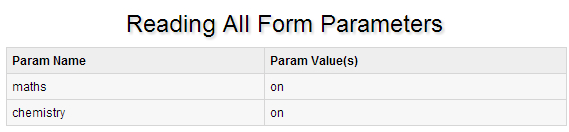

# JSP 表单处理

我们在浏览网页的时候，经常需要向服务器提交信息，并让后台程序处理。浏览器中使用 GET 和 POST 方法向服务器提交数据。

## GET 方法

GET方法将请求的编码信息添加在网址后面，网址与编码信息通过"?"号分隔。如下所示：

```
http://www.w3cschool.cc/hello?key1=value1&key2=value2
```

GET方法是浏览器默认传递参数的方法，一些敏感信息，如密码等建议不使用GET方法。

用get时，传输数据的大小有限制 （注意不是参数的个数有限制），最大为1024字节。

## POST 方法

一些敏感信息，如密码等我们可以同过POST方法传递，post提交数据是隐式的。

POST提交数据是不可见的，GET是通过在url里面传递的（可以看一下你浏览器的地址栏）。

JSP使用getParameter()来获得传递的参数，getInputStream()方法用来处理客户端的二进制数据流的请求。

## JSP 读取表单数据

*   **getParameter():** 使用 request.getParameter() 方法来获取表单参数的值。

*   **getParameterValues():** 获得如checkbox类（名字相同，但值有多个）的数据。 接收数组变量 ，如checkobx类型

*   **getParameterNames():**该方法可以取得所有变量的名称，该方法返回一个Emumeration。

*   **getInputStream():**调用此方法来读取来自客户端的二进制数据流。

## 使用URL的 GET 方法实例

以下是一个简单的URL,并使用GET方法来传递URL中的参数：

```
http://localhost:8080/main.jsp?first_name=ZARA&last_name=ALI
```

以下是main.jsp文件的JSP程序用于处理客户端提交的表单数据，我们使用getParameter()方法来获取提交的数据：

```
<html>
<head>
<title>Using GET Method to Read Form Data</title>
</head>
<body>
<center>
<h1>Using GET Method to Read Form Data</h1>
<ul>
<li><p><b>First Name:</b>
   <%= request.getParameter("first_name")%>
</p></li>
<li><p><b>Last  Name:</b>
   <%= request.getParameter("last_name")%>
</p></li>
</ul>
</body>
</html>

```

接下来我们通过浏览器访问_http://localhost:8080/main.jsp?first_name=ZARA&last_name=ALI_ 输出结果如下所示：

```
Using GET Method to Read Form Data
First Name: ZARA

Last Name: ALI

```

## 使用表单的 GET 方法实例

以下是一个简单的HTML表单，该表单通过GET方法将客户端数据提交 到main.jsp文件中：

```
<html>
<body>
<form action="main.jsp" method="GET">
First Name: <input type="text" name="first_name">
<br />
Last Name: <input type="text" name="last_name" />
<input type="submit" value="Submit" />
</form>
</body>
</html>

```

将以上HTML代码保存到Hello.htm文件中。 将该文件放置于&lt;Tomcat安装目录&gt;/webapps/ROOT 目录下。 通过访问 _http://localhost:8080/Hello.htm_，输出界面如下所示：


在"First Name" 与 "Last Name"两个表单中填入信息，并点击"Submit"按钮，它将输出结果。

## 使用表单的 POST 方法实例

接下来让我们使用POST方法来传递表单数据，修改main.jsp与Hello.htm文件代码，如下所示：

main.jsp文件代码：

```
<html>
<head>
<title>Using GET and POST Method to Read Form Data</title>
</head>
<body>
<center>
<h1>Using GET Method to Read Form Data</h1>
<ul>
<li><p><b>First Name:</b>
   <%= request.getParameter("first_name")%>
</p></li>
<li><p><b>Last  Name:</b>
   <%= request.getParameter("last_name")%>
</p></li>
</ul>
</body>
</html>

```

以下是Hello.htm修改后的代码：

```
<html>
<body>
<form action="main.jsp" method="POST">
First Name: <input type="text" name="first_name">
<br />
Last Name: <input type="text" name="last_name" />
<input type="submit" value="Submit" />
</form>
</body>
</html>

```

通过浏览器访问 _http://localhost:8080/Hello.htm_，输出如下：


在"First Name" 与 "Last Name"两个表单中填入信息，并点击"Submit"按钮，它将输出结果。

## 传递 Checkbox 数据到JSP程序

复选框 checkbox 可以传递一个甚至多个数据。

以下是一个简单的HTML代码，并将代码保存在CheckBox.htm文件中：

```
<html>
<body>
<form action="main.jsp" method="POST" target="_blank">
<input type="checkbox" name="maths" checked="checked" /> Maths
<input type="checkbox" name="physics"  /> Physics
<input type="checkbox" name="chemistry" checked="checked" /> 
                                                Chemistry
<input type="submit" value="Select Subject" />
</form>
</body>
</html>

```

以上代码在浏览器访问如下所示：

以下为main.jsp文件代码，用于处理复选框数据：

```
<html>
<head>
<title>Reading Checkbox Data</title>
</head>
<body>
<center>
<h1>Reading Checkbox Data</h1>
<ul>
<li><p><b>Maths Flag:</b>
   <%= request.getParameter("maths")%>
</p></li>
<li><p><b>Physics Flag:</b>
   <%= request.getParameter("physics")%>
</p></li>
<li><p><b>Chemistry Flag:</b>
   <%= request.getParameter("chemistry")%>
</p></li>
</ul>
</body>
</html>

```

以上实例输出结果为：


## 读取所有表单参数

以下我们将使用 HttpServletRequest 的getParameterNames()来读取所有可用的表单参数,该方法可以取得所有变量的名称，该方法返回一个Emumeration。

一旦我们有了一个Enumeration（枚举），我们就可以调用hasMoreElements（）方法来确定何时停止使用和nextElement（）方法来获得每个参数的名称。

```
<%@ page import="java.io.*,java.util.*" %>
<html>
<head>
<title>HTTP Header Request Example</title>
</head>
<body>
<center>
<h2>HTTP Header Request Example</h2>
<table width="100%" border="1" align="center">
<tr bgcolor="#949494">
<th>Param Name</th><th>Param Value(s)</th>
</tr>
<%
   Enumeration paramNames = request.getParameterNames();

   while(paramNames.hasMoreElements()) {
      String paramName = (String)paramNames.nextElement();
      out.print("<tr><td>" + paramName + "</td>\n");
      String paramValue = request.getHeader(paramName);
      out.println("<td> " + paramValue + "</td></tr>\n");
   }
%>
</table>
</center>
</body>
</html>

```

以下是Hello.htm文件的内容:

```
<html>
<body>
<form action="main.jsp" method="POST" target="_blank">
<input type="checkbox" name="maths" checked="checked" /> Maths
<input type="checkbox" name="physics"  /> Physics
<input type="checkbox" name="chemistry" checked="checked" /> Chem
<input type="submit" value="Select Subject" />
</form>
</body>
</html>

```

现在我们通过浏览器访问 Hello.htm 文件并提交数据，输出结果如下：



你可以尝试使用以上的JSP代码读取其它对象，如文本框，单选按钮或下拉框等等其他形式的数据。

