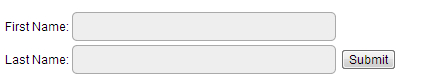

# JSP Cookies 处理

Cookies是存储在客户机的文本文件，它们保存了大量轨迹信息。在servlet技术基础上，JSP显然能够提供对HTTP cookies的支持。

通常有三个步骤来识别回头客：

*   服务器脚本发送一系列cookies至浏览器。比如名字，年龄，ID号码等等。
*   浏览器在本地机中存储这些信息，以备不时之需。
*   当下一次浏览器发送任何请求至服务器时，它会同时将这些cookies信息发送给服务器，然后服务器使用这些信息来识别用户或者干些其它事情。

本章节将会传授您如何去设置或重设cookie的方法，还有如何访问它们及如何删除它们。

## Cookie剖析

Cookies通常在HTTP信息头中设置（虽然JavaScript能够直接在浏览器中设置cookies）。在JSP中，设置一个cookie需要发送如下的信息头给服务器：

```
HTTP/1.1 200 OK
Date: Fri, 04 Feb 2000 21:03:38 GMT
Server: Apache/1.3.9 (UNIX) PHP/4.0b3
Set-Cookie: name=xyz; expires=Friday, 04-Feb-07 22:03:38 GMT;
                 path=/; domain=tutorialspoint.com
Connection: close
Content-Type: text/html

```

正如您所见，Set-Cookie信息头包含一个键值对，一个GMT（格林尼治标准）时间，一个路径，一个域名。键值对会被编码为URL。有效期域是个指令，告诉浏览器在什么时候之后就可以清除这个cookie。

如果浏览器被配置成可存储cookies，那么它将会保存这些信息直到过期。如果用户访问的任何页面匹配了cookie中的路径和域名，那么浏览器将会重新将这个cookie发回给服务器。浏览器端的信息头长得就像下面这样：

```
GET / HTTP/1.0
Connection: Keep-Alive
User-Agent: Mozilla/4.6 (X11; I; Linux 2.2.6-15apmac ppc)
Host: zink.demon.co.uk:1126
Accept: image/gif, */*
Accept-Encoding: gzip
Accept-Language: en
Accept-Charset: iso-8859-1,*,utf-8
Cookie: name=xyz

```

JSP脚本通过request对象中的getCookies()方法来访问这些cookies，这个方法会返回一个Cookie对象的数组。

## Servlet Cookies 方法

下表列出了Cookie对象中常用的方法：

| **方法** | **描述** |
| --- | --- |
| **public void setDomain(String pattern)** |设置cookie的域名，比如w3cschool.cc |
| **public String getDomain()** |获取cookie的域名，比如w3cschool.cc |
| **public void setMaxAge(int expiry)** |设置cookie有效期，以秒为单位，默认有效期为当前session的存活时间 |
| **public int getMaxAge()** |获取cookie有效期，以秒为单位，默认为-1 ，表明cookie会活到浏览器关闭为止 |
| **public String getName()** |返回 cookie的名称，名称创建后将不能被修改 |
| **public void setValue(String newValue)** |设置 cookie的值 |
| **public String getValue()** |获取cookie的值 |
| **public void setPath(String uri)** |设置cookie 的路径，默认为当前页面目录下的所有URL，还有此目录下的所有子目录 |
| **public String getPath()** |获取cookie 的路径 |
| **public void setSecure(boolean flag)** |指明cookie是否要加密传输 |
| **public void setComment(String purpose)** |设置注释描述 cookie的目的。当浏览器将cookie展现给用户时，注释将会变得非常有用 |
| **public String getComment()** |返回描述cookie目的的注释，若没有则返回null |

## 使用JSP设置Cookies

使用JSP设置cookie包含三个步骤：

**(1)创建一个Cookie对象：** 调用Cookie的构造函数，使用一个cookie名称和值做参数，它们都是字符串。

```
Cookie cookie = new Cookie("key","value");

```

请务必牢记，名称和值中都不能包含空格或者如下的字符：

```
[ ] ( ) = , " / ? @ : ;

```

**(2) 设置有效期：**调用setMaxAge()函数表明cookie在多长时间（以秒为单位）内有效。下面的操作将有效期设为了24小时。

```
cookie.setMaxAge(60*60*24);

```

**(3) 将cookie发送至HTTP响应头中：**调用response.addCookie()函数来向HTTP响应头中添加cookies。

```
response.addCookie(cookie);

```

### 实例演示

```
<%
   // 为 first_name 和 last_name设置cookie      
   Cookie firstName = new Cookie("first_name",
 			  request.getParameter("first_name"));
   Cookie lastName = new Cookie("last_name",
			  request.getParameter("last_name"));

   // 设置cookie过期时间为24小时。
   firstName.setMaxAge(60*60*24);
   lastName.setMaxAge(60*60*24);

   // 在响应头部添加cookie
   response.addCookie( firstName );
   response.addCookie( lastName );
%>
<html>
<head>
<title>Setting Cookies</title>
</head>
<body>
<center>
<h1>Setting Cookies</h1>
</center>
<ul>
<li><p><b>First Name:</b>
   <%= request.getParameter("first_name")%>
</p></li>
<li><p><b>Last  Name:</b>
   <%= request.getParameter("last_name")%>
</p></li>
</ul>
</body>
</html>

```

将上面两个文件放在&lt;Tomcat安装目录&gt;/webapps/ROOT目录下，然后访问http://localhost:8080/hello.jsp，将会得到如下输出结果：



试着输入First Name和Last Name，然后点击提交按钮，它将会在您的屏幕中显示first name和last name，并且设置first name和last name两个cookie，下一次点击提交按钮时会发给服务器。

## 使用JSP读取Cookies

想要读取cookies，您就需要调用request.getCookies()方法来获得一个javax.servlet.http.Cookie对象的数组，然后遍历这个数组，使用getName()方法和getValue()方法来获取每一个cookie的名称和值。

<h3实例演示< h3="">

让我们来读取上个例子中的cookies。

```
<html>
<head>
<title>Reading Cookies</title>
</head>
<body>
<center>
<h1>Reading Cookies</h1>
</center>
<%
   Cookie cookie = null;
   Cookie[] cookies = null;
   // 获取cookies的数据,是一个数组
   cookies = request.getCookies();
   if( cookies != null ){
      out.println("<h2> Found Cookies Name and Value</h2>");
      for (int i = 0; i < cookies.length; i++){
         cookie = cookies[i];
         out.print("Name : " + cookie.getName( ) + ",  ");
         out.print("Value: " + cookie.getValue( )+" <br/>");
      }
  }else{
      out.println("<h2>No cookies founds</h2>");
  }
%>
</body>
</html>

```

如果您把first name cookie设置成"John"，last name设置成"Player"，访问 http://localhost:8080/main.jsp，将会得到如下输出结果：

```
Found Cookies Name and Value
Name : first_name, Value: John
Name : last_name, Value: Player

```

## 使用JSP删除Cookies

删除cookies非常简单。如果您想要删除一个cookie，按照下面给的步骤来做就行了：

*   获取一个已经存在的cookie然后存储在Cookie对象中。
*   将cookie的有效期设置为0。
*   将这个cookie重新添加进响应头中。

### 实例演示

下面的程序删除一个名为"first_name"的cookie，当您下次运行main.jsp时，first_name将会为null。

```
<html>
<head>
<title>Reading Cookies</title>
</head>
<body>
<center>
<h1>Reading Cookies</h1>
</center>
<%
   Cookie cookie = null;
   Cookie[] cookies = null;
   // 获取当前域名下的cookies，是一个数组
   cookies = request.getCookies();
   if( cookies != null ){
      out.println("<h2> Found Cookies Name and Value</h2>");
      for (int i = 0; i < cookies.length; i++){
         cookie = cookies[i];
         if((cookie.getName( )).compareTo("first_name") == 0 ){
            cookie.setMaxAge(0);
            response.addCookie(cookie);
            out.print("Deleted cookie: " +
            cookie.getName( ) + "<br/>");
         }
         out.print("Name : " + cookie.getName( ) + ",  ");
         out.print("Value: " + cookie.getValue( )+" <br/>");
      }
  }else{
      out.println(
      "<h2>No cookies founds</h2>");
  }
%>
</body>
</html>

```

访问它，将会得到如下输出结果：

```
Cookies Name and Value
Deleted cookie : first_name
Name : first_name, Value: John
Name : last_name, Value: Player

```

再次访问http://localhost:8080/main.jsp，将会得到如下结果：

```
Found Cookies Name and Value
Name : last_name, Value: Player

```

您也可以手动在浏览器中删除cookies。点击Tools菜单项，然后选择Internet Options，点击Delete Cookies，就能删除所有cookies了。
