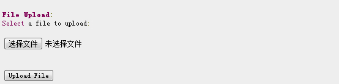

# JSP 文件上传

JSP可以通过HTML的form表单上传文件到服务器。 文件类型可以是文本文件、二进制文件、图像文件等其他任何文档。

## 创建文件上传表单

接下来我们使用HTML标签来创建文件上传表单，以下为要注意的点：

*   form表单 **method** 属性必须设置为 **POST** 方法 ，不能使用 GET 方法。
*   form表单 **enctype** 属性需要设置为 **multipart/form-data**。
*   form表单 **action** 属性需要设置为提交到后台处理文件上传的jsp文件地址。例如 **uploadFile.jsp** 程序文件用来处理上传的文件。
*   上传文件元素需要使用 &lt;input .../&gt; 标签，属性设置为 type="file"。如果需要上传多个文件，可以在 &lt;input .../&gt;标签中设置不同的名称。

以下是一个上传文件的表单，实例如下：

```
<html>
<head>
<title>File Uploading Form</title>
</head>
<body>
<h3>File Upload:</h3>
Select a file to upload: <br />
<form action="UploadServlet" method="post"
                        enctype="multipart/form-data">
<input type="file" name="file" size="50" />
<br />
<input type="submit" value="Upload File" />
</form>
</body>
</html>

```

在你本地浏览器访问该文件，显示界面如下所示，在你点击"Upload File"会弹出一个窗口让你选择要上传的文件：


## 后台JSP处理脚本

首先我们先定义文件上传后存储在服务上的位置，你可以将路径写在你的程序当中，或者我们可以在web.xml配置文件中通过设置 context-param 元素来设置文件存储的目录，如下所示：

```
<web-app>
....
<context-param> 
    <description>Location to store uploaded file</description> 
    <param-name>file-upload</param-name> 
    <param-value>
         c:\apache-tomcat-5.5.29\webapps\data\
     </param-value> 
</context-param>
....
</web-app>

```

以下脚本文件UploadFile.jsp可以处理多个上传的文件，在使用该脚本前，我们需要注意以下几点：

*   以下实例依赖 FileUpload, 所以你需要在你的classpath中引入最新的 **commons-fileupload.x.x.jar** 包文件。 下载地址为：[http://commons.apache.org/fileupload/](//commons.apache.org/fileupload/)。
*   FileUpload 依赖 Commons IO, 所以你需要在你的classpath中引入最新的 **commons-io-x.x.jar** 。 下载地址为： [http://commons.apache.org/io/](//commons.apache.org/io/)。
*   在测试以下实例时，你需要上传确认上传的文件大小小于 _maxFileSize_ 变量设置的大小 ,否则文件无法上传成功。
*   确保你已经创建了目录 c:\temp 和 c:\apache-tomcat-5.5.29\webapps\data 。

```
<%@ page import="java.io.*,java.util.*, javax.servlet.*" %>
<%@ page import="javax.servlet.http.*" %>
<%@ page import="org.apache.commons.fileupload.*" %>
<%@ page import="org.apache.commons.fileupload.disk.*" %>
<%@ page import="org.apache.commons.fileupload.servlet.*" %>
<%@ page import="org.apache.commons.io.output.*" %>

<%
   File file ;
   int maxFileSize = 5000 * 1024;
   int maxMemSize = 5000 * 1024;
   ServletContext context = pageContext.getServletContext();
   String filePath = context.getInitParameter("file-upload");

   // 验证上传内容了类型
   String contentType = request.getContentType();
   if ((contentType.indexOf("multipart/form-data") >= 0)) {

      DiskFileItemFactory factory = new DiskFileItemFactory();
      // 设置内存中存储文件的最大值
      factory.setSizeThreshold(maxMemSize);
      // 本地存储的数据大于 maxMemSize.
      factory.setRepository(new File("c:\\temp"));

      // 创建一个新的文件上传处理程序
      ServletFileUpload upload = new ServletFileUpload(factory);
      // 设置最大上传的文件大小
      upload.setSizeMax( maxFileSize );
      try{ 
         // 解析获取的文件
         List fileItems = upload.parseRequest(request);

         // 处理上传的文件
         Iterator i = fileItems.iterator();

         out.println("<html>");
         out.println("<head>");
         out.println("<title>JSP File upload</title>");  
         out.println("</head>");
         out.println("<body>");
         while ( i.hasNext () ) 
         {
            FileItem fi = (FileItem)i.next();
            if ( !fi.isFormField () )	
            {
            // 获取上传文件的参数
            String fieldName = fi.getFieldName();
            String fileName = fi.getName();
            boolean isInMemory = fi.isInMemory();
            long sizeInBytes = fi.getSize();
            // 写入文件
            if( fileName.lastIndexOf("\\") >= 0 ){
            file = new File( filePath , 
            fileName.substring( fileName.lastIndexOf("\\"))) ;
            }else{
            file = new File( filePath ,
            fileName.substring(fileName.lastIndexOf("\\")+1)) ;
            }
            fi.write( file ) ;
            out.println("Uploaded Filename: " + filePath + 
            fileName + "<br>");
            }
         }
         out.println("</body>");
         out.println("</html>");
      }catch(Exception ex) {
         System.out.println(ex);
      }
   }else{
      out.println("<html>");
      out.println("<head>");
      out.println("<title>Servlet upload</title>");  
      out.println("</head>");
      out.println("<body>");
      out.println("<p>No file uploaded</p>"); 
      out.println("</body>");
      out.println("</html>");
   }
%>

```

接下来让我们通过浏览器访问 _http://localhost:8080/UploadFile.htm_，界面如下所示，并上传文件：



如果你的JSP脚本运行正常，文件将被上传至 c:\apache-tomcat-5.5.29\webapps\data\ ，你可以打开文件夹看看是否上传成功。

