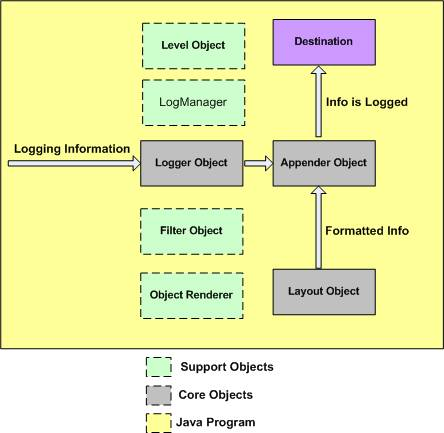

# log4j架构 - Log4j教程

Log4j API设计为分层结构，其中每一层提供了不同的对象，对象执行不同的任务。这使得设计灵活，根据将来需要来扩展。

有两种类型可用在Log4j的框架对象。

*   **核心对象：** 框架的强制对象和框架的使用。

*   **支持对象：** 框架和支持体核心对象，可选的对象执行另外重要的任务。

## 核心对象：

### Logger对象：

顶级层的Logger，它提供Logger对象。Logger对象负责捕获日志信息及它们存储在一个空间的层次结构。

### 布局对象：

该层提供其用于格式化不同风格的日志信息的对象。布局层提供支持Appender对象到发布日志信息之前。

布局对象的发布方式是人类可读的及可重复使用的记录信息的一个重要的角色。

### Appender对象：

下位层提供Appender对象。Appender对象负责发布日志信息，以不同的首选目的地，如数据库，文件，控制台，UNIX系统日志等。

以下是显示Log4J框架的不同组件的虚拟图：

## 支持对象：

log4j框架的其他重要的对象起到日志框架的一个重要作用：

### Level对象：

级别对象定义的任何记录信息的粒度和优先级。有记录的七个级别在API中定义：OFF, DEBUG, INFO, ERROR, WARN, FATAL 和 ALL

### Filter对象：

过滤对象用于分析日志信息及是否应记录或不用这些信息做出进一步的决定。

一个appender对象可以有与之关联的几个Filter对象。如果日志记录信息传递给特定Appender对象，都和特定Appender相关的Filter对象批准的日志信息，然后才能发布到所连接的目的地。

### 对象渲染器：

ObjectRenderer对象是一个指定提供传递到日志框架的不同对象的字符串表示。这个对象所使用的布局对象来准备最后的日志信息。

### 日志管理：

日志管理对象管理的日志框架。它负责从一个系统级的配置文件或配置类读取初始配置参数。

 