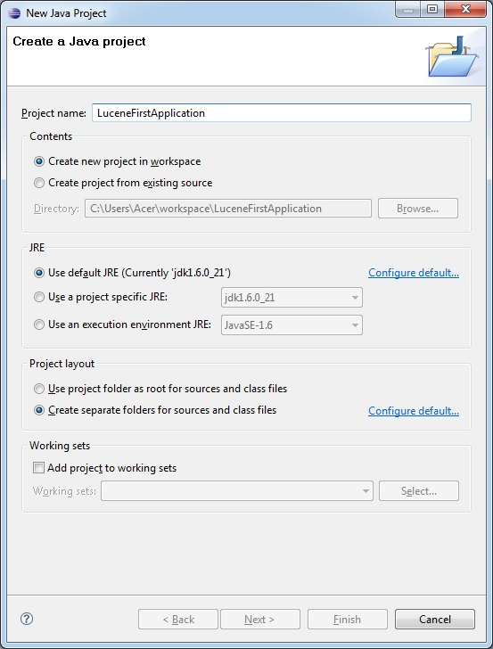
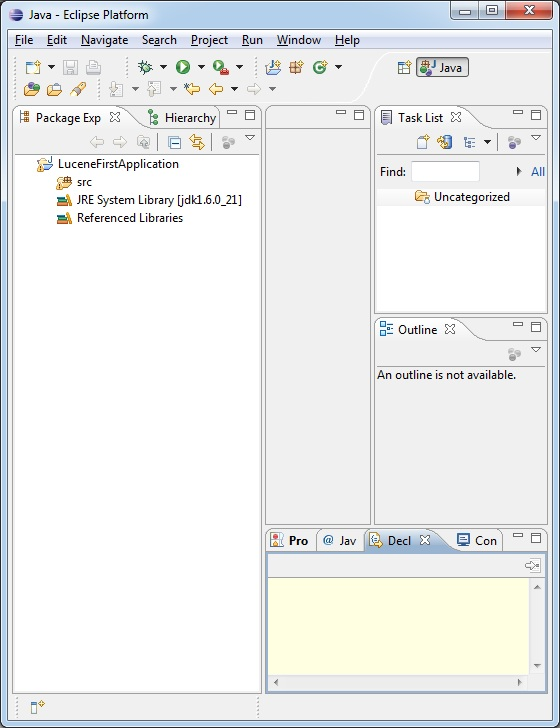
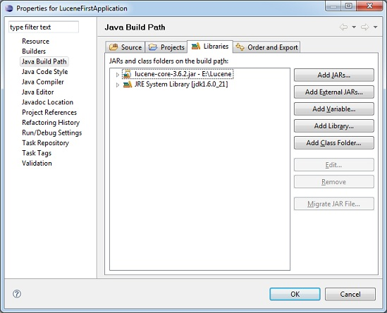
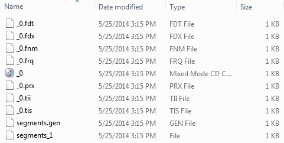

# Lucene第一个应用程序 - Lucene教程

让我们使用Lucene框架做实际编程。在开始使用Lucene框架编写第一个例子之前，必须确保已经安装Lucene的环境正常。也假设有一点点的工作和Eclipse IDE的知识。

因此，开始写一个简单的搜索应用程序将打印找到搜索结果数量。我们也看到在这个过程中创建的索引列表。

## 第1步 - 创建Java项目：

第一步是使用**Eclipse IDE**创建一个简单的Java项目。按照选项 **File -&gt; New -&gt; Project** 最后选择 **Java Project **从向导列表向导。现在，项目命名为 **LuceneFirstApplication** 使用向导窗口，如下所示：



一旦项目成功创建，将有以下内容在 **Project Explorer:**



## 第2步 - 添加必需的库：

作为第二步，我们添加Lucene核心框架库在项目中。要做到这一点，右键单击项目名称LuceneFirstApplication然后按照上下文菜单中提供以下选项：Build Path -&gt; Configure Build Path，显示了Java构建路径如下窗口：



现在，使用添加在库选项卡中提供外部JAR按钮，添加Lucene安装目录下的核心JAR：

*   lucene-core-3.6.2

## 第3步 - 创建源文件：

现在，让我们 **LuceneFirstApplication** 项目下创建实际的源文件。首先，我们需要创建一个名为 **com.yiibai.lucene** 包。要做到这一点，右键单击 src 在包资源管理部分，并按照选项：**New -&gt; Package.**

下一步，我们将创建 LuceneTester.java 和 其他Java类在 **com.yiibai.lucene** 包下。

**LuceneConstants.java**

这个类是用来提供跨示例应用程序中使用的各种常量。

```
package com.yiibai.lucene;

public class LuceneConstants {
   public static final String CONTENTS="contents";
   public static final String FILE_NAME="filename";
   public static final String FILE_PATH="filepath";
   public static final int MAX_SEARCH = 10;
}
```

_TextFileFilter.java_

此类用于为 .txt 文件过滤器

```
package com.yiibai.lucene;

import java.io.File;
import java.io.FileFilter;

public class TextFileFilter implements FileFilter {

   @Override
   public boolean accept(File pathname) {
      return pathname.getName().toLowerCase().endsWith(".txt");
   }
}
```

_Indexer.java_

这个类是用于索引的原始数据，这样我们就可以使用Lucene库，使其可搜索。

```
package com.yiibai.lucene;

import java.io.File;
import java.io.FileFilter;
import java.io.FileReader;
import java.io.IOException;

import org.apache.lucene.analysis.standard.StandardAnalyzer;
import org.apache.lucene.document.Document;
import org.apache.lucene.document.Field;
import org.apache.lucene.index.CorruptIndexException;
import org.apache.lucene.index.IndexWriter;
import org.apache.lucene.store.Directory;
import org.apache.lucene.store.FSDirectory;
import org.apache.lucene.util.Version;

public class Indexer {

   private IndexWriter writer;

   public Indexer(String indexDirectoryPath) throws IOException{
      //this directory will contain the indexes
      Directory indexDirectory = 
         FSDirectory.open(new File(indexDirectoryPath));

      //create the indexer
      writer = new IndexWriter(indexDirectory, 
         new StandardAnalyzer(Version.LUCENE_36),true,
         IndexWriter.MaxFieldLength.UNLIMITED);
   }

   public void close() throws CorruptIndexException, IOException{
      writer.close();
   }

   private Document getDocument(File file) throws IOException{
      Document document = new Document();

      //index file contents
      Field contentField = new Field(LuceneConstants.CONTENTS, 
         new FileReader(file));
      //index file name
      Field fileNameField = new Field(LuceneConstants.FILE_NAME,
         file.getName(),
         Field.Store.YES,Field.Index.NOT_ANALYZED);
      //index file path
      Field filePathField = new Field(LuceneConstants.FILE_PATH,
         file.getCanonicalPath(),
         Field.Store.YES,Field.Index.NOT_ANALYZED);

      document.add(contentField);
      document.add(fileNameField);
      document.add(filePathField);

      return document;
   }   

   private void indexFile(File file) throws IOException{
      System.out.println("Indexing "+file.getCanonicalPath());
      Document document = getDocument(file);
      writer.addDocument(document);
   }

   public int createIndex(String dataDirPath, FileFilter filter) 
      throws IOException{
      //get all files in the data directory
      File[] files = new File(dataDirPath).listFiles();

      for (File file : files) {
         if(!file.isDirectory()
            && !file.isHidden()
            && file.exists()
            && file.canRead()
            && filter.accept(file)
         ){
            indexFile(file);
         }
      }
      return writer.numDocs();
   }
}
```

_Searcher.java_

这个类是用来搜索索引所创建的索引搜索请求的内容。

```
package com.yiibai.lucene;

import java.io.File;
import java.io.IOException;

import org.apache.lucene.analysis.standard.StandardAnalyzer;
import org.apache.lucene.document.Document;
import org.apache.lucene.index.CorruptIndexException;
import org.apache.lucene.queryParser.ParseException;
import org.apache.lucene.queryParser.QueryParser;
import org.apache.lucene.search.IndexSearcher;
import org.apache.lucene.search.Query;
import org.apache.lucene.search.ScoreDoc;
import org.apache.lucene.search.TopDocs;
import org.apache.lucene.store.Directory;
import org.apache.lucene.store.FSDirectory;
import org.apache.lucene.util.Version;

public class Searcher {

   IndexSearcher indexSearcher;
   QueryParser queryParser;
   Query query;

   public Searcher(String indexDirectoryPath) 
      throws IOException{
      Directory indexDirectory = 
         FSDirectory.open(new File(indexDirectoryPath));
      indexSearcher = new IndexSearcher(indexDirectory);
      queryParser = new QueryParser(Version.LUCENE_36,
         LuceneConstants.CONTENTS,
         new StandardAnalyzer(Version.LUCENE_36));
   }

   public TopDocs search( String searchQuery) 
      throws IOException, ParseException{
      query = queryParser.parse(searchQuery);
      return indexSearcher.search(query, LuceneConstants.MAX_SEARCH);
   }

   public Document getDocument(ScoreDoc scoreDoc) 
      throws CorruptIndexException, IOException{
      return indexSearcher.doc(scoreDoc.doc);    
   }

   public void close() throws IOException{
      indexSearcher.close();
   }
}
```

_LuceneTester.java_

这个类是用来测试 Lucene 库的索引和搜索功能。

```
package com.yiibai.lucene;

import java.io.IOException;

import org.apache.lucene.document.Document;
import org.apache.lucene.queryParser.ParseException;
import org.apache.lucene.search.ScoreDoc;
import org.apache.lucene.search.TopDocs;

public class LuceneTester {

   String indexDir = "E:\Lucene\Index";
   String dataDir = "E:\Lucene\Data";
   Indexer indexer;
   Searcher searcher;

   public static void main(String[] args) {
      LuceneTester tester;
      try {
         tester = new LuceneTester();
         tester.createIndex();
         tester.search("Mohan");
      } catch (IOException e) {
         e.printStackTrace();
      } catch (ParseException e) {
         e.printStackTrace();
      }
   }

   private void createIndex() throws IOException{
      indexer = new Indexer(indexDir);
      int numIndexed;
      long startTime = System.currentTimeMillis();    
      numIndexed = indexer.createIndex(dataDir, new TextFileFilter());
      long endTime = System.currentTimeMillis();
      indexer.close();
      System.out.println(numIndexed+" File indexed, time taken: "
         +(endTime-startTime)+" ms");        
   }

   private void search(String searchQuery) throws IOException, ParseException{
      searcher = new Searcher(indexDir);
      long startTime = System.currentTimeMillis();
      TopDocs hits = searcher.search(searchQuery);
      long endTime = System.currentTimeMillis();

      System.out.println(hits.totalHits +
         " documents found. Time :" + (endTime - startTime));
      for(ScoreDoc scoreDoc : hits.scoreDocs) {
         Document doc = searcher.getDocument(scoreDoc);
            System.out.println("File: "
            + doc.get(LuceneConstants.FILE_PATH));
      }
      searcher.close();
   }
}
```

## 第4步- 创建数据和索引目录

把 record1.txt 任命为 record10.txt 包含简单的名称以及学生的其他数据信息，并把它们放在目录：E:LuceneData 并测试数据。索引目录路径应创建在 E:LuceneIndex。运行此程序后，就可以看到该文件夹中创建的索引文件的列表。

## 第5步 - 运行程序：

一旦完成创建源和原始数据，数据目录和索引目录，下一步是编译和运行程序。要做到这一点，请LuceneTester.Java文件的活动选项卡中使用EclipseIDE可无论是运行选项，或使用Ctrl+ F11来编译和运行应用程序LuceneTester。如果一切正常您的应用程序，这将打印在 Eclipse IDE 控制台以下消息：

```
Indexing E:LuceneData
ecord1.txt
Indexing E:LuceneData
ecord10.txt
Indexing E:LuceneData
ecord2.txt
Indexing E:LuceneData
ecord3.txt
Indexing E:LuceneData
ecord4.txt
Indexing E:LuceneData
ecord5.txt
Indexing E:LuceneData
ecord6.txt
Indexing E:LuceneData
ecord7.txt
Indexing E:LuceneData
ecord8.txt
Indexing E:LuceneData
ecord9.txt
10 File indexed, time taken: 109 ms
1 documents found. Time :0
File: E:LuceneData
ecord4.txt

```

一旦已经成功地运行程序，将有以下的索引目录中的内容：



