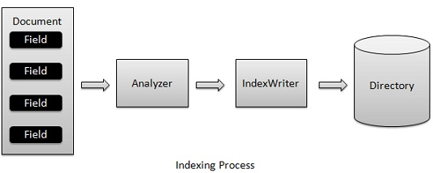

# Lucene索引过程 - Lucene教程

索引过程是Lucene提供的核心功能之一。下图说明了索引过程和使用的类。IndexWriter是索引过程中最重要的和核心组件。



添加文档包含字段IndexWriter，该分析用分析仪分析文件，然后创建/根据需要并在目录存储/更新/打开/编辑索引。IndexWriter用于更新或创建索引。它不是用来读取索引。

现在，展示一个循序渐进的过程，以获得在索引过程的理解，使用一个基本的例子。

## 创建一个文档

*   创建一个方法来获取从文本文件中获得 Lucene 的文档。

*   创建各种类型的是含有键作为名称和值作为内容被编入索引键值对字段。

*   设置字段中进行分析或不设置。在我们的实例中，只有内容被分析，因为它可能包含数据，诸如 a, am, are, an，它不要求在搜索操作等等。

*   新创建的字段添加到文档对象并返回给调用者的方法。

```
private Document getDocument(File file) throws IOException{
   Document document = new Document();

   //index file contents
   Field contentField = new Field(LuceneConstants.CONTENTS, 
      new FileReader(file));
   //index file name
   Field fileNameField = new Field(LuceneConstants.FILE_NAME,
      file.getName(),
      Field.Store.YES,Field.Index.NOT_ANALYZED);
   //index file path
   Field filePathField = new Field(LuceneConstants.FILE_PATH,
      file.getCanonicalPath(),
      Field.Store.YES,Field.Index.NOT_ANALYZED);

   document.add(contentField);
   document.add(fileNameField);
   document.add(filePathField);

   return document;
}   
```

## 创建IndexWriter

*   IndexWriter 类作为它创建/在索引过程中更新指标的核心组成部分

*   创建一个 IndexWriter 对象

*   创建其应指向位置，其中索引是存储一个lucene的目录

*   初始化索引目录，有标准的分析版本信息和其他所需/可选参数创建 IndexWriter 对象

```
private IndexWriter writer;

public Indexer(String indexDirectoryPath) throws IOException{
   //this directory will contain the indexes
   Directory indexDirectory = 
      FSDirectory.open(new File(indexDirectoryPath));
   //create the indexer
   writer = new IndexWriter(indexDirectory, 
      new StandardAnalyzer(Version.LUCENE_36),true,
      IndexWriter.MaxFieldLength.UNLIMITED);
}
```

## 开始索引过程

```
private void indexFile(File file) throws IOException{
   System.out.println("Indexing "+file.getCanonicalPath());
   Document document = getDocument(file);
   writer.addDocument(document);
}
```

## 应用程序示例

让我们创建一个测试 Lucene 应用程序来测试索引过程。

| 步骤 | 描述 |
| --- | --- |
| 1 | 在 packagecom.yiibai.lucene 包下创建一个名称 LuceneFirstApplication 项目用于解释 Lucene - First Application chapter, 也可以使用 Lucene 的创建项目 -  在 First Application 章这样本章理解索引过程。 |
| 2 | 创建LuceneConstants.java，TextFileFilter.java和 Indexer.java，其它的文件保存不变。 |
| 3 | 创建LuceneTester.java如下所述 |
| 4 | 清理和构建应用程序，以确保业务逻辑按要求 |

_LuceneConstants.java_

这个类是用来提供跨示例应用程序中使用的各种常量

```
package com.yiibai.lucene;

public class LuceneConstants {
   public static final String CONTENTS="contents";
   public static final String FILE_NAME="filename";
   public static final String FILE_PATH="filepath";
   public static final int MAX_SEARCH = 10;
}
```

_TextFileFilter.java_

此类用于为 .txt 文件过滤器

```
package com.yiibai.lucene;

import java.io.File;
import java.io.FileFilter;

public class TextFileFilter implements FileFilter {

   @Override
   public boolean accept(File pathname) {
      return pathname.getName().toLowerCase().endsWith(".txt");
   }
}
```

_Indexer.java_

这个类是用于索引的原始数据，这样就可以使用Lucene库，使其可搜索。

```
package com.yiibai.lucene;

import java.io.File;
import java.io.FileFilter;
import java.io.FileReader;
import java.io.IOException;

import org.apache.lucene.analysis.standard.StandardAnalyzer;
import org.apache.lucene.document.Document;
import org.apache.lucene.document.Field;
import org.apache.lucene.index.CorruptIndexException;
import org.apache.lucene.index.IndexWriter;
import org.apache.lucene.store.Directory;
import org.apache.lucene.store.FSDirectory;
import org.apache.lucene.util.Version;

public class Indexer {

   private IndexWriter writer;

   public Indexer(String indexDirectoryPath) throws IOException{
      //this directory will contain the indexes
      Directory indexDirectory = 
         FSDirectory.open(new File(indexDirectoryPath));

      //create the indexer
      writer = new IndexWriter(indexDirectory, 
         new StandardAnalyzer(Version.LUCENE_36),true,
         IndexWriter.MaxFieldLength.UNLIMITED);
   }

   public void close() throws CorruptIndexException, IOException{
      writer.close();
   }

   private Document getDocument(File file) throws IOException{
      Document document = new Document();

      //index file contents
      Field contentField = new Field(LuceneConstants.CONTENTS, 
         new FileReader(file));
      //index file name
      Field fileNameField = new Field(LuceneConstants.FILE_NAME,
         file.getName(),
         Field.Store.YES,Field.Index.NOT_ANALYZED);
      //index file path
      Field filePathField = new Field(LuceneConstants.FILE_PATH,
         file.getCanonicalPath(),
         Field.Store.YES,Field.Index.NOT_ANALYZED);

      document.add(contentField);
      document.add(fileNameField);
      document.add(filePathField);

      return document;
   }   

   private void indexFile(File file) throws IOException{
      System.out.println("Indexing "+file.getCanonicalPath());
      Document document = getDocument(file);
      writer.addDocument(document);
   }

   public int createIndex(String dataDirPath, FileFilter filter) 
      throws IOException{
      //get all files in the data directory
      File[] files = new File(dataDirPath).listFiles();

      for (File file : files) {
         if(!file.isDirectory()
            && !file.isHidden()
            && file.exists()
            && file.canRead()
            && filter.accept(file)
         ){
            indexFile(file);
         }
      }
      return writer.numDocs();
   }
}
```

_LuceneTester.java_

这个类是用来测试 Lucene 库的索引能力。

```
package com.yiibai.lucene;

import java.io.IOException;

public class LuceneTester {

   String indexDir = "E:\Lucene\Index";
   String dataDir = "E:\Lucene\Data";
   Indexer indexer;

   public static void main(String[] args) {
      LuceneTester tester;
      try {
         tester = new LuceneTester();
         tester.createIndex();
      } catch (IOException e) {
         e.printStackTrace();
      } 
   }

   private void createIndex() throws IOException{
      indexer = new Indexer(indexDir);
      int numIndexed;
      long startTime = System.currentTimeMillis();    
      numIndexed = indexer.createIndex(dataDir, new TextFileFilter());
      long endTime = System.currentTimeMillis();
      indexer.close();
      System.out.println(numIndexed+" File indexed, time taken: "
         +(endTime-startTime)+" ms");        
   }
}
```

## 数据和索引目录的创建

从 record1.txt 命名文件 record10.txt 包含简单的名称以及学生的其他细节，并把它们放在目录 E:LuceneData.  索引目录路径应创建为 E:LuceneIndex. 运行此程序后，就可以看到该文件夹中创建的索引文件的列表。

## 运行程序：

一旦使用创建源，创造了原始数据，数据目录和索引目录来完成，准备好这一步然后编译和运行程序。要做到这一点，保存LuceneTester.Java文件选项卡中使用Eclipse IDE 运行 Run 选项，或使用Ctrl+ F11来编译和运行应用程序LuceneTester。如果应用程序一切正常，这将打印在Eclipse IDE的控制台以下消息：

```
Indexing E:LuceneData
ecord1.txt
Indexing E:LuceneData
ecord10.txt
Indexing E:LuceneData
ecord2.txt
Indexing E:LuceneData
ecord3.txt
Indexing E:LuceneData
ecord4.txt
Indexing E:LuceneData
ecord5.txt
Indexing E:LuceneData
ecord6.txt
Indexing E:LuceneData
ecord7.txt
Indexing E:LuceneData
ecord8.txt
Indexing E:LuceneData
ecord9.txt
10 File indexed, time taken: 109 ms

```

一旦成功地运行程序，将有以下的索引目录中的内容：


