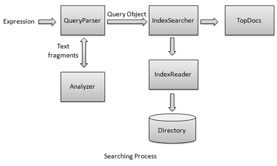

# Lucene搜索操作 - Lucene教程

搜索过程是由Lucene所提供的核心功能之一。下图说明了搜索过程和使用的类。 IndexSearcher是搜索过程中最重要的和核心组件。



我们首先创建目录包含索引，然后将它传递给IndexSearcher，它使用IndexReader打开目录。然后，创建一个期限查询，使搜索usingIndexSearcher通过将查询到的搜索。 IndexSearcher返回TopDocs对象包含搜索信息连同它是搜索操作的结果的文档的文档ID(多个)。

现在，我们将展示一个循序渐进的过程，以获得在索引过程的理解，使用一个基本的例子。

## 创建QueryParser

*   QueryParser类解析用户输入，并输入到 Lucene 理解的格式的查询。

*   创建QueryParser的对象。

*   初始化一个在此查询运行有标准的分析版本信息和索引的名字创建QueryParser对象。

```
QueryParser queryParser;

public Searcher(String indexDirectoryPath) throws IOException{

   queryParser = new QueryParser(Version.LUCENE_36,
      LuceneConstants.CONTENTS,
         new StandardAnalyzer(Version.LUCENE_36));
}
```

## 创建IndexSearcher

*   IndexSearcher类作为它在索引过程中创建搜索索引的核心组成部分。

*   创建IndexSearcher对象。

*   创建其应指向位置，其中索引是存储一个 lucene 的目录。

*   初始化索引目录中创建 IndexSearcher 的对象

```
IndexSearcher indexSearcher;

public Searcher(String indexDirectoryPath) throws IOException{
   Directory indexDirectory = 
      FSDirectory.open(new File(indexDirectoryPath));
   indexSearcher = new IndexSearcher(indexDirectory);
}
```

## 搜索

*   要开始搜索，通过 QueryParser 解析搜索表达式创建一个查询对象。

*   通过调用IndexSearcher.search()方法搜索。

```
Query query;

public TopDocs search( String searchQuery) throws IOException, ParseException{
   query = queryParser.parse(searchQuery);
   return indexSearcher.search(query, LuceneConstants.MAX_SEARCH);
}
```

## 获取文件

```
public Document getDocument(ScoreDoc scoreDoc) 
   throws CorruptIndexException, IOException{
   return indexSearcher.doc(scoreDoc.doc);    
}
```

## 关闭IndexSearcher

```
public void close() throws IOException{
   indexSearcher.close();
}
```

## 应用程序示例

让我们创建一个测试Lucene的应用程序来测试搜索过程。

| 步骤 | 描述 |
| --- | --- |
| 1 | 创建下名称为LuceneFirstApplication的一个项目作为解释Lucene的应用在包packagecom.yiibai.lucene下，在第一个应用程序的篇章。也可以使用Lucene创建的项目理解搜索过程。 |
| 2 | 创建LuceneConstants.java，TextFileFilter.java和Searcher.java 用于 Lucene解释- 在第一应用章节。其它文件保持不变。 |
| 3 | 创建LuceneTester.java如下所述。 |
| 4 | 清理和构建应用程序，以确保业务逻辑按要求工作。 |

_LuceneConstants.java_

这个类是用来提供可应用于示例应用程序中使用的各种常量。

```
package com.yiibai.lucene;

public class LuceneConstants {
   public static final String CONTENTS="contents";
   public static final String FILE_NAME="filename";
   public static final String FILE_PATH="filepath";
   public static final int MAX_SEARCH = 10;
}
```

_TextFileFilter.java_

此类用于 .txt文件过滤器。

```
package com.yiibai.lucene;

import java.io.File;
import java.io.FileFilter;

public class TextFileFilter implements FileFilter {

   @Override
   public boolean accept(File pathname) {
      return pathname.getName().toLowerCase().endsWith(".txt");
   }
}
```

_Searcher.java_

这个类用来读取就使用Lucene库的原始数据，并搜索数据的索引。

```
package com.yiibai.lucene;

import java.io.File;
import java.io.IOException;

import org.apache.lucene.analysis.standard.StandardAnalyzer;
import org.apache.lucene.document.Document;
import org.apache.lucene.index.CorruptIndexException;
import org.apache.lucene.queryParser.ParseException;
import org.apache.lucene.queryParser.QueryParser;
import org.apache.lucene.search.IndexSearcher;
import org.apache.lucene.search.Query;
import org.apache.lucene.search.ScoreDoc;
import org.apache.lucene.search.TopDocs;
import org.apache.lucene.store.Directory;
import org.apache.lucene.store.FSDirectory;
import org.apache.lucene.util.Version;

public class Searcher {

   IndexSearcher indexSearcher;
   QueryParser queryParser;
   Query query;

   public Searcher(String indexDirectoryPath) throws IOException{
      Directory indexDirectory = 
         FSDirectory.open(new File(indexDirectoryPath));
      indexSearcher = new IndexSearcher(indexDirectory);
      queryParser = new QueryParser(Version.LUCENE_36,
         LuceneConstants.CONTENTS,
         new StandardAnalyzer(Version.LUCENE_36));
   }

   public TopDocs search( String searchQuery) 
      throws IOException, ParseException{
      query = queryParser.parse(searchQuery);
      return indexSearcher.search(query, LuceneConstants.MAX_SEARCH);
   }

   public Document getDocument(ScoreDoc scoreDoc) 
      throws CorruptIndexException, IOException{
     return indexSearcher.doc(scoreDoc.doc);    
   }

   public void close() throws IOException{
      indexSearcher.close();
   }
}
```

_LuceneTester.java_

这个类是用来测试 Lucene 库的搜索能力。

```
package com.yiibai.lucene;

import java.io.IOException;

import org.apache.lucene.document.Document;
import org.apache.lucene.queryParser.ParseException;
import org.apache.lucene.search.ScoreDoc;
import org.apache.lucene.search.TopDocs;

public class LuceneTester {

   String indexDir = "E:\Lucene\Index";
   String dataDir = "E:\Lucene\Data";
   Searcher searcher;

   public static void main(String[] args) {
      LuceneTester tester;
      try {
         tester = new LuceneTester();
         tester.search("Mohan");
      } catch (IOException e) {
         e.printStackTrace();
      } catch (ParseException e) {
         e.printStackTrace();
      }
   }

   private void search(String searchQuery) throws IOException, ParseException{
      searcher = new Searcher(indexDir);
      long startTime = System.currentTimeMillis();
      TopDocs hits = searcher.search(searchQuery);
      long endTime = System.currentTimeMillis();

      System.out.println(hits.totalHits +
         " documents found. Time :" + (endTime - startTime) +" ms");
      for(ScoreDoc scoreDoc : hits.scoreDocs) {
         Document doc = searcher.getDocument(scoreDoc);
         System.out.println("File: "+ doc.get(LuceneConstants.FILE_PATH));
      }
      searcher.close();
   }    
}
```

## 数据和索引目录的创建

从record1.txt到record10.txt的文件中包含简单的名称以及学生的其他细节，并把它们放在目录E:LuceneData。这是测试数据。索引目录路径应创建为E:LuceneIndex。期间，运行 Lucene索引程序后- 索引过程中，可以看到该文件夹中创建的索引文件的列表。

## 运行程序：

一旦创建源，创造了原始数据，数据目录，索引目录和索引完成后，已经准备好这一步是编译和运行程序。要做到这一点，请LuceneTester.Java文件选项卡中使用Eclipse IDE可使用Run选项，或使用Ctrl+ F11来编译和运行应用程序LuceneTester。如果您的应用程序一切正常，这将在Eclipse IDE的控制台打印以下消息：

```
1 documents found. Time :29 ms
File: E:LuceneData
ecord4.txt
```

