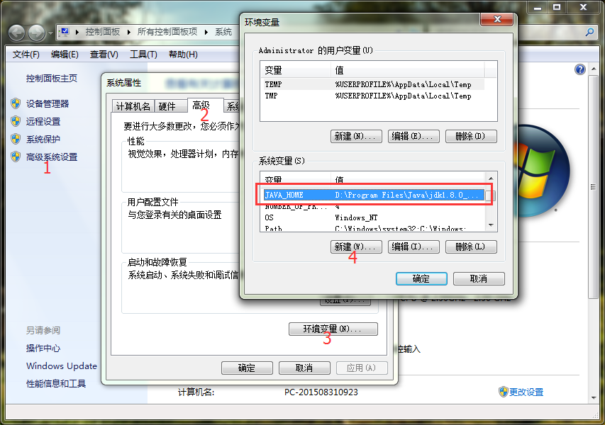
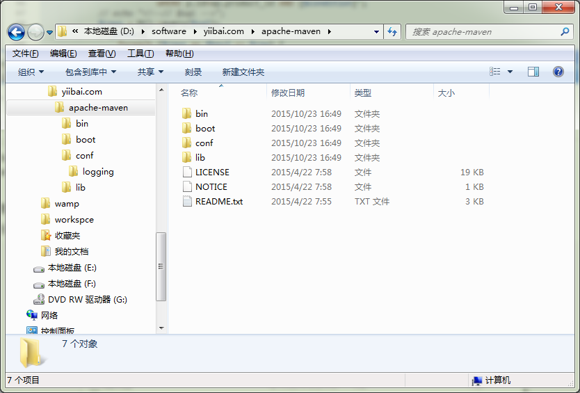
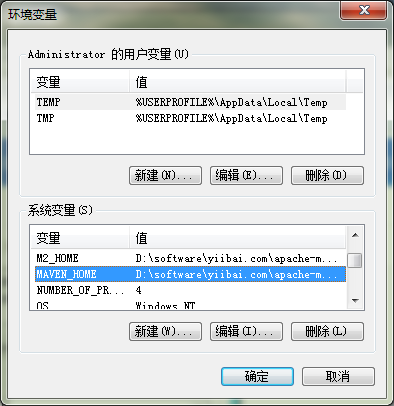
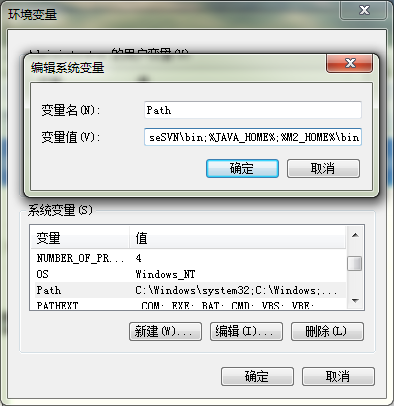

# Maven安装配置 - Maven教程

想要安装 [Apache Maven](http://maven.apache.org/) 在Windows 系统上, 只需要下载 Maven 的 zip 文件，并将其解压到你想安装的目录，并配置 Windows 环境变量。

所需工具 ：

1.  JDK 1.8
2.  Maven 3.3.3
3.  Windows 7

注
Maven 3.2 要求 JDK 1.6 或以上版本, 而Maven 3.0/3.1 需要 JDK 1.5 或以上

## 1\. JDK 和 JAVA_HOME

确保已安装JDK，并 “JAVA_HOME” 变量已加入作为 Windows 环境变量。



操作要以按上面数字顺序，在这个教程中，安装的 JDK 是 JDK1.8，为了方便学习，建议你也安装使用 JDK1.8。

## 2\. 下载Apache Maven

访问 [Maven官方网站](http://maven.apache.org/download.cgi)，打开后找到下载链接，如下：


下载 Maven 的 zip 文件，例如： [apache-maven-3.3.3-bin.zip](http://mirrors.cnnic.cn/apache/maven/maven-3/3.3.3/binaries/apache-maven-3.3.3-bin.zip)，将它解压到你要安装 Maven 的文件夹。

假设你解压缩到这个文件夹 –  D:\software\yiibai.com\apache-maven



注意：在这一步，只是文件夹和文件，安装不是必需的

## 3\. 添加 M2_HOME 和 MAVEN_HOME

添加 M2_HOME 和 MAVEN_HOME 环境变量在Windows，并将其指向你的 Maven 文件夹。




M2_HOME 或 MAVEN_HOME
Maven 说只是添加 M2_HOME , 但一些项目仍引用 Maven 的文件夹 MAVEN_HOME, 因此，为了安全也把它添加进去。

## 4\. 添加到环境变量 - PATH

更新 PATH 变量，添加 Maven bin 文件夹到 PATH 的最后 – %M2_HOME%\bin, 这样就可以到处运行 Maven 命令了。




## 5\. 验证

完成，以验证它，执行 mvn –version 在命令提示符下，如下图输出结果：

```
C:\Users\Administrator>mvn -version
Apache Maven 3.3.3 (7994120775791599e205a5524ec3e0dfe41d4a06; 2015-04-22T19:57:3
7+08:00)
Maven home: D:\software\yiibai.com\apache-maven
Java version: 1.8.0_40, vendor: Oracle Corporation
Java home: D:\Program Files\Java\jdk1.8.0_40
Default locale: zh_CN, platform encoding: GBK
OS name: "windows 7", version: "6.1", arch: "amd64", family: "dos"
```

如果你看到类似消息，表示 Apache Maven 在 Windows 上已安装成功。

