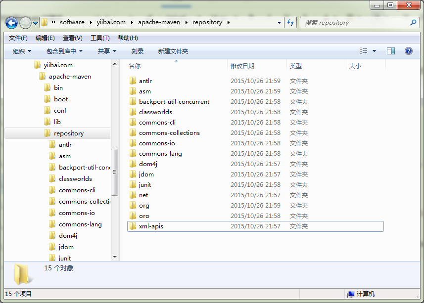

# Maven本地资源库 - Maven教程

Maven的本地资源库是用来存储所有项目的依赖关系(插件jar和其他文件，这些文件被Maven下载)到本地文件夹。很简单，当你建立一个Maven项目，所有相关文件将被存储在你的Maven本地仓库。

默认情况下，Maven的本地资源库默认为 .m2 目录文件夹：

1.  Unix/Mac OS X – ~/.m2
2.  Windows – C:\Documents and Settings\{your-username}\.m2

## 1\. 更新Maven的本地库

通常情况下，可改变默认的 .m2 目录下的默认本地存储库文件夹到其他更有意义的名称，例如， maven-repo

找到 {M2_HOME}\conf\setting.xml, 更新 localRepository 到其它名称。

{M2_HOME}\conf\setting.xml

```
<settings><!-- localRepository
   | The path to the local repository maven will use to store artifacts.
   |
   | Default: ~/.m2/repository
  <localRepository>/path/to/local/repo</localRepository>
  --><localRepository>D:\software\yiibai.com\apache-maven\repository</localRepository>
```

## 2\. 保存文件

执行之后，新的 Maven 本地存储库现在改为 D:\software\yiibai.com\apache-maven\repository.

执行命令：

```
C:\worksp> mvn archetype:generate -DgroupId=com.yiibai -DartifactId=NumberGenerator -DarchetypeArtifactId=maven-archetype-quickstart -DinteractiveMode=false
```

详见如下图：



