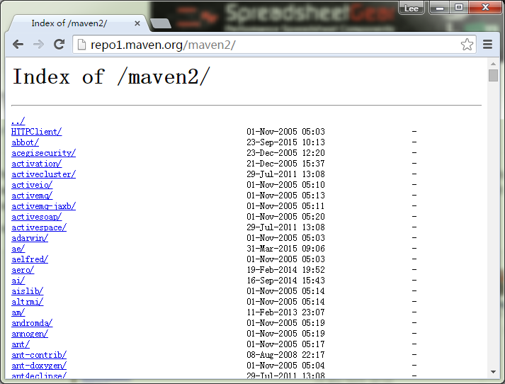
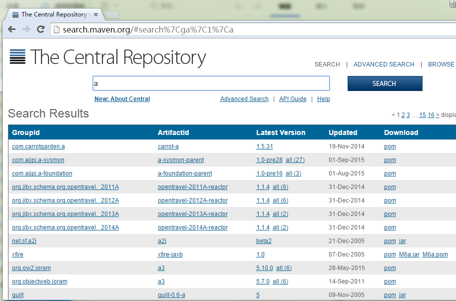

# Maven中央存储库 - Maven教程

当你建立一个 Maven 的项目，Maven 会检查你的 pom.xml 文件，以确定哪些依赖下载。首先，Maven 将从本地资源库获得 Maven 的本地资源库依赖资源，如果没有找到，然后把它会从默认的 Maven 中央存储库 – [http://repo1.maven.org/maven2/](http://repo1.maven.org/maven/) 查找下载。

Maven 的中央资源库网站是这样的：

Maven中心储存库网站已经改版本，目录浏览可能不再使用。这将直接被重定向到 [http://search.maven.org/](http://search.maven.org/)。这就好多了，现在有一个搜索功能：

PS：目录浏览功能被禁用，但是，当你建立 Maven 的项目，它仍然会从 “http://repo1.maven.org/maven/” 得到依赖, 您可以从 Maven 验证输出。

