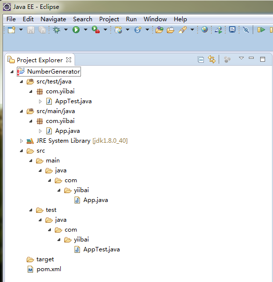
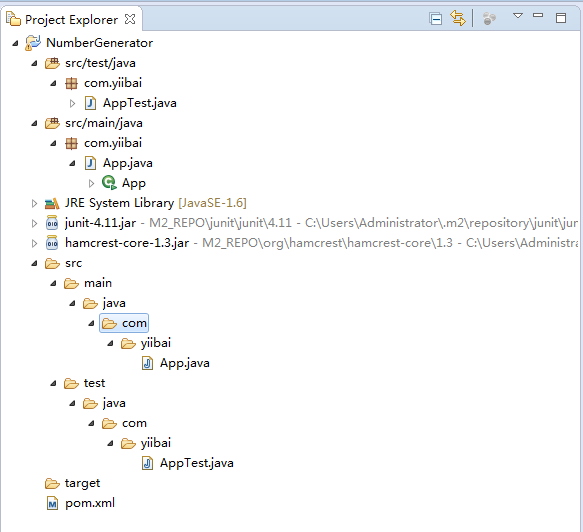

# 使用Maven创建Java项目 - Maven教程

在本教程中，我们将向你展示如何使用 Maven 来创建一个 Java 项目，导入其到Eclipse IDE，并打包 Java 项目到一个 JAR 文件。

所需要的工具：

1.  Maven 3.3.3
2.  Eclipse 4.2
3.  JDK 8

注意：请确保 Maven 是正确安装和配置（在Windows，*nix，Mac OSX系统中），然后再开始本教程，避免 mvn 命令未找到错误。

## 1\. 从 Maven 模板创建一个项目

在终端（* UNIX或Mac）或命令提示符（Windows）中，浏览到要创建 Java 项目的文件夹。键入以下命令：

```
mvn archetype:generate -DgroupId={project-packaging} -DartifactId={project-name}-DarchetypeArtifactId=maven-archetype-quickstart -DinteractiveMode=false
```

这告诉 Maven 来从 maven-archetype-quickstart 模板创建 Java 项目。如果忽视 archetypeArtifactId 选项，一个巨大的 Maven 模板列表将列出。

例如，这里的工作目录是：C:\worksp，执行命令过程时间可能比较久，看个人的网络状况。

```
C:\worksp>mvn archetype:generate -DgroupId=com.yiibai -DartifactId=NumberGenerat
or -DarchetypeArtifactId=maven -archetype-quickstart -DinteractiveMode=false
[INFO] Scanning for projects...
[INFO]
[INFO] ------------------------------------------------------------------------
[INFO] Building Maven Stub Project (No POM) 1
[INFO] ------------------------------------------------------------------------
[INFO]
[INFO] >>> maven-archetype-plugin:2.4:generate (default-cli) > generate-sources
@ standalone-pom >>>
[INFO]
[INFO] <<< maven-archetype-plugin:2.4:generate (default-cli) < generate-sources
@ standalone-pom <<<
[INFO]
[INFO] --- maven-archetype-plugin:2.4:generate (default-cli) @ standalone-pom --
-
[INFO] Generating project in Batch mode
[INFO] -------------------------------------------------------------------------
---
[INFO] Using following parameters for creating project from Old (1.x) Archetype:
 maven-archetype-quickstart:1.0
[INFO] -------------------------------------------------------------------------
---
[INFO] Parameter: basedir, Value: C:\worksp
[INFO] Parameter: package, Value: com.yiibai
[INFO] Parameter: groupId, Value: com.yiibai
[INFO] Parameter: artifactId, Value: NumberGenerator
[INFO] Parameter: packageName, Value: com.yiibai
[INFO] Parameter: version, Value: 1.0-SNAPSHOT
[INFO] project created from Old (1.x) Archetype in dir: C:\worksp\NumberGenerato
r
[INFO] ------------------------------------------------------------------------
[INFO] BUILD SUCCESS
[INFO] ------------------------------------------------------------------------
[INFO] Total time: 23.166 s
[INFO] Finished at: 2015-10-27T11:03:48+08:00
[INFO] Final Memory: 17M/114M
[INFO] ------------------------------------------------------------------------
```

在上述情况下，一个新的Java项目命名 “NumberGenerator”, 而整个项目的目录结构会自动创建。

**注意**
有少数用户说 mvn archetype:generate 命令未能生成项目结构。 如果您有任何类似的问题，不用担心，只需跳过此步骤，手动创建文件夹，请参阅步骤2的项目结构。

## 2.Maven目录布局

使用 mvn archetype:generate + maven-archetype-quickstart 模板, 以下项目的目录结构被创建。

```
NumberGenerator
   |-src
   |---main
   |-----java
   |-------com
   |---------yiibai   
   |-----------App.java
   |---test|-----java
   |-------com
   |---------yiibai
   |-----------AppTest.java
   |-pom.xml
```

很简单的，所有的源代码放在文件夹 /src/main/java/, 所有的单元测试代码放入 /src/test/java/.

**注意，请阅读** [Maven标准目录布局](http://maven.apache.org/guides/introduction/introduction-to-the-standard-directory-layout.html)

附加的一个标准的 pom.xml 被生成。这个POM文件类似于 Ant build.xml 文件，它描述了整个项目的信息，一切从目录结构，项目的插件，项目依赖，如何构建这个项目等，请阅读[POM官方指南](http://maven.apache.org/guides/introduction/introduction-to-the-pom.html) 

pom.xml

## 3\. Eclipse IDE

为了使它成为一个 Eclipse 项目，在终端进入到 “NumberGenerator” 项目，键入以下命令：

```
C:\worksp\NumberGenerator>mvn eclipse:eclipse
.... ...
[INFO] Using Eclipse Workspace: null
[INFO] Adding default classpath container: org.eclipse.jdt.launching.JRE_CONTAIN
ER
[INFO] Not writing settings - defaults suffice
[INFO] Wrote Eclipse project for "NumberGenerator" to C:\worksp\NumberGenerator.
[INFO]
[INFO] ------------------------------------------------------------------------
[INFO] BUILD SUCCESS
[INFO] ------------------------------------------------------------------------
[INFO] Total time: 04:47 min
[INFO] Finished at: 2015-10-27T15:24:48+08:00
[INFO] Final Memory: 15M/164M
[INFO] ------------------------------------------------------------------------
```

执行以上命令后，它自动下载更新相关资源和配置信息（需要等待一段时间），并产生 Eclipse IDE所要求的所有项目文件。要导入项目到Eclipse IDE中，选择 “File -&gt; Import… -&gt; General-&gt;Existing Projects into Workspace”

图片: 项目导入到 Eclipse IDE中。




## 4\. 更新POM

默认的 pom.xml 太简单了，很多时候，你需要添加编译器插件来告诉 Maven 使用哪个 JDK 版本是用来编译项目。（默认JDK1.4，这的确太旧了点）

```
      <plugin>
        <groupId>org.apache.maven.plugins</groupId>
        <artifactId>maven-compiler-plugin</artifactId>
        <version>2.3.2</version>
        <configuration>
            <source>1.6</source>
            <target>1.6</target>
        </configuration>
    </plugin>
```

从更新JUnit 3.8.1到最新的 4.11。

```
<dependency>
    <groupId>junit</groupId>
    <artifactId>junit</artifactId>
    <version>4.11</version>
    <scope>test</scope>
</dependency>
```

**Maven 坐标**
上面的XML代码片段被称为“Maven坐标”，如果你需要 JUnit 的 jar，你需要找出其相应的 Maven 坐标。它适用于所有其他的依赖，如Spring，Hibernate，Apache 普通的等，只要到[Maven中心储存库](http://search.maven.org/)，并找出哪些是依赖正确的 Maven 坐标。pom.xml – 更新版本

```
<project xmlns="http://maven.apache.org/POM/4.0.0" 
    xmlns:xsi="http://www.w3.org/2001/XMLSchema-instance"
    xsi:schemaLocation="http://maven.apache.org/POM/4.0.0 
    http://maven.apache.org/maven-v4_0_0.xsd">
    <modelVersion>4.0.0</modelVersion>
    <groupId>com.mkyong</groupId>
    <artifactId>NumberGenerator</artifactId>
    <packaging>jar</packaging>
    <version>1.0-SNAPSHOT</version>
    <name>NumberGenerator</name>
    <url>http://maven.apache.org</url>
    <dependencies>
        <dependency>
            <groupId>junit</groupId>
            <artifactId>junit</artifactId>
            <version>4.11</version>
            <scope>test</scope>
        </dependency>
    </dependencies>

    <build>
      <plugins>
        <plugin>
            <groupId>org.apache.maven.plugins</groupId>
            <artifactId>maven-compiler-plugin</artifactId>
            <version>2.3.2</version>
            <configuration>
                <source>1.6</source>
                <target>1.6</target>
            </configuration>
        </plugin>
      </plugins>
    </build>

</project>
```

在终端，再次发出同样的命令 mvn eclipse:eclipse ,Maven将从Maven中心储存库下载插件项目依赖关系（JUnit），它会自动保存到你的本地仓库。

## 5\. 更新业务逻辑

测试驱动开发（TDD），先更新单元测试，以确保应用程序（APP）对象有一个方法来生成包含恰好36位字母表的唯一密钥。

AppTest.java

```
package com.yiibai;

import org.junit.Assert;
import org.junit.Test;

public class AppTest {

    @Test
    public void testLengthOfTheUniqueKey() {

        App obj = new App();
        Assert.assertEquals(36, obj.generateUniqueKey().length());

    }
}
```

完成业务逻辑。

App.java

```
package com.yiibai;

import java.util.UUID;

/**
 * Generate a unique number
 *
 */
public class App 
{

    public static void main( String[] args )
    {
        App obj = new App();
        System.out.println("Unique ID : " + obj.generateUniqueKey());
    }

    public String generateUniqueKey(){

        String id = UUID.randomUUID().toString();
        return id;

    }
}
```

## 6\. Maven 打包

现在，我们将使用Maven这个项目，并输出编译成一个 “jar” 的文件。 请参考 pom.xml 文件，包元素定义应该包应该输出什么。

pom.xml

```
<project ...>
    <modelVersion>4.0.0</modelVersion>
    <groupId>com.yiibai</groupId>
    <artifactId>NumberGenerator</artifactId>    
    <packaging>jar</packaging>    
    <version>1.0-SNAPSHOT</version>
```

在终端输入 mvn package :

```
C:\worksp\NumberGenerator> mvn package
... ...
ha-2/classworlds-1.1-alpha-2.jar (37 KB at 20.2 KB/sec)
Downloaded: [https://repo.maven.apache.org/maven2/org/codehaus/plexus/plexus-io/2](https://repo.maven.apache.org/maven2/org/codehaus/plexus/plexus-io/2) .0.2/plexus-io-2.0.2.jar (57 KB at 28.1 KB/sec)
Downloaded: [https://repo.maven.apache.org/maven2/org/codehaus/plexus/plexus-inte](https://repo.maven.apache.org/maven2/org/codehaus/plexus/plexus-inte) rpolation/1.15/plexus-interpolation-1.15.jar (60 KB at 21.4 KB/sec)
Downloaded: [https://repo.maven.apache.org/maven2/org/codehaus/plexus/plexus-arch](https://repo.maven.apache.org/maven2/org/codehaus/plexus/plexus-arch) iver/2.1/plexus-archiver-2.1.jar (181 KB at 61.5 KB/sec)
Downloaded: [https://repo.maven.apache.org/maven2/org/codehaus/plexus/plexus-util](https://repo.maven.apache.org/maven2/org/codehaus/plexus/plexus-util) s/3.0/plexus-utils-3.0.jar (221 KB at 60.3 KB/sec)
[INFO] Building jar: C:\worksp\NumberGenerator\target\NumberGenerator-1.0-SNAPSH
OT.jar
[INFO] ------------------------------------------------------------------------
[INFO] BUILD SUCCESS
[INFO] ------------------------------------------------------------------------
[INFO] Total time: 01:00 min
[INFO] Finished at: 2015-10-27T20:00:17+08:00
[INFO] Final Memory: 10M/54M
[INFO] ------------------------------------------------------------------------
```

它编译，运行单元测试并打包项目成一个 jar 文件，并把它放在 project/target 文件夹。如果出错：**ERROR: Unable to locate the Javac Compiler in:,  C:\Program Files (x86)\Java\jre6\..\lib\tools.jar,Please ensure you are using JDK 1.4 or above and,not a JRE (the com.sun.tools.javac.Main class is required)...**

参考：[http://my.oschina.net/u/1449336/blog/199802](http://my.oschina.net/u/1449336/blog/199802)

 最终项目的目录结构, 如下图片 :




## 7\. 示例

从项目的 jar 文件运行应用程序示例

```
C:\worksp\NumberGenerator>java -cp target/NumberGenerator-1.0-SNAPSHOT.jar com.y
iibai.App
Unique ID : 94e5fd1a-c038-415f-a8ed-7fc58c397369
C:\worksp\NumberGenerator>
C:\worksp\NumberGenerator>java -cp target/NumberGenerator-1.0-SNAPSHOT.jar com.y
iibai.App
Unique ID : 48df568a-4b4b-4964-b767-664e206ca4b5
C:\worksp\NumberGenerator>java -cp target/NumberGenerator-1.0-SNAPSHOT.jar com.y
iibai.App
Unique ID : 4ac9156c-2e4a-45f4-8644-0707ae28d5a6
```

## 下载代码

下载代码 - [Maven-NumberGenerator.zip ](http://pan.baidu.com/s/1hqwbe5I)

