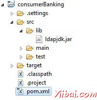

# Maven外部依赖 - Maven教程

现在，你也知道Maven做依赖管理使用Maven仓库的概念。但是，如果依赖是不提供任何远程存储库和中央存储库发生了什么？ Maven提供为使用外部依赖的概念，应用在这样的场景。

举一个例子，让我们做以下修改项在目[Maven创建项目](http://www.yiibai.com/maven/maven_creating_project.html) 这一章节中创建。

*   添加lib文件夹到src文件夹

*   复制任何的jar到lib文件夹。我们使用ldapjdk.jar，这是LDAP操作的辅助库。

现在我们的项目结构看起来应该像下面的：



在这里，有自己的特定项目，这是很平常案例库，它可以包含jar文件可能无法在任何Maven存储库，那么需要下载。如果代码使用这个Maven库，那么Maven构建将失败，因为它无法下载或在编译阶段是指这个库。

要处理这种情况，让我们来添加这个外部依赖项中使用下列方式到Maven的pom.xml。

```
<project xmlns="http://maven.apache.org/POM/4.0.0" 
   xmlns:xsi="http://www.w3.org/2001/XMLSchema-instance"
   xsi:schemaLocation="http://maven.apache.org/POM/4.0.0 
   http://maven.apache.org/maven-v4_0_0.xsd">
   <modelVersion>4.0.0</modelVersion>
   <groupId>com.companyname.bank</groupId>
   <artifactId>consumerBanking</artifactId>
   <packaging>jar</packaging>
   <version>1.0-SNAPSHOT</version>
   <name>consumerBanking</name>
   <url>http://maven.apache.org</url>

   <dependencies>
      <dependency>
         <groupId>junit</groupId>
         <artifactId>junit</artifactId>
         <version>3.8.1</version>
         <scope>test</scope>
      </dependency>

      <dependency>
         <groupId>ldapjdk</groupId>
         <artifactId>ldapjdk</artifactId>
         <scope>system</scope>
         <version>1.0</version>
         <systemPath>${basedir}srclibldapjdk.jar</systemPath>
      </dependency>
   </dependencies>

</project>
```

先看下依赖性在上面的例子，清除下列有关外部相关的关键概念第二dependency元素。

*   外部依赖（jar库位置）可以在pom.xml中以同样的方式与其他依赖关系进行配置。

*   指定的groupId一样的库名称。

*   指定artifactId的相同库的名称。

*   指定范围的系统。

*   指定相系统项目的位置。

希望现在你清楚了解外部依赖，能够指定在Maven项目的外部依赖。

