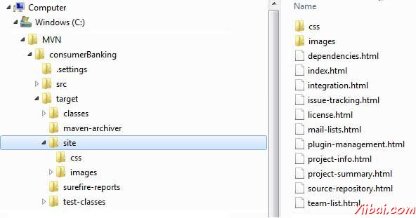
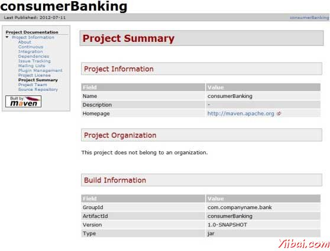

# Maven项目文档 - Maven教程

本教程将教你如何一步到位创建应用程序的文档。因此，让我们开始，到  C:/MVN 创建java应用程序consumerBanking。 OpenconsumerBanking文件夹，然后执行以下命令mvn命令。 

```
C:MVN>mvn site

```

Maven将开始构建该项目。

```
[INFO] Scanning for projects...
[INFO] -------------------------------------------------------------------
[INFO] Building consumerBanking
[INFO]    task-segment: [site]
[INFO] -------------------------------------------------------------------
[INFO] [site:site {execution: default-site}]
[INFO] artifact org.apache.maven.skins:maven-default-skin: 
checking for updates from central
[INFO] Generating "About" report.
[INFO] Generating "Issue Tracking" report.
[INFO] Generating "Project Team" report.
[INFO] Generating "Dependencies" report.
[INFO] Generating "Continuous Integration" report.
[INFO] Generating "Source Repository" report.
[INFO] Generating "Project License" report.
[INFO] Generating "Mailing Lists" report.
[INFO] Generating "Plugin Management" report.
[INFO] Generating "Project Summary" report.
[INFO] -------------------------------------------------------------------
[INFO] BUILD SUCCESSFUL
[INFO] -------------------------------------------------------------------
[INFO] Total time: 16 seconds
[INFO] Finished at: Wed Jul 11 18:11:18 IST 2012
[INFO] Final Memory: 23M/148M
[INFO] -------------------------------------------------------------------

```

就是这样。你的项目文件已准备就绪。 Maven有目标目录中创建一个网站。



打开 C:MVNconsumerBanking argetsite 文件夹。点击index.htmll看到文档。



Maven会使用称为Doxia一个文件处理引擎，它会读取多个源格式转换为通用文档模型的文档。要编写你的项目文档，可以在以下几个常用的格式，这是由Doxia解析编写内容。

| 格式名称 | 描述 | 参考 |
| --- | --- | --- |
| APT | A Plain Text document format | [http://maven.apache.org/doxia/format.htmll](http://maven.apache.org/doxia/format.htmll) |
| XDoc | A Maven 1.x documentation format | [http://jakarta.apache.org/site/jakarta-site2.htmll](http://jakarta.apache.org/site/jakarta-site2.htmll) |
| FML | Used for FAQ documents | [http://maven.apache.org/doxia/references/fml-format.htmll](http://maven.apache.org/doxia/references/fml-format.htmll) |
| XHTML | Extensible HTML | [http://en.wikipedia.org/wiki/XHTML](http://en.wikipedia.org/wiki/XHTML) |

