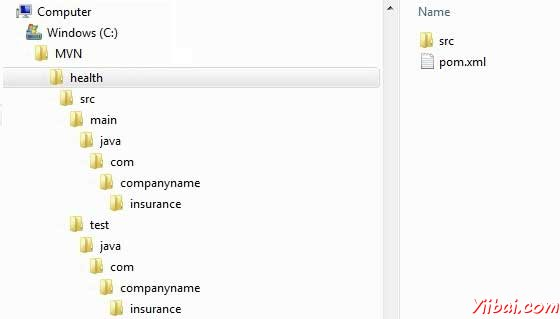

# Maven项目模板 - Maven教程

Maven提供用户，使用原型的概念，不同类型的项目模板（以数字614）是一个非常大的列表。 Maven帮助用户快速开始使用以下命令创建新的Java项目

```
mvn archetype:generate

```

## 什么是原型？

原型是一个Maven插件，其任务是创建一个项目结构按照其模板。我们将使用快速启动原型插件在这里创建一个简单的Java应用程序。

## 使用项目模板

让我们打开命令控制台，进入到C：&gt; MVN目录，然后执行以下命令mvn命令

```
C:MVN>mvn archetype:generate 

```

Maven会开始处理，并会要求选择所需的原型

```
INFO] Scanning for projects...
[INFO] Searching repository for plugin with prefix: 'archetype'.
[INFO] -------------------------------------------------------------------
[INFO] Building Maven Default Project
[INFO]    task-segment: [archetype:generate] (aggregator-style)
[INFO] -------------------------------------------------------------------
[INFO] Preparing archetype:generate
...
600: remote -> org.trailsframework:trails-archetype (-)
601: remote -> org.trailsframework:trails-secure-archetype (-)
602: remote -> org.tynamo:tynamo-archetype (-)
603: remote -> org.wicketstuff.scala:wicket-scala-archetype (-)
604: remote -> org.wicketstuff.scala:wicketstuff-scala-archetype 
Basic setup for a project that combines Scala and Wicket,
depending on the Wicket-Scala project. 
Includes an example Specs test.)
605: remote -> org.wikbook:wikbook.archetype (-)
606: remote -> org.xaloon.archetype:xaloon-archetype-wicket-jpa-glassfish (-)
607: remote -> org.xaloon.archetype:xaloon-archetype-wicket-jpa-spring (-)
608: remote -> org.xwiki.commons:xwiki-commons-component-archetype 
(Make it easy to create a maven project for creating XWiki Components.)
609: remote -> org.xwiki.rendering:xwiki-rendering-archetype-macro 
(Make it easy to create a maven project for creating XWiki Rendering Macros.)
610: remote -> org.zkoss:zk-archetype-component (The ZK Component archetype)
611: remote -> org.zkoss:zk-archetype-webapp (The ZK wepapp archetype)
612: remote -> ru.circumflex:circumflex-archetype (-)
613: remote -> se.vgregion.javg.maven.archetypes:javg-minimal-archetype (-)
614: remote -> sk.seges.sesam:sesam-annotation-archetype (-)
Choose a number or apply filter 
(format: [groupId:]artifactId, case sensitive contains): 203:

```

按Enter键选择默认选项（203：Maven原型 - 快速入门）

Maven会要求原型的特定版本

```
Choose org.apache.maven.archetypes:maven-archetype-quickstart version:
1: 1.0-alpha-1
2: 1.0-alpha-2
3: 1.0-alpha-3
4: 1.0-alpha-4
5: 1.0
6: 1.1
Choose a number: 6:

```

按Enter键选择默认选项（6：Maven原型 - 快速入门：1.1）

Maven会要求项目的细节。输入项目细节的要求。按回车，如果提供的默认值。您可以通过输入自己的值覆盖它们。

```
Define value for property 'groupId': : com.companyname.insurance
Define value for property 'artifactId': : health
Define value for property 'version': 1.0-SNAPSHOT:
Define value for property 'package': com.companyname.insurance:

```

Maven会要求项目的细节确认。按回车键或按Y

```
Confirm properties configuration:
groupId: com.companyname.insurance
artifactId: health
version: 1.0-SNAPSHOT
package: com.companyname.insurance
Y:

```

现在，Maven将开始创建项目结构，并会显示如下内容：

```
[INFO] -----------------------------------------------------------------------
[INFO] Using following parameters for creating project 
from Old (1.x) Archetype: maven-archetype-quickstart:1.1
[INFO] -----------------------------------------------------------------------
[INFO] Parameter: groupId, Value: com.companyname.insurance
[INFO] Parameter: packageName, Value: com.companyname.insurance
[INFO] Parameter: package, Value: com.companyname.insurance
[INFO] Parameter: artifactId, Value: health
[INFO] Parameter: basedir, Value: C:MVN
[INFO] Parameter: version, Value: 1.0-SNAPSHOT
[INFO] project created from Old (1.x) Archetype in dir: C:MVNhealth
[INFO] -----------------------------------------------------------------------
[INFO] BUILD SUCCESSFUL
[INFO] -----------------------------------------------------------------------
[INFO] Total time: 4 minutes 12 seconds
[INFO] Finished at: Fri Jul 13 11:10:12 IST 2012
[INFO] Final Memory: 20M/90M
[INFO] -----------------------------------------------------------------------

```

## 创建项目

现在转到C：&gt; MVN目录。会看到一个java应用程序项目创建了这是在创建项目时给出 artifactId 命名为：health 。 Maven将创建一个标准的目录布局如下图所示的项目：



## 创建的pom.xml

Maven生成如下所列项目中的 pom.xml 文件：

```
<project xmlns="http://maven.apache.org/POM/4.0.0" 
   xmlns:xsi="http://www.w3.org/2001/XMLSchema-instance"
   xsi:schemaLocation="http://maven.apache.org/POM/4.0.0 
   http://maven.apache.org/xsd/maven-4.0.0.xsd">
   <modelVersion>4.0.0</modelVersion>
   <groupId>com.companyname.insurance</groupId>
   <artifactId>health</artifactId>
   <version>1.0-SNAPSHOT</version>
   <packaging>jar</packaging>
   <name>health</name>
   <url>http://maven.apache.org</url>
   <properties>
      <project.build.sourceEncoding>UTF-8</project.build.sourceEncoding>
   </properties>
   <dependencies>
      <dependency>
      <groupId>junit</groupId>
         <artifactId>junit</artifactId>
         <version>3.8.1</version>
         <scope>test</scope>
      </dependency>
   </dependencies>
</project>
```

## 创建App.java

Maven 示例生成Java源文件，App.java下面列出项目：

位置: **C: &gt; MVN &gt; health &gt; src &gt; main &gt; java &gt; com &gt; companyname &gt; insurance &gt; App.java**

```
package com.companyname.insurance;

/**
 * Hello world!
 *
 */
public class App 
{
    public static void main( String[] args )
    {
        System.out.println( "Hello World!" );
    }
}
```

## 创建AppTest.java

Maven的样本生成Java源测试文件，AppTest.java下面列出的项目：

位置: **C: &gt; MVN &gt; health &gt; src &gt; test &gt; java &gt; com &gt; companyname &gt; insurance &gt; AppTest.java**

```
package com.companyname.insurance;

import junit.framework.Test;
import junit.framework.TestCase;
import junit.framework.TestSuite;

/**
 * Unit test for simple App.
 */
public class AppTest 
    extends TestCase
{
    /**
     * Create the test case
     *
     * @param testName name of the test case
     */
    public AppTest( String testName )
    {
        super( testName );
    }

    /**
     * @return the suite of tests being tested
     */
    public static Test suite()
    {
        return new TestSuite( AppTest.class );
    }

    /**
     * Rigourous Test :-)
     */
    public void testApp()
    {
        assertTrue( true );
    }
}
```

就是这样。现在可以看到Maven的功能。您可以创建任何类型，使用 maven 单一命令的项目并启动开发。

