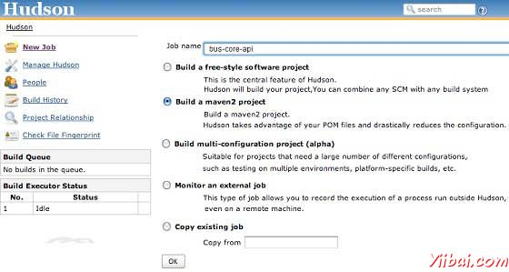

# Maven构建自动化-Hudson - Maven教程

建立自动化定义场景，依赖项目建设过程中被启动，一旦项目生成成功完成，以确保相关的项目是稳定的。

## 实例

考虑一个团队正在开发一个项目总线核心API上的其他两个项目的应用程序，网页UI和应用程序的桌面UI的依赖。

app-web-ui 项目使用1.0-SNAPSHOT总线核心API项目

```
<project xmlns="http://maven.apache.org/POM/4.0.0" 
   xmlns:xsi="http://www.w3.org/2001/XMLSchema-instance"
   xsi:schemaLocation="http://maven.apache.org/POM/4.0.0 
   http://maven.apache.org/xsd/maven-4.0.0.xsd">
   <modelVersion>4.0.0</modelVersion>
   <groupId>app-web-ui</groupId>
   <artifactId>app-web-ui</artifactId>
   <version>1.0</version>
   <packaging>jar</packaging>
   <dependencies>
      <dependency>
      <groupId>bus-core-api</groupId>
         <artifactId>bus-core-api</artifactId>
         <version>1.0-SNAPSHOT</version>
      </dependency>
   </dependencies>
</project>
```

app-desktop-ui 项目使用总线核心API项目的1.0-SNAPSHOT

```
<project xmlns="http://maven.apache.org/POM/4.0.0" 
   xmlns:xsi="http://www.w3.org/2001/XMLSchema-instance"
   xsi:schemaLocation="http://maven.apache.org/POM/4.0.0 
   http://maven.apache.org/xsd/maven-4.0.0.xsd">
   <modelVersion>4.0.0</modelVersion>
   <groupId>app-desktop-ui</groupId>
   <artifactId>app-desktop-ui</artifactId>
   <version>1.0</version>
   <packaging>jar</packaging>
   <dependencies>
      <dependency>
      <groupId>bus-core-api</groupId>
         <artifactId>bus-core-api</artifactId>
         <version>1.0-SNAPSHOT</version>
      </dependency>
   </dependencies>
</project>
```

bus-core-api 项目

```
<project xmlns="http://maven.apache.org/POM/4.0.0" 
   xmlns:xsi="http://www.w3.org/2001/XMLSchema-instance"
   xsi:schemaLocation="http://maven.apache.org/POM/4.0.0 
   http://maven.apache.org/xsd/maven-4.0.0.xsd">
   <modelVersion>4.0.0</modelVersion>
   <groupId>bus-core-api</groupId>
   <artifactId>bus-core-api</artifactId>
   <version>1.0-SNAPSHOT</version>
   <packaging>jar</packaging>   
</project>
```

现在，app-web-ui和app-desktop-ui项目团队需要自己编译过程应该揭开序幕，每当bus-core-api项目的变化。

使用快照确保应使用最新的bus-core-api 项目，但要满足上面我们需要做一些额外的要求。

*   添加一个生成后的目标bus-core-api POM的应用程序 app-web-ui 和app-desktop-ui 的基础之上。

*   使用持续集成（CI）的服务器像哈德森自动管理构建自动化。

## 使用Maven

更新总线核心API项目pom.xml

```
<project xmlns="http://maven.apache.org/POM/4.0.0" 
   xmlns:xsi="http://www.w3.org/2001/XMLSchema-instance"
   xsi:schemaLocation="http://maven.apache.org/POM/4.0.0 
   http://maven.apache.org/xsd/maven-4.0.0.xsd">
   <modelVersion>4.0.0</modelVersion>
   <groupId>bus-core-api</groupId>
   <artifactId>bus-core-api</artifactId>
   <version>1.0-SNAPSHOT</version>
   <packaging>jar</packaging>
   <build>
   <plugins>
   <plugin>
   <artifactId>maven-invoker-plugin</artifactId>
   <version>1.6</version>
      <configuration>
         <debug>true</debug>
         <pomIncludes>
            <pomInclude>app-web-ui/pom.xml</pomInclude>
            <pomInclude>app-desktop-ui/pom.xml</pomInclude> 
         </pomIncludes>
      </configuration>
      <executions>
         <execution>
            <id>build</id>
            <goals>
               <goal>run</goal>
            </goals>
         </execution>
      </executions>
   </plugin>
   </plugins>
   <build>
</project>
```

让我们打开命令控制台，进入到C: &gt; MVN &gt; bus-core-api目录，然后执行以下命令mvn命令。

```
C:MVNus-core-api>mvn clean package -U

```

Maven将开始构建项目bus-core-api。

```
[INFO] Scanning for projects...
[INFO] ------------------------------------------------------------------
[INFO] Building bus-core-api
[INFO]    task-segment: [clean, package]
[INFO] ------------------------------------------------------------------
...
[INFO] [jar:jar {execution: default-jar}]
[INFO] Building jar: C:MVNus-core-ui    arget
bus-core-ui-1.0-SNAPSHOT.jar
[INFO] ------------------------------------------------------------------
[INFO] BUILD SUCCESSFUL
[INFO] ------------------------------------------------------------------

```

一旦bus-core-api构建成功，Maven将开始构建应用程序app-web-ui

```
[INFO] ------------------------------------------------------------------
[INFO] Building app-web-ui 
[INFO]    task-segment: [package]
[INFO] ------------------------------------------------------------------
...
[INFO] [jar:jar {execution: default-jar}]
[INFO] Building jar: C:MVNapp-web-ui    arget
app-web-ui-1.0-SNAPSHOT.jar
[INFO] ------------------------------------------------------------------
[INFO] BUILD SUCCESSFUL
[INFO] ------------------------------------------------------------------

```

一旦app-web-ui 构建成功，Maven将开始构建app-desktop-ui项目

```
[INFO] ------------------------------------------------------------------
[INFO] Building app-desktop-ui 
[INFO]    task-segment: [package]
[INFO] ------------------------------------------------------------------
...
[INFO] [jar:jar {execution: default-jar}]
[INFO] Building jar: C:MVNapp-desktop-ui    arget
app-desktop-ui-1.0-SNAPSHOT.jar
[INFO] -------------------------------------------------------------------
[INFO] BUILD SUCCESSFUL
[INFO] -------------------------------------------------------------------

```

## 使用Maven持续集成服务

使用CI服务器更适合作为开发人员不需要更新的bus-core-api I项目的POM每次一个新的项目，例如 app-mobile-ui添加作为bus-core-api 项目相关的项目。哈德森Hudson 自动管理使用Maven的依赖管理构建自动化。 



哈德森（Hudson ）认每个项目生成的工作。一旦一个项目的代码签入到SVN（或映射到哈德森任何源管理工具），哈德森开始它的构建工作，一旦这项工作得到完成，它会自动启动其他相关工作（其他相关项目）。

在上面的例子中，当bus-core-ui 源代码SVN更新，哈德森开始它的构建。一旦构建成功。哈德森自动查找相关的项目，并开始构建app-web-ui 和app-desktop-ui 项目。

