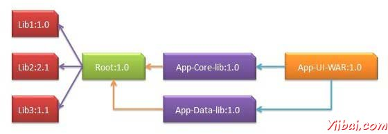

# Maven依赖管理 - Maven教程

其中一个Maven的核心特征是依赖管理。管理依赖关系变得困难的任务一旦我们处理多模块项目（包含数百个模块/子项目）。 Maven提供了一个高程度的控制来管理这样的场景。

## 传递依赖发现

这是很通常情况下，当一个库说A就依赖于其他库说B的情况下，另一个项目Ç想用A，则该项目需要使用库中B。

在Maven帮助下以避免这样的要求来发现所有需要的库。 Maven通过读取依赖项项目文件（pom.xml中），找出它们的依赖等。

我们只需要在每个项目POM定义直接依赖关系。 Maven自动处理其余部分。

传递依赖，包括库的图形可能会快速增长在很大程度上。可能出现情况下，当有重复的库。 Maven提供一些功能来控制传递依赖程度

| Feature | 描述 |
| --- | --- |
| Dependency mediation | Determines what version of a dependency is to be used when multiple versions of an artifact are encountered. If two dependency versions are at the same depth in the dependency tree, the first declared dependency will be used. |
| Dependency management | Directly specify the versions of artifacts to be used when they are encountered in transitive dependencies. For an example project C can include B as a dependency in its dependencyManagement section and directly control which version of B is to be used when it is ever referenced. |
| Dependency scope | Includes dependencies as per the current stage of the build |
| Excluded dependencies | Any transitive dependency can be excluede using "exclusion" element. As example, A depends upon B and B depends upon C then A can mark C as excluded. |
| Optional dependencies | Any transitive dependency can be marked as optional using "optional" element. As example, A depends upon B and B depends upon C. Now B marked C as optional. Then A will not use C. |

## 依赖范围

传递依赖发现可以使用各种依赖范围如下文所述受到限制

| Scope | 描述 |
| --- | --- |
| compile | This scope indicates that dependency is available in classpath of project. It is default scope. |
| provided | This scope indicates that dependency is to be provided by JDK or web-Server/Container at runtime. |
| runtime | This scope indicates that dependency is not required for compilation, but is required during execution. |
| test | This scope indicates that the dependency is only available for the test compilation and execution phases. |
| system | This scope indicates that you have to provide the system path. |
| import | This scope is only used when dependency is of type pom. This scopes indicates that the specified POM should be replaced with the dependencies in that POM's &lt;dependencyManagement&gt; section. |

## 依赖关系管理

通常情况下，我们已经一套项目在一个共同的项目下。在这种情况下，我们可以创造让所有的公共依赖一个共同的POM，然后进行分项目POMS为这个POM父。下面的例子将帮助你理解这个概念



以下是上述的依赖图的细节

*   APP-UI-WAR依赖于App-Core-lib和 App-Data-lib。

*   Root 是 App-Core-lib 和 App-Data-lib 的父类。

*   Root 定义LIB1，LIB2，Lib3作为其依赖部分依赖关系。

App-UI-WAR

```
<project xmlns="http://maven.apache.org/POM/4.0.0"
   xmlns:xsi="http://www.w3.org/2001/XMLSchema-instance"
   xsi:schemaLocation="http://maven.apache.org/POM/4.0.0
   http://maven.apache.org/xsd/maven-4.0.0.xsd">
      <modelVersion>4.0.0</modelVersion>
      <groupId>com.companyname.groupname</groupId>
      <artifactId>App-UI-WAR</artifactId>
      <version>1.0</version>
      <packaging>war</packaging>
      <dependencies>
         <dependency>
            <groupId>com.companyname.groupname</groupId>
            <artifactId>App-Core-lib</artifactId>
            <version>1.0</version>
         </dependency>
      </dependencies>  
      <dependencies>
         <dependency>
            <groupId>com.companyname.groupname</groupId>
            <artifactId>App-Data-lib</artifactId>
            <version>1.0</version>
         </dependency>
      </dependencies>  
</project>
```

App-Core-lib

```
<project xmlns="http://maven.apache.org/POM/4.0.0"
   xmlns:xsi="http://www.w3.org/2001/XMLSchema-instance"
   xsi:schemaLocation="http://maven.apache.org/POM/4.0.0
   http://maven.apache.org/xsd/maven-4.0.0.xsd">
      <parent>
         <artifactId>Root</artifactId>
         <groupId>com.companyname.groupname</groupId>
         <version>1.0</version>
      </parent>
      <modelVersion>4.0.0</modelVersion>
      <groupId>com.companyname.groupname</groupId>
      <artifactId>App-Core-lib</artifactId>
      <version>1.0</version> 
      <packaging>jar</packaging>
</project>
```

App-Data-lib

```
<project xmlns="http://maven.apache.org/POM/4.0.0"
   xmlns:xsi="http://www.w3.org/2001/XMLSchema-instance"
   xsi:schemaLocation="http://maven.apache.org/POM/4.0.0
   http://maven.apache.org/xsd/maven-4.0.0.xsd">
      <parent>
         <artifactId>Root</artifactId>
         <groupId>com.companyname.groupname</groupId>
         <version>1.0</version>
      </parent>
      <modelVersion>4.0.0</modelVersion>
      <groupId>com.companyname.groupname</groupId>
      <artifactId>App-Data-lib</artifactId>
      <version>1.0</version>   
      <packaging>jar</packaging>
</project>
```

Root

```
<project xmlns="http://maven.apache.org/POM/4.0.0"
   xmlns:xsi="http://www.w3.org/2001/XMLSchema-instance"
   xsi:schemaLocation="http://maven.apache.org/POM/4.0.0
   http://maven.apache.org/xsd/maven-4.0.0.xsd">
      <modelVersion>4.0.0</modelVersion>
      <groupId>com.companyname.groupname</groupId>
      <artifactId>Root</artifactId>
      <version>1.0</version>
      <packaging>pom</packaging>
      <dependencies>
         <dependency>
            <groupId>com.companyname.groupname1</groupId>
            <artifactId>Lib1</artifactId>
            <version>1.0</version>
         </dependency>
      </dependencies>  
      <dependencies>
         <dependency>
            <groupId>com.companyname.groupname2</groupId>
            <artifactId>Lib2</artifactId>
            <version>2.1</version>
         </dependency>
      </dependencies>  
      <dependencies>
         <dependency>
            <groupId>com.companyname.groupname3</groupId>
            <artifactId>Lib3</artifactId>
            <version>1.1</version>
         </dependency>
      </dependencies>  
</project>
```

现在，当我们建立App-UI-WAR项目，Maven会发现所有的依赖通过遍历依赖图和构建应用程序。

从上面的例子中，我们可以学到以下关键概念

*   常见的依赖关系可以用父POM的概念被放置在一个地方。 App-Data-lib 和 App-Core-lib 项目列表在 Root 目录(见Roots包类型。它是POM).

*   不需要Lib1, lib2, Lib3 作为依赖于 App-UI-WAR. Maven使用传递性依赖机制来管理这些细节。

