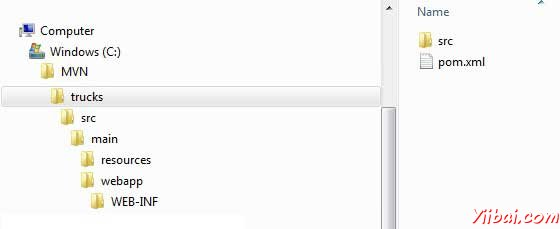
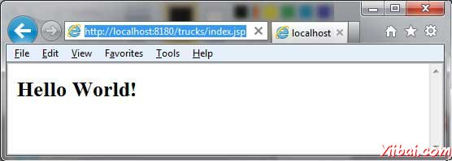

# Maven Web应用 - Maven教程

本教程将教你如何管理使用Maven版本控制系统管理一个基于Web项目。在这里，将学习如何创建/构建/部署和运行Web应用程序：

## 创建Web应用程序

要创建一个简单的java web应用程序，我们将使用Maven的原型 - web应用插件。因此，让我们打开命令控制台，进入到C： MVN目录并执行以下命令mvn命令。

```
C:MVN>mvn archetype:generate 
-DgroupId=com.companyname.automobile 
-DartifactId=trucks
-DarchetypeArtifactId=maven-archetype-webapp 
-DinteractiveMode=false

```

Maven会开始处理，并建立完整的基于Web的Java应用程序项目结构。

```
[INFO] Scanning for projects...
[INFO] Searching repository for plugin with prefix: 'archetype'.
[INFO] -------------------------------------------------------------------
[INFO] Building Maven Default Project
[INFO]    task-segment: [archetype:generate] (aggregator-style)
[INFO] -------------------------------------------------------------------
[INFO] Preparing archetype:generate
[INFO] No goals needed for project - skipping
[INFO] [archetype:generate {execution: default-cli}]
[INFO] Generating project in Batch mode
[INFO] --------------------------------------------------------------------
[INFO] Using following parameters for creating project 
from Old (1.x) Archetype: maven-archetype-webapp:1.0
[INFO] --------------------------------------------------------------------
[INFO] Parameter: groupId, Value: com.companyname.automobile
[INFO] Parameter: packageName, Value: com.companyname.automobile
[INFO] Parameter: package, Value: com.companyname.automobile
[INFO] Parameter: artifactId, Value: trucks
[INFO] Parameter: basedir, Value: C:MVN
[INFO] Parameter: version, Value: 1.0-SNAPSHOT
[INFO] project created from Old (1.x) Archetype in dir: C:MVN    rucks
[INFO] -------------------------------------------------------------------
[INFO] BUILD SUCCESSFUL
[INFO] -------------------------------------------------------------------
[INFO] Total time: 16 seconds
[INFO] Finished at: Tue Jul 17 11:00:00 IST 2012
[INFO] Final Memory: 20M/89M
[INFO] -------------------------------------------------------------------

```

现在去到C:/ MVN目录。您将看到创建了一个名为trucks （如artifactId指定）一个java应用程序项目。



Maven使用标准的目录结构。用上面的例子中，我们可以了解到以下关键概念

| 文件夹结构 | 描述 |
| --- | --- |
| trucks | contains src folder and pom.xml |
| src/main/webapp | contains index.jsp and WEB-INF folder. |
| src/main/webapp/WEB-INF | contains web.xml |
| src/main/resources | it contains images/properties files . |

## POM.xml

```
<project xmlns="http://maven.apache.org/POM/4.0.0" 
   xmlns:xsi="http://www.w3.org/2001/XMLSchema-instance"
   xsi:schemaLocation="http://maven.apache.org/POM/4.0.0 
   http://maven.apache.org/maven-v4_0_0.xsd">
   <modelVersion>4.0.0</modelVersion>
   <groupId>com.companyname.automobile</groupId>
   <artifactId>trucks</artifactId>
   <packaging>war</packaging>
   <version>1.0-SNAPSHOT</version>
   <name>trucks Maven Webapp</name>
   <url>http://maven.apache.org</url>
   <dependencies>
      <dependency>
         <groupId>junit</groupId>
         <artifactId>junit</artifactId>
         <version>3.8.1</version>
         <scope>test</scope>
      </dependency>
   </dependencies>
   <build>
      <finalName>trucks</finalName>
   </build>
</project>
```

Maven还创建了一个示例JSP源文件

打开 **C: &gt; MVN &gt; trucks &gt; src &gt; main &gt; webapp &gt;** 文件夹，你会看到index.jsp。

```
<html>
   <body>
      <h2>Hello World!</h2>
   </body>
</html>
```

## 构建Web应用程序

让我们打开命令控制台，进入到C:MVN rucks目录并执行以下命令mvn命令。

```
C:MVN    rucks>mvn clean package

```

Maven将开始建设该项目。

```
[INFO] Scanning for projects...
[INFO] -------------------------------------------------------------------
[INFO] Building trucks Maven Webapp
[INFO]    task-segment: [clean, package]
[INFO] -------------------------------------------------------------------
[INFO] [clean:clean {execution: default-clean}]
[INFO] [resources:resources {execution: default-resources}]
[WARNING] Using platform encoding (Cp1252 actually) to 
copy filtered resources,i.e. build is platform dependent!
[INFO] Copying 0 resource
[INFO] [compiler:compile {execution: default-compile}]
[INFO] No sources to compile
[INFO] [resources:testResources {execution: default-testResources}]
[WARNING] Using platform encoding (Cp1252 actually) to 
copy filtered resources,i.e. build is platform dependent!
[INFO] skip non existing resourceDirectory 
C:MVN    ruckssrc    est
esources
[INFO] [compiler:testCompile {execution: default-testCompile}]
[INFO] No sources to compile
[INFO] [surefire:test {execution: default-test}]
[INFO] No tests to run.
[INFO] [war:war {execution: default-war}]
[INFO] Packaging webapp
[INFO] Assembling webapp[trucks] in [C:MVN    rucks    arget    rucks]
[INFO] Processing war project
[INFO] Copying webapp resources[C:MVN    ruckssrcmainwebapp]
[INFO] Webapp assembled in[77 msecs]
[INFO] Building war: C:MVN    rucks    arget    rucks.war
[INFO] -------------------------------------------------------------------
[INFO] BUILD SUCCESSFUL
[INFO] -------------------------------------------------------------------
[INFO] Total time: 3 seconds
[INFO] Finished at: Tue Jul 17 11:22:45 IST 2012
[INFO] Final Memory: 11M/85M
[INFO] -------------------------------------------------------------------

```

## 部署Web应用程序

现在复制创建的trucks.war 到**C: &gt; MVN &gt; trucks &gt; target &gt;**文件夹到web服务器的webapp目录下，然后重新启动Web服务器。

## 测试Web应用程序

使用URL运行Web应用程序 : **http://&lt;server-name&gt;:&lt;port-number&gt;/trucks/index.jsp**

验证输出。



