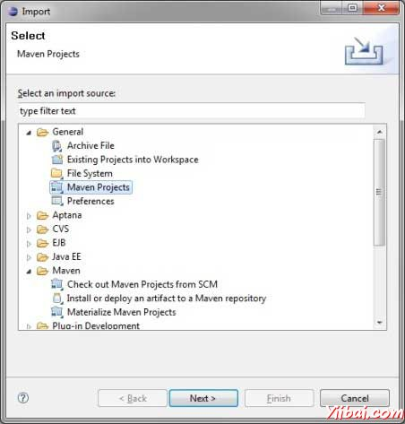
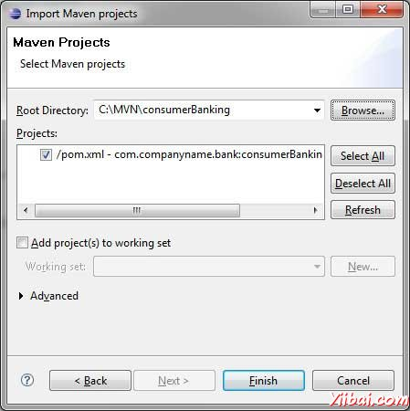
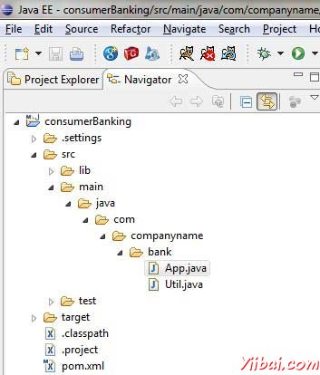
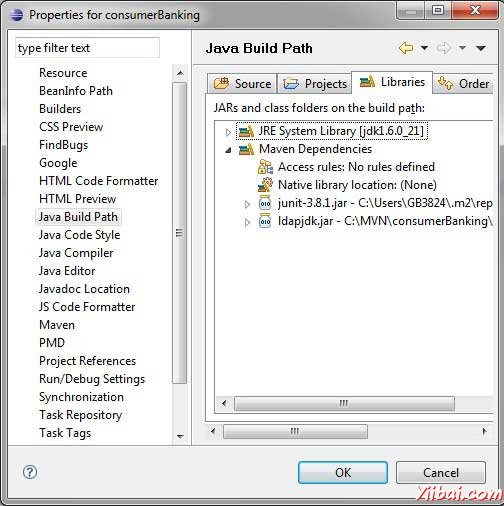
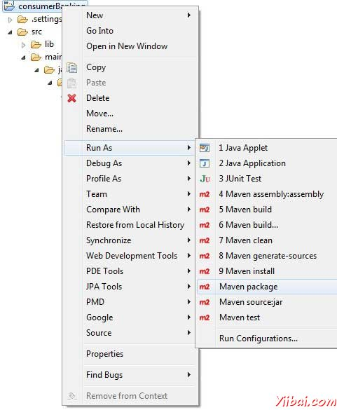

# Eclispe IDE集成Maven - Maven教程

Eclipse提供了一个很好的插件[m2eclipse](http://www.eclipse.org/m2e/) 无缝将Maven和Eclipse集成在一起。

m2eclipse一些特点如下

*   您可以从Eclipse运行Maven目标。

*   可以使用其自己的控制台查看Maven命令的输出在Eclipse里面。

*   你可以更新maven的依赖关系使用IDE。

*   您可以启动Maven在Eclipse中建立。

*   它的依赖管理基于Maven的pom.xml 在Eclipse构建路径。

*   它解决了从Eclipse工作区Maven的依赖关系，而不需要安装到本地Maven仓库（需要依赖项目在同一个工作区）。

*   它自动下载需要的依赖和源从远程Maven仓库。

*   它提供了向导，用于创建新的Maven项目，pom.xml和现有项目可让Maven支持

*   它提供了快速搜索远程Maven仓库的依赖

## 安装m2eclipse插件

请使用以下链接之一安装m2eclipse：

| Eclipse | URL |
| --- | --- |
| Eclipse 3.5 (Gallileo) | [Installing m2eclipse in Eclipse 3.5 (Gallileo)](http://www.sonatype.com/books/m2eclipse-book/reference/ch02s03.htmll) |
| Eclipse 3.6 (Helios) | [Installing m2eclipse in Eclipse 3.6 (Helios)](http://www.sonatype.com/books/m2eclipse-book/reference/install-sect-marketplace.htmll) |

下面的例子将帮助您利用集成Eclipse和Maven。

## 导入Eclipse中Maven项目

*   打开Eclipse.

*   选择File &gt; Import &gt; 选项.

*   选择Maven项目选项。单击Next按钮。



*   选择项目的位置，使用Maven创建一个项目。我们已经创建一个Java项目consumerBanking。看到Maven创建项目，看看如何创建使用Maven项目。

*   单击Finish按钮。



现在，你可以看到Maven项目在eclipse。



现在，看看consumerBanking项目属性。你可以看到，Eclipse已经添加Maven的依赖关系，以Java构建路径。



现在，它使用Eclipse的Maven来构建项目。

*   右键点击consumerBanking项目打开上下文菜单。

*   选择 Run 作为选项

*   然后maven的封装选项

Maven将开始建设该项目。你可以看到在Eclipse控制台输出

```
[INFO] Scanning for projects...
[INFO] -------------------------------------------------------------------
[INFO] Building consumerBanking
[INFO] 
[INFO] Id: com.companyname.bank:consumerBanking:jar:1.0-SNAPSHOT
[INFO] task-segment: [package]
[INFO] -------------------------------------------------------------------
[INFO] [resources:resources]
[INFO] Using default encoding to copy filtered resources.
[INFO] [compiler:compile]
[INFO] Nothing to compile - all classes are up to date
[INFO] [resources:testResources]
[INFO] Using default encoding to copy filtered resources.
[INFO] [compiler:testCompile]
[INFO] Nothing to compile - all classes are up to date
[INFO] [surefire:test]
[INFO] Surefire report directory: 
C:MVNconsumerBanking    argetsurefire-reports

-------------------------------------------------------
 T E S T S
-------------------------------------------------------
Running com.companyname.bank.AppTest
Tests run: 1, Failures: 0, Errors: 0, Skipped: 0, Time elapsed: 0.047 sec

Results :

Tests run: 1, Failures: 0, Errors: 0, Skipped: 0

[INFO] [jar:jar]
[INFO] -------------------------------------------------------------------
[INFO] BUILD SUCCESSFUL
[INFO] -------------------------------------------------------------------
[INFO] Total time: 1 second
[INFO] Finished at: Thu Jul 12 18:18:24 IST 2012
[INFO] Final Memory: 2M/15M
[INFO] -------------------------------------------------------------------

```



现在，右键点击App.java。选择Run As选项。选择作为Java应用程序。

你会看到结果

