# Eclipse构建Maven项目 - Maven教程

**1\. 安装m2eclipse插件 **
   要用Eclipse构建Maven项目，我们需要先安装meeclipse插件 
   点击eclipse菜单栏Help-&gt;Eclipse Marketplace搜索到插件Maven Integration for Eclipse 并点击安装即可，如下图：

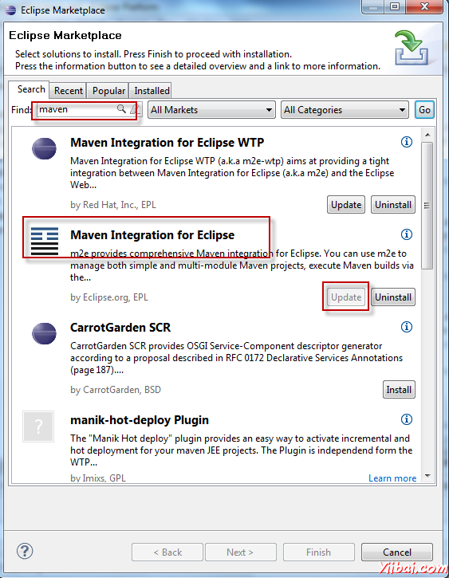

安装成成之后我们在Eclipse菜单栏中点击File-&gt;New-&gt;Other,在弹出的对话框中会看到如下图所示：

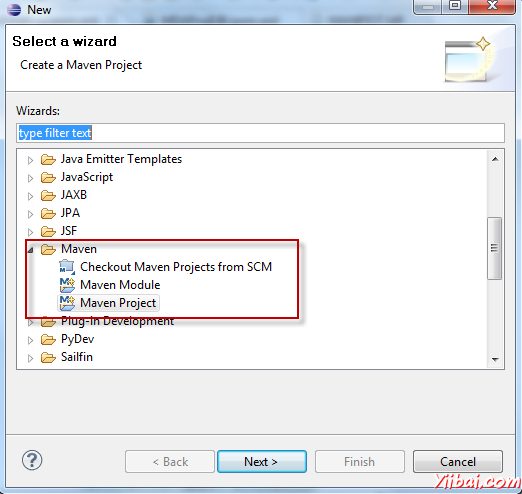

**2. 构建Maven项目**  

      以eclipse3.6为例

      1）创建简单Maven项目

           点击Eclipse菜单栏File-&gt;New-&gt;Ohter-&gt;Maven得到如下图所示对话框：

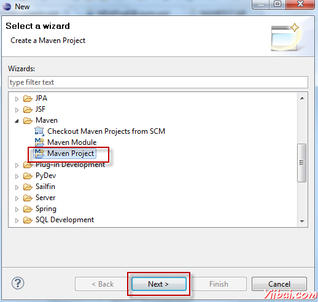

选中Maven Project并点击Next，到下一个对话框继续点击Next得到如下对话框

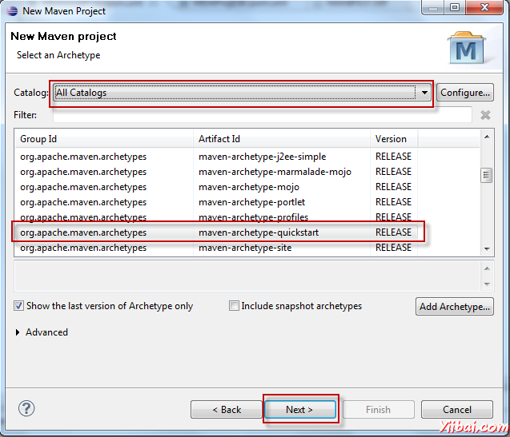
 如图示操作，选择maven-archetype-quickstart，点击Next

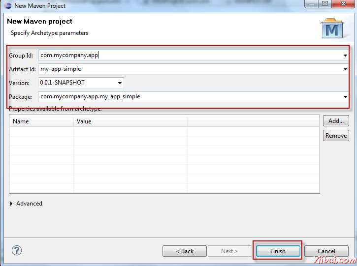
 按图示填写好groupId, artfactId,version等信息，点击Finish。

由此我们成功创建了一个简单的Maven项目，项目结构如图所示

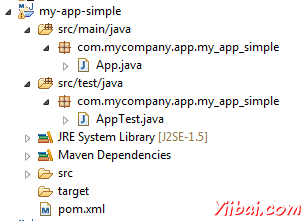

     2）创建Maven web项目

     操作跟创建简单Maven项目类似，点击Eclipse菜单File-&gt;New-&gt;Other-&gt;Maven-&gt;Maven Project

     在选择maven-archetype的界面进行如下操作：

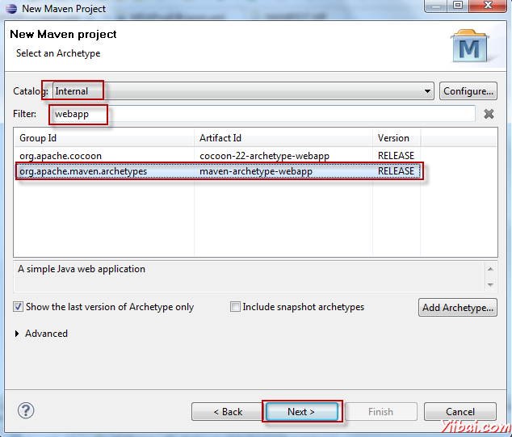
 点击Next,填写好相应的groupId,artifactId,version等信息，点击Finish

得到的Maven web项目结构如下图所示：

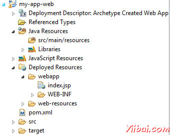

 右击项目，点击Properties-&gt;Project Facets

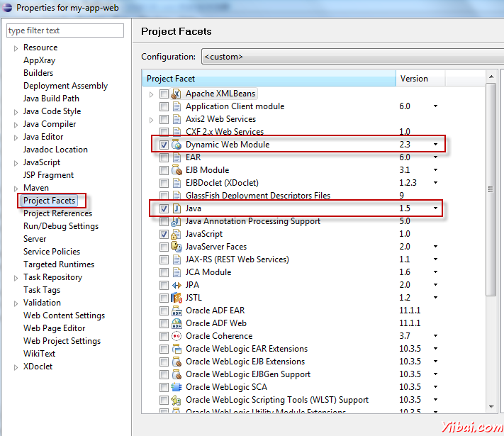

如上图可以看到项目为web2.3 java1.5 当然我们也可以改成我们所需要的版本，打开xml文件my-app-web/.settings/org.eclipse.wst.common.project.facet.core.xml，进行修改即可：

Xml代码  

1.  &lt;?xml version="1.0" encoding="UTF-8"?&gt;  
2.  &lt;faceted-project&gt;  
3.  &lt;fixed facet="wst.jsdt.web"/&gt;  
4.  &lt;installed facet="java" version="1.5"/&gt;  
5.  &lt;installed facet="jst.web" version="2.3"/&gt;  
6.  &lt;installed facet="wst.jsdt.web" version="1.0"/&gt;  
7.  &lt;/faceted-project&gt;  

     3）导入Maven项目

          在Eclipse project explorer中右击，在弹出框中选择import，得到如下图所示：          
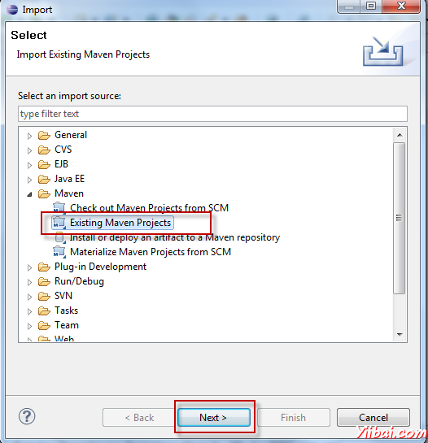

      选择Existing Maven Projects，并点击Next，得到如下图所示对话框：

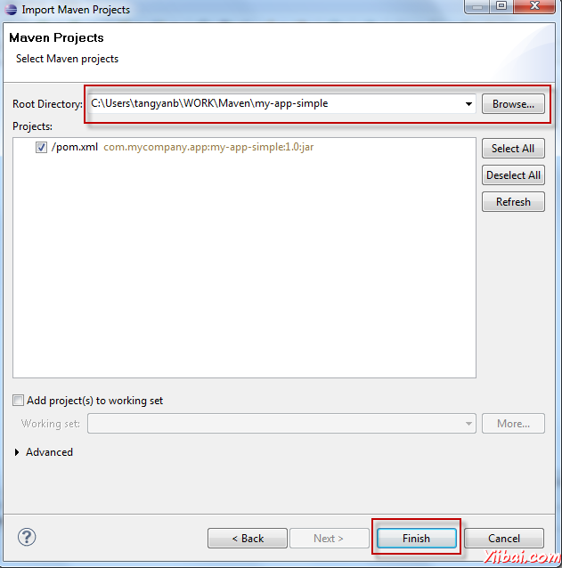

选择一个已经创建好的Maven项目，并点击Finish。

由此，导入Maven项目成功

**3. 运行Maven命令**

    右击项目，点击Run as，如下图：

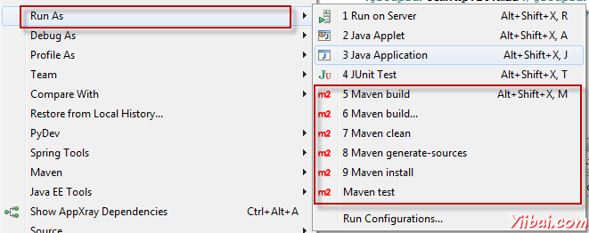

 即可看到有很多现有的maven命令，点击即可运行，并在控制台可以看到运行信息

 如果你想运行的maven命令在这里没有找到，点击Maven build创建新的命令，操作如下图所示：

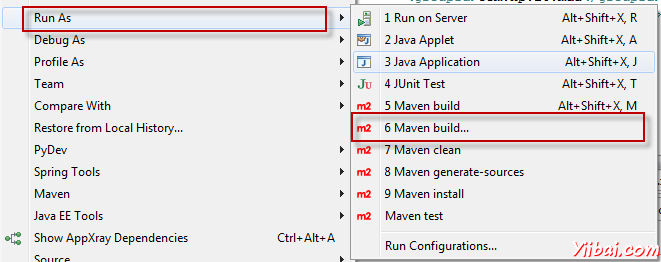

 如下图填入Maven命令，点击Run即可

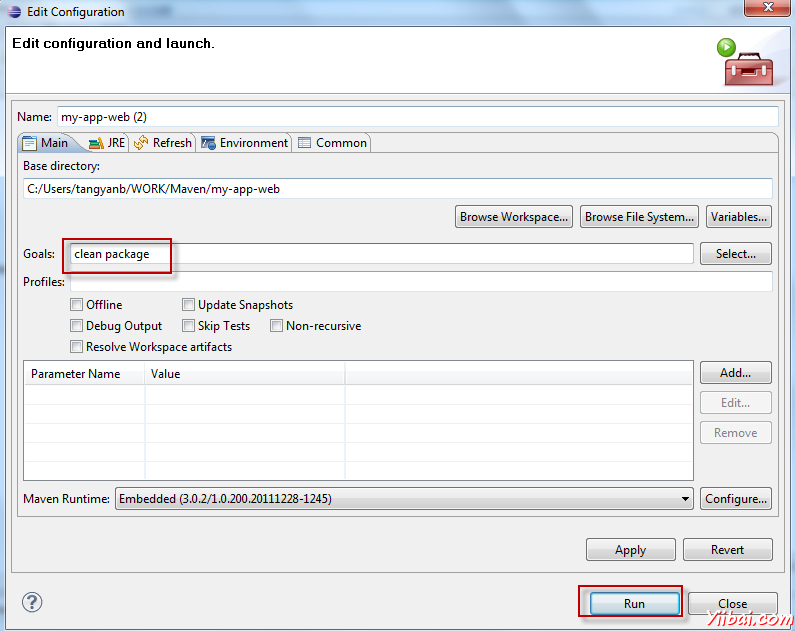

新增的maven命令可以通过如下方式找到，并再次运行：

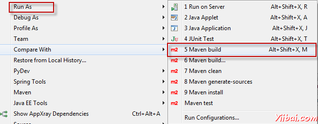

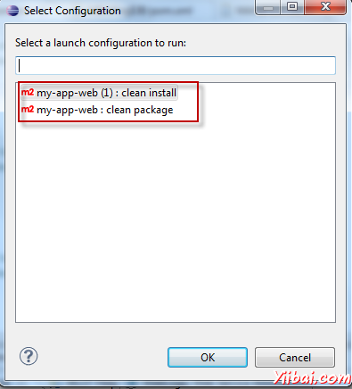

