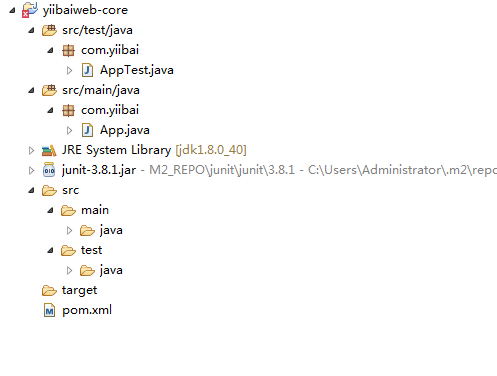

# 转换基于Maven的Web应用程序支持Eclipse IDE - Maven教程

在上一节教程中，使用Maven创建了一个Web应用程序。这里有一个指南，告诉你如何转换Web应用程序到Eclipse IDE支持的形式。

注意，通过WTP工具Eclipse IDE支持Web应用程序，所以需要让基于Maven的项目支持它。

## 1\. mvn eclipse:eclipse -Dwtpversion=2.0

要转换一个基于Maven的Java项目支持IDE，使用此命令：

```
mvn eclipse:eclipse
```

对于Web应用程序，需要额外的参数，使其支持 Eclipse WTP，应该使用这个命令：

```
mvn eclipse:eclipse -Dwtpversion=2.0
```

_看看其输出 …_

```
_C:\worksp> mvn archetype:generate -DgroupId=com.yiibai -DartifactId=yiibaiweb-core
C:\worksp\yiibaiweb-core>mvn eclipse:eclipse -Dwtpversion=2.0
[INFO] Scanning for projects...
[INFO]
[INFO] ------------------------------------------------------------------------
[INFO] Building yiibaiweb-core 1.0-SNAPSHOT
[INFO] ------------------------------------------------------------------------
[INFO]
[INFO] >>> maven-eclipse-plugin:2.10:eclipse (default-cli) > generate-resources
@ yiibaiweb-core >>>
[INFO]
[INFO] <<< maven-eclipse-plugin:2.10:eclipse (default-cli) < generate-resources
@ yiibaiweb-core <<<
[INFO]
[INFO] --- maven-eclipse-plugin:2.10:eclipse (default-cli) @ yiibaiweb-core ---
[INFO] Adding support for WTP version 2.0.
[INFO] Using Eclipse Workspace: null
[INFO] Adding default classpath container: org.eclipse.jdt.launching.JRE_CONTAIN
ER
[INFO] Not writing settings - defaults suffice
[INFO] Wrote Eclipse project for "yiibaiweb-core" to C:\worksp\yiibaiweb-core.
[INFO]
[INFO] ------------------------------------------------------------------------
[INFO] BUILD SUCCESS
[INFO] ------------------------------------------------------------------------
[INFO] Total time: 2.038 s
[INFO] Finished at: 2015-11-02T20:30:36+08:00
[INFO] Final Memory: 13M/114M
[INFO] ------------------------------------------------------------------------_
```

## 2\. Eclipse WTP

标准Eclipse的“.classpath”和“.project”文件被创建。你会发现创建一个新的 “.setting” 文件夹，里面包含两个文件“org.eclipse.wst.common.component”和“org.eclipse.wst.common.project.facet.core.xml” 都是WTP或Faces文件用来支持Eclipse。

_File : org.eclipse.wst.common.project.facet.core.xml_

```
<faceted-project><fixed facet="jst.java"/><fixed facet="jst.web"/><installed facet="jst.web"version="2.4"/><installed facet="jst.java"version="1.4"/></faceted-project>
```

**注意**
使用JDK1.4 和 Maven2.X生成的 Web应用程序(见上文)，这是相当过时，需要将其升级到最新的JDK版本。

_File : org.eclipse.wst.common.component_

```
<project-modules id="moduleCoreId"project-version="2.0"><wb-module deploy-name="mkyongweb-core"><property name="context-root"value="mkyongweb-core"/><wb-resource deploy-path="/"source-path="src/main/webapp"/><property name="java-output-path"value="/target/classes"/><wb-resource deploy-path="/WEB-INF/classes"source-path="src/main/resources"/></wb-module></project-modules>
```

## 3\. 导入到Eclipse IDE

现在，我们已经拥有了一个 Eclipse 的 Web应用程序需要配置和文件，那么，就可以开始导入基于Maven构建Web应用程序到Eclipse IDE中去了。

**步骤:**
在Eclipse IDE 的菜单栏, File -&gt; Import… -&gt; General -&gt; Existing Projects into Workspace -&gt; 选择根目录(选择项目文件夹中)-&gt; 完成。




完事大吉！

## 参考

1.  [http://maven.apache.org/plugins/maven-eclipse-plugin/eclipse-mojo.html](http://maven.apache.org/plugins/maven-eclipse-plugin/eclipse-mojo.html)
2.  [http://maven.apache.org/plugins/maven-eclipse-plugin/wtp.html](http://maven.apache.org/plugins/maven-eclipse-plugin/wtp.html)
3.  [http://wiki.eclipse.org/WTP_FAQ#What_version_of_Eclipse_does_WTP_work_with.3F](http://wiki.eclipse.org/WTP_FAQ#What_version_of_Eclipse_does_WTP_work_with.3F)
4.  [Unsupported WTP version: 1.5\. This plugin currently supports only the following versions: 1.0 R7](http://www.mkyong.com/maven/unsupported-wtp-version-15-this-plugin-currently-supports-only-the-following-versions-10-r7)

