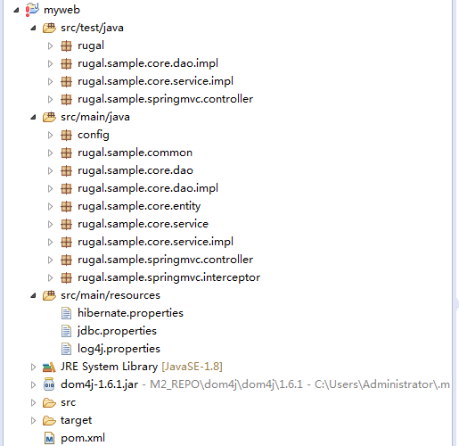

# 使用Maven模板创建项目 - Maven教程

在本教程中，我们将向你展示如何使用mvn archetype:generate从现有的Maven模板列表中生成项目。在Maven 3.3.3，有超过1000+个模板，Maven 团队已经过滤掉一些无用的模板。

通常情况下，我们只需要使用下面的两个模板：

1.  maven-archetype-webapp – Java Web Project (WAR)
2.  maven-archetype-quickstart – Java Project (JAR)

## 1\. Maven 1000+ 模板

如果键入命令mvn archetype:generate，1000 +模板会被提示在屏幕上，你没有办法看到它，或者选择什么。为了解决这个问题，输出模板列表，像这样保存为文本文件：

```
C:\worksp> mvn archetype:generate > templates.txt //waiting few seconds,then exits
Press CTRL + C

C:\worksp> vim templates.txt
```

## 2\. Maven archetype:generate

步骤来指导你如何从现有 Spring-Hibernate 模板来构建Web项目：

2.1 列出 Maven 的模板：

```
C:\worksp> mvn archetype:generate
[INFO] Scanning for projects...
[INFO]                                                                         
[INFO] ------------------------------------------------------------------------
[INFO] Building Maven Stub Project (No POM) 1
[INFO] ------------------------------------------------------------------------
[INFO] 
[INFO] >>> maven-archetype-plugin:2.4:generate (default-cli) > generate-sources @ standalone-pom >>>
[INFO] 
[INFO] <<< maven-archetype-plugin:2.4:generate (default-cli) < generate-sources @ standalone-pom <<<
[INFO] 
[INFO] --- maven-archetype-plugin:2.4:generate (default-cli) @ standalone-pom ---
[INFO] Generating project in Interactive mode
[INFO] No archetype defined. Using maven-archetype-quickstart (org.apache.maven.archetypes:maven-archetype-quickstart:1.0)

Choose archetype:
1: remote -> am.ik.archetype:maven-reactjs-blank-archetype (Blank Project for React.js)
2: remote -> am.ik.archetype:msgpack-rpc-jersey-blank-archetype (Blank Project for Spring Boot + Jersey)
3: remote -> am.ik.archetype:mvc-1.0-blank-archetype (MVC 1.0 Blank Project)
4: remote -> am.ik.archetype:spring-boot-blank-archetype (Blank Project for Spring Boot)
5: remote -> am.ik.archetype:spring-boot-docker-blank-archetype (Docker Blank Project for Spring Boot)
6: remote -> am.ik.archetype:spring-boot-gae-blank-archetype (GAE Blank Project for Spring Boot)
7: remote -> am.ik.archetype:spring-boot-jersey-blank-archetype (Blank Project for Spring Boot + Jersey)
8: remote -> at.chrl.archetypes:chrl-spring-sample (Archetype for Spring Vaadin Webapps)
```

2.2 选择数字 “314” 来使用 ml.rugal.archetype:springmvc-spring-hibernate 模板，并填写详细信息：

注意，这个数字314可能在您的环境有所不同。寻找正确的数字应该看看在上面的步骤1中列出的技术。

```
1445: remote -> us.fatehi:schemacrawler-archetype-plugin-lint (-)
Choose a number or apply filter (format: [groupId:]artifactId, case sensitive co
ntains): 674: 477
Choose ml.rugal.archetype:springmvc-spring-hibernate version:
1: 0.1
2: 0.2
3: 0.3
4: 0.4
5: 0.5
6: 0.6
Choose a number: 6:
Downloading: https://repo.maven.apache.org/maven2/ml/rugal/archetype/springmvc-s
pring-hibernate/0.6/springmvc-spring-hibernate-0.6.jar
Downloaded: https://repo.maven.apache.org/maven2/ml/rugal/archetype/springmvc-sp
ring-hibernate/0.6/springmvc-spring-hibernate-0.6.jar (30 KB at 6.8 KB/sec)
Downloading: https://repo.maven.apache.org/maven2/ml/rugal/archetype/springmvc-s
pring-hibernate/0.6/springmvc-spring-hibernate-0.6.pom
Downloaded: https://repo.maven.apache.org/maven2/ml/rugal/archetype/springmvc-sp
ring-hibernate/0.6/springmvc-spring-hibernate-0.6.pom (4 KB at 5.3 KB/sec)
Define value for property 'groupId': : com.yiibai.web
Define value for property 'artifactId': : myweb
Define value for property 'version':  1.0-SNAPSHOT: :
Define value for property 'package':  com.yiibai.web: :
Confirm properties configuration:
groupId: com.yiibai.web
artifactId: myweb
version: 1.0-SNAPSHOT
package: com.yiibai.web
 Y: : y
[INFO] -------------------------------------------------------------------------
---
[INFO] Using following parameters for creating project from Archetype: springmvc
-spring-hibernate:0.6
[INFO] -------------------------------------------------------------------------
---
[INFO] Parameter: groupId, Value: com.yiibai.web
[INFO] Parameter: artifactId, Value: myweb
[INFO] Parameter: version, Value: 1.0-SNAPSHOT
[INFO] Parameter: package, Value: com.yiibai.web
[INFO] Parameter: packageInPathFormat, Value: com/yiibai/web
[INFO] Parameter: package, Value: com.yiibai.web
[INFO] Parameter: version, Value: 1.0-SNAPSHOT
[INFO] Parameter: groupId, Value: com.yiibai.web
[INFO] Parameter: artifactId, Value: myweb
[INFO] project created from Archetype in dir: C:\worksp\myweb
[INFO] ------------------------------------------------------------------------
[INFO] BUILD SUCCESS
[INFO] ------------------------------------------------------------------------
[INFO] Total time: 05:07 min
[INFO] Finished at: 2015-11-03T07:10:56+08:00
[INFO] Final Memory: 16M/176M
[INFO] ------------------------------------------------------------------------
```

它会生成以下项目文件夹和文件。




图片: 生成Eclipse IDE中的项目结构。

注意，要导入项目到Eclipse中，键入命令mvn eclipse:eclipse，并导入它作为一个正常的项目：

```
c:\worksp> cd myweb
c:\worksp>myweb> mvn eclipse:eclipse
```

## 3\. 更多示例

如果您知道哪个 archetypeArtifactId 使用，只需跳过交互模式命令：

3.1 maven-archetype-quickstart (Java Project)

```
$ mvn archetype:generate -DgroupId=com.yiibai.core -DartifactId=ProjectName -DarchetypeArtifactId=maven-archetype-quickstart -DinteractiveMode=false
```

3.2 maven-archetype-webapp (Java Web Project)

```
$ mvn archetype:generate -DgroupId=com.yiibai.web -DartifactId=ProjectName -DarchetypeArtifactId=maven-archetype-webapp -DinteractiveMode=false
```

## 参考

1.  [Newbie: maven archetype:generate](http://stackoverflow.com/questions/8194257/newbie-maven-archetypegenerate)
2.  [Guide to Creating Archetypes](http://maven.apache.org/guides/mini/guide-creating-archetypes.html)
3.  [Maven Archetype Plugin – Usage](http://maven.apache.org/archetype/maven-archetype-plugin/usage.html)
4.  [personal site for Rugal Bernstein](http://rugal.github.io/)

