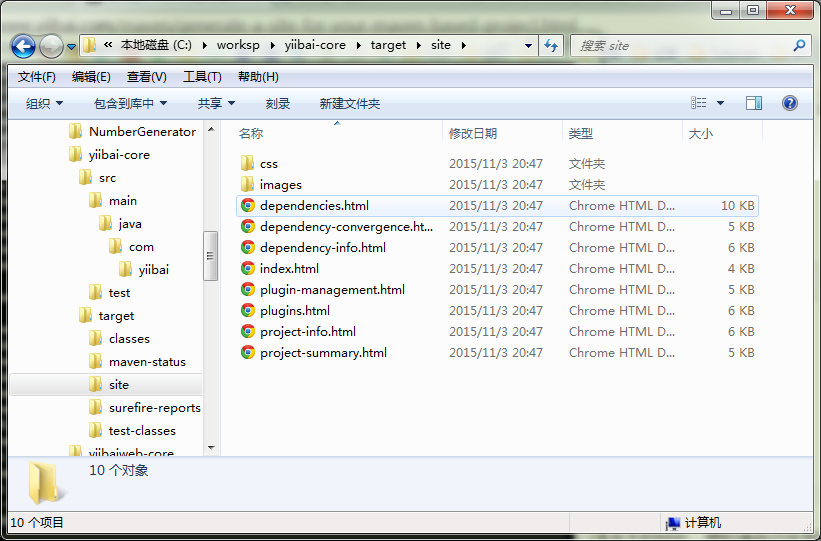

# 生成基于Maven的项目文档站点 - Maven教程

在Maven中，可以使用“mvn site”，为您的项目信息生成文档站点。

```
mvn site
```

生成的网站是在项目的“target/site”文件夹中。

## mvn site 示例

请参见通过“mvn site”命令生成的文件列表。


文档页面的样本如下。



**注意**
就个人而言，我不喜欢这个功能了，因为它并没有带来多大的好处，想知道自己开发的项目的信息可以试试。

