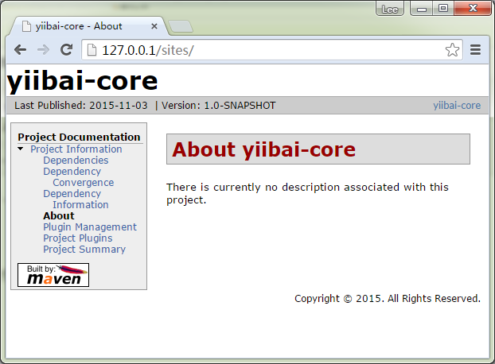

# 使用“mvn site-deploy”部署站点（WebDAV例子） - Maven教程

这里有一个指南，向您展示如何使用“mvn site:deploy”来自动部署生成的文档站点到服务器，这里通过WebDAV机制说明。

P.S 在这篇文章中，我们使用的是Apache服务器2.x的WebDAV功能。

## 1\. 启用 WebDAV

请参见本指南，了解 [如何启用WebDAV访问Apache 2.x服务器](http://www.yiibai.com/article/enable-webdav-in-apache-server-2-2-x-windows.html)。

## 2\. 配置在何处部署

在 pom.xml 中，配置在 “distributionManagement” 标签部署你的网站。

```
<distributionManagement>
    <site>
      <id>yiibaiserver</id>
      <url>dav:http://127.0.0.1/sites/</url>
    </site>
</distributionManagement>
```

**注**
“dav”前缀是HTTP协议之前添加的，这意味着通过WebDAV机制部署您的网站。或者，可以用“scp”取代它，如果您的服务器支持“scp”访问。

告诉Maven来使用“wagon-webdav-jackrabbit”扩展部署。

```
<build>
    <extensions>
        <extension>
            <groupId>org.apache.maven.wagon</groupId>
            <artifactId>wagon-webdav-jackrabbit</artifactId>
            <version>1.0-beta-7</version>
        </extension>
    </extensions>
</build>
```

**wagon-webdav**
一些人说可以使用“wagon-webdav”，但这不是我试了不能正常工作，所以这里用“wagon-webdav-jackrabbit”代替。

```
<extension>
            <groupId>org.apache.maven.wagon</groupId>
            <artifactId>wagon-webdav</artifactId>
            <version>1.0-beta-2</version>
</extension>
```

_ pom.xml 整个文件内容：_

```
<project xmlns="http://maven.apache.org/POM/4.0.0" 
  xmlns:xsi="http://www.w3.org/2001/XMLSchema-instance"
  xsi:schemaLocation="http://maven.apache.org/POM/4.0.0 
  http://maven.apache.org/maven-v4_0_0.xsd">
  <modelVersion>4.0.0</modelVersion>
  <groupId>com.yiibai.core</groupId>
  <artifactId>yiibai-core</artifactId>
  <packaging>jar</packaging>
  <version>1</version>
  <name>yiibai-core</name>
  <url>http://maven.apache.org</url>
  <build>
    <extensions>
        <extension>
            <groupId>org.apache.maven.wagon</groupId>
            <artifactId>wagon-webdav-jackrabbit</artifactId>
            <version>1.0-beta-7</version>
        </extension>
    </extensions>
  </build>
  <distributionManagement>
    <site>
      <id>yiibaiserver</id>
      <url>dav:http://127.0.0.1/sites/</url>
    </site>
  </distributionManagement>
</project>
```

## 3\. 配置WebDAV身份验证

通常情况下，WebDAV是需要认证的访问。所以需要把相关的认证细节(用户名和密码)%MAVEN_PATH%/conf/settings.xml.

_File : settings.xml_

```
<servers>
    <server>
        <id>yiibaiserver</id>
        <username>admin</username>
        <password>123456</password>
    </server>
</servers>
```

** “yiibaiserver” 是什么 ?**
在Maven的“的settings.xml”文件服务器ID将在“的pom.xml”文件被网站引用。

## 4\. mvn site:deploy

“mvn site:deploy” 命令执行：

```
C:\worksp\yiibai-core>mvn site:deploy
... ...
Transfer finished. 11622 bytes copied in 0.021 seconds
十一月 03, 2015 9:00:07 下午 org.apache.commons.httpclient.auth.AuthChallengePro
cessor selectAuthScheme
信息: digest authentication scheme selected
Uploading: .//project-info.html to http://127.0.0.1/sites/

##十一月 03, 2015 9:00:07 下午 org.apache.commons.httpclient.auth.AuthChallengeP
rocessor selectAuthScheme
信息: digest authentication scheme selected
##http://127.0.0.1/sites//./project-info.html - Status code: 201

Transfer finished. 11170 bytes copied in 0.035 seconds
十一月 03, 2015 9:00:07 下午 org.apache.commons.httpclient.auth.AuthChallengePro
cessor selectAuthScheme
信息: digest authentication scheme selected
Uploading: .//project-summary.html to http://127.0.0.1/sites/

##十一月 03, 2015 9:00:07 下午 org.apache.commons.httpclient.auth.AuthChallengeP
rocessor selectAuthScheme
信息: digest authentication scheme selected
##http://127.0.0.1/sites//./project-summary.html - Status code: 201

Transfer finished. 10190 bytes copied in 0.021 seconds
http://127.0.0.1/sites/ - Session: Disconnecting
http://127.0.0.1/sites/ - Session: Disconnected
[INFO] ------------------------------------------------------------------------
[INFO] BUILD SUCCESS
[INFO] ------------------------------------------------------------------------
[INFO] Total time: 28.737 s
[INFO] Finished at: 2015-11-03T21:00:07+08:00
[INFO] Final Memory: 14M/156M
[INFO] ------------------------------------------------------------------------
```

所有站点文件夹和文件，在项目文件夹- “target/site”会被自动部署到服务器。

## 5\. 输出

在本例中，可以通过这个网址访问该部署的站点：[http://127.0.0.1/sites/](http://127.0.0.1/sites/)，见下图：




完成.

## 参考

1.  [http://maven.apache.org/plugins/maven-site-plugin/usage.html](http://maven.apache.org/plugins/maven-site-plugin/usage.html)
2.  [http://mojo.codehaus.org/wagon-maven-plugin/usage.html](http://mojo.codehaus.org/wagon-maven-plugin/usage.html)
3.  [http://maven.apache.org/plugins/maven-site-plugin/deploy-mojo.html](http://maven.apache.org/plugins/maven-site-plugin/deploy-mojo.html)
4.  [http://maven.40175.n5.nabble.com/site-deploy-using-DAV-with-digest-auth-td125042.html](http://maven.40175.n5.nabble.com/site-deploy-using-DAV-with-digest-auth-td125042.html)
5.  [http://www.sonatype.com/books/maven-book/reference/site-generation-sect-deploy-site.html](http://www.sonatype.com/books/maven-book/reference/site-generation-sect-deploy-site.html)

