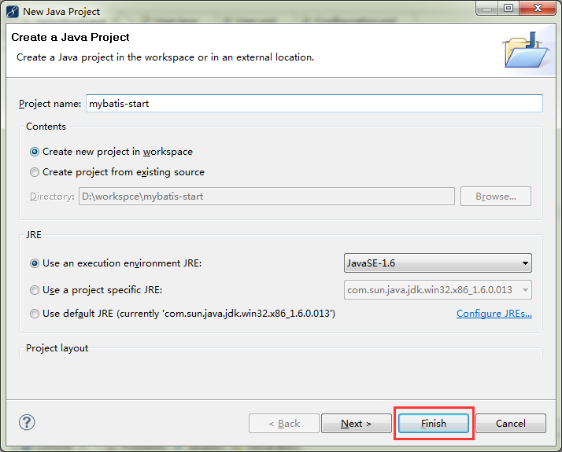
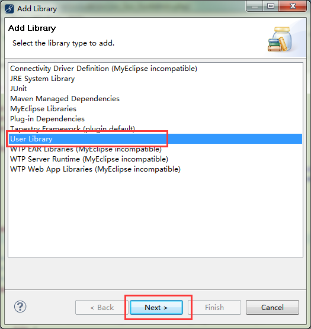
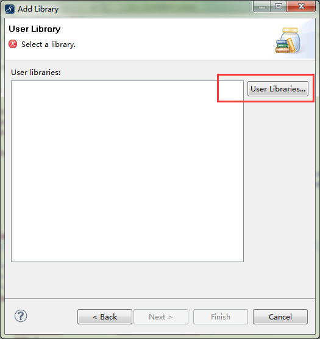
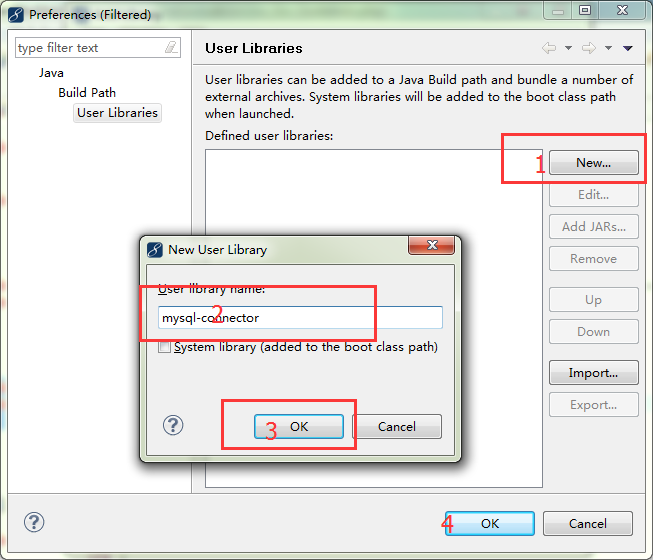
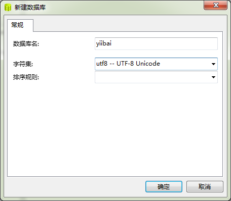
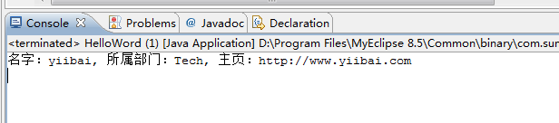

# MyBatis环境配置及入门 - MyBatis教程

Mybatis 开发环境搭建，选择: MyEclipse8.5 版本，mysql 5.5, jdk 1.8, mybatis3.2.3.jar 包。这些软件工具均可以到各自的官方网站上下载。

整个过程在概如下，

1\. 在本教程中，建立 [java](http://www.yiibai.com/java/) 工程，但一般都是开发 web 项目，这个系列教程最后是 web，但这里为了方便学习，本教程前面建立的都是 java 工程。
2\. 将 mybatis-3.2.3.jar，mysql-connector-java-5.1.25-bin.jar 创建两个用户自定库（User Libary）：mysql-connector 和 mybatis；
3\. 创建 [mysql](http://www.yiibai.com/mysql/) 测试数据库和用户表, 注意，数据库使用的是 utf-8 编码。以解决不必要的中文乱码问题。

### 一、创建 Java 工程

首先建立一个名字为 Helloword 的 java project。选择 "File" -&gt; "New" -&gt;"Java Project"，如下图所示：



这样就创建了一个 Java 工程了，我们继续下一步。接下来我们在 mybatis-start 项目中加入两个所需的程序库：mysql-connector 和 mybatis，右键点击 "mybatis-start" 项目，从弹出的菜单中选择： "Build Path" -&gt; "Add Libaries..." ，如下图所示：



从中选择“User Library"，点击“Next&gt;"，创建两个类库为：mysql-connector 和 mybatis，如下所示：



点击“User Libararies..."，继续下一步，创建一个新的类库，如下图所示：



到此用户的一个类库创建完成，以相同的方式来创建另一个类库：

### 二、创建数据库和 User 表

创建所需的数据库和表，要创建的数据库是：yiibai，并在 yiibai 数据库创建一个表：user，如下图所示：

创建数据库：yiibai，使用 utf-8 编码。



接下我们创建一个表：user，并插入一条记录信息，其结构如下所示：

```
CREATE TABLE `user` (
  `id` int(10) unsigned NOT NULL AUTO_INCREMENT,
  `name` varchar(64) NOT NULL DEFAULT '',
  `dept` varchar(254) NOT NULL DEFAULT '',
  `website` varchar(254) DEFAULT '',
  `phone` varchar(16) NOT NULL DEFAULT '',
  PRIMARY KEY (`id`)
) ENGINE=InnoDB AUTO_INCREMENT=2 DEFAULT CHARSET=latin1;

-- ----------------------------
-- Records of user
-- ----------------------------
INSERT INTO `user` VALUES ('1', 'yiibai', 'Tech', 'http://www.yiibai.com', '13800009988');
```

### 三、创建 Mybatis 配置文件


到此为止，前期准备工作就完成了。下面开始真正配置 mybatis-start 项目。设置 mybatis 配置文件: Configure.xml, 在 src/config 目录下建立此文件，内容如下:

```
<?xml version="1.0" encoding="UTF-8"?>
<!DOCTYPE configuration PUBLIC "-//mybatis.org//DTD Config 3.0//EN"
"http://mybatis.org/dtd/mybatis-3-config.dtd">
<configuration>
    <typeAliases>
        <typeAlias alias="User" type="com.yiibai.mybatis.models.User" />
    </typeAliases>
    <environments default="development">
        <environment id="development">
        <transactionManager type="JDBC" />
            <dataSource type="POOLED">  
                            <property name="driver" value="com.mysql.jdbc.Driver" />
                <property name="url" value="jdbc:mysql://127.0.0.1:3306/yiibai" />
                <property name="username" value="root" />
                <property name="password" value="" />
                       </dataSource>
        </environment>
    </environments>

    <mappers>
         <!-- // power by http://www.yiibai.com -->
         <mapper resource="com/yiibai/mybatis/models/User.xml" />
    </mappers>
</configuration>
```

### 四、创建实体类和映射文件

首先创建一个包：com.yiibai.mybatis.models，并在下创建与数据库表对应的 User.java 类及其映射文件：User.xml，详细如下图所示：

```
package com.yiibai.mybatis.models;

public class User {
    private int id;
    private String name;
    private String dept;
    private String phone;
    private String website;

    public String getWebsite() {
        return website;
    }
    public void setWebsite(String website) {
        this.website = website;
    }
    public int getId() {
        return id;
    }
    public void setId(int id) {
        this.id = id;
    }
    public String getName() {
        return name;
    }
    public void setName(String name) {
        this.name = name;
    }
    public String getDept() {
        return dept;
    }
    public void setDept(String dept) {
        this.dept = dept;
    }
    public String getPhone() {
        return phone;
    }
    public void setPhone(String phone) {
        this.phone = phone;
    }

}
```


同时建立这个 User 类对应的映射文件 User.xml，详细如下代码所示：

```
<?xml version="1.0" encoding="UTF-8"?>
<!DOCTYPE mapper PUBLIC "-//mybatis.org//DTD Mapper 3.0//EN"
"http://mybatis.org/dtd/mybatis-3-mapper.dtd">

<mapper namespace="com.yiibai.mybatis.models.UserMapper">
    <select id="GetUserByID" parameterType="int" resultType="User">
        select * from `user` where id = #{id}
    </select>
</mapper>
```

下面是对这几个配置文件一点解释说明：
1、配置文件 Configure.xml 是 mybatis 用来建立 sessionFactory，里面主要包含了数据库连接相关内容，还有 java 类所对应的别名，比如：<typeAlias alias="User" type="com.yiibai.mybatis.models.User"/> 这个别名非常重要，在具体的类的映射中，比如：User.xml 中 resultType 就是对应这个。要保持一致，这里的 resultType 还有另外单独的定义方式，后面学习到我们再详细介绍说明。
2、Configure.xml 里面 的<mapper resource="com/yiibai/mybatis/models/User.xml"/>是包含要映射的类的 xml 配置文件。
3、在User.xml 文件里面主要是定义各种 SQL 语句，以及这些语句的参数，以及要返回的类型等等。

### 五、运行程序测试结果

在 src 源码目录下建立 一个类叫作：HelloWord, 来运行测试配置环境是否成功，具体代码如下示：

```
import java.io.Reader;

import org.apache.ibatis.io.Resources;
import org.apache.ibatis.session.SqlSession;
import org.apache.ibatis.session.SqlSessionFactory;
import org.apache.ibatis.session.SqlSessionFactoryBuilder;

import com.yiibai.mybatis.models.*;

/**
 *
 * @author yiibai
 * @copyright http://www.yiibai.com
 * @date 2015/09/22
 */
public class HelloWord {
    private static SqlSessionFactory sqlSessionFactory;
    private static Reader reader;

    static {
        try {
            reader = Resources.getResourceAsReader("config/Configure.xml");
            sqlSessionFactory = new SqlSessionFactoryBuilder().build(reader);
        } catch (Exception e) {
            e.printStackTrace();
        }
    }
    public static SqlSessionFactory getSession() {
        return sqlSessionFactory;
    }
    /**
     * @param args
     */
    public static void main(String[] args) {
        // TODO Auto-generated method stub
        SqlSession session = sqlSessionFactory.openSession();
        try {
            User user = (User) session.selectOne(
                    "com.yiibai.mybatis.models.UserMapper.GetUserByID", 1);
            if(user!=null){
                String userInfo = "名字："+user.getName()+", 所属部门："+user.getDept()+", 主页："+user.getWebsite();
                System.out.println(userInfo);
            }
        } finally {
            session.close();
        }
    }

}
```

现在运行这个程序，不是得到查询结果了？正确的输出结果应该如下：

```
名字：yiibai, 所属部门：Tech, 主页：http://www.yiibai.com
```



恭喜你，环境搭建配置成功，在接下来章节，我们将学习 Mybatis 的操作方式：增删改查。

Jar 包下载：[http://pan.baidu.com/s/1bnyRJ9H](http://pan.baidu.com/s/1bnyRJ9H)


