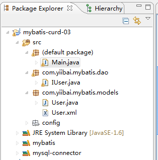

# Mybatis增删改查（CURD） - MyBatis教程

前面的小节我们已经讲到用接口的方式编程。使用这种方式，需要注意的一个地方就是，在User.xml  配置文件中，mapper namespace="com.yiibai.mybatis.inter.IUser" ，命名空间对应非常重要，名称不能有错，必须与我们定义的 package 和 接口一致。如果不一致就会出错，这一章主要在上一讲基于接口编程的基础上完成如下操作:
1\. 使用 mybatis 查询用户数据(读取用户列表)
2\. 使用 mybatis 增加用户数据
3\. 使用 mybatis 更新用户数据
4\. 使用 mybatis 删除用户数据

查询数据，前面已经讲过简单的查询单个用户数据，在这里将查询出用户列表，

要查询出列表，也就是返回 List, 在我们这个例子中也就是 List&lt;User&gt; , 要以这种方式返回数据，需要在 User.xml 里面配置返回的类型 resultMap, 注意不是 resultType, 而这个resultMap 所对应的应该是我们自己配置。

### 1、创建工程并配置所需环境

我们首先来创建一个工程：mybatis-curd-03，与第一节中介绍的环境配置一样，加入所需的 jar 包：mysql-connector 和 mybatis3.jar。配置 src/config/Configure.xml，其文件内容如下：

```
<?xml version="1.0" encoding="UTF-8"?>
<!DOCTYPE configuration PUBLIC "-//mybatis.org//DTD Config 3.0//EN"
"http://mybatis.org/dtd/mybatis-3-config.dtd">
<configuration>
    <typeAliases>
        <typeAlias alias="User" type="com.yiibai.mybatis.models.User" />
    </typeAliases>

    <environments default="development">
        <environment id="development">
            <transactionManager type="JDBC" />
            <dataSource type="POOLED">
                <property name="driver" value="com.mysql.jdbc.Driver" />
                <property name="url" value="jdbc:mysql://127.0.0.1:3306/test" />
                <property name="username" value="root" />
                <property name="password" value="" />
            </dataSource>
        </environment>
    </environments>

    <mappers>
        <!-- // power by http://www.yiibai.com -->
        <mapper resource="com/yiibai/mybatis/models/User.xml" />
    </mappers>
</configuration>
```

### 2、创建 Java 类和接口

在这里需要创建一个类和一个接口：User.java类和IUser.java接口，User.java类位于包 com.yiibai.mybatis.models 下，User.java类代码内容如下：

```
package com.yiibai.mybatis.models;

public class User {
    private int id;
    private String name;
    private String dept;
    private String phone;
    private String website;

    public String getWebsite() {
        return website;
    }
    public void setWebsite(String website) {
        this.website = website;
    }
    public int getId() {
        return id;
    }
    public void setId(int id) {
        this.id = id;
    }
    public String getName() {
        return name;
    }
    public void setName(String name) {
        this.name = name;
    }
    public String getDept() {
        return dept;
    }
    public void setDept(String dept) {
        this.dept = dept;
    }
    public String getPhone() {
        return phone;
    }
    public void setPhone(String phone) {
        this.phone = phone;
    }

}

```

IUser.java接口位于包 com.yiibai.mybatis.dao 下，IUser.java接口代码内容如下：

```
package com.yiibai.mybatis.dao;

import java.util.List;

import org.apache.ibatis.annotations.Select;

import com.yiibai.mybatis.models.User;
/**
 * 
 * @author yiibai
 *
 */
public interface IUser {
    //@Select("select * from user where id= #{id}")
    //public User getUserByID(int id);
    public List<User> getUserList();

    public void insertUser(User user);

    public void updateUser(User user);

    public void deleteUser(int userId);

    public User getUser(int id);
}

```

这里还需要一个XML文件，与前一小节中一样，使用的是 User.xml，在这其中， 我们分别对应了增删改查的操作（每一个操作的 ID 对应于IUser接口的方法），其内容如下： 

```
import java.io.Reader;
import java.text.MessageFormat;
import java.util.List;

import org.apache.ibatis.io.Resources;
import org.apache.ibatis.session.SqlSession;
import org.apache.ibatis.session.SqlSessionFactory;
import org.apache.ibatis.session.SqlSessionFactoryBuilder;

import com.yiibai.mybatis.dao.IUser;
import com.yiibai.mybatis.models.User;

public class Main {
    private static SqlSessionFactory sqlSessionFactory;
    private static Reader reader;

    static {
        try {
            reader = Resources.getResourceAsReader("config/Configure.xml");
            sqlSessionFactory = new SqlSessionFactoryBuilder().build(reader);
        } catch (Exception e) {
            e.printStackTrace();
        }
    }

    public static SqlSessionFactory getSession() {
        return sqlSessionFactory;
    }

    /**
     * @param args
     */
    public static void main(String[] args) {
        // TODO Auto-generated method stub
        SqlSession session = sqlSessionFactory.openSession();
        try {
            //User user = (User) session.selectOne(
            //        "com.yiibai.mybatis.models.UserMapper.getUserByID", 1);
            IUser iuser = session.getMapper(IUser.class);
            // 用户数据列表
            //getUserList();
            // 插入数据
            //testInsert();
            //testUpdate();

            // 删除数据
            testDelete();

        } finally {
            session.close();
        }
    }
    // 
    public static void testInsert()
    {
        try
        {
            // 获取Session连接
            SqlSession session = sqlSessionFactory.openSession();
            // 获取Mapper
            IUser userMapper = session.getMapper(IUser.class);
            System.out.println("Test insert start...");
            // 执行插入
            User user = new User();
            user.setId(0);
            user.setName("Google");
            user.setDept("Tech");
            user.setWebsite("http://www.google.com");
            user.setPhone("120");
            userMapper.insertUser(user);
            // 提交事务
            session.commit();

            // 显示插入之后User信息
            System.out.println("
After insert");
            getUserList();
            System.out.println("Test insert finished...");
        }
        catch (Exception e)
        {
            e.printStackTrace();
        }
    }

    // 获取用户列表
    public static void getUserList(){
        try
        {
            SqlSession session = sqlSessionFactory.openSession();
            IUser iuser = session.getMapper(IUser.class);
            // 显示User信息
            System.out.println("Test Get start...");
            printUsers(iuser.getUserList());
            System.out.println("Test Get finished...");
        }catch (Exception e)
        {
            e.printStackTrace();
        }
    }
    public static void testUpdate()
    {
        try
        {
            SqlSession session = sqlSessionFactory.openSession();
            IUser iuser = session.getMapper(IUser.class);
            System.out.println("Test update start...");
            printUsers(iuser.getUserList());
            // 执行更新
            User user = iuser.getUser(1);
            user.setName("New name");
            iuser.updateUser(user);
            // 提交事务
            session.commit();
            // 显示更新之后User信息
            System.out.println("
After update");
            printUsers(iuser.getUserList());
            System.out.println("Test update finished...");
        }catch (Exception e)
        {
            e.printStackTrace();
        }
    }
    // 删除用户信息
    public static void testDelete()
    {
        try
        {
            SqlSession session = sqlSessionFactory.openSession();
            IUser iuser = session.getMapper(IUser.class);
            System.out.println("Test delete start...");
            // 显示删除之前User信息
            System.out.println("Before delete");
            printUsers(iuser.getUserList());
            // 执行删除
            iuser.deleteUser(3);
            // 提交事务
            session.commit();
            // 显示删除之后User信息
            System.out.println("
After delete");
            printUsers(iuser.getUserList());
            System.out.println("Test delete finished...");
        }catch (Exception e)
        {
            e.printStackTrace();
        }
    }
    /**
     * 
     * 打印用户信息到控制台
     * 
     * @param users
     */
    private static void printUsers(final List<User> users)
    {
        int count = 0;

        for (User user : users)
        {
            System.out.println(MessageFormat.format("============= User[{0}]=================", ++count));
            System.out.println("User Id: " + user.getId());
            System.out.println("User Name: " + user.getName());
            System.out.println("User Dept: " + user.getDept());
            System.out.println("User Website: " + user.getWebsite());
        }
    }
}

```

执行以上程序，如果没有问题，应该能正确输出。那么这里所有增删改查都完成了，需要注意的是在增加，更改，删除的时候需要调用 session.commit() 来提交事务，这样才会真正对数据库进行操作提交保存，否则操作没有提交到数据中。
到此为止，简单的单表操作已经完成了，接下来在下一节中将会讲解多表联合查询，以及结果集的选取。 如遇到不明白的问题，请留言评论。

最后，附上工程结果图，如下：



