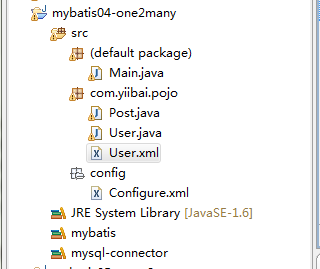

# Mybatis表关联一对多 - MyBatis教程

有了前面几章的基础，对一些简单的应用是可以处理的，但在实际项目中，经常是关联表的查询，比如：最常见到的多对一，一对多等。这些查询是如何处理的呢，这一讲就讲这个问题。前面几篇教程中介绍的都是单表映射的一些操作，然而在我们的实际项目中往往是用到多表映射。在Java实体对象对中，一对多可以根据List和Set来实现，两者在mybitis中都是通过collection标签来配合来加以实现。这篇介绍的是多表中的多对一表关联查询。

**应用场景：**首先根据用户 ID 读取一个用户信息，然后再读取这个用户所发布贴子(post)。

### 1、先做一些准备工作

我们首先在创建一个 java 工程，工程名称为：mybatis04-one2many([下载](http://pan.baidu.com/s/1pJIeU0b))，还需要创建两张表，它们分别是用户表 user，和帖子表 post，一个户用户可以有多个帖子。
**user表的结构和数据：**

```
-- ----------------------------
-- Table structure for `user`
-- ----------------------------
CREATE TABLE `user` (
  `id` int(10) unsigned NOT NULL AUTO_INCREMENT,
  `username` varchar(64) NOT NULL DEFAULT '',
  `mobile` int(10) unsigned NOT NULL DEFAULT '0',
  `created` datetime NOT NULL DEFAULT '0000-00-00 00:00:00',
  PRIMARY KEY (`id`)
) ENGINE=InnoDB AUTO_INCREMENT=2 DEFAULT CHARSET=utf8;

-- ----------------------------
-- Records of user
-- ----------------------------
INSERT INTO `user` VALUES ('1', 'yiibai', '100', '2015-09-23 20:11:23');
```

**帖子表 post 的结构和数据：**

```
-- ----------------------------
-- Table structure for `post`
-- ----------------------------
CREATE TABLE `post` (
  `post_id` int(10) unsigned NOT NULL AUTO_INCREMENT,
  `userid` int(10) unsigned NOT NULL,
  `title` varchar(254) NOT NULL DEFAULT '',
  `content` text,
  `created` datetime NOT NULL DEFAULT '0000-00-00 00:00:00',
  PRIMARY KEY (`post_id`)
) ENGINE=InnoDB AUTO_INCREMENT=4 DEFAULT CHARSET=utf8;

-- ----------------------------
-- Records of post
-- ----------------------------
INSERT INTO `post` VALUES ('1', '1', 'MyBatis关联数据查询', '在实际项目中，经常使用关联表的查询，比如：多对一，一对多等。这些查询是如何处理的呢，这一讲就讲这个问题。我们首先创建一个 post 表，并初始化数据.', '2015-09-23 21:40:17');
INSERT INTO `post` VALUES ('2', '1', 'MyBatis开发环境搭建', '为了方便学习，这里直接建立java 工程，但一般都是开发 Web 项目。', '2015-09-23 21:42:14');
INSERT INTO `post` VALUES ('3', '2', '这个是别人发的', 'content,内容...', '0000-00-00 00:00:00');  
```

从上面应该看出，这几个帖子对应的 userid 都是1，所以需要用户表 user 里面有 id=1 的数据。可以修改成满足自己条件的数据，按照orm的规则，表肯定需要一个对象与之对应，所以我们增加一个 Post 类。

### 2、创建表对应的 JavaBean 对象

这个例子中，我们需要在包 com.yiibai.pojo 下创建两个类，它们分别是： User.java 和 Post.java，我们一个一个地来看它们的代码，User.java 类的代码如下：

```
package com.yiibai.pojo;

import java.io.Serializable;
import java.util.Date;
import java.util.List;

public class User implements Serializable{
    private int id;
    private String username;
    private String mobile;
    private List<Post> posts;

    public int getId() {
        return id;
    }

    public void setId(int id) {
        this.id = id;
    }

    public String getUsername() {
        return username;
    }

    public void setUsername(String username) {
        this.username = username;
    }

    public String getMobile() {
        return mobile;
    }

    public void setMobile(String mobile) {
        this.mobile = mobile;
    }

    public List<Post> getPosts() {
        return posts;
    }
    public void setPosts(List<Post> posts) {
        this.posts = posts;
    }

    @Override
    public String toString() {
        return "User [id=" + id + ", name=" + username + "]";
    }

}

```

Post.java 类的代码如下：

```
package com.yiibai.pojo;

import java.io.Serializable;

public class Post implements Serializable{
    private int id;
    private User user;
    private String title;
    private String content;

    public int getId() {
        return id;
    }

    public void setId(int id) {
        this.id = id;
    }

    public User getUser() {
        return user;
    }

    public void setUser(User user) {
        this.user = user;
    }

    public String getTitle() {
        return title;
    }

    public void setTitle(String title) {
        this.title = title;
    }

    public String getContent() {
        return content;
    }

    public void setContent(String content) {
        this.content = content;
    }
}
```

### 3、配置文件

在这一章节中，要用到的配置文件有两个，一个是 mybatis 的主配置文件：src/config/Configure.xml 和 User.java对应的配置文件 User.xml，我们先来看看 src/config/Configure.xml，其详细配置信息如下：

```
<?xml version="1.0" encoding="UTF-8"?>
<!DOCTYPE configuration PUBLIC "-//mybatis.org//DTD Config 3.0//EN"
"http://mybatis.org/dtd/mybatis-3-config.dtd">
<configuration>
    <typeAliases>
        <typeAlias alias="User" type="com.yiibai.pojo.User" />
        <typeAlias alias="Post" type="com.yiibai.pojo.Post" />
    </typeAliases>

    <environments default="development">
        <environment id="development">
            <transactionManager type="JDBC" />
            <dataSource type="POOLED">
                <property name="driver" value="com.mysql.jdbc.Driver" />
                <property name="url" value="jdbc:mysql://127.0.0.1:3306/yiibai" />
                <property name="username" value="root" />
                <property name="password" value="" />
            </dataSource>
        </environment>
    </environments>

    <mappers>
        <!-- // power by http://www.yiibai.com -->
        <mapper resource="com/yiibai/pojo/User.xml" />
    </mappers>
</configuration>
```

这里需要注意的是 <typeAliases> 这个标签内容，它就是用于定义一个 JavaBean 类的别名，如将 com.yiibai.pojo.User 简写为 User，可以认为  com.yiibai.pojo.User 就是 User，User 就是  com.yiibai.pojo.User 。

另外一个配置文件 User.xml 的内容如下：

```
<?xml version="1.0" encoding="UTF-8"?>
<!DOCTYPE mapper PUBLIC "-//mybatis.org//DTD Mapper 3.0//EN" 
"http://mybatis.org/dtd/mybatis-3-mapper.dtd">

<mapper namespace="com.yiibai.userMaper">
    <!-- User 级联文章查询 方法配置 (一个用户对多个文章)  -->

    <resultMap type="User" id="resultUserMap">
        <result property="id" column="user_id" />
        <result property="username" column="username" />
        <result property="mobile" column="mobile" />
        <collection property="posts" ofType="com.yiibai.pojo.Post" column="userid">
            <id property="id" column="post_id" javaType="int" jdbcType="INTEGER"/>    
            <result property="title" column="title" javaType="string" jdbcType="VARCHAR"/>
            <result property="content" column="content" javaType="string" jdbcType="VARCHAR"/> 
        </collection>
    </resultMap>

    <select id="getUser" resultMap="resultUserMap" parameterType="int">
        SELECT u.*,p.*
        FROM user u, post p
        WHERE u.id=p.userid AND id=#{user_id} 
  </select>

</mapper>
```

### 4、测试程序运行

到这里，整个工作准备得已经差不多了，我们创建一个主类来测试上面程序，在 src 下创建一个 Main.java，代码如下：

```
import java.io.Reader;
import java.text.MessageFormat;
import java.util.List;

import org.apache.ibatis.io.Resources;
import org.apache.ibatis.session.SqlSession;
import org.apache.ibatis.session.SqlSessionFactory;
import org.apache.ibatis.session.SqlSessionFactoryBuilder;

import com.yiibai.pojo.Post;
import com.yiibai.pojo.User;

public class Main {
    private static SqlSessionFactory sqlSessionFactory;
    private static Reader reader;

    static {
        try {
            reader = Resources.getResourceAsReader("config/Configure.xml");
            sqlSessionFactory = new SqlSessionFactoryBuilder().build(reader);
        } catch (Exception e) {
            e.printStackTrace();
        }
    }

    public static SqlSessionFactory getSession() {
        return sqlSessionFactory;
    }

    /**
     * @param args
     */
    public static void main(String[] args) {
        // TODO Auto-generated method stub
        SqlSession session = sqlSessionFactory.openSession();
        try {
            int userid = 1;
            User user = session.selectOne("com.yiibai.userMaper.getUser", 1); 
             System.out.println("username: "+user.getUsername()+",");
                     List<Post> posts = user.getPosts();  
                     for(Post p : posts) {
                         System.out.println("Title:" + p.getTitle()); 
                         System.out.println("Content:" + p.getContent());                
                      }  
         } finally {
            session.close();
         }
    }

}
```

输出结果如下：

```
username: yiibai,
Title:MyBatis关联数据查询
Content:在实际项目中，经常使用关联表的查询，比如：多对一，一对多等。这些查询是如何处理的呢，这一讲就讲这个问题。我们首先创建一个 post 表，并初始化数据.
Title:MyBatis开发环境搭建
Content:为了方便学习，这里直接建立java 工程，但一般都是开发 Web 项目。
```

**附工程目录结构图如下：**



