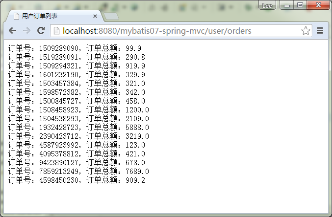

# MyBatis整合Spring MVC - MyBatis教程

前面几篇文章已经讲到了mybatis与spring 的集成。目前主流的Web MVC框架，除了Struts这个主力外，还有Spring MVC，主要是由于 Spring MVC 配置比较简单，使用起来也十分明了，非常灵活，与Spring 集成较好，对 RESTful API 的支持也比 struts 要好。所以Spring MVC在一定程度上有一定的优势。
MyBatis是ibatis的升级版，作为hibernate的老对手，它是一个可以自定义SQL、存储过程和高级映射的持久层框架。
与Hibernate 的主要区别就是 Mybatis 是半自动化的，而 Hibernate 是全自动的，所以当应用需求越来越复杂的时候，自动化的 SQL 显得比较笨拙。
经常搭框架的人应该都清楚，框架搭建的核心就是配置文件。

在这里我们需要创建 web 工程。今天将直接用 mybatis与Spring mvc 的方式集成起来，源码在本文结尾处下载.主要有以下几个方面的配置。

**整个Mybatis与Spring MVC 示例要完成的步骤如下：**

1、示例功能描述

2、创建工程

3、数据库表结构及数据记录

4、实例对象

5、配置文件

6、测试执行，输出结果

## 1、示例功能描述

在本示例中，需要使用 MyBatis和Spring MVC整合完成这样的一个简单功能，即指定一个用户（ID=1），查询出这个用户关联的所有订单。

## 2、创建工程

首先创建一个工程的名称为：mybatis07-spring-mvc，在 src 源代码目录下建立文件夹 config，并将原来的 mybatis 配置文件 Configuration.xml 移动到这个文件夹中, 并在 config 文家夹中建立 Spring 配置文件：applicationContext.xml。工程结构目录如下：


## 3、数据库表结构及数据记录

在本示例中，用到两个表：用户表和订单表，其结构和数据记录如下：

```
CREATE TABLE `user` (
  `id` int(10) unsigned NOT NULL AUTO_INCREMENT,
  `username` varchar(64) NOT NULL DEFAULT '',
  `mobile` varchar(16) NOT NULL DEFAULT '',
  PRIMARY KEY (`id`)
) ENGINE=InnoDB AUTO_INCREMENT=3 DEFAULT CHARSET=utf8;

-- ----------------------------
-- Records of user
-- ----------------------------
INSERT INTO `user` VALUES ('1', 'yiibai', '13838009988');
INSERT INTO `user` VALUES ('2', 'saya', '13838009988');
```

订单表结构和数据如下：

```
CREATE TABLE `order` (
  `order_id` int(10) unsigned NOT NULL AUTO_INCREMENT,
  `user_id` int(10) unsigned NOT NULL DEFAULT '0',
  `order_no` varchar(16) NOT NULL DEFAULT '',
  `money` float(10,2) unsigned DEFAULT '0.00',
  PRIMARY KEY (`order_id`)
) ENGINE=InnoDB AUTO_INCREMENT=17 DEFAULT CHARSET=utf8;

-- ----------------------------
-- Records of order
-- ----------------------------
INSERT INTO `order` VALUES ('1', '1', '1509289090', '99.90');
INSERT INTO `order` VALUES ('2', '1', '1519289091', '290.80');
INSERT INTO `order` VALUES ('3', '1', '1509294321', '919.90');
INSERT INTO `order` VALUES ('4', '1', '1601232190', '329.90');
INSERT INTO `order` VALUES ('5', '1', '1503457384', '321.00');
INSERT INTO `order` VALUES ('6', '1', '1598572382', '342.00');
INSERT INTO `order` VALUES ('7', '1', '1500845727', '458.00');
INSERT INTO `order` VALUES ('8', '1', '1508458923', '1200.00');
INSERT INTO `order` VALUES ('9', '1', '1504538293', '2109.00');
INSERT INTO `order` VALUES ('10', '1', '1932428723', '5888.00');
INSERT INTO `order` VALUES ('11', '1', '2390423712', '3219.00');
INSERT INTO `order` VALUES ('12', '1', '4587923992', '123.00');
INSERT INTO `order` VALUES ('13', '1', '4095378812', '421.00');
INSERT INTO `order` VALUES ('14', '1', '9423890127', '678.00');
INSERT INTO `order` VALUES ('15', '1', '7859213249', '7689.00');
INSERT INTO `order` VALUES ('16', '1', '4598450230', '909.20');
```

## 4、实例对象

用户表和订单表分别对应两个实例对象，分别是：User.java 和 Order.java，它们都在 com.yiibai.pojo 包中。

User.java代码内容如下：

```
package com.yiibai.pojo;

import java.util.List;

/** 
 * @describe: User
 * @author: Yiibai 
 * @version: V1.0
 * @copyright http://www.yiibai.com
 */  
public class User {
    private int id;
    private String username;
    private String mobile;

    public int getId() {
        return id;
    }
    public void setId(int id) {
        this.id = id;
    }
    public String getUsername() {
        return username;
    }
    public void setUsername(String username) {
        this.username = username;
    }
    public String getMobile() {
        return mobile;
    }
    public void setMobile(String mobile) {
        this.mobile = mobile;
    }

}

```

Order.java代码内容如下：

```
package com.yiibai.pojo;

/**
 * @describe: User - 订单
 * @author: Yiibai
 * @version: V1.0
 * @copyright http://www.yiibai.com
 */
public class Order {
    private int orderId;
    private String orderNo;
    private float money;
    private int userId;
    private User user;

    public int getUserId() {
        return userId;
    }
    public void setUserId(int userId) {
        this.userId = userId;
    }
    public int getOrderId() {
        return orderId;
    }
    public void setOrderId(int orderId) {
        this.orderId = orderId;
    }
    public User getUser() {
        return user;
    }
    public void setUser(User user) {
        this.user = user;
    }
    public String getOrderNo() {
        return orderNo;
    }
    public void setOrderNo(String orderNo) {
        this.orderNo = orderNo;
    }
    public float getMoney() {
        return money;
    }
    public void setMoney(float money) {
        this.money = money;
    }

}
```

## 5、配置文件

这个实例中有三个重要的配置文件，它们分别是：applicationContext.xml ， Configuration.xml 以及 UserMaper.xml。

applicationContext.xml  配置文件里最主要的配置：

```
<?xml version="1.0" encoding="utf-8"?>
<beans xmlns="http://www.springframework.org/schema/beans"
    xmlns:xsi="http://www.w3.org/2001/XMLSchema-instance" xmlns:aop="http://www.springframework.org/schema/aop"
    xmlns:tx="http://www.springframework.org/schema/tx" xmlns:context="http://www.springframework.org/schema/context"
    xmlns:p="http://www.springframework.org/schema/p"
    xsi:schemaLocation="  
            http://www.springframework.org/schema/beans http://www.springframework.org/schema/beans/spring-beans-3.0.xsd  
            http://www.springframework.org/schema/aop http://www.springframework.org/schema/aop/spring-aop-3.0.xsd  
            http://www.springframework.org/schema/context http://www.springframework.org/schema/context/spring-context-3.0.xsd  
            http://www.springframework.org/schema/jee http://www.springframework.org/schema/jee/spring-jee-3.0.xsd  
            http://www.springframework.org/schema/tx http://www.springframework.org/schema/tx/spring-tx-3.0.xsd"
    default-autowire="byName" default-lazy-init="false">

    <!--本示例采用DBCP连接池，应预先把DBCP的jar包复制到工程的lib目录下。 -->
    <context:property-placeholder location="classpath:/config/database.properties" />

    <bean id="dataSource" class="org.apache.commons.dbcp.BasicDataSource"
        destroy-method="close" p:driverClassName="com.mysql.jdbc.Driver"
        p:url="jdbc:mysql://127.0.0.1:3306/yiibai?characterEncoding=utf8"
        p:username="root" p:password="" p:maxActive="10" p:maxIdle="10">
    </bean>

    <bean id="transactionManager"
        class="org.springframework.jdbc.datasource.DataSourceTransactionManager">
        <property name="dataSource" ref="dataSource" />
    </bean>

    <bean id="sqlSessionFactory" class="org.mybatis.spring.SqlSessionFactoryBean">
        <!--dataSource属性指定要用到的连接池-->
        <property name="dataSource" ref="dataSource" />
        <!--configLocation属性指定mybatis的核心配置文件-->
        <property name="configLocation" value="classpath:config/Configuration.xml" />
        <!-- 所有配置的mapper文件 -->
        <property name="mapperLocations" value="classpath*:com/yiibai/mapepr/*.xml" />
    </bean>

    <bean class="org.mybatis.spring.mapper.MapperScannerConfigurer">
        <property name="basePackage" value="com.yiibai.maper" />
    </bean>
</beans> 

```

配置文件 Configuration.xml 的内容如下：

```
<?xml version="1.0" encoding="UTF-8" ?>
<!DOCTYPE configuration PUBLIC "-//mybatis.org//DTD Config 3.0//EN"
"http://mybatis.org/dtd/mybatis-3-config.dtd">
<configuration>
    <typeAliases> 
        <typeAlias alias="User" type="com.yiibai.pojo.User"/>
        <typeAlias alias="Order" type="com.yiibai.pojo.Order"/>  
    </typeAliases> 
    <!-- 与spring 集成之后,这些可以完全删除,数据库连接的管理交给 spring 去管理 -->
    <!-- 
    <environments default="development">
        <environment id="development">
        <transactionManager type="JDBC"/>
            <dataSource type="POOLED">
            <property name="driver" value="com.mysql.jdbc.Driver"/>
            <property name="url" value="jdbc:mysql://127.0.0.1:3306/mybatis?characterEncoding=utf8" />
            <property name="username" value="root"/>
            <property name="password" value="password"/>
            </dataSource>
        </environment>
    </environments>
    -->

    <!-- 这里交给sqlSessionFactory 的 mapperLocations属性去得到所有配置信息 -->
    <!-- 
    <mappers>
        <mapper resource="com/yihaomen/mapper/User.xml"/>
    </mappers>
    --> 

</configuration>
```

UserMaper.xml 用于定义查询和数据对象映射，其内容如下：

```
<?xml version="1.0" encoding="UTF-8" ?>
<!DOCTYPE mapper PUBLIC "-//mybatis.org//DTD Mapper 3.0//EN" 
"http://mybatis.org/dtd/mybatis-3-mapper.dtd">
<mapper namespace="com.yiibai.maper.UserMaper">

        <!-- 为了返回list 类型而定义的returnMap -->
    <resultMap type="User" id="resultUser">
        <id column="id" property="id" />
        <result column="username" property="username" />
        <result column="mobile" property="mobile" />
    </resultMap>

    <!-- User 联合 Order 查询 方法的配置 (多对一的方式)  -->    
    <resultMap id="resultUserOrders" type="Order">
        <id property="orderId" column="order_id" />
        <result property="orderNo" column="order_no" />
        <result property="money" column="money" />
        <result property="userId" column="user_id" />

        <association property="user" javaType="User">
            <id property="id" column="id" />
            <result property="username" column="username" />
            <result property="mobile" column="mobile" />            
        </association>        
    </resultMap> 

    <select id="getUserOrders" parameterType="int" resultMap="resultUserOrders">
       SELECT u.*,o.* FROM `user` u, `order` o 
              WHERE u.id=o.user_id AND u.id=#{id}
    </select>

    <select id="getUserById" resultMap="resultUser" parameterType="int">
        SELECT *
        FROM user
        WHERE id=#{id}
    </select>    
</mapper>
```

## 6、测试执行，输出结果

我们创建一个控制器类在包 com.yiibai.controller 下，类的名称为：UserController.java，其代码如下：

```
package com.yiibai.controller;

import java.util.List;

import javax.servlet.http.HttpServletRequest;
import javax.servlet.http.HttpServletResponse;
import org.springframework.beans.factory.annotation.Autowired;
import org.springframework.stereotype.Controller;
import org.springframework.web.bind.annotation.RequestMapping;
import org.springframework.web.servlet.ModelAndView;

import com.yiibai.maper.UserMaper;
import com.yiibai.pojo.Order;

/** 
 * @describe: 读取一个用户下的所有订单
 * @author: Yiibai 
 * @version: V1.0
 * @copyright http://www.yiibai.com
 */ 

// http://localhost:8080/mybatis07-spring-mvc/user/orders
@Controller
@RequestMapping("/user")
public class UserController {
    @Autowired
    UserMaper userMaper;

    @RequestMapping("/orders")
    public ModelAndView listall(HttpServletRequest request,HttpServletResponse response){
        List<Order> orders=userMaper.getUserOrders(1); 
        System.out.println("orders");
        ModelAndView mav=new ModelAndView("user_orders");
        mav.addObject("orders",orders);
        return mav;
    }
}

```

接下来还需要创建一个 web 页面作为结果输出，在目录 WebRoot/WEB-INF/pages 下创建一个名为 user_orders.jsp 文件，其代码如下：

```
<%@ page language="java" contentType="text/html; charset=UTF-8"
    pageEncoding="UTF-8"%>
<%@ taglib prefix="c" uri="http://java.sun.com/jsp/jstl/core"%>
<!DOCTYPE html PUBLIC "-//W3C//DTD HTML 4.01 Transitional//EN" "http://www.w3.org/TR/html4/loose.dtd">
<html>
    <head>
        <meta http-equiv="Content-Type" content="text/html; charset=UTF-8" />
        <title>用户订单列表</title>
    </head>
    <body>
        <c:forEach items="${orders}" var="order">  
        订单号：${order.orderNo }，订单总额：${order.money }<br />
        </c:forEach>
    </body>
</html>
```

然后启动 MyEclipse 中的 tomcat，具体如下图所示：


注：web.xml 还需要配置一下，详细见下载代码。

在浏览器中打开网址：http://localhost:8080/mybatis07-spring-mvc/user/orders，输出结果如下图所示：



工程代码下载：[http://pan.baidu.com/s/1bnkE8cZ](http://pan.baidu.com/s/1bnkE8cZ)

Jar 包下载：[http://pan.baidu.com/s/1bnyRJ9H](http://pan.baidu.com/s/1bnyRJ9H)

