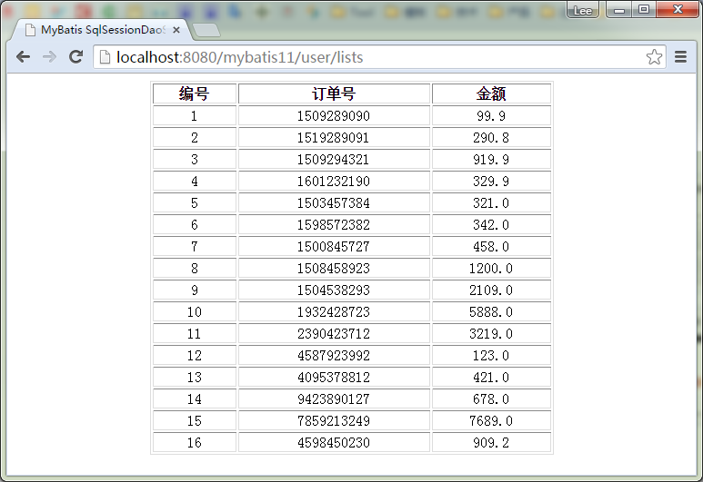

# MyBatis SqlSessionDaoSupport实例 - MyBatis教程

在前面的章节中，我们已经讲到了基本的 mybatis 操作，但都是基于 mapper 隐射操作的，在 mybatis3 中这个 mapper 接口貌似充当了以前在ibatis 2中的 DAO 层的作用。但事实上，如果有这个mapper接口不能完成的工作，或者需要更复杂的扩展的时候，我们就需要自己写 DAO 层。 mybatis 3 也是支持 DAO 层设计的，类似于 ibatis2。下面我们结合一个实例来介绍。

首页我们创建一个工程为：mybatis11，再创建一个 com.yihaomen.dao 包，然后在里面分别创建接口UserDAO，并实现该接口 UserDAOImpl 。整个工程的目录结构如下：


UserDao接口的代码如下：

```
package com.yiibai.dao;

import java.util.List;

import com.yiibai.pojo.Order;

public interface UserDAO {
    public List<Order> getUserOrders(int userId);
}

```

UserDaoImpl 实现UserDao接口的代码如下：

```
package com.yiibai.dao;

import java.util.List;

import org.mybatis.spring.support.SqlSessionDaoSupport;
import org.springframework.stereotype.Repository;

import com.yiibai.pojo.Order;

@Repository
public class UserDAOImpl extends SqlSessionDaoSupport implements UserDAO {
    public List<Order> getUserOrders(int userId) {
        // TODO Auto-generated method stub
        return this.getSqlSession().selectList("com.yiibai.inter.IUser.getUserOrders",userId);
    }
}
```

控制类 UserController.java 的代码如下：

```
package com.yiibai.controller;

import java.util.List;

import javax.servlet.http.HttpServletRequest;
import javax.servlet.http.HttpServletResponse;
import org.springframework.beans.factory.annotation.Autowired;
import org.springframework.stereotype.Controller;
import org.springframework.web.bind.annotation.RequestMapping;
import org.springframework.web.servlet.ModelAndView;

import com.yiibai.dao.UserDAO;
import com.yiibai.pojo.Order;
import com.yiibai.util.Page;

// http://localhost:8080/mybatis08-paging/user/orders
@Controller
@RequestMapping("/user")
public class UserController {
    //UserMaper userMaper;

    @Autowired
    UserDAO userDao;

    /**
     * 某一个用户下的所有订单（Dao方式）
     * URL => http://localhost:8080/mybatis11/user/lists
     * 
     * @param request
     * @param response
     * @return
     */
    @RequestMapping("/lists")
    public ModelAndView listalldao(HttpServletRequest request,
            HttpServletResponse response) {
        List<Order> orders = this.userDao.getUserOrders(1);
        // 制定视图 =>list.jsp
        ModelAndView mav = new ModelAndView("lists");
        mav.addObject("orders", orders);
        return mav;
    }

}
```

下一步，我们运行检验结果（根据用户ID，读取这个用户的所有订单），打开浏览器，输入网址：http://localhost:8080/mybatis11/user/lists ，结果如下图所示：



工程 mybatis11 的代码下载：[http://pan.baidu.com/s/1sjrEL9V](http://pan.baidu.com/s/1sjrEL9V)

Jar 包下载：[http://pan.baidu.com/s/1bnyRJ9H](http://pan.baidu.com/s/1bnyRJ9H)

