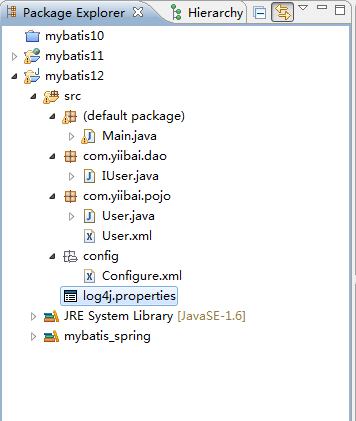

# MyBatis打印输出SQL语句 - MyBatis教程

Hibernate是可以配置 show_sql 显示 自动生成的SQL 语句，用 format_sql 可以格式化SQL 语句，但如果用 mybatis 怎么实现这个功能呢？如果你搜索看一下，基本都是通过配置日志来实现的，比如配置我们最常用的 log4j.properties 来实现。

首页我们创建一个 java 工程叫作：mybatis12，内容与之前 Mybatis+Spring 差不多，实现一个通过指定用户ID并读取其订单列表，来观察SQL的执行情况。其工程目录结构如下：



log4j.properties 内容如下：

```
# by yiibai.com
log4j.rootLogger=debug,stdout,logfile
log4j.appender.stdout=org.apache.log4j.ConsoleAppender
#log4j.appender.stdout.Target=System.err
log4j.appender.stdout.layout=org.apache.log4j.SimpleLayout
log4j.appender.logfile=org.apache.log4j.FileAppender
log4j.appender.logfile.File=C:/mybatis_show_sql.log
log4j.appender.logfile.layout=org.apache.log4j.PatternLayout
log4j.appender.logfile.layout.ConversionPattern=%d{yyyy-MM-dd HH:mm:ss} %F %p %m%n

log4j.logger.com.ibatis=DEBUG
log4j.logger.com.ibatis.common.jdbc.SimpleDataSource=DEBUG
log4j.logger.com.ibatis.common.jdbc.ScriptRunner=DEBUG
log4j.logger.com.ibatis.sqlmap.engine.impl.SqlMapClientDelegate=DEBUG
log4j.logger.java.sql.Connection=DEBUG
log4j.logger.java.sql.Statement=DEBUG
log4j.logger.java.sql.PreparedStatement=DEBUG

```

主类测试代码如下：

```
import java.io.Reader;
import java.text.MessageFormat;
import java.util.List;

import org.apache.ibatis.io.Resources;
import org.apache.ibatis.session.SqlSession;
import org.apache.ibatis.session.SqlSessionFactory;
import org.apache.ibatis.session.SqlSessionFactoryBuilder;

import com.yiibai.dao.IUser;
import com.yiibai.pojo.User;

public class Main {
    private static SqlSessionFactory sqlSessionFactory;
    private static Reader reader;

    static {
        try {
            reader = Resources.getResourceAsReader("config/Configure.xml");
            sqlSessionFactory = new SqlSessionFactoryBuilder().build(reader);
        } catch (Exception e) {
            e.printStackTrace();
        }
    }

    public static SqlSessionFactory getSession() {
        return sqlSessionFactory;
    }

    /**
     * @param args
     */
    public static void main(String[] args) {
        // TODO Auto-generated method stub
        SqlSession session = sqlSessionFactory.openSession();
        try {
            //User user = (User) session.selectOne(
            //        "com.yiibai.mybatis.models.UserMapper.getUserByID", 1);
            IUser iuser = session.getMapper(IUser.class);
            getUserList();
            //testInsert();
            testUpdate();
            //testDelete();

        } finally {
            session.close();
        }
    }
    // 
    public static void testInsert()
    {
        try
        {
            SqlSession session = sqlSessionFactory.openSession();
            IUser userMapper = session.getMapper(IUser.class);
            System.out.println("Test insert start...");
            User user = new User();
            user.setId(0);
            user.setName("Google");
            user.setDept("Tech");
            user.setWebsite("http://www.google.com");
            user.setPhone("120");
            userMapper.insertUser(user);
            session.commit();

            System.out.println("\r\nAfter insert");
            getUserList();
            System.out.println("Test insert finished...");
        }
        catch (Exception e)
        {
            e.printStackTrace();
        }
    }

    // 用户列表
    public static void getUserList(){
        try
        {
            SqlSession session = sqlSessionFactory.openSession();
            IUser iuser = session.getMapper(IUser.class);
            System.out.println("Test Get start...");
            printUsers(iuser.getUserList());
            System.out.println("Test Get finished...");
        }catch (Exception e)
        {
            e.printStackTrace();
        }
    }
    public static void testUpdate()
    {
        try
        {
            SqlSession session = sqlSessionFactory.openSession();
            IUser iuser = session.getMapper(IUser.class);
            System.out.println("Test update start...");
            printUsers(iuser.getUserList());
            User user = iuser.getUser(1);
            user.setName("New name");
            iuser.updateUser(user);
            session.commit();
            System.out.println("\r\nAfter update");
            printUsers(iuser.getUserList());
            System.out.println("Test update finished...");
        }catch (Exception e)
        {
            e.printStackTrace();
        }
    }

    public static void testDelete()
    {
        try
        {
            SqlSession session = sqlSessionFactory.openSession();
            IUser iuser = session.getMapper(IUser.class);
            System.out.println("Test delete start...");
            System.out.println("Before delete");
            printUsers(iuser.getUserList());
            iuser.deleteUser(3);
            session.commit();
            System.out.println("\r\nAfter delete");
            printUsers(iuser.getUserList());
            System.out.println("Test delete finished...");
        }catch (Exception e)
        {
            e.printStackTrace();
        }
    }
    /**
     * 
     * 
     * @param users
     */
    private static void printUsers(final List<User> users)
    {
        int count = 0;

        for (User user : users)
        {
            System.out.println(MessageFormat.format("============= User[{0}]=================", ++count));
            System.out.println("User Id: " + user.getId());
            System.out.println("User Name: " + user.getName());
            System.out.println("User Dept: " + user.getDept());
            System.out.println("User Website: " + user.getWebsite());
        }
    }
}

```

执行后，在MyEclise终端输出结果如下：

```
DEBUG - Logging initialized using 'class org.apache.ibatis.logging.commons.JakartaCommonsLoggingImpl' adapter.
DEBUG - PooledDataSource forcefully closed/removed all connections.
DEBUG - PooledDataSource forcefully closed/removed all connections.
DEBUG - PooledDataSource forcefully closed/removed all connections.
DEBUG - PooledDataSource forcefully closed/removed all connections.
Test Get start...
DEBUG - Opening JDBC Connection
DEBUG - Created connection 22927632.
DEBUG - Setting autocommit to false on JDBC Connection [com.mysql.jdbc.JDBC4Connection@15dd910]
DEBUG - ooo Using Connection [com.mysql.jdbc.JDBC4Connection@15dd910]
DEBUG - ==>  Preparing: select * from user 
DEBUG - ==> Parameters: 
DEBUG - <==      Total: 2
============= User[1]=================
User Id: 1
User Name: New name
User Dept: Tech
User Website: http://www.yiibai.com
============= User[2]=================
User Id: 2
User Name: Hevi
User Dept: Tech
User Website: http://www.baidu.com
Test Get finished...
Test update start...
DEBUG - Opening JDBC Connection
DEBUG - Created connection 33189144.
DEBUG - Setting autocommit to false on JDBC Connection [com.mysql.jdbc.JDBC4Connection@1fa6d18]
DEBUG - ooo Using Connection [com.mysql.jdbc.JDBC4Connection@1fa6d18]
DEBUG - ==>  Preparing: select * from user 
DEBUG - ==> Parameters: 
DEBUG - <==      Total: 2
============= User[1]=================
User Id: 1
User Name: New name
User Dept: Tech
User Website: http://www.yiibai.com
============= User[2]=================
User Id: 2
User Name: Hevi
User Dept: Tech
User Website: http://www.baidu.com
DEBUG - ooo Using Connection [com.mysql.jdbc.JDBC4Connection@1fa6d18]
DEBUG - ==>  Preparing: select * from user where id=? 
DEBUG - ==> Parameters: 1(Integer)
DEBUG - <==      Total: 1
DEBUG - ooo Using Connection [com.mysql.jdbc.JDBC4Connection@1fa6d18]
DEBUG - ==>  Preparing: UPDATE user SET name = ?, dept = ?, website = ?, phone = ? where id = ? 
DEBUG - ==> Parameters: New name(String), Tech(String), http://www.yiibai.com(String), 13800009988(String), 1(Integer)
DEBUG - <==    Updates: 1
DEBUG - Committing JDBC Connection [com.mysql.jdbc.JDBC4Connection@1fa6d18]

After update
DEBUG - ooo Using Connection [com.mysql.jdbc.JDBC4Connection@1fa6d18]
DEBUG - ==>  Preparing: select * from user 
DEBUG - ==> Parameters: 
DEBUG - <==      Total: 2
============= User[1]=================
User Id: 1
User Name: New name
User Dept: Tech
User Website: http://www.yiibai.com
============= User[2]=================
User Id: 2
User Name: Hevi
User Dept: Tech
User Website: http://www.baidu.com
Test update finished...

```

代码下载：[http://pan.baidu.com/s/1jGk165o](http://pan.baidu.com/s/1jGk165o)

Jar 包下载：[http://pan.baidu.com/s/1bnyRJ9H](http://pan.baidu.com/s/1bnyRJ9H)

