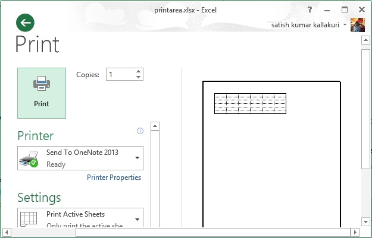

# Apache POI打印区域 - POI教程

本章介绍了如何在电子表格中设置打印区域。通常打印区域从左上角到Excel电子表格右下角。打印区域可根据要求进行定制。它意味着可以从整个电子表格打印单元的特定范围，自定义的纸张大小，用网格线打印的内容接通等

以下代码是用来在电子表格中设置打印区域。

```
import java.io.File;
import java.io.FileOutputStream;
import org.apache.poi.xssf.usermodel.XSSFPrintSetup;
import org.apache.poi.xssf.usermodel.XSSFSheet;
import org.apache.poi.xssf.usermodel.XSSFWorkbook;
public class PrintArea
{
   public static void main(String[] args)throws Exception
   {
      XSSFWorkbook workbook = new XSSFWorkbook();
      XSSFSheet spreadsheet = workbook
      .createSheet("Print Area");
      //set print area with indexes
      workbook.setPrintArea(
      0, //sheet index
      0, //start column
      5, //end column
      0, //start row
      5 //end row
      );
      //set paper size
      spreadsheet.getPrintSetup().setPaperSize(
      XSSFPrintSetup.A4_PAPERSIZE);
      //set display grid lines or not
      spreadsheet.setDisplayGridlines(true);
     //set print grid lines or not
     spreadsheet.setPrintGridlines(true);
     FileOutputStream out = new FileOutputStream(
     new File("printarea.xlsx"));
     workbook.write(out);
     out.close();
     System.out.println("printarea.xlsx written successfully");
   }
}
```

让我们保存了上面的代码为PrintArea.java。编译并从命令提示符执行它如下。

```
$javac PrintArea.java
$java PrintArea
```

它会生成一个名为printarea.xlsx在当前目录下的文件，并显示在命令提示符处输出以下。

```
printarea.xlsx written successfully
```

在上面的代码中，我们还没有添加任何单元格值。因此printarea.xlsx是一个空白文件。但是可以在下图的打印预览显示网格线打印区域查看。


