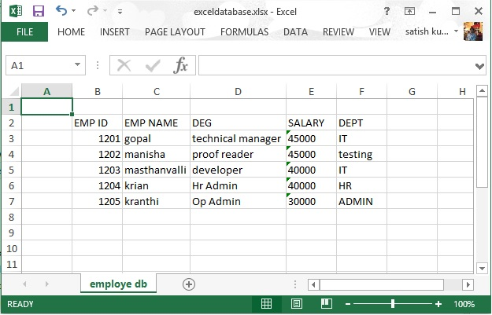

# Apache POI数据库 - POI教程

本章介绍了POI库与数据库的交互方式。有了JDBC帮助，可以从数据库中检索数据并插入数据来使用POI库电子表格。让我们考虑SQL操作MySQL数据库。

## 写入数据库

让我们假设数据表是 emp_tbl 存有雇员信息是从MySQL数据库 test 中检索。

| EMP ID | EMP NAME | DEG | SALARY | DEPT |
| --- | --- | --- | --- | --- |
| 1201 | Gopal | Technical Manager | 45000 | IT |
| 1202 | Manisha | Proof reader | 45000 | Testing |
| 1203 | Masthanvali | Technical Writer | 45000 | IT |
| 1204 | Kiran | Hr Admin | 40000 | HR |
| 1205 | Kranthi | Op Admin | 30000 |

使用下面的代码从数据库中检索数据，并插入到同一个电子表格。

```
import java.io.File;
import java.io.FileOutputStream;
import java.sql.Connection;
import java.sql.DriverManager;
import java.sql.ResultSet;
import java.sql.Statement;
import org.apache.poi.xssf.usermodel.XSSFCell;
import org.apache.poi.xssf.usermodel.XSSFRow;
import org.apache.poi.xssf.usermodel.XSSFSheet;
import org.apache.poi.xssf.usermodel.XSSFWorkbook;
public class ExcelDatabase 
{
   public static void main(String[] args) throws Exception 
   {
      Class.forName("com.mysql.jdbc.Driver");
      Connection connect = DriverManager.getConnection( 
      "jdbc:mysql://localhost:3306/test" , 
      "root" , 
      "root"
      );
      Statement statement = connect.createStatement();
      ResultSet resultSet = statement
      .executeQuery("select * from emp_tbl");
      XSSFWorkbook workbook = new XSSFWorkbook(); 
      XSSFSheet spreadsheet = workbook
      .createSheet("employe db");
      XSSFRow row=spreadsheet.createRow(1);
      XSSFCell cell;
      cell=row.createCell(1);
      cell.setCellValue("EMP ID");
      cell=row.createCell(2);
      cell.setCellValue("EMP NAME");
      cell=row.createCell(3);
      cell.setCellValue("DEG");
      cell=row.createCell(4);
      cell.setCellValue("SALARY");
      cell=row.createCell(5);
      cell.setCellValue("DEPT");
      int i=2;
      while(resultSet.next())
      {
         row=spreadsheet.createRow(i);
         cell=row.createCell(1);
         cell.setCellValue(resultSet.getInt("eid"));
         cell=row.createCell(2);
         cell.setCellValue(resultSet.getString("ename"));
         cell=row.createCell(3);
         cell.setCellValue(resultSet.getString("deg"));
         cell=row.createCell(4);
         cell.setCellValue(resultSet.getString("salary"));
         cell=row.createCell(5);
         cell.setCellValue(resultSet.getString("dept"));
         i++;
      }
      FileOutputStream out = new FileOutputStream(
      new File("exceldatabase.xlsx"));
      workbook.write(out);
      out.close();
      System.out.println(
      "exceldatabase.xlsx written successfully");
   }
}
```

让我们保存了上面的代码为ExcelDatabase.java。编译并从命令提示符执行它如下。

```
$javac ExcelDatabase.java
$java ExcelDatabase
```

它会生成一个名为exceldatabase.xlsx在当前目录中的Excel文件并显示在命令提示符处输出以下。

```
exceldatabase.xlsx written successfully
```

exceldatabase.xlsx文件如下所示。



