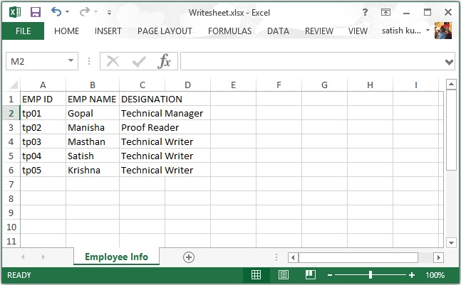

# Apache POI电子表格/Spreadsheet - POI教程

本章将介绍如何创建一个电子表格，并使用Java操纵它。电子表格是在Excel文件中的页面;它包含具有特定名称的行和列。

读完本章后，将能够创建一个电子表格，并能在其上执行读取操作。

## 创建电子表格

首先，让我们创建一个使用在前面的章节中讨论的引用的类的电子表格。按照前面的章节中，首先创建一个工作簿，然后我们就可以去，并创建一个表。

下面的代码片段用于创建电子表格。

```
//Create Blank workbook
XSSFWorkbook workbook = new XSSFWorkbook(); 
//Create a blank spreadsheet
XSSFSheet spreadsheet = workbook.createSheet("Sheet Name");
```

## 在电子表格的行

电子表格有一个网格布局。行和列被标识与特定的名称。该列标识字母和行用数字。

下面的代码片段用于创建一个行。

```
XSSFRow row = spreadsheet.createRow((short)1);
```

## 写入到电子表格

让我们考虑雇员数据的一个例子。这里的雇员数据给出以表格形式。

| Emp Id | Emp Name | 称号 |
| --- | --- | --- |
| Tp01 | Gopal | Technical Manager |
| TP02 | Manisha | Proof Reader |
| Tp03 | Masthan | Technical Writer |
| Tp04 | Satish | Technical Writer |
| Tp05 | Krishna | Technical Writer |

以下代码是用来写上述数据到电子表格。

```
import java.io.File;
import java.io.FileOutputStream;
import java.util.Map;
import java.util.Set;
import java.util.TreeMap;
import org.apache.poi.ss.usermodel.Cell;
import org.apache.poi.xssf.usermodel.XSSFRow;
import org.apache.poi.xssf.usermodel.XSSFSheet;
import org.apache.poi.xssf.usermodel.XSSFWorkbook;
public class Writesheet 
{
   public static void main(String[] args) throws Exception 
   {
      //Create blank workbook
      XSSFWorkbook workbook = new XSSFWorkbook(); 
      //Create a blank sheet
      XSSFSheet spreadsheet = workbook.createSheet( 
      " Employee Info ");
      //Create row object
      XSSFRow row;
      //This data needs to be written (Object[])
      Map < String, Object[] > empinfo = 
      new TreeMap < String, Object[] >();
      empinfo.put( "1", new Object[] { 
      "EMP ID", "EMP NAME", "DESIGNATION" });
      empinfo.put( "2", new Object[] { 
      "tp01", "Gopal", "Technical Manager" });
      empinfo.put( "3", new Object[] { 
      "tp02", "Manisha", "Proof Reader" });
      empinfo.put( "4", new Object[] { 
      "tp03", "Masthan", "Technical Writer" });
      empinfo.put( "5", new Object[] { 
      "tp04", "Satish", "Technical Writer" });
      empinfo.put( "6", new Object[] { 
      "tp05", "Krishna", "Technical Writer" });
      //Iterate over data and write to sheet
      Set < String > keyid = empinfo.keySet();
      int rowid = 0;
      for (String key : keyid)
      {
         row = spreadsheet.createRow(rowid++);
         Object [] objectArr = empinfo.get(key);
         int cellid = 0;
         for (Object obj : objectArr)
         {
            Cell cell = row.createCell(cellid++);
            cell.setCellValue((String)obj);
         }
      }
      //Write the workbook in file system
      FileOutputStream out = new FileOutputStream( 
      new File("Writesheet.xlsx"));
      workbook.write(out);
      out.close();
      System.out.println( 
      "Writesheet.xlsx written successfully" );
   }
}
```

上面的Java代码保存为Writesheet.java，然后并在命令提示符下编译运行，如下所示：

```
$javac Writesheet.java
$java Writesheet
```

这将编译和执行来生成一个Excel文件名为Writesheet.xlsx在当前目录中，在命令提示符处键入以下输出。

```
Writesheet.xlsx written successfully
```

Writesheet.xlsx文件的内容如下所示。



## 从电子表格读取数据

让我们考虑上述excel文件命名Writesheet.xslx作为输入文件。注意下面的代码;它是用于从电子表格中读取数据。

```
import java.io.File;
import java.io.FileInputStream;
import java.util.Iterator;
import org.apache.poi.ss.usermodel.Cell;
import org.apache.poi.ss.usermodel.Row;
import org.apache.poi.xssf.usermodel.XSSFRow;
import org.apache.poi.xssf.usermodel.XSSFSheet;
import org.apache.poi.xssf.usermodel.XSSFWorkbook;
public class Readsheet 
{
   static XSSFRow row;
   public static void main(String[] args) throws Exception 
   {
      FileInputStream fis = new FileInputStream(
      new File("WriteSheet.xlsx"));
      XSSFWorkbook workbook = new XSSFWorkbook(fis);
      XSSFSheet spreadsheet = workbook.getSheetAt(0);
      Iterator < Row > rowIterator = spreadsheet.iterator();
      while (rowIterator.hasNext()) 
      {
         row = (XSSFRow) rowIterator.next();
         Iterator < Cell > cellIterator = row.cellIterator();
         while ( cellIterator.hasNext()) 
         {
            Cell cell = cellIterator.next();
            switch (cell.getCellType()) 
            {
               case Cell.CELL_TYPE_NUMERIC:
               System.out.print( 
               cell.getNumericCellValue() + " \t\t " );
               break;
               case Cell.CELL_TYPE_STRING:
               System.out.print(
               cell.getStringCellValue() + " \t\t " );
               break;
            }
         }
         System.out.println();
      }
      fis.close();
   }
}
```

让我们把上面的代码保存在Readsheet.java文件，然后编译并在命令提示符下运行，如下所示：

```
$javac Readsheet.java
$java Readsheet
```

如果您的系统环境配置了POI库，它会编译和执行产生在命令提示符处键入以下输出。

```
EMP ID EMP NAME DESIGNATION 
 tp01   Gopal    Technical Manager 
 tp02   Manisha  Proof Reader 
 tp03   Masthan  Technical Writer 
 tp04   Satish   Technical Writer 
 tp05   Krishna  Technical Writer
```

