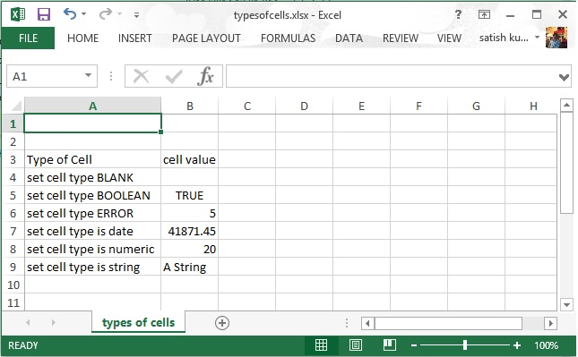
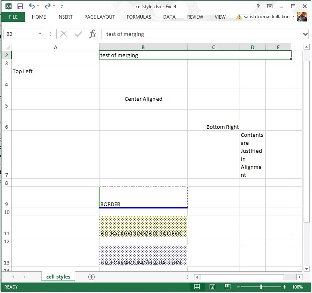

# Apache POI单元格/Cells - POI教程

输入到电子表格中的任何数据总是存储在一个单元中。我们使用的行和列的标签来识别单元格。本章介绍了如何使用Java编程操纵单元电子表格的数据。

## 创建一个单元格

需要创建一个单元之前创建一个行。行是什么？只不过是单元的集合。

下面的代码片段用于创建一个单元格。

```
//create new workbook
XSSFWorkbook workbook = new XSSFWorkbook(); 
//create spreadsheet with a name
XSSFSheet spreadsheet = workbook.createSheet("new sheet");
//create first row on a created spreadsheet
XSSFRow row = spreadsheet.createRow(0);
//create first cell on created row
XSSFCell cell = row.createCell(0);
```

## 单元格类型

单元格类型指定单元格是否可以包含字符串，数值，或公式。字符串单元不能持有数值和数值单元格无法容纳字符串。下面给出是单元格值和类型的语法。

| 单元格的值类型 | 类型语法 |
| --- | --- |
| Blank cell value | XSSFCell.CELL_TYPE_BLANK |
| Boolean cell value | XSSFCell.CELL.TYPE_BOOLEAN |
| Error cell value | XSSFCell.CELL_TYPE_ERROR |
| Numeric cell value | XSSFCell.CELL_TYPE_NUMERIC |
| String cell value | XSSFCell.CELL_TYPE_STRING |

以下代码是用于在电子表格创建不同类型的单元格。

```
import java.io.File;
import java.io.FileOutputStream;
import java.util.Date;
import org.apache.poi.xssf.usermodel.XSSFCell;
import org.apache.poi.xssf.usermodel.XSSFRow;
import org.apache.poi.xssf.usermodel.XSSFSheet;
import org.apache.poi.xssf.usermodel.XSSFWorkbook;
public class TypesofCells 
{
   public static void main(String[] args)throws Exception 
   {
      XSSFWorkbook workbook = new XSSFWorkbook(); 
      XSSFSheet spreadsheet = workbook.createSheet("cell types");
      XSSFRow row = spreadsheet.createRow((short) 2);
      row.createCell(0).setCellValue("Type of Cell");
      row.createCell(1).setCellValue("cell value");
      row = spreadsheet.createRow((short) 3);
      row.createCell(0).setCellValue("set cell type BLANK");
      row.createCell(1);
      row = spreadsheet.createRow((short) 4);
      row.createCell(0).setCellValue("set cell type BOOLEAN");
      row.createCell(1).setCellValue(true);
      row = spreadsheet.createRow((short) 5);
      row.createCell(0).setCellValue("set cell type ERROR");
      row.createCell(1).setCellValue(XSSFCell.CELL_TYPE_ERROR );
      row = spreadsheet.createRow((short) 6);
      row.createCell(0).setCellValue("set cell type date");
      row.createCell(1).setCellValue(new Date());
      row = spreadsheet.createRow((short) 7);
      row.createCell(0).setCellValue("set cell type numeric" );
      row.createCell(1).setCellValue(20 );
      row = spreadsheet.createRow((short) 8);
      row.createCell(0).setCellValue("set cell type string");
      row.createCell(1).setCellValue("A String");
      FileOutputStream out = new FileOutputStream(
      new File("typesofcells.xlsx"));
      workbook.write(out);
      out.close();
      System.out.println(
      "typesofcells.xlsx written successfully");
   }
}
```

保存上面的代码到一个名为TypesofCells.java文件，编译并从命令提示符如下执行它。

```
$javac TypesofCells.java
$java TypesofCells
```

如果您的系统配置了POI库，那么它会编译和执行在当前目录中生成一个名为typesofcells.xlsx的Excel文件，并显示以下输出。

```
typesofcells.xlsx written successfully
```

typesofcells.xlsx文件如下所示。



## 单元格样式

在这里，可以学习如何做单元格格式，并采用不同的风格，如合并相邻的单元格，添加边框，设置单元格对齐方式和填充颜色。

以下代码是使用Java编程用于不同样式应用到单元格。

```
import java.io.File;
import java.io.FileOutputStream;
import org.apache.poi.hssf.util.HSSFColor;
import org.apache.poi.ss.usermodel.IndexedColors;
import org.apache.poi.ss.util.CellRangeAddress;
import org.apache.poi.xssf.usermodel.XSSFCell;
import org.apache.poi.xssf.usermodel.XSSFCellStyle;
import org.apache.poi.xssf.usermodel.XSSFRow;
import org.apache.poi.xssf.usermodel.XSSFSheet;
import org.apache.poi.xssf.usermodel.XSSFWorkbook;
public class CellStyle 
{
   public static void main(String[] args)throws Exception 
   {
      XSSFWorkbook workbook = new XSSFWorkbook(); 
      XSSFSheet spreadsheet = workbook.createSheet("cellstyle");
      XSSFRow row = spreadsheet.createRow((short) 1);
      row.setHeight((short) 800);
      XSSFCell cell = (XSSFCell) row.createCell((short) 1);
      cell.setCellValue("test of merging");
      //MEARGING CELLS 
      //this statement for merging cells
      spreadsheet.addMergedRegion(new CellRangeAddress(
      1, //first row (0-based)
      1, //last row (0-based)
      1, //first column (0-based)
      4 //last column (0-based)
      ));
      //CELL Alignment
      row = spreadsheet.createRow(5); 
      cell = (XSSFCell) row.createCell(0);
      row.setHeight((short) 800);
      // Top Left alignment 
      XSSFCellStyle style1 = workbook.createCellStyle();
      spreadsheet.setColumnWidth(0, 8000);
      style1.setAlignment(XSSFCellStyle.ALIGN_LEFT);
      style1.setVerticalAlignment(XSSFCellStyle.VERTICAL_TOP);
      cell.setCellValue("Top Left");
      cell.setCellStyle(style1);
      row = spreadsheet.createRow(6); 
      cell = (XSSFCell) row.createCell(1);
      row.setHeight((short) 800);
      // Center Align Cell Contents 
      XSSFCellStyle style2 = workbook.createCellStyle();
      style2.setAlignment(XSSFCellStyle.ALIGN_CENTER);
      style2.setVerticalAlignment( 
      XSSFCellStyle.VERTICAL_CENTER);
      cell.setCellValue("Center Aligned"); 
      cell.setCellStyle(style2);
      row = spreadsheet.createRow(7); 
      cell = (XSSFCell) row.createCell(2);
      row.setHeight((short) 800);
      // Bottom Right alignment 
      XSSFCellStyle style3 = workbook.createCellStyle();
      style3.setAlignment(XSSFCellStyle.ALIGN_RIGHT);
      style3.setVerticalAlignment( 
      XSSFCellStyle.VERTICAL_BOTTOM);
      cell.setCellValue("Bottom Right");
      cell.setCellStyle(style3);
      row = spreadsheet.createRow(8);
      cell = (XSSFCell) row.createCell(3);
      // Justified Alignment 
      XSSFCellStyle style4 = workbook.createCellStyle();
      style4.setAlignment(XSSFCellStyle.ALIGN_JUSTIFY);
      style4.setVerticalAlignment(
      XSSFCellStyle.VERTICAL_JUSTIFY);
      cell.setCellValue("Contents are Justified in Alignment"); 
      cell.setCellStyle(style4);
      //CELL BORDER
      row = spreadsheet.createRow((short) 10);
      row.setHeight((short) 800);
      cell = (XSSFCell) row.createCell((short) 1);
      cell.setCellValue("BORDER");
      XSSFCellStyle style5 = workbook.createCellStyle();
      style5.setBorderBottom(XSSFCellStyle.BORDER_THICK);
      style5.setBottomBorderColor(
      IndexedColors.BLUE.getIndex());
      style5.setBorderLeft(XSSFCellStyle.BORDER_DOUBLE);
      style5.setLeftBorderColor( 
      IndexedColors.GREEN.getIndex());
      style5.setBorderRight(XSSFCellStyle.BORDER_HAIR);
      style5.setRightBorderColor( 
      IndexedColors.RED.getIndex());
      style5.setBorderTop(XSSFCellStyle.BIG_SPOTS);
      style5.setTopBorderColor( 
      IndexedColors.CORAL.getIndex());
      cell.setCellStyle(style5);
      //Fill Colors
      //background color
      row = spreadsheet.createRow((short) 10 );
      cell = (XSSFCell) row.createCell((short) 1);
      XSSFCellStyle style6 = workbook.createCellStyle();
      style6.setFillBackgroundColor(
      HSSFColor.LEMON_CHIFFON.index );
      style6.setFillPattern(XSSFCellStyle.LESS_DOTS);
      style6.setAlignment(XSSFCellStyle.ALIGN_FILL);
      spreadsheet.setColumnWidth(1,8000);
      cell.setCellValue("FILL BACKGROUNG/FILL PATTERN");
      cell.setCellStyle(style6);
      //Foreground color
      row = spreadsheet.createRow((short) 12);
      cell = (XSSFCell) row.createCell((short) 1);
      XSSFCellStyle style7=workbook.createCellStyle();
      style7.setFillForegroundColor(HSSFColor.BLUE.index);
      style7.setFillPattern( XSSFCellStyle.LESS_DOTS);
      style7.setAlignment(XSSFCellStyle.ALIGN_FILL);
      cell.setCellValue("FILL FOREGROUND/FILL PATTERN");
      cell.setCellStyle(style7);
      FileOutputStream out = new FileOutputStream(
      new File("cellstyle.xlsx"));
      workbook.write(out);
      out.close();
      System.out.println("cellstyle.xlsx written successfully");
   }
}
```

保存上面的代码在一个名为CellStyle.java文件，编译并从命令提示符如下执行它。

```
$javac CellStyle.java
$java CellStyle
```

它会生成一个名为cellstyle.xlsx在当前目录中的Excel文件并显示以下输出。

```
cellstyle.xlsx written successfully
```

cellstyle.xlsx文件如下所示。



