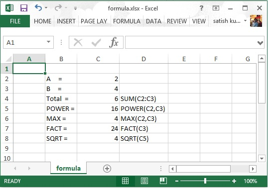

# Apache POI公式 - POI教程

本章将介绍如何使用Java编程应用不同单元公式的过程。 Excel应用程序的基本目的是通过应用公式就可以保持数值数据。

在公式中，我们通过动态值，或在Excel工作表中的值的位置。在执行这个公式，就会得到想要的结果。下表列出了常用的在Excel中的几个基本公式。

| 操作 | 语法 |
| --- | --- |
| 添加多个数值 | = SUM(Loc1:Locn) or = SUM(n1,n2,) |
| 计数 | = COUNT(Loc1:Locn) or = COUNT(n1,n2,) |
| 两个数的幂 | = POWER(Loc1,Loc2) or = POWER(number, power) |
| 多个数的最大值 | = MAX(Loc1:Locn) or = MAX(n1,n2,) |
| 乘积 | = PRODUCT(Loc1:Locn) or = PRODUCT(n1,n2,) |
| 阶乘 | = FACT(Locn) or = FACT(number) |
| 绝对数字 | = ABS(Locn) or = ABS(number) |
| 今天的日期 | =TODAY() |
| 转换成小写 | = LOWER(Locn) or = LOWER(text) |
| 平方根 | = SQRT(locn) or = SQRT(number) |

以下代码用于公式添加至单元格，并执行它。

```
import java.io.File;
import java.io.FileOutputStream;
import org.apache.poi.xssf.usermodel.XSSFCell;
import org.apache.poi.xssf.usermodel.XSSFRow;
import org.apache.poi.xssf.usermodel.XSSFSheet;
import org.apache.poi.xssf.usermodel.XSSFWorkbook;
public class Formula 
{
   public static void main(String[] args)throws Exception 
   {
      XSSFWorkbook workbook = new XSSFWorkbook(); 
      XSSFSheet spreadsheet = workbook.createSheet("formula");
      XSSFRow row = spreadsheet.createRow(1);
      XSSFCell cell = row.createCell(1);
      cell.setCellValue("A =" );
      cell = row.createCell(2);
      cell.setCellValue(2);
      row = spreadsheet.createRow(2);
      cell = row.createCell(1);
      cell.setCellValue("B =");
      cell = row.createCell(2);
      cell.setCellValue(4);
      row = spreadsheet.createRow(3);
      cell = row.createCell(1);
      cell.setCellValue("Total =");
      cell = row.createCell(2);
      // Create SUM formula
      cell.setCellType(XSSFCell.CELL_TYPE_FORMULA);
      cell.setCellFormula("SUM(C2:C3)" );
      cell = row.createCell(3);
      cell.setCellValue("SUM(C2:C3)");
      row = spreadsheet.createRow(4);
      cell = row.createCell(1);
      cell.setCellValue("POWER =");
      cell=row.createCell(2);
      // Create POWER formula
      cell.setCellType(XSSFCell.CELL_TYPE_FORMULA);
      cell.setCellFormula("POWER(C2,C3)");
      cell = row.createCell(3);
      cell.setCellValue("POWER(C2,C3)");
      row = spreadsheet.createRow(5);
      cell = row.createCell(1);
      cell.setCellValue("MAX =");
      cell = row.createCell(2);
      // Create MAX formula
      cell.setCellType(XSSFCell.CELL_TYPE_FORMULA);
      cell.setCellFormula("MAX(C2,C3)");
      cell = row.createCell(3);
      cell.setCellValue("MAX(C2,C3)");
      row = spreadsheet.createRow(6);
      cell = row.createCell(1);
      cell.setCellValue("FACT =");
      cell = row.createCell(2);
      // Create FACT formula
      cell.setCellType(XSSFCell.CELL_TYPE_FORMULA);
      cell.setCellFormula("FACT(C3)");
      cell = row.createCell(3);
      cell.setCellValue("FACT(C3)");
      row = spreadsheet.createRow(7);
      cell = row.createCell(1);
      cell.setCellValue("SQRT =");
      cell = row.createCell(2);
      // Create SQRT formula
      cell.setCellType(XSSFCell.CELL_TYPE_FORMULA);
      cell.setCellFormula("SQRT(C5)");
      cell = row.createCell(3);
      cell.setCellValue("SQRT(C5)");
      workbook.getCreationHelper()
      .createFormulaEvaluator()
      .evaluateAll();
      FileOutputStream out = new FileOutputStream(
      new File("formula.xlsx"));
      workbook.write(out);
      out.close();
      System.out.println("fromula.xlsx written successfully");
   }
}

```

保存上面的代码到文件Formula.java，然后编译并从命令提示符如下执行它。

```
$javac Formula.java
$java Formula

```

它会生成一个名为formula.xlsx在当前目录中的Excel文件并显示在命令提示符处键入以下输出。

```
fromula.xlsx written successfully

```

formula.xlsx文件如下所示。



