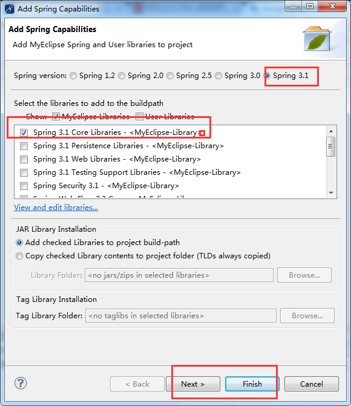
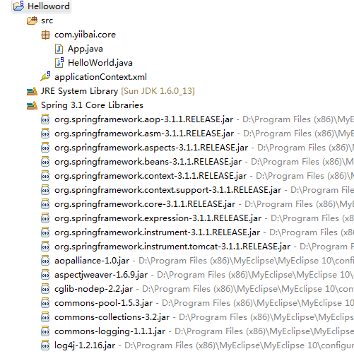

# Spring hello world实例 - Spring教程

本教程介绍如何在Spring3 中创建一个简单的 Hello World 例子。在这篇文章中使用的技术或工具：

1.  Spring 3.1
2.  MyEclipse 10
3.  JDK 1.6

提示: Spring 3 至少JDK1.5才能正常工作。Spring 3.0 dependencies
在Spring2.5.x中，几乎整个Spring模块分组在一个单独的 spring.jar 文件中。由于Spring3中每模块被分成一个单独的 jar 文件，例如，spring-core, spring-expression, spring-context, spring-aop等

## 1\. 创建一个Java工程

打开 MyEclipse 创建一个java工程：Helloword，并添加Spring支持类库，右键工程名称，选择"MyEclipse"-&gt;"Add Spring Capabilites"，如下图：


## 2\. Spring bean

一个简单的 Spring bean.

```
package com.yiibai.core;

/**
 * Spring bean
 * 
 */
public class HelloWorld {
    private String name;

    public void setName(String name) {
        this.name = name;
    }

    public void printHello() {
        System.out.println("Spring 3 : Hello ! " + name);
    }
}
```

## 4\. Spring bean 配置文件

创建Spring配置文件，并声明所有可用的Spring bean。

_File : _applicationContext_.xml_

```
<beans xmlns="http://www.springframework.org/schema/beans"
    xmlns:xsi="http://www.w3.org/2001/XMLSchema-instance"
    xsi:schemaLocation="http://www.springframework.org/schema/beans
    http://www.springframework.org/schema/beans/spring-beans-3.0.xsd">

    <bean id="helloBean" class="com.yiibai.core.HelloWorld">
        <property name="name" value="Yiibai" />
    </bean>

</beans>
```

## 5. 项目结构

查看目录结构如下:



## 6\. 执行代码

```
package com.yiibai.core;

import org.springframework.context.ApplicationContext;
import org.springframework.context.support.ClassPathXmlApplicationContext;

public class App {
    public static void main(String[] args) {
        ApplicationContext context = new ClassPathXmlApplicationContext(
                "applicationContext.xml"); HelloWorld obj = (HelloWorld) context.getBean("helloBean");
        obj.printHello();
    }
}
```

## 7\. 输出结果

```
Spring 3 : Hello ! Yiibai
```

## 下载源代码

http://pan.baidu.com/s/1qWZQoPm

