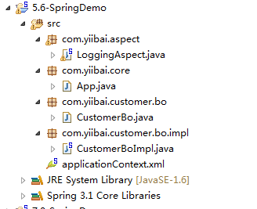

# Spring AOP+AspectJ注解实例 - Spring教程

在本教程中，我们将向你展示如何将AspectJ注解集成到Spring AOP框架。在这个Spring AOP+ AspectJ 示例中，让您轻松实现拦截方法。常见AspectJ的注解：

1.  @Before – 方法执行前运行
2.  @After – 运行在方法返回结果后
3.  @AfterReturning – 运行在方法返回一个结果后，在拦截器返回结果。
4.  @AfterThrowing – 运行方法在抛出异常后，
5.  @Around – 围绕方法执行运行，结合以上这三个通知。

注意
Spring AOP 中没有 AspectJ 支持，请阅读 [内置 Spring AOP 例子](http://www.yiibai.com/spring/spring-aop-examples-advice.html)。

## 1\. 目录结构

看到这个例子的目录结构。


## 2\. Spring Beans

普通 bean 中有几个方法，后来通过 AspectJ 注解拦截。

```
package com.yiibai.customer.bo;

public interface CustomerBo {

    void addCustomer();

    String addCustomerReturnValue();

    void addCustomerThrowException() throws Exception;

    void addCustomerAround(String name);
}
```

```
package com.yiibai.customer.bo.impl;

import com.yiibai.customer.bo.CustomerBo;

public class CustomerBoImpl implements CustomerBo {

    public void addCustomer(){
        System.out.println("addCustomer() is running ");
    }

    public String addCustomerReturnValue(){
        System.out.println("addCustomerReturnValue() is running ");
        return "abc";
    }

    public void addCustomerThrowException() throws Exception {
        System.out.println("addCustomerThrowException() is running ");
        throw new Exception("Generic Error");
    }

    public void addCustomerAround(String name){
        System.out.println("addCustomerAround() is running, args : " + name);
    }
}
```

## 4\. 启用AspectJ

在 Spring 配置文件，把“<aop:aspectj-autoproxy />”，并定义Aspect(拦截)和普通的bean。

_File : applicationContext.xml_

```
<beans xmlns="http://www.springframework.org/schema/beans"
    xmlns:xsi="http://www.w3.org/2001/XMLSchema-instance" 
    xmlns:aop="http://www.springframework.org/schema/aop"
    xsi:schemaLocation="http://www.springframework.org/schema/beans
    http://www.springframework.org/schema/beans/spring-beans-3.0.xsd 
    http://www.springframework.org/schema/aop 
    http://www.springframework.org/schema/aop/spring-aop-3.0.xsd ">

    <aop:aspectj-autoproxy />

    <bean id="customerBo" class="com.yiibai.customer.bo.impl.CustomerBoImpl" />

    <!-- Aspect -->
    <bean id="logAspect" class="com.yiibai.aspect.LoggingAspect" />

</beans>
```

## 4\. AspectJ @Before

在下面例子中，logBefore()方法将在 customerBo接口的 addCustomer()方法的执行之前被执行。AspectJ的“切入点”是用来声明哪种方法将被拦截，应该参考[Spring AOP切入点指南](http://static.springsource.org/spring/docs/3.0.x/spring-framework-reference/html/aop.html#aop-pointcuts)，支持切入点表达式的完整列表。

_File : LoggingAspect.java_

```
package com.yiibai.aspect;

import org.aspectj.lang.JoinYiibai;
import org.aspectj.lang.annotation.Aspect;
import org.aspectj.lang.annotation.Before;

@Aspect
public class LoggingAspect {

    @Before("execution(* com.yiibai.customer.bo.CustomerBo.addCustomer(..))")
    public void logBefore(JoinYiibai joinYiibai) {

        System.out.println("logBefore() is running!");
        System.out.println("hijacked : " + joinYiibai.getSignature().getName());
        System.out.println("******");
    }

}
```

运行

```
CustomerBo customer = (CustomerBo) appContext.getBean("customerBo");
customer.addCustomer();
```

输出结果

```
logBefore() is running!
hijacked : addCustomer
******
addCustomer() is running
```

## 5\. AspectJ @After

在下面例子中，logAfter()方法将在 customerBo 接口的 addCustomer()方法的执行之后执行。

_File : LoggingAspect.java_

```
package com.yiibai.aspect;

import org.aspectj.lang.JoinYiibai;
import org.aspectj.lang.annotation.Aspect;
import org.aspectj.lang.annotation.After;

@Aspect
public class LoggingAspect {

    @After("execution(* com.yiibai.customer.bo.CustomerBo.addCustomer(..))")
    public void logAfter(JoinYiibai joinYiibai) {

        System.out.println("logAfter() is running!");
        System.out.println("hijacked : " + joinYiibai.getSignature().getName());
        System.out.println("******");

    }

}
```

运行它

```
CustomerBo customer = (CustomerBo) appContext.getBean("customerBo");
customer.addCustomer();
```

输出结果

```
addCustomer() is running 
logAfter() is running!
hijacked : addCustomer
******
```

## 6\. AspectJ @AfterReturning

在下面例子中，logAfterReturning()方法将在 customerBo 接口的addCustomerReturnValue()方法执行之后执行。此外，还可以截取返回的值使用“returning”属性。

要截取返回的值，对“returning”属性(结果)的值必须用相同的方法参数(结果)。

_File : LoggingAspect.java_

```
package com.yiibai.aspect;

import org.aspectj.lang.JoinYiibai;
import org.aspectj.lang.annotation.Aspect;
import org.aspectj.lang.annotation.AfterReturning;

@Aspect
public class LoggingAspect {

   @AfterReturning(
      pointcut = "execution(* com.yiibai.customer.bo.CustomerBo.addCustomerReturnValue(..))",
      returning= "result")
   public void logAfterReturning(JoinYiibai joinYiibai, Object result) {

    System.out.println("logAfterReturning() is running!");
    System.out.println("hijacked : " + joinYiibai.getSignature().getName());
    System.out.println("Method returned value is : " + result);
    System.out.println("******");
   }
}
```

运行它

```
CustomerBo customer = (CustomerBo) appContext.getBean("customerBo");
    customer.addCustomerReturnValue();
```

输出结果

```
addCustomerReturnValue() is running 
logAfterReturning() is running!
hijacked : addCustomerReturnValue
Method returned value is : abc
******
```

## 7\. AspectJ @AfterReturning

在下面的例子中，如果 customerBo 接口的addCustomerThrowException()方法抛出异常logAfterThrowing()方法将被执行。

_File : LoggingAspect.java_

```
package com.yiibai.aspect;

import org.aspectj.lang.JoinYiibai;
import org.aspectj.lang.annotation.Aspect;
import org.aspectj.lang.annotation.AfterThrowing;

@Aspect
public class LoggingAspect {

   @AfterThrowing(
      pointcut = "execution(* com.yiibai.customer.bo.CustomerBo.addCustomerThrowException(..))",
      throwing= "error")
    public void logAfterThrowing(JoinYiibai joinYiibai, Throwable error) {

    System.out.println("logAfterThrowing() is running!");
    System.out.println("hijacked : " + joinYiibai.getSignature().getName());
    System.out.println("Exception : " + error);
    System.out.println("******");

    }
}
```

运行它

```
CustomerBo customer = (CustomerBo) appContext.getBean("customerBo");
customer.addCustomerThrowException();
```

输出结果

```
addCustomerThrowException() is running 
logAfterThrowing() is running!
hijacked : addCustomerThrowException
Exception : java.lang.Exception: Generic Error
******
Exception in thread "main" java.lang.Exception: Generic Error
    //...
```

## 8\. AspectJ @Around

在下面例子中，logAround()方法将在customerBo接口的addCustomerAround()方法执行之前执行， 必须定义“joinYiibai.proceed();” 控制何时拦截器返回控制到原来的addCustomerAround()方法。

_File : LoggingAspect.java_

```
package com.yiibai.aspect;

import org.aspectj.lang.ProceedingJoinYiibai;
import org.aspectj.lang.annotation.Aspect;
import org.aspectj.lang.annotation.Around;

@Aspect
public class LoggingAspect {

   @Around("execution(* com.yiibai.customer.bo.CustomerBo.addCustomerAround(..))")
   public void logAround(ProceedingJoinYiibai joinYiibai) throws Throwable {

    System.out.println("logAround() is running!");
    System.out.println("hijacked method : " + joinYiibai.getSignature().getName());
    System.out.println("hijacked arguments : " + Arrays.toString(joinYiibai.getArgs()));

    System.out.println("Around before is running!");
    joinYiibai.proceed(); //continue on the intercepted method
    System.out.println("Around after is running!");

    System.out.println("******");

   }

}
```

运行它

```
CustomerBo customer = (CustomerBo) appContext.getBean("customerBo");
customer.addCustomerAround("yiibai");
```

输出结果

```
logAround() is running!
hijacked method : addCustomerAround
hijacked arguments : [yiibai]
Around before is running!
addCustomerAround() is running, args : yiibai
Around after is running!
******
```

## 总结

它总是建议采用最少 AspectJ 注解。这是关于Spring AspectJ 的一篇相当长的文章。进一步的解释和例子，请访问下面的参考链接。下载源代码 – [http://pan.baidu.com/s/1boo4f9P](http://pan.baidu.com/s/1boo4f9P)

